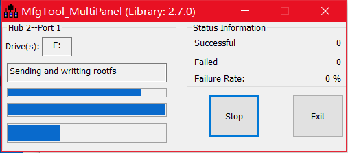
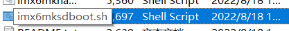
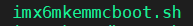
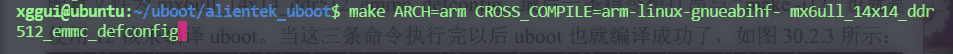
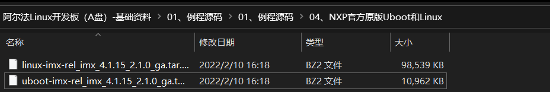

# 系统移植

## 1. 镜像系统烧写

### 1.1 Windows 下使用 OTG 烧写系统

在 windows 使用 nxp 提供的 mfgtool 来开发烧写系统，需要先将开发板的 USB_OTG 接口连接到电脑，然后双击脚本文件



### 1.2 Ubuntu 下通过脚本烧写系统

首先固化到 SD 卡，然后使用 SD 卡启动，启动以后在 Linux 中执行烧写到 EMMC 中



将 file 拷贝到 ubuntu 中，执行上面这个脚本文件，系统烧写到 sd 卡当中，用 sd 卡启动开发板，执行

这个脚本

## 2. uboot 编译

### 2.1 何为 uboot

1. uboot 是一个裸机程序，比较复杂。

2. uboot 就是一个 bootloader 作用就是用于启动 Linux 或其他系统，Uboot 最主要的工作就是初始化 DDR ，因为 Linux 是运行在 DDR 里面的。一般 Linux 镜像存放在 SD

### 2.2 uboot 编译

1. 编译 uboot 的时候要先配置



生成 .config 文件

开始编译


编译完成就会生成一个 u-boot.bin，必须要添加头部信息，uboot 编译最后会通过 /tools/mkimage 软件添加头部信息，生成 u-boot.imx

将这个 u-boot.imx 文件替换掉 `.\mfgtool\Profiles\Linux\OS Firmware\firmware` 中的 emmc 的 u-boot

启动时会显示编译信息：


## 3. uboot 命令使用

### 3.1 uboot 启动 log 分析和基础命令使用

`help 或者 ?`

查看某一个命令 `? boot`

**信息查询**

1. bdinfo
1. printenv 查看环境变量

**设置环境变量**

setenv

```sh
=> setenv bootdelay 5 设置5秒的倒计时
=> saveenv  
```

对于比较长的命令，可以这样设置 setenv ' xxxxx '

删除环境变量（值为空就是删除）

```sh
setenv bootdelay
```

**保存环境变量**

saveenv 这样就不会爆警告了

**内存命令**

查询内存

```sh
md.b 80000000 14
md.w 80000000 14
md.l 80000000 14
```

修改内存

```sh
nm.b 80000000
接着开始修改
按 q 退出
```

填充修改

```sh
mw.l 80000000 0A0A0A0A 10
从 80000000 开始的往后64个字节用0A0A0A0A填充
```

数据拷贝

```sh
cp [.b, .w, .l] source target count
cp.l 80000000 80000100 10
```

比较数据

```sh
cmp [.b, .w, .l] addr1 addr2 count
cmp.l 80000000 80000100 10
```

**网络变量设置**

**MMC 内存操作命令**

## 4. uboot 源码目录分析

因为 uboot 会使用到一些经过编译才会生成的文件，因此我们在分析 uboot 的时候先要编译一下 uboot

`.\arch\arm\cpu\u-boot.lds ` 是整个 uboot 的连接脚本

`.\alientek_uboot\board\freescale\mx6ullevk` 重点

`.\alientek_uboot\configs` 配置文件，这些配置文件对应不同的板子

我们移植 uboot 的时候重点关注 board 和 configs 主要是 defconfig

## 5. uboot 顶层 Makefile 分析

分析个p

## 6. uboot 移植

* 将 nxp 原版官方的 uboot 传到 ubuntu



* 修改配置文件

在 configs 文件夹有很多配置文件

```sh
/linux/nxp_uboot/uboot-imx-rel_imx_4.1.15_2.1.0_ga/configs$
```

本章我们讲解 EMMC 版本的移植，所以使用 mx6ull_14x14_evk_emmc_defconfig 作为默认配置文件。  

编写编译脚本

```sh
#!/bin/bash
make ARCH=arm CROSS_COMPILE=arm-linux-gnueabihf- distclean
make ARCH=arm CROSS_COMPILE=arm-linux-gnueabih:f- mx6ull_14x14_evk_emmc_defconfig
make V=1 ARCH=arm CROSS_COMPILE=arm-linux-gnueabihf- -j16
```

* 使用 imxdownload 烧写 .bin 文件到开发板

```
恢复默认环境变量
env default -a 
```

## 7. uboot 从 emmc 和网络 tftp 启动 Linux

* 从 emmc 中启动

```sh
mmc dev 1 
fatls mmc 1:1 # 查看镜像和设备树
fatload mmc 1:1 80800000 zimage # 加载内核镜像
fatload mmc 1:1 83000000 imx6ull-14x14-emmc-7-800x480-c.dtb # 加载设备树
bootz 80800000 - 83000000 # 启动
```

* 从 tftp 中启动

```sh
ubuntu 中配置好环境（编写配置文件，创建并索引到 tftp 共享文件夹）
tftp 80800000 zImage # 从服务器下载镜像
tftp 83000000 imx6ull-14x14-emmc-7-800x480-c.dtb # 从服务器下载设备树
bootz 80800000 - 83000000 # 启动
```

建议写到 bootcmd 变量中，这样每次启动都会自动执行上述的代码

注意：这个 bug 我找了一个晚上，就是 `8080000 - 83000000` ''-''之间要注意空格，否则就会卡在 starting kernel...

## 8. 构建根文件系统

* 在 nfs 服务器共享文件夹下创建根文件夹

```
mkdir rootfs
```

* 解压 busybox-1.29.0.tar.bz2

```sh
tar -vxjf busybox-1.29.0.tar.bz2
```

* 修改 makefile 添加交叉编译器

```sh
CROSS_COMPILE ?= /usr/local/arm/gcc-linaro-4.9.4-2017.01-
x86_64_arm-linux-gnueabihf/bin/arm-linux-gnueabihf-
......
190 ARCH ?= arm
```

* 配置 busybox

```sh
支持
defconfig 默认配置
allyesconfig 全部配置
allnoconfig 最小配置
make defconfig
# 图形化个性设置
make menuconfig
```

* 编译 busybox

```sh
make install CONFIG_PREFIX=/home/xggui/linux/nfs/rootfs
```

* 完善根文件系统 添加 lib 库

这里可以添加一些 叉编译器的库

* 连接 nfs

```sh
setenv bootargs 'console=ttymxc0,115200 root=/dev/nfs nfsroot=192.168.1.250:
/home/zuozhongkai/linux/nfs/rootfs,proto=tcp rw ip=192.168.1.251:192.168.1.250:192.168.1.1:
255.255.255.0::eth0:off' //设置 bootargs
saveenv //保存环境变量
```

