# 驱动开发

## 1. 我的第一个 Linux 驱动

* sd 卡上烧写 uboot
* 通过 tftp 下载镜像和设备树到开发板
* 通过 nfs 挂载根文件系统到开发板

* 将编译出来的 .ko 文件放到根文件系统里
  * 加载驱动 insmod，modprobe 要比 insmod 智能，它会分析模块的依赖关系
  * 移除驱动 rmmod

**将驱动拷贝到 modules 文件夹**

加载驱动模块 `insmod chrxxx.ko`

或者使用 `modprobe device`

```sh
# 将驱动文件放置在 /lib/modules/内核版本
# 内核版本 uname -r
# 执行
假设有 device.ko 文件
depmod # 生成依赖关系文件
modprobe device # 注意是不加后缀的
```

卸载模块 `rmmod chrxxx.ko`

查看加载的模块 `lsmod`

**给驱动文件加入 LICENSE**

chrdevbase.c：

```c
//添加 license
MODULE_LICENSE("GPL");
// 作者
MODULE_AUTHOR("xggui");
```

**在驱动文件中打印信息 printk**

* printf 是在应用程序中打印

* printk 是在内核态中打印

```c
static int __init chrdevbase_init(void)
{
	printk("init: hello world!!!!\r\n");
	return 0;
}

static void __exit chrdevbase_exit(void)
{
	printk("chrdevbase exit\r\n");
}
```

**字符设备的注册与注销**

使用 register_chrdev 函数注册字符设备

卸载驱动需要注销掉字符设备，使用 unregister_chrdev 函数

```c
static inline int register_chrdev(unsigned int major, const char *name,
const struct file_operations *fops)
    
static inline void unregister_chrdev(unsigned int major, const char *name)
```

* register_chrdev 函数用于注册字符设备，此函数一共有三个参数，这三个参数的含义如下：  

major： 主设备号， Linux 下每个设备都有一个设备号，设备号分为主设备号和次设备号两部分，关于设备号后面会详细讲解。(cat /proc/devices   查看已经使用的设备号)
name：设备名字，指向一串字符串。
fops： 结构体 file_operations 类型指针，指向设备的操作函数集合变量。

* unregister_chrdev 函数用户注销字符设备，此函数有两个参数，这两个参数含义如下：

major： 要注销的设备对应的主设备号。
name： 要注销的设备对应的设备名。  

**实现操作函数集合**

```c
static struct file_operations test_fops = {
	.owner = THIS_MODULE,
	.open = chrdevbase_open,
	.read = chrdevbase_read,
	.write = chrdevbase_write,
	.release = chrdevbase_release,
};
```

**编写 app 函数**

编写完成后编译并拷贝到板子上

```sh
arm-linux-gnueabihf-gcc chrdevbaseApp.c -o chrdevbaseApp
```

**创建设备节点文件**

```sh
mknod /dev/chrdevbase c 200 0
```

**测试应用程序（从设备节点文件中读写数据）**

```sh
./chrdevbaseApp  /dev/chrdevbase 1
./chrdevbaseApp  /dev/chrdevbase 2
```

**卸载驱动**

驱动卸载后设备节点文件会自动删除

## 2. LED 灯驱动程序

**地址映射**

Linux 内核启动的时候会初始化 MMU，设置好内存映射，设置好以后 CPU 访问的都是虚拟地址，因此不能直接向 0X020E0068 这个寄存器地址写入数据就可以配置 GPIO1_IO03 的复用功能    

**ioremap 函数**

ioremap 函数用于获取指定物理地址空间对应的虚拟地址空间 ，定义在 arch/arm/include/asm/io.h 文件中  

```c
#define ioremap(cookie,size) __arm_ioremap((cookie), (size),MT_DEVICE)
void __iomem * __arm_ioremap(phys_addr_t phys_addr, size_t size,unsigned int mtype)
{
	return arch_ioremap_caller(phys_addr, size, mtype,__builtin_return_address(0));
}
```

ioremap 是个宏，有两个参数： cookie 和 size，真正起作用的是函数arm_ioremap，此函
数有三个参数和一个返回值，这些参数和返回值的含义如下：
phys_addr：要映射的物理起始地址。
size：要映射的内存空间大小。
mtype： ioremap 的类型，可以选择 MT_DEVICE、 MT_DEVICE_NONSHARED、MT_DEVICE_CACHED 和 MT_DEVICE_WC， ioremap 函数选择 MT_DEVICE。
返回值：_iomem 类型的指针，指向映射后的虚拟空间首地址。  

**iounmap 函数 **

卸载驱动的时候需要使用 iounmap 函数释放掉 ioremap 函数所做的映射， iounmap 函数原型如下：  

```c
void iounmap (volatile void __iomem *addr)
```

iounmap 只有一个参数 addr，此参数就是要取消映射的虚拟地址空间首地址。假如我们现在要取消掉 IOMUXC_SW_MUX_CTL_PAD_GPIO1_IO03 寄存器的地址映射，使用如下代码即可

```c
iounmap(SW_MUX_GPIO1_IO03);
```

**IO 访问内存函数**

* 读内存函数

```c
u8 readb(const volatile void __iomem *addr)
u16 readw(const volatile void __iomem *addr)
u32 readl(const volatile void __iomem *addr)
```

readb、readw 和 readl 这三个函数分别对应 8bit、16bit 和 32bit 读操作，参数 addr 就是要读取写内存地址，返回值就是读取到的数据  

* 写内存函数

```c
void writeb(u8 value, volatile void __iomem *addr)
void writew(u16 value, volatile void __iomem *addr)
void writel(u32 value, volatile void __iomem *addr)
```

writeb、 writew 和 writel 这三个函数分别对应 8bit、 16bit 和 32bit 写操作，参数 value 是要写入的数值， addr 是要写入的地址。  

**程序的编写**

看代码

**测试程序**

关闭原系统的呼吸灯

```sh
echo none > /sys/class/leds/red/trigger // 改变 LED 的触发模式
```

```sh
./ledApp /dev/led 1 # 开灯
./ledApp /dev/led 0 # 关灯
```

## 3. 新字符设备驱动实验

**之前使用的 register_chrdev 是旧字符设备函数 **

字符设备驱动开发重点是使用 register_chrdev 函数注册字符设备，当不再使用设备的时候就使用
unregister_chrdev 函数注销字符设备，驱动模块加载成功以后还需要手动使用 mknod 命令创建
设备节点。 register_chrdev 和 unregister_chrdev 这两个函数是老版本驱动使用的函数，现在新的
字符设备驱动已经不再使用这两个函数，而是使用Linux内核推荐的新字符设备驱动API函数  

**分配和释放设备号**

如果没有指定设备号的话就使用如下函数来申请设备号：

```c
int alloc_chrdev_region(dev_t *dev, unsigned baseminor, unsigned count, const char *name)
```

如果给定了设备的主设备号和次设备号就使用如下所示函数来注册设备号即可：  

```c
int register_chrdev_region(dev_t from, unsigned count, const char *name)
```

注销字符设备之后要释放掉设备号，不管是通过 alloc_chrdev_region 函数还是
register_chrdev_region 函数申请的设备号，统一使用如下释放函数：  

```c
void unregister_chrdev_region(dev_t from, unsigned count)
```

分配设备号示例

```c
int major;	 /* 主设备号 */
int minor;	 /* 次设备号 */
dev_t devid; /* 设备号 */
if (major)
{							 /* 定义了主设备号 */
	devid = MKDEV(major, 0); /* 大部分驱动次设备号都选择 0*/
	register_chrdev_region(devid, 1, "test");
}
else
{											   /* 没有定义设备号 */
	alloc_chrdev_region(&devid, 0, 1, "test"); /* 申请设备号 */
	major = MAJOR(devid);					   /* 获取分配号的主设备号 */
	minor = MINOR(devid);					   /* 获取分配号的次设备号 */
}

```

**新的字符设备注册方法**

字符设备结构体

```c
struct cdev {
    struct kobject kobj;
    struct module *owner;
    const struct file_operations *ops; // 字符设备文件操作函数
    struct list_head list;
    dev_t dev; // 设备号
    unsigned int count;
};
```

* 初始化字符设备

```c
void cdev_init(struct cdev *cdev, const struct file_operations *fops)
    
struct cdev testcdev;
/* 设备操作函数 */
static struct file_operations test_fops = {
	.owner = THIS_MODULE,
	/* 其他具体的初始项 */
};
testcdev.owner = THIS_MODULE;
cdev_init(&testcdev, &test_fops); /* 初始化 cdev 结构体变量 */    
```

* 向系统添加设备

```c
int cdev_add(struct cdev *p, dev_t dev, unsigned count)
    
struct cdev testcdev;
/* 设备操作函数 */
static struct file_operations test_fops = {
.owner = THIS_MODULE,
/* 其他具体的初始项 */
};
testcdev.owner = THIS_MODULE;
cdev_init(&testcdev, &test_fops); /* 初始化 cdev 结构体变量 */
cdev_add(&testcdev, devid, 1); /* 添加字符设备 */    
```

* 删除设备

```c
void cdev_del(struct cdev *p)

cdev_del(&testcdev); /* 删除 cdev */    
```

**自动创建设备节点**

先创建类，然后在类下创建设备节点

class_create 函数和 device_create 函数

## 4. LINUX 设备树

**什么是设备树**

uboot 启动内核用到 zImage imx6ull-alientek-emmc.dtb bootz 80800000 - 83000000

设备树，设备和树

在单片机驱动里面比如 w25qxx，spi，速度都是在 .c 文件中写死在系统的，这样就会存在有大量的 .c 文件，而且系统更应该关注系统的事情，应该与外设脱离开来，并且使用 .dts 格式存储

**DTS DTB 和 DTC 的关系**

DTS 通过编译变成 DTB

DTC 工具相当于 gcc 编译器，将 .dts 编译成 .dtb 

在 linux 内核上通过 `make dtbs` 单独编译所有的设备树文件

dts 文件的路径：

```sh
/home/xggui/linux/linux-imx-rel_imx_4.1.15_2.1.0_ga_alientek/arch/arm/boot/dts
```

编译指定的设备树 .dtb 

```sh
make imx6ull-alientek-emmc.dtb
```

**DTS 基本语法**

1. DTS 也是以 ’/ ‘开始
2. & 符号可以追加 .dts 文件的信息
3. dts 也有头文件，用 #include<> 包括，扩展名为 .dtsi 文件，这种文件一般描述 cpu 内部的外设（一般用于共有的，不能把某个板子私有的设备节点直接写进去，要使用 & 符号进行追加，追加的数据存放在 .dts 文件内）

imx6ull-alientek-emmc.dts 文件

```c
/dts-v1/;
#include <.h>
#include ".dtsi"
/ {
	model = "Freescale i.MX6 ULL 14x14 EVK Board";
	compatible = "fsl,imx6ull-14x14-evk", "fsl,imx6ull";
    chosen {
      	stdout-path = "";  
    };
    memory {
        reg = <0x80000000 0x20000000>;
    };
    reserved-memory {
        
    };
    
};

&pwm1 {
	pinctrl-names = "default";
	pinctrl-0 = <&pinctrl_pwm1>;
	status = "okay";
};
```

* model compatible 等是属性
* 从根节点开始描述设备信息
* 在 .dts 的 / 根节点外有一些 &cpu0 这样的语句是 “追加 .dtsi 的某些节点”
* // 或者 /* */ 都是支持注释的
* 追加的属性会替换掉原有的属性
* 节点名字的要求 `node-nam@unit-address`
* ：后面才是名字，前面是标签名字

**设备树在系统中的体现**

系统启动以后可以在根文件系统里面看到设备树的节点信息（以文件夹的方式显现）

在 `/proc/device-tree`文件夹下存放着设备信息

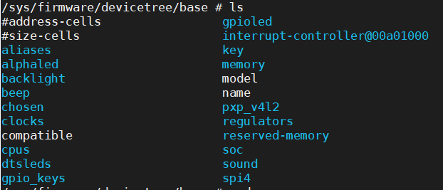

属性以文件形式显示，节点以文件夹的形式显示

内核启动的时候，会解析设备树，然后在这个文件夹下显示出来

**标准属性**

* compatible 属性

```c
compatible = "fsl,imx6ul-evk-wm8960","fsl,imx-audio-wm8960";
```

属性值有两个，分别为“fsl,imx6ul-evk-wm8960”和“fsl,imx-audio-wm8960”，其中“fsl”
表示厂商是飞思卡尔，“imx6ul-evk-wm8960”和“imx-audio-wm8960”表示驱动模块名字 

启动 uboot 时，这个属性的词条会与内核源码中 mach 文件的词条对比，如果不同，则会一直卡在 starting kernel

* model 属性

model 属性值也是一个字符串，一般 model 属性描述设备模块信息，比如名字什么的

```c
model = "wm8960-audio";
```

* status 属性

status 属性看名字就知道是和设备状态有关的， status 属性值也是字符串，字符串是设备的
状态信息，可选的状态如表 43.3.3.1 所示：  

| 值       | 描述                                                         |
| :------- | ------------------------------------------------------------ |
| okay     | 表明设备是可操作的                                           |
| disabled | 表明设备当前是不可操作的，但是在未来可以变为可操作的，比如热插拔设备 插入以后。至于 disabled 的具体含义还要看设备的绑定文档 |
| fail     | 表明设备不可操作，设备检测到了一系列的错误，而且设备也不大可能变得可 操作 |
| fail-sss | 含义和“fail”相同，后面的 sss 部分是检测到的错误内容          |

* #address-cells #size-cells 属性

reg 的属性中起始地址的个数，地址长度的个数

* ranges 属性

* name 属性

name 属性值为字符串， name 属性用于记录节点名字， name 属性已经被弃用，不推荐使用
name 属性，一些老的设备树文件可能会使用此属性  

**自定义一个节点**

打开 .dts 源码

在根节点下添加

```c
/ {
	//自定义节点
	mytestnode {
		
	};    
};
```

然后编译并替换原来的 .dtb 文件，重启开发板

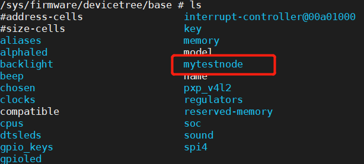

****

**特殊节点**

aliase 节点

```c
/ {
	aliases {
		can0 = &flexcan1;
		can1 = &flexcan2;
		ethernet0 = &fec1;
		ethernet1 = &fec2;
		gpio0 = &gpio1;
		gpio1 = &gpio2;
		gpio2 = &gpio3;
		gpio3 = &gpio4;
		gpio4 = &gpio5;
		i2c0 = &i2c1;
		i2c1 = &i2c2;
		i2c2 = &i2c3;
		i2c3 = &i2c4;
		mmc0 = &usdhc1;
		mmc1 = &usdhc2;
		serial0 = &uart1;
		serial1 = &uart2;
		serial2 = &uart3;
		serial3 = &uart4;
		serial4 = &uart5;
		serial5 = &uart6;
		serial6 = &uart7;
		serial7 = &uart8;
		spi0 = &ecspi1;
		spi1 = &ecspi2;
		spi2 = &ecspi3;
		spi3 = &ecspi4;
		usbphy0 = &usbphy1;
		usbphy1 = &usbphy2;
	};
};
```

这个节点的作用就是定义别名

choose 节点

```c
chosen {
	stdout-path = &uart1;
};
```

主要目的就是将 uboot 里面的 bootargs 环境变量值传递给 linux 内核作为命令行参数 kernel command line

```sh
/sys/firmware/devicetree/base/chosen # ls
bootargs     name         stdout-path
```

经过分析 uboot 拥有 bootargs 环境变量和 dtb 

在 fdt_support.c 文件中可以看到有个 fdt_chosen 函数

```c
	/* find or create "/chosen" node. */
	nodeoffset = fdt_find_or_add_subnode(fdt, 0, "chosen");
	if (nodeoffset < 0)
		return nodeoffset;

	str = getenv("bootargs");
	if (str) {
		err = fdt_setprop(fdt, nodeoffset, "bootargs", str,
				  strlen(str) + 1);
		if (err < 0) {
			printf("WARNING: could not set bootargs %s.\n",
			       fdt_strerror(err));
			return err;
		}
	}
```

它会给 chosen 节点添加一个 bootargs 属性

**绑定信息文档**

Linux 内核源码中有详细的.txt 文档描述了如何添加节点（仅做参考），这些.txt 文档叫做绑定文档 目录为：`/Documentation/devicetree/bindings `

**设备树常用 OF 操作函数（在驱动函数里使用）**

* 驱动如何获取到设备树中节点信息

在驱动中使用 OF 函数获取设备树属性内容，内核中也是使用结构体保存设备树的节点信息

* 驱动想要获取设备树中节点内容，首先要找到设备树节点名字

具体函数见参考手册

## 5. 设备树下的 LED 驱动实验

本次实验只是为了更好理解设备树，实际开发不会这样做

关键代码如下：读取设备节点的寄存器信息，然后用来映射，然后操作寄存器（脱裤子放屁）

```c
alphaled {
	#address-cells = <1>;
	#size-cells = <1>;
	compatible = "alientek,alphaled";
	status = "okay";
	reg = <	0X020C406C 0x04	/* CCM_CCGR1_BASE */
			0X020E0068 0X04	/* SW_MUX_GPIO1_IO03_BASE */
			0X020E02F4 0X04 /* SW_PAD_GPIO1_IO03_BASE */
			0X0209C000 0X04 /* GPIO1_DR_BASE */
			0X0209C004 0X04>; /* GPIO1_GDIR_BASE */
};
```

```c
IMX6U_CCM_CCGR1 = ioremap(regdata[0], regdata[1]);
SW_MUX_GPIO1_IO03 = ioremap(regdata[2], regdata[3]);
SW_PAD_GPIO1_IO03 = ioremap(regdata[4], regdata[5]);
GPIO1_DR = ioremap(regdata[6], regdata[7]);
GPIO1_GDIR = ioremap(regdata[8], regdata[9]);
```

```c
ret = of_property_read_u32_array(dtsled.nd, "reg", regdata, 10);
if (ret < 0)
{
    printk("reg property read failed!\r\n");
}
else
{
    u8 i = 0;
    printk("reg data:\r\n");
    for (i = 0; i < 10; i++)
        printk("%#X ", regdata[i]);
    printk("\r\n");
}
```

## 6. pinctrl 和 gpio 子系统实验

1. 上一章的 led 驱动实验本质还是没变，都是配置 LED 灯所使用的 GPIO 寄存器，驱动开发方式和裸机基本没啥区别。

2. Linux 是一个庞大而完善的系统，尤其是驱动框架，像 GPIO 这种最基本的驱动不可能采用“原始”的裸机驱动开发方式。

3. Linux 内核提供了 pinctrl 和 gpio 子系统用于 GPIO 驱动用来简化 GPIO 驱动开发。

**6ULL 的 GPIO 使用**

* 设置 PIN 的复用和电气属性

* 配置 GPIO 的属性

**pinctrl 子系统**

借助 pinctrl 来设置一个 PIN 的复用和电气属性

pinctrl 子系统的工作：

* 获取设备树中 pin 信息
* 根据获取到 pin 信息来设置 pin 的复用功能
* 根据获取到 pin 信息来设置 pin 的电气特性

对于我们使用者来讲，只需要在设备树里面设置好某个 Pin 的相关属性即可，其他的初始化工作均由 pinctrl 子系统来完成，pinctrl 子系统源码目录为 `drivers/pinctrl`

打开 imx6ull.dtsi，找到与 iomuxc 有关的节点：

* iomuxc 寄存器

```c
iomuxc: iomuxc@020e0000 {
	compatible = "fsl,imx6ul-iomuxc";
	reg = <0x020e0000 0x4000>;
};
```

* iomuxc-gpr 寄存器

```c
gpr: iomuxc-gpr@020e4000 {
	compatible = "fsl,imx6ul-iomuxc-gpr",
		"fsl,imx6q-iomuxc-gpr", "syscon";
	reg = <0x020e4000 0x4000>;
};
```

* iomuxc-snvs 寄存器

```c
iomuxc_snvs: iomuxc-snvs@02290000 {
	compatible = "fsl,imx6ull-iomuxc-snvs";
	reg = <0x02290000 0x10000>;
};
```

在 .dts 文件中引用了这些寄存器节点，并在此基础上添加了一些信息

```c
&iomuxc {
	pinctrl-names = "default";
	pinctrl-0 = <&pinctrl_hog_1>;
	imx6ul-evk {
		pinctrl_hog_1: hoggrp-1 {
			fsl,pins = <
				MX6UL_PAD_UART1_RTS_B__GPIO1_IO19		0x17059 /* SD1 CD */
				MX6UL_PAD_GPIO1_IO05__USDHC1_VSELECT	0x17059 /* SD1 VSELECT */
				MX6UL_PAD_GPIO1_IO00__ANATOP_OTG1_ID 	0x13058	/* USB OTG1 ID */  
			>;
		};

		pinctrl_gpioled: ledgrp{
			fsl,pins = <
				MX6UL_PAD_GPIO1_IO03__GPIO1_IO03   0x10b0	
			>;
		};

		/* zuozhongkai beep */
		pinctrl_beep: beepgrp{
			fsl,pins = <
				MX6ULL_PAD_SNVS_TAMPER1__GPIO5_IO01 0x10b0
			>;
		};
...  
    
};    
```

* 根据设备的类型，创建对应的子节点，然后设备所用的 PIN 都放到此节点。

* 添加一个 PIN 信息

```c
pinctrl_gpioled: ledgrp{
	fsl,pins = <
		MX6UL_PAD_GPIO1_IO03__GPIO1_IO03   0x10b0	
	>;
};
// fsl,pins = < 选择复用的io 写给电气属性寄存器的值 >;
```

我们在 ixm6ul-pinfunc.h 中找到

```c
/*
 * The pin function ID is a tuple of
 * <mux_reg conf_reg input_reg mux_mode input_val>
 * 首地址在父节点，然后宏定义依次是 <复用寄存器的偏移地址，电气属性配置寄存器的偏移地址，偏移为0表示这个io的pin没有input功能有值的话代表这个io的输入寄存器的偏移地址，复用的模式（下标），写给input_reg这个寄存器的值>
 */
#define MX6UL_PAD_BOOT_MODE0__GPIO5_IO10                          0x0014 0x02A0 0x0000 0x5 0x0
#define MX6UL_PAD_BOOT_MODE1__GPIO5_IO11                          0x0018 0x02A4 0x0000 0x5 0x0
#define MX6UL_PAD_SNVS_TAMPER0__GPIO5_IO00                        0x001C 0x02A8 0x0000 0x5 0x0
```

**princtrl 驱动**

如何找到 IMX6UL 对应的 pinctrl 子系统驱动

pinctrl-imx6ul.c 文件是用来获取设备树中的节点信息，并将节点信息用来初始化 io 

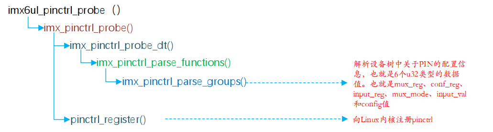

**gpio 子系统**

使用 gpio 子系统来使用 gpio

gpio 在设备树中的表示方式

```c
&usdhc1 {
	pinctrl-names = "default", "state_100mhz", "state_200mhz";
	pinctrl-0 = <&pinctrl_usdhc1>;
	pinctrl-1 = <&pinctrl_usdhc1_100mhz>;
	pinctrl-2 = <&pinctrl_usdhc1_200mhz>;
	cd-gpios = <&gpio1 19 GPIO_ACTIVE_LOW>;
	keep-power-in-suspend;
	enable-sdio-wakeup;
	vmmc-supply = <&reg_sd1_vmmc>;
	status = "okay";
};
```

定义了一个 cd-gpios 属性

```c
cd-gpios = <&gpio1 19 GPIO_ACTIVE_LOW>;
```

此处使用了 gpio1_19

```c
gpio1: gpio@0209c000 {
	compatible = "fsl,imx6ul-gpio", "fsl,imx35-gpio";
	reg = <0x0209c000 0x4000>;
	interrupts = <GIC_SPI 66 IRQ_TYPE_LEVEL_HIGH>,
		     <GIC_SPI 67 IRQ_TYPE_LEVEL_HIGH>;
	gpio-controller;
	#gpio-cells = <2>;
	interrupt-controller;
	#interrupt-cells = <2>;
};
```

**如何从设备树中获取要使用的 GPIO 信息**

of 函数

驱动中对 gpio 的操作函数

1. 获取到 GPIO 所处的设备节点，比如 of_find_node_by_path
2. 获取 GPIO 的编号，of_get_name_gpio 函数，返回值是 gpio 编号
3. 请求此编号的 GPIO ，gpio_request 函数
4. 设置 GPIO 输入或者输出，gpio_direction_input 或者 gpio_direction_output
5. 如果是输入，那么通过 gpio_get_value 函数读取 GPIO 的值如果是输出， gpio_set_value 设置 GPIO 值

**编写驱动**

在 申请 io 这一步骤失败要检查：

设备树中是否有其他节点使用 了这个 io

1. 检查复用，也就是 pinctl 设置
2. gpio 使用

**总结**

1. 添加 pinctrl 信息
2. 检查当前设备树中要使用的 IO 有没有被其他设备使用，如果有的话要处理
3. 添加设备节点，在设备节点中创建一个属性，此属性描述所使用的 gpio
4. 编写驱动，获取对应的 gpio 编号，并申请 IO 成功以后即可使用此 IO（不申请也行，就是不会检查该 IO 是否被使用）

## 7. beep 蜂鸣器实验

修改上一章的代码即可

## 8. Linux 并发与竞争

Linux 下面临：多任务，中断，抢占，多核的情况，他们在竞争这个资源，我们需要保护这个资源（数据）

学过 FreeRTOS 和 UCOS 应该知道临界区这个概念，临界区就是共享数据段，对于临界区必须保证一次只有一个线程访问

**原子操作**

对于 C 语言中 `a = 3`

```assembly
ldr r0, =0x3000000
ldr r1, =5
str r1, [r0]
```

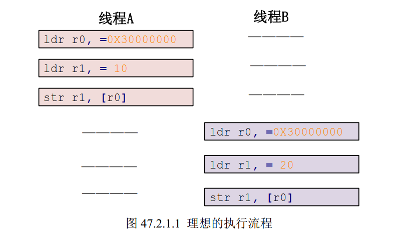

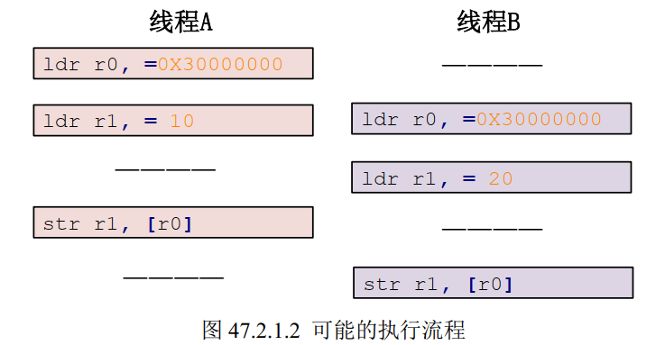

要解决这个问题就是把这三个指令当成一个整体运行，这要使用到原子整型 API 函数

include/types.h 文件定义了一个结构体

```c
typedef struct {
	int counter;
} atomic_t;
```

```c
atomic_t num = ATOMIC_INIT(2);
```

原子整形操作 API 函数

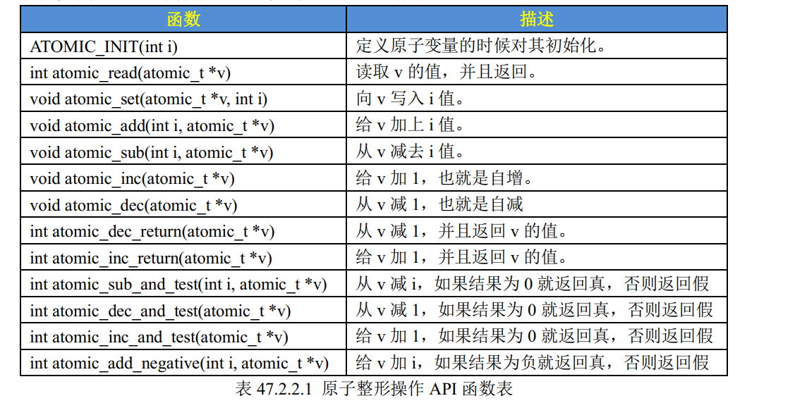

原子位操作函数

查手册

**自选锁**

* 自选的意思就是原地打转排队，目的是等待共享资源可以访问

* 自选锁的缺点就是，等待自选锁的线程会一直等待，这样很浪费处理器的时间，所以自旋锁适合于轻量级的枷锁

自选锁结构体（spinlock_types.h）

```c
typedef struct spinlock {
	union {
		struct raw_spinlock rlock;

#ifdef CONFIG_DEBUG_LOCK_ALLOC
# define LOCK_PADSIZE (offsetof(struct raw_spinlock, dep_map))
		struct {
			u8 __padding[LOCK_PADSIZE];
			struct lockdep_map dep_map;
		};
#endif
	};
} spinlock_t;
```

使用自旋锁要注意死锁现象的发生（不能调用任何含有休眠的函数，不能递归申请自旋锁），线程与线程，线程与中断

**信号量**

* 信号量可以使等待资源线程进入休眠状态，因此适用于占用资源比较久的场合
* 中断不能休眠，因此信号量不能用于中断
* 如果共享资源的持有时间比较短，则不适合使用信号量。因为的信号量的休眠，切换线程的开销要远大于信号量带来的优势

计数型信号量和二值型信号量（信号量的值不大于1）

**互斥体-mutex**

* mutex 可以导致休眠，因此不能在中断中 使用
* 和信号量一样，mutex 可以调用能够引起阻塞的 API 函数

## 9. 按键输入实验

后台运行应用

```sh
./keyApp /dev/key &
```

top 查看占用情况，可以看到占用率使用了 99.6% 这是因为应用程序一直循环读取，所以一般程序不会这样写。

ps 查看后台应用，使用 kill -9 node 关闭后台应用

## 10. Linux 内核定时器原理

**内核时间管理**

* cortex-M 内核使用 systick 作为系统定时器

* 硬件定时器、软件定时器，原理是依靠系统定时器来驱动
* Linux 内核频率可以配置，图形化界面配置
* HZ 表示系统节拍率，100

linux 使用 `jiffies` 全局变量来记录系统从启动到当前时间的节拍数

* 使用 api 函数来判断是否超时

```c
unsigned long timeout;
timeout = jiffies + (2 * HZ); /* 超时的时间点 */
/*************************************
具体的代码
************************************/
/* 判断有没有超时 */
if(time_before(jiffies, timeout)) {
/* 超时未发生 */
} else {
/* 超时发生 */
}
```

**内核定时器**

* 软件定时器不像硬件定时器一样，直接给周期值，设置期满以后的时间点
* 定时处理函数
* 内核定时器不是周期性的，一次定时时间到了以后就会关闭，除非重新打开

结构体描述定时器

```c
struct timer_list {
    struct list_head entry;
    unsigned long expires; /* 定时器超时时间，单位是节拍数 */
    struct tvec_base *base;
    void (*function)(unsigned long); /* 定时处理函数 */
    unsigned long data; /* 要传递给 function 函数的参数 */
    int slack;
};
```

调用定时器 api 函数

```c
struct timer_list timer; /* 定义定时器 */
/* 定时器回调函数 */
void function(unsigned long arg)
    {
/*
* 定时器处理代码
*/
/* 如果需要定时器周期性运行的话就使用 mod_timer
* 函数重新设置超时值并且启动定时器。
*/
mod_timer(&dev->timertest, jiffies + msecs_to_jiffies(2000));
}
/* 初始化函数 */
void init(void)
{
    init_timer(&timer); /* 初始化定时器 */
    timer.function = function; /* 设置定时处理函数 */
    timer.expires=jffies + msecs_to_jiffies(2000);/* 超时时间 2 秒 */
    timer.data = (unsigned long)&dev; /* 将设备结构体作为参数 */
    add_timer(&timer); /* 启动定时器 */
}
/* 退出函数 */
void exit(void)
{
del_timer(&timer); /* 删除定时器 */
/* 或者使用 */
del_timer_sync(&timer);
}
```

**linux 内核短延时函数**

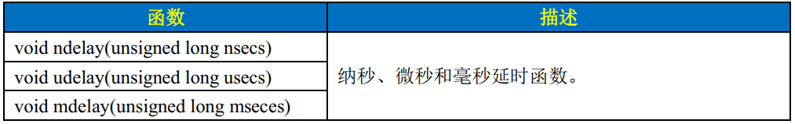

**编写实验驱动**

定义结构体 timer_list（添加头文件 /linux/timer）

应用 ioctl 函数实现对定时器的控制，命令是自己定义的，但是要符合规则：

```c
#define _IO(type, nr) // 没有参数的命令
#define _IOR(type, nr, size) // 该命令是从驱动读数据
#define _IOW(type, nr, size) // 该命令是从驱动写入数据
#define _IOWR(type, nr, size) // 双向数据传输

//type 是幻数，nr 是序号 size 是大小
```

## 11. Linux 内核中断处理

**裸机里面中断的实现方法**

* 使能中断，初始化相应的寄存器
* 注册中断复位函数，也就是想 irqTable 数组的指定标号写入中断服务函数
* 中断发生以后进入 IRQ 中断服务函数，在 IRQ 中断服务函数在数组 irqTable 里面查找具体的中断处理函数，找到以后执行相应的中断处理函数

**Linux 中断**

* 先知道你要使用的中断对应的中断号
* 先申请 request_irq 此函数会激活中断
* 如果不用中断了，那就释放掉，使用 free_irq
* 中断处理函数 `irqreturn t(*irq_handler_t)(int,void*) `

* 使能和禁止中断

**上半部和下半部**

中断一定要处理的越快越好，上半部就是处理一些比较快进快出的事件

* 当处理的内容不希望被打断，可以放在上半部
* 如果要处理的任务对时间敏感，可以放到上半部
* 如果要处理的任务与硬件有关，可以放到上半部
* 除了上述的，优先考虑放到下半部

软中断

要使用软中断，要先注册，使用函数 open softirq 。注册以后使用 raise_softirq 触发

tasklet

注册一个 tasklet 函数

**如何在设备树中描述中断信息**

`#interrupt-cells` 指定 interrupt 的 cells 数量

```c
gpio5: gpio@020ac000 {
compatible = "fsl,imx6ul-gpio", "fsl,imx35-gpio";
reg = <0x020ac000 0x4000>;
interrupts = <GIC_SPI 74 IRQ_TYPE_LEVEL_HIGH>,
<GIC_SPI 75 IRQ_TYPE_LEVEL_HIGH>;
gpio-controller;
#gpio-cells = <2>;
interrupt-controller;
#interrupt-cells = <2>;
};
```

```C
fxls8471@1e {
compatible = "fsl,fxls8471";
reg = <0x1e>;
position = <0>;
interrupt-parent = <&gpio5>;
interrupts = <0 8>;
};
```

\#interrupt-cells，指定中断源的信息 cells 个数。
interrupt-controller，表示当前节点为中断控制器。
interrupts，指定中断号，触发方式等。
interrupt-parent，指定父中断，也就是中断控制器。  

> 获取中断号

通过函数 irq_of_parse_and_map 从 inttertupes 属性获取中断号

**编写驱动**

1. 修改设备树 
2. 编写驱动文件
2. 添加消抖（通过定时器）
2. 添加 tasklet 实现实验下半部分

使用 tasklet 的目的就是，调用中断函数，中断函数启动 tasklet 然后中断就退出了，这时候就实现中断的快进快出

注意：

```c
// 释放 io 和中断
for (i = 0; i < KEY_NUM; i++)
    free_irq(irq.irqkey[i].irqnum, &irq);
for (i = 0; i < KEY_NUM; i++)
    gpio_free(irq.irqkey[i].gpio);
```

```c
ret = request_irq(dev->irqkey[i].irqnum,
                          dev->irqkey[i].handler,
                          IRQF_TRIGGER_FALLING | IRQF_TRIGGER_RISING,
                          dev->irqkey[i].name, &irq);
```

* 释放函数的设备指针要和请求函数的设备指针一致

驱动中的返回值与 app 应用程序中的返回值的关系

```c
// 从设备读取数据
static ssize_t irq_read(struct file *filp, char __user *buf, size_t count, loff_t *ppos)
{
    int ret;
    struct irq_dev *dev = (struct irq_dev *)filp->private_data;
    unsigned char keyvalue = atomic_read(&dev->keyvalue);
    unsigned char releasekey = atomic_read(&dev->releasekey);

    if (releasekey == 1)
    {
        // 将值上报给应用程序
        ret = copy_to_user(buf, &keyvalue, sizeof(keyvalue));
        atomic_set(&dev->releasekey, 0);
    }
    else
        return -1; 

    // 这个返回值在 app 中通过read() 函数返回出去
    return 0;
}
// 
```

```c
    // 循环读取
    while (1)
    {
		ret = read(fd, &data, sizeof(data));
		if (ret < 0) {  /* 数据读取错误或者无效 */
			
		} else {		/* 数据读取正确 */
			if (data)	/* 读取到数据 */
				printf("key value = %#X\r\n", data);
		}
    }
```

## 12. IO 阻塞和非阻塞实验

这里的 IO 并不是引脚而是文件的输入和输出

* 阻塞 IO 的访问：当资源不可使用的时候，应用程序就会挂起，当资源可以使用的时候，会唤醒

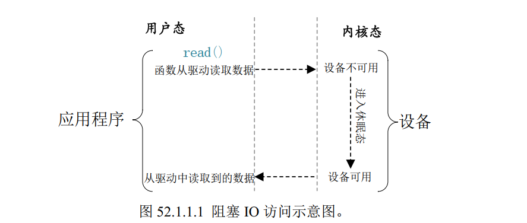

* 非阻塞 IO 的访问：当资源不可使用的时候，应用程序轮询查看或放弃。会有超时处理机制

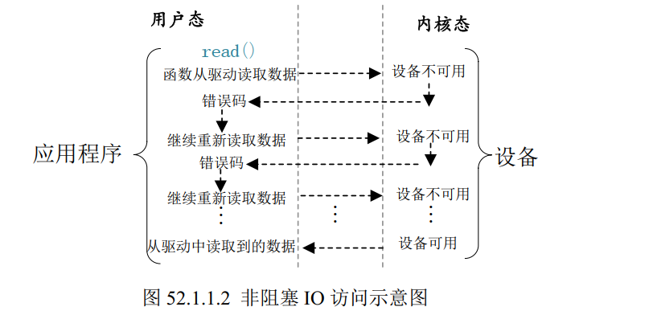

当应用程序使用非阻塞访问时，如果设备不可用或者数据未准备好就会返回错误码表示数据读取失败，应用程序会再次读取数据，直到数据读取成功

* 实现阻塞访问的代码

```c
int fd;
int data = 0;
fd = open("/dev/xxx_dev", O_RDWR); /* 阻塞方式打开 */
ret = read(fd, &data, sizeof(data)); /* 读取数据 */
```

* 实现非阻塞访问的代码（添加参数 O_NONBLOCK）

```c
int fd;
int data = 0;
fd = open("/dev/xxx_dev", O_RDWR | O_NONBLOCK); /* 非阻塞方式打开 */
ret = read(fd, &data, sizeof(data)); /* 读取数据 */
```

**等待队列**

如果使用阻塞访问的话，就要实现等待队列

1. 等待队列头

`wair_queue_head_t` 需要定义一个。定义以后使用 `init_waitqueue_head ` 函数进行初始化或者使用宏`DECLARE_WAIT_QUEUE_HEAD`定义并且初始化

2. 等待队列项

`wait_queue_t `表示等待队列项，或者使用宏 `DECLARE_WAITQUEUE(name, tsk)`

3. 添加队列项到等待队列头

`add_wait_queue` 函数

4. 移除等待队列项

资源可用的时候使用 `remove_wait_queue ` 函数移除

5. 唤醒

`wake_up` 唤醒

**轮询**

1. 驱动里面的 poll 函数

```c
// 在 file_operations 结构体里有这样一个成员变量
unsigned int (*poll) (struct file *, struct poll_table_struct *);
```

## 13. 异步通知简介

**信号**

软件层次上的中断，也叫做软中断信号，软件层次上对中断机制的一种模拟

```sh 
kill -9 xxx # 关闭某个应用
```

* 除了 SIGKILL(9) 和 SIGSTOP(19) 这两个信号不能被忽略之外，其他信号都可以忽略
* 当我们按下 GTRL + C 组合键的时候会向当前正在占用终端的应用程序发送 SIGINT 信号，该信号默认的动作是关闭当前的应用程序

**应用程序对异步通知的处理**

使用 signal 函数来设置指定信号的处理函数

```c
sighandler_t signal(int signum,sighandler_t handler)
```

* 修改 SIGINT 信号的处理函数，实现按下组合键时打印信息

```c
#include <stdlib.h>
#include <stdio.h>
#include <signal.h>

void sigint_handler(int num)
{
    printf("\r\nSIGINT signal!!!\r\n");
    exit(0);
}

int main(void)
{
    signal(SIGINT,sigint_handler);
    while(1);
    return 0;
}
```

那么问题来了，谁向应用发送信号（如果是其他信号的话）

1. 注册信号处理函数
2. 将本应用程序的进程号告诉给内核
3. 开启异步通知

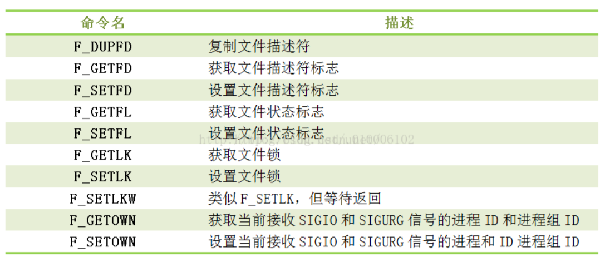

**驱动中的信号处理**

1. 要使用 fasync_struct 结构体
2. 实现 file_operations 里面的 fasync 函数，fasync 还需要借助 fasync_helper 函数
3. 实现驱动给应用发送信号的函数， kill_fasync 函数
4. 关闭驱动的时候要删除信号 

有点像 qt 的信号与槽，只不过在驱动层发送信号，在应用层接收信号

## 14. platform 设备驱动实验

以前的驱动实验都很简单，就是对 IO 的操作

目的：为了方便驱动的编写，提高软件的重用以及跨平台性能

**驱动的分隔与分离**

做法就是每一个平台的 I2C 控制器都提供一个统一的接口（也叫做主机驱动）每一个设备的话也只提供一个驱动程序（设备驱动）每个设备通过统一的 I2C 接口驱动来访问

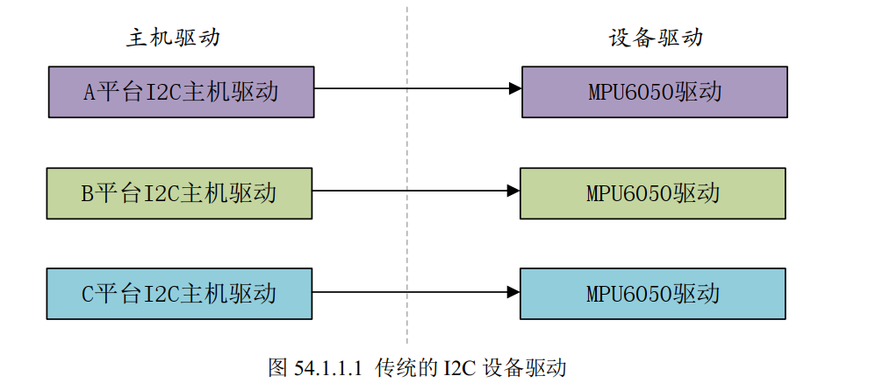

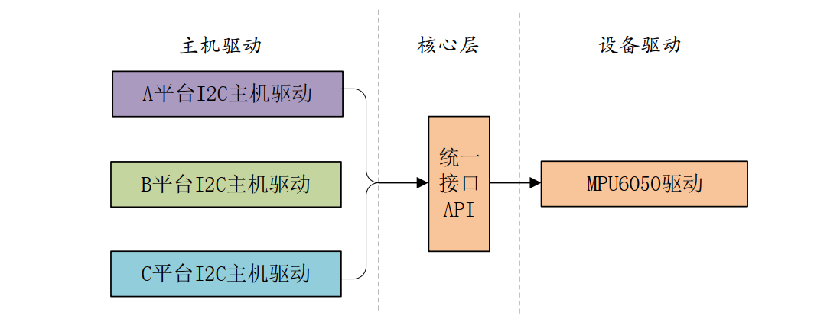

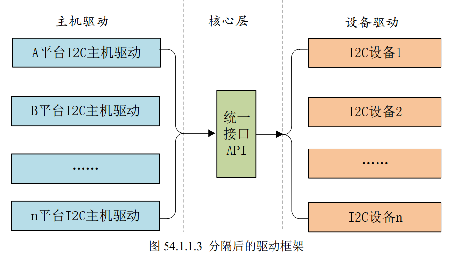

* 将驱动分离：主机控制器驱动和设备驱动，主机控制器驱动一般是半导体厂商写的
* 我们的任务就是在 linux 驱动框架下编写具体的设备驱动
* 中间的联系就是核心层

**Linux 中的总线(bus)、驱动(driver)和**
**设备(device)模型**

驱动：就是具体的设备驱动

设备：设备属性，包括地址范围，如果是 IIC 的话还有 IIC 器件地址，速度

**总线**

总线数据类型为：bus_type

```c
struct bus_type {
	const char		*name;
	const char		*dev_name;
	struct device		*dev_root;
	struct device_attribute	*dev_attrs;	/* use dev_groups instead */
	const struct attribute_group **bus_groups;
	const struct attribute_group **dev_groups;
	const struct attribute_group **drv_groups;

	int (*match)(struct device *dev, struct device_driver *drv);
	int (*uevent)(struct device *dev, struct kobj_uevent_env *env);
	int (*probe)(struct device *dev);
	int (*remove)(struct device *dev);
	void (*shutdown)(struct device *dev);

	int (*online)(struct device *dev);
	int (*offline)(struct device *dev);

	int (*suspend)(struct device *dev, pm_message_t state);
	int (*resume)(struct device *dev);

	const struct dev_pm_ops *pm;

	const struct iommu_ops *iommu_ops;

	struct subsys_private *p;
	struct lock_class_key lock_key;
};

```

* 向 Linux 内核注册总线，使用 `bus_register` 函数，卸载总线使用 `bus_unregister`函数

* 总线的主要工作就是完成总线下的**设备**和**驱动**之间的匹配（match函数指针就是用来匹配的）

**驱动**

驱动数据类型为：device_driver

```c
struct device_driver {
	const char		*name;
	struct bus_type		*bus;

	struct module		*owner;
	const char		*mod_name;	/* used for built-in modules */

	bool suppress_bind_attrs;	/* disables bind/unbind via sysfs */

	const struct of_device_id	*of_match_table;
	const struct acpi_device_id	*acpi_match_table;

	int (*probe) (struct device *dev);
	int (*remove) (struct device *dev);
	void (*shutdown) (struct device *dev);
	int (*suspend) (struct device *dev, pm_message_t state);
	int (*resume) (struct device *dev);
	const struct attribute_group **groups;

	const struct dev_pm_ops *pm;

	struct driver_private *p;
};
```

* 驱动和设备匹配以后驱动里面的 probe 函数就会执行
* 使用 driver_register 注册驱动，该函数的执行过程：

```c
driver_register
    -> bus_add_driver
    	-> driver_attach 
    		-> bus_for_each_dev // 查找总线下所有匹配设备
    			-> __driver_attach // 每个设备都调用此函数
    				-> driver_match_device // 检查是否匹配
    				-> driver_probe_device
    				-> really_probe
    					->drv->probe(dev) // 执行driver的probe函数
```

向总线注册驱动的时候，会检查当前总线下的所有设备，查找有没有与此驱动匹配的设备，有的话就会执行驱动的 probe 函数

**设备**

设备的数据类型为：device

```c
struct device {
	struct device		*parent;

	struct device_private	*p;

	struct kobject kobj;
	const char		*init_name; /* initial name of the device */
	const struct device_type *type;

	struct mutex		mutex;	/* mutex to synchronize calls to
					 * its driver.
					 */

	struct bus_type	*bus;		/* type of bus device is on */
	struct device_driver *driver;	/* which driver has allocated this
					   device */
	void		*platform_data;	/* Platform specific data, device
					   core doesn't touch it */
	void		*driver_data;	/* Driver data, set and get with
					   dev_set/get_drvdata */
	struct dev_pm_info	power;
	struct dev_pm_domain	*pm_domain;

#ifdef CONFIG_PINCTRL
	struct dev_pin_info	*pins;
#endif

#ifdef CONFIG_NUMA
	int		numa_node;	/* NUMA node this device is close to */
#endif
	u64		*dma_mask;	/* dma mask (if dma'able device) */
	u64		coherent_dma_mask;/* Like dma_mask, but for
					     alloc_coherent mappings as
					     not all hardware supports
					     64 bit addresses for consistent
					     allocations such descriptors. */
	unsigned long	dma_pfn_offset;

	struct device_dma_parameters *dma_parms;

	struct list_head	dma_pools;	/* dma pools (if dma'ble) */

	struct dma_coherent_mem	*dma_mem; /* internal for coherent mem
					     override */
#ifdef CONFIG_DMA_CMA
	struct cma *cma_area;		/* contiguous memory area for dma
					   allocations */
#endif
	/* arch specific additions */
	struct dev_archdata	archdata;

	struct device_node	*of_node; /* associated device tree node */
	struct fwnode_handle	*fwnode; /* firmware device node */

	dev_t			devt;	/* dev_t, creates the sysfs "dev" */
	u32			id;	/* device instance */

	spinlock_t		devres_lock;
	struct list_head	devres_head;

	struct klist_node	knode_class;
	struct class		*class;
	const struct attribute_group **groups;	/* optional groups */

	void	(*release)(struct device *dev);
	struct iommu_group	*iommu_group;

	bool			offline_disabled:1;
	bool			offline:1;
};
```

* 向总线注册设备的时候，使用 `device_register` 函数执行过程如下：

```c
device_register
    -> device_add
    	-> bus_add_device
    	-> bus_probe_device
    		-> device_attach
    			-> bus_for_each_drv
    				-> __driver_attach // 每个设备都调用此函数
    					-> driver_match_device // 检查是否匹配
    					-> driver_probe_device
    					-> really_probe
    						->drv->probe(dev) // 执行driver的probe函数
```

驱动与设备匹配以后，驱动的 probe 函数就会执行，probe 函数就是驱动编写人员去写的

**platform 平台驱动模型**

1. 为了方便开发，Linux 提出了驱动分离与分层
2. 进一步引出了驱动-总线-设备模型，或者框架
3. 对于 SOC 内部的 RTC，timer 等不好归结为具体的总线，为此 Linux 内核提出了一个虚拟总线，也就是 platform 总线 ，当然也就有对应的 platform 设备和 platform 驱动

* platform 总线注册：

```c
struct bus_type platform_bus_type = {
.name = "platform",
.dev_groups = platform_dev_groups,
.match = platform_match,
.uevent = platform_uevent,
.pm = &platform_dev_pm_ops,
};
```

* platform 驱动注册：

```c
struct platform_driver {
int (*probe)(struct platform_device *);
int (*remove)(struct platform_device *);
void (*shutdown)(struct platform_device *);
int (*suspend)(struct platform_device *, pm_message_t state);
int (*resume)(struct platform_device *);
struct device_driver driver;
const struct platform_device_id *id_table;
bool prevent_deferred_probe;
};
```

* platform 设备注册：

```c
struct platform_device {
const char *name;
int id;
bool id_auto;
struct device dev;
u32 num_resources;
struct resource *resource;
const struct platform_device_id *id_entry;
char *driver_override; /* Driver name to force a match */
/* MFD cell pointer */
struct mfd_cell *mfd_cell;
/* arch specific additions */
struct pdev_archdata archdata;
};
```

* 无设备树的时候就要添加上面的设备结构体，使用 platform_device_register 函数注册设备

* 有设备树的话就只要修改设备树节点

platform 匹配过程

根据前面的分析，驱动和设备的匹配都是通过 bus -> match 函数，platform 总线下的 match 函数就是：platform_match

**程序编写-无设备树**

两部分：platform_driver platform_device

* platform_device

```c
/* 设备加载 */
static int __init leddevice_init(void)
{
    /* 注册platform设备 */
    return platform_device_register(&leddevice);
}

/* 设备卸载 */
static void __exit leddevice_exit(void)
{
    /* 卸载platform设备 */
    platform_device_unregister(&leddevice);
}
```

主要就是像之前写模块那样的框架，但是使用了注册和卸载 platform 的函数，编译完成后生成 .ko 文件，执行 modprobe 进行加载，加载成功后可以在 /sys/bus/platform/devices 路径下看到编写好的设备

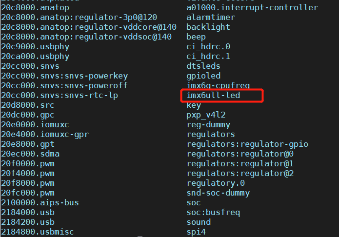

* platform_driver

```c
/* 驱动加载 */
static int __init leddriver_init(void)
{
    platform_driver_register(&led_driver);
    return 0;
}

/* 驱动卸载 */
static void __exit leddriver_exit(void)
{
    platform_driver_unregister(&led_driver);
}
```

还是和以前一样写模块的框架，当写好驱动和设备模块时，modprobe 运行模块，（驱动和设别模块的运行顺序无所谓），如果成功匹配设备和驱动会执行 probe 函数，也即是打印信息

```c
/* probe 函数*/
static int led_probe(struct platform_device *dev)
{
    printk("led_probe run\r\n");
    return 0;
}
```

那么接下进行的操作就是在此函数上初始化 IO 等操作，但是编写驱动需要寄存器地址信息，地址信息使用设备信息，定义在 platform_device 里面，因此需要使用 platform_get_resource() 函数来获取资源，最后其他的操作都和以前的点灯程序一样

**程序编写-有设备树**

有设备树的时候是由设备树描述的，因此不需要像总线注册设备而是直接修改设备树，然后编写驱动

* 有设备树的话就不需要编写 platform_device函数，通过与设备树的节点 compatible 属性值进行匹配，匹配成功则执行 Probe 函数

```c
/* 设备树匹配表结构体(就是一个设备id数组) */
struct of_device_id led_of_match[] = {
    {.compatible = "alientek,gpioled"},
    {.compatible = "xxx"},
    {/* sentinel */},
};

struct platform_driver led_driver = {
    .driver = {
        .name = "imx6ull-led",          /* 无设备树的时候用来进行匹配 */
        .of_match_table = led_of_match, /* 设备树匹配表 */
    },
    .remove = led_remove,
    .probe = led_probe,
};
```

* 之后的操作就是通过获取设备树节点进行点灯操作
* 当驱动与设备树成功匹配后，可以通过结构体来获取相应的设备树节点信息（platform 提供了很多 API 函数去获取设备相关信息）

```c
    /* 设置LED所使用的GPIO */
    /* 1、获取设备节点：gpioled */
    /* 这里由于驱动已经与设备树匹配成功了，所以就不需要再找节点*/
#if 0    
	dtsled_dev.nd = of_find_node_by_path("/gpioled");
	if(dtsled_dev.nd == NULL) {
		printk("gpioled node not find!\r\n");
		return -EINVAL;
	} else {
		printk("gpioled node find!\r\n");
	}
#endif
    // 因此可以直接通过指针寻找到节点 <<--
    dtsled_dev.nd = dev->dev.of_node;
```

## 15. Linux 自带 LED 驱动实验

Linux 自带的驱动，都是通过图形化界面配置，选择使能或者不使用。在 linux 内核源码输入 `make menuconfig`

找到：按 y 编译在内核（其实就是修改了 .config 文件的某个选项 CONFIG_LEDS_GPIO ）

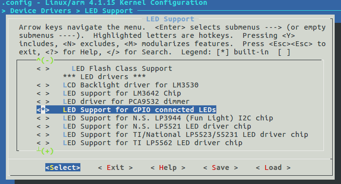

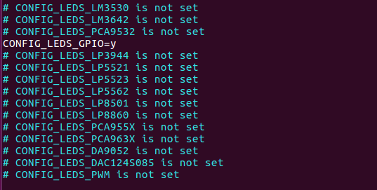

在 Linux 内核源码中一般驱动文件夹下 makefile 会使用 CONFIG_XXX 来决定要编译哪个文件，比如 led 的配置可以在如下路径的 makefile 文件下查看

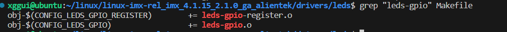

**Linux 自带的 led 驱动分析**

打开驱动文件 `leds-gpio.c` 用 vscode 在内核源码里面搜

```c
static struct platform_driver gpio_led_driver = {
	.probe		= gpio_led_probe,
	.remove		= gpio_led_remove,
	.driver		= {
		.name	= "leds-gpio",
		.of_match_table = of_gpio_leds_match,
	},
};

module_platform_driver(gpio_led_driver);
```

为什么没有 `module_init` 和 `module_exit`？

因为 `module_platform_driver` 这个宏其实就是上面两个函数

根据 gpio_led_driver 可以知道，设备树的匹配表里面的属性值为：

```c
static const struct of_device_id of_gpio_leds_match[] = {
	{ .compatible = "gpio-leds", },
	{},
};
```

因此当我们在设备树添加对应的节点的时候要使用这个属性值，但设备和驱动匹配后 probe 函数执行

**内核自带的 led 驱动的使用**

1. 首先将驱动编译进内核里面
2. 根据绑定文档在设备树上添加相应的设备节点信息
3. 如果无设备树，那么就要使用 platform_device_register 向总线注册设备，如果有设备树，就直接修改设备树，添加指定的节点，绑定文档地址如下：

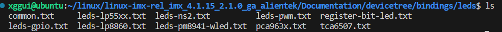

* 修改设备树

```c
/ {

	dtsleds {
		compatible = "gpio-leds";
		led0 {
			label = "red";
			gpios = <&gpio1 3 GPIO_ACTIVE_LOW>;
			default-state = "off"; // 灯的默认状态
			linux,default-trigger = "heartbeat"; // 设置默认触发为心跳模式

		};

	};
};
```

最后可以在 `/sys/devices/platform/dtsleds/leds/red ` 下改变灯的配置

## 16. Linux MISC 杂项驱动

**内核自带 misc 驱动简介**

* 其实 misc 就是最简单的字符设备封装在 platform 总线驱动下

* misc 设备驱动的主设备号都为 10 ，不同的设备使用不同的从设备号
* misc 设备会自动创建 cdev 不需要像我们以前那样手动创建

使用 misc 设备需要注册结构体：

```c
struct miscdevice  {
	int minor; // 从设备号
	const char *name; // 设备名字
	const struct file_operations *fops; // 字符操作函数集
	struct list_head list;
	struct device *parent;
	struct device *this_device;
	const struct attribute_group **groups;
	const char *nodename;
	umode_t mode;
};
```

注册设备函数：

```c
extern int misc_register(struct miscdevice *misc);
extern int misc_deregister(struct miscdevice *misc);
```

这些函数会代替 cdev 的创建和初始化（自动获取设备节点文件等），以及销毁工作

如果 minor 为 255 也就是宏 MISC_DYNAMIC_MINOR 的话会自动申请设备号

**使用 misc 驱动框架**

查看代码

## 17. INPUT 子系统

**input 子系统简介**

输入设备本质上还是字符设备，只是在此基础上套上了 input 框架，用户只需要负责上报输入事件，比如按键值、坐标等信息， input 核心层负责处理这些事件  

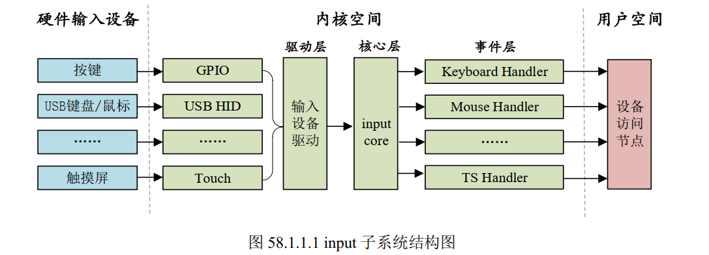

* input 子系统也是字符设备，只不过 input 核心层会帮我们注册相应的驱动

* 在 input.c 文件里有模块的入口出口函数

```c
// 出口函数
static void __exit input_exit(void)
{
	input_proc_exit();
	unregister_chrdev_region(MKDEV(INPUT_MAJOR, 0),
				 INPUT_MAX_CHAR_DEVICES);
	class_unregister(&input_class);
}
// 入口函数
static int __init input_init(void)
{
	int err;

	err = class_register(&input_class); // 不就是注册了一个类吗（自动创建设备节点文件）
	if (err) {
		pr_err("unable to register input_dev class\n");
		return err;
	}

	err = input_proc_init();
	if (err)
		goto fail1;

	err = register_chrdev_region(MKDEV(INPUT_MAJOR, 0), // 不就是注册字符设备吗
				     INPUT_MAX_CHAR_DEVICES, "input");
	if (err) {
		pr_err("unable to register char major %d", INPUT_MAJOR);
		goto fail2;
	}

	return 0;

 fail2:	input_proc_exit();
 fail1:	class_unregister(&input_class);
	return err;
}
```

可以在这里看到类的注册结果：

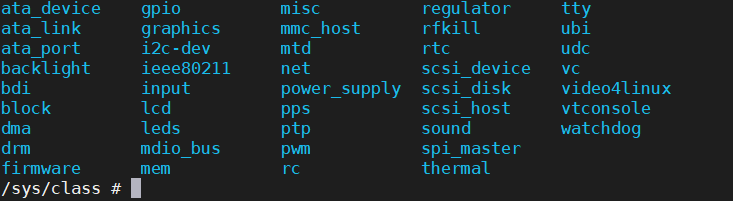

既然内核已经帮我们写好了 input 驱动，那么我们要干什么？需要我们去完善具体的输入设备，完善输入设备的时候就要按照 input 子系统框架的要求来

**注册 input 设备**

设备的结构体在 input.c 文件里

```c
struct input_dev {
	const char *name;
	const char *phys;
	const char *uniq;
	struct input_id id;

	unsigned long propbit[BITS_TO_LONGS(INPUT_PROP_CNT)];

	unsigned long evbit[BITS_TO_LONGS(EV_CNT)];
	unsigned long keybit[BITS_TO_LONGS(KEY_CNT)];
	unsigned long relbit[BITS_TO_LONGS(REL_CNT)];
	unsigned long absbit[BITS_TO_LONGS(ABS_CNT)];
	unsigned long mscbit[BITS_TO_LONGS(MSC_CNT)];
	unsigned long ledbit[BITS_TO_LONGS(LED_CNT)];
	unsigned long sndbit[BITS_TO_LONGS(SND_CNT)];
	unsigned long ffbit[BITS_TO_LONGS(FF_CNT)];
	unsigned long swbit[BITS_TO_LONGS(SW_CNT)];

	unsigned int hint_events_per_packet;

	unsigned int keycodemax;
	unsigned int keycodesize;
	void *keycode;

	int (*setkeycode)(struct input_dev *dev,
			  const struct input_keymap_entry *ke,
			  unsigned int *old_keycode);
	int (*getkeycode)(struct input_dev *dev,
			  struct input_keymap_entry *ke);

	struct ff_device *ff;

	unsigned int repeat_key;
	struct timer_list timer;

	int rep[REP_CNT];

	struct input_mt *mt;

	struct input_absinfo *absinfo;

	unsigned long key[BITS_TO_LONGS(KEY_CNT)];
	unsigned long led[BITS_TO_LONGS(LED_CNT)];
	unsigned long snd[BITS_TO_LONGS(SND_CNT)];
	unsigned long sw[BITS_TO_LONGS(SW_CNT)];

	int (*open)(struct input_dev *dev);
	void (*close)(struct input_dev *dev);
	int (*flush)(struct input_dev *dev, struct file *file);
	int (*event)(struct input_dev *dev, unsigned int type, unsigned int code, int value);

	struct input_handle __rcu *grab;

	spinlock_t event_lock;
	struct mutex mutex;

	unsigned int users;
	bool going_away;

	struct device dev;

	struct list_head	h_list;
	struct list_head	node;

	unsigned int num_vals;
	unsigned int max_vals;
	struct input_value *vals;

	bool devres_managed;
};
```

* 申请并初始化 input_dev 使用 input_alloc_device 函数
* evbit 表示输入事件，比如按键对用的事件为 EV_KEY 如果要连按，就要添加 EV_REP，按键还有对应的位图，也在该 input.c 文件中
* 初始化 input_dev 以后需要向内核注册，使用 input_register_device 函数

**事件的上报**

按键按下以后上报事件，比如对于按键而言就是在按键中断服务函数，或者消抖定时器函数里面获取按键按下情况并且上报，可以使用 input_event 函数

```c
void input_event(struct input_dev *dev, unsigned int type, unsigned int code, int value);
```

对于按键而言，也可以使用

```c
static inline void input_report_key(struct input_dev *dev, unsigned int code, int value)
{
	input_event(dev, EV_KEY, code, !!value);
}
```

使用上面两个函数上报完成输入函数以后，需要使用 Input_sync 做同步

**程序的编写**

程序编写好后加载模块，在 `/dev/input/`可以看到多了一个设备节点文件，执行 `hexdump /dev/input/event2` 然后点击按键会产生一系列字符：

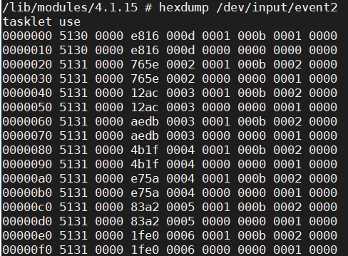

**input_event 结构体**

应用程序可以通过 input_event 来获取输入事件数据，比如按键值

```c
struct input_event {
	struct timeval time;
	__u16 type; // 事件类型
	__u16 code; // 事件码，比如按键事件就是按键码
	__s32 value; // 值，对于按键就是按下或者抬起
};
```

```c
struct timeval {
	__kernel_time_t		tv_sec;		/* seconds */
	__kernel_suseconds_t	tv_usec;	/* microseconds */
};
```

字符解析：

```c
//编号  秒（32位）	微秒（32位）  type code 	 value
0000000 5130 0000 	e816 000d 	0001 000b 	0001 0000
0000010 5130 0000 	e816 000d 	0000 0000 	0000 0000
0000020 5131 0000 	765e 0002 	0001 000b 	0001 0000
0000030 5131 0000 	765e 0002 	0000 0000 	0000 0000
0000040 5131 0000 	12ac 0003 	0001 000b 	0001 0000
// type 为1 0 1 0.. 因为EV_KEY是1 EV_SYN是0 
// code 为b 0 b 0.. 因为KEY_0是11也就是0b    
```

**编写应用程序**

按键驱动对应的文件就是 `/dev/input/eventX`，应用程序读取该文件来得到按键信息，也就是按键有没有被按下

**Linux 内核自带按键驱动程序使用**

* 配置内核，选中内核自带的 KEY 驱动程序，然后会在 .config 里面产生 `CONFIG_KEYBOARD_GPIO = y`

* 经过查找，内核自带的 KEY 驱动程序是 gpio_keys.c 这是一个标准的 platform 驱动

```c
static struct platform_driver gpio_keys_device_driver = {
	.probe		= gpio_keys_probe,
	.remove		= gpio_keys_remove,
	.driver		= {
		.name	= "gpio-keys",
		.pm	= &gpio_keys_pm_ops,
		.of_match_table = of_match_ptr(gpio_keys_of_match),
	}
};
```

```c
static const struct of_device_id gpio_keys_of_match[] = {
	{ .compatible = "gpio-keys", },
	{ },
};
```

因此我们在设备树中添加对应的节点的时候，其 compatible 属性必须是 "gpio-keys"

* 修改设备树，根据绑定文档添加如下的节点

```c
/ {
// 给linux自带的按键驱动添加节点
	gpio_keys {
		compatible = "gpio-keys";
		#address-cells = <1>;
		#size-cells = <0>;
		pinctrl-names = "default";
		pinctrl-0 = <&pinctrl_key>;	 // !!!注意，这里即使不添加管脚复用功能，按键也能正常使用，因为默认复用为了gpio        
		autorepeat;
		key0 {
			label = "GPIO_KEY_ENTER";
			linux,code = <KEY_ENTER>;
			gpios = <&gpio1 18 GPIO_ACTIVE_LOW>;
		};
	};
};
```

由于驱动在启动 linux 系统时已经自动添加，因此修改设备树成功匹配后便会在 `/dev/input/` 下生成相应的设备节点文件

## 18. LCD 驱动实验

**Frame buffer 设备**

只针对 rgb 屏幕，framebuffer 是一种机制，应用程序操作驱动里面 LCD 显存的一种机制，因为应用程序需要通过操作显存来在 LCD 上显示信息。

* 当我们编写好驱动以后会生成一个名为 `/dev/fbX(X=0~n)`的设备，应用程序通过访问 /dev/fbX 这个设备就可以访问 LCD。NXP 官方的 Linux 内核默认已经开启了 LCD 驱动

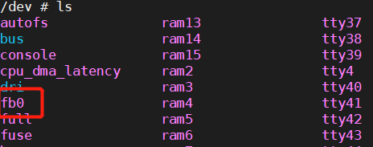

**LCD 驱动解析**

* 驱动文件为 mxsfb.c 为 platform 驱动框架，驱动和设备匹配以后，mxsfb_probe 函数就会执行
* framebuffer 在内核中的表现就是 fb_info 结构体

```c
struct fb_info {
	atomic_t count;
	int node;
	int flags;
	struct mutex lock;		/* Lock for open/release/ioctl funcs */
	struct mutex mm_lock;		/* Lock for fb_mmap and smem_* fields */
	struct fb_var_screeninfo var;	/* Current var */
	struct fb_fix_screeninfo fix;	/* Current fix */
	struct fb_monspecs monspecs;	/* Current Monitor specs */
	struct work_struct queue;	/* Framebuffer event queue */
	struct fb_pixmap pixmap;	/* Image hardware mapper */
	struct fb_pixmap sprite;	/* Cursor hardware mapper */
	struct fb_cmap cmap;		/* Current cmap */
	struct list_head modelist;      /* mode list */
	struct fb_videomode *mode;	/* current mode */

#ifdef CONFIG_FB_BACKLIGHT
	/* assigned backlight device */
	/* set before framebuffer registration, 
	   remove after unregister */
	struct backlight_device *bl_dev;

	/* Backlight level curve */
	struct mutex bl_curve_mutex;	
	u8 bl_curve[FB_BACKLIGHT_LEVELS];
#endif
#ifdef CONFIG_FB_DEFERRED_IO
	struct delayed_work deferred_work;
	struct fb_deferred_io *fbdefio;
#endif

	struct fb_ops *fbops;
	struct device *device;		/* This is the parent */
	struct device *dev;		/* This is this fb device */
	int class_flag;                    /* private sysfs flags */
#ifdef CONFIG_FB_TILEBLITTING
	struct fb_tile_ops *tileops;    /* Tile Blitting */
#endif
	char __iomem *screen_base;	/* Virtual address */
	unsigned long screen_size;	/* Amount of ioremapped VRAM or 0 */ 
	void *pseudo_palette;		/* Fake palette of 16 colors */ 
#define FBINFO_STATE_RUNNING	0
#define FBINFO_STATE_SUSPENDED	1
	u32 state;			/* Hardware state i.e suspend */
	void *fbcon_par;                /* fbcon use-only private area */
	/* From here on everything is device dependent */
	void *par;
	/* we need the PCI or similar aperture base/size not
	   smem_start/size as smem_start may just be an object
	   allocated inside the aperture so may not actually overlap */
	struct apertures_struct {
		unsigned int count;
		struct aperture {
			resource_size_t base;
			resource_size_t size;
		} ranges[0];
	} *apertures;

	bool skip_vt_switch; /* no VT switch on suspend/resume required */
};
```

* 屏幕驱动重点就是初始化 fb_info 里面的各个成员变量，初始化完成以后，通过 register_framebuffer 函数向内核注册 fb_info，同理，卸载就是用 unregister_framebuffer 函数

* mxsfb_probe 函数重点工作

  * 初始化 fb_info 并且向内核注册
  * 初始化 LCDIF 控制器

  mxsfb_init_fbinfo_dt 

**驱动编写**

修改设备树：

1. 屏幕引脚设置

将屏幕引脚电气属性改为 0x49，就是降低 lcd 引脚的驱动能力（因为原子的屏幕引脚有一部分复用来作为 boot 启动开关，如果驱动能力太强会影响网络）

2. 修改设备树（配置好自己的屏幕）

```c
&lcdif {
	pinctrl-names = "default";
	pinctrl-0 = <&pinctrl_lcdif_dat
		     &pinctrl_lcdif_ctrl>;
	display = <&display0>;
	status = "okay";

	display0: display {
		bits-per-pixel = <32>;
		bus-width = <24>;

		display-timings {
			native-mode = <&timing0>;
			timing0: timing0 {
			clock-frequency = <51200000>;  
			hactive = <800>;
			vactive = <480>;
			hfront-porch = <40>;
			hback-porch = <88>;
			hsync-len = <48>;
			vback-porch = <32>;
			vfront-porch = <13>;
			vsync-len = <3>;

			hsync-active = <0>;
			vsync-active = <0>;
			de-active = <1>;
			pixelclk-active = <1>;
			};
		};
	};
};
```

拷贝设备树，然后重启开发板，输入 `echo hello linux > /dev/tty1`

便会在屏幕上输出字符

3. 将屏幕作为终端

修改 initab 文件：添加一行 （这里打错了应该是 tty1::askfirst:）

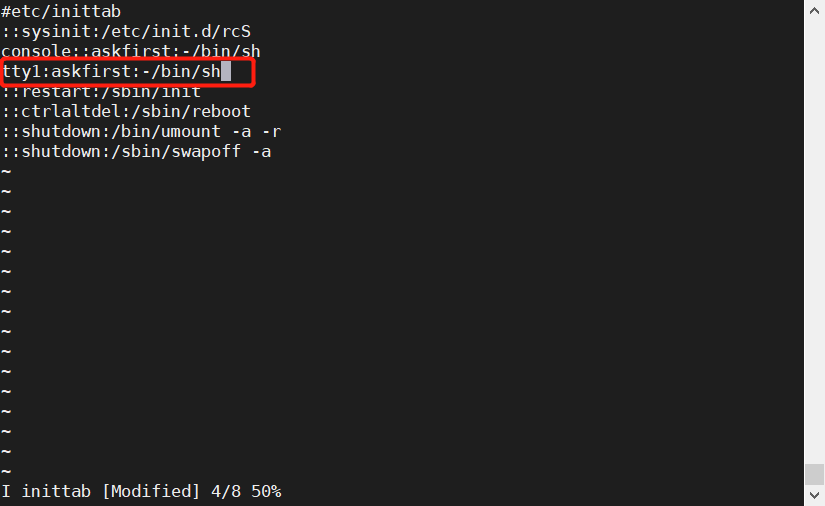

在 uboot 里修改 bootargs 环境变量


一般屏幕的背光用 PWM 控制亮度，一般测试屏幕的时候直接将背光引脚拉高或拉低

## 19. Linux 多点电容触摸屏实验

* 电容触摸屏，上报多点触摸信息，通过触摸芯片，比如 FT5426 ，这是一个 IIC，多点电容触摸屏的本质就是 IIC 驱动

* 触摸 IIC 一般都是有中断的，当检测到触摸信息以后就会触发中断，在中断处理函数里读取触摸点信息
* 得到触摸点信息，linux 系统如何使用，input 设备，linux 下有触摸屏上报的流程，涉及到 input 子系统下触摸信息的上报（根据 MT 协议进行上报）MT 协议被分为 Type A Type B 协议
  * Type A 一股脑全部上报所有触摸点信息，系统去甄别这些信息属于哪个触摸点的
  * Type B 适用于触摸芯片有追踪能力的

上报触摸信息是通过不同的事件来上报的：ABS_MT_XXX 事件

Type A：

```c
ABS_MT_POSITION_X x[0] // 第一个点x轴坐标
ABS_MT_POSITION_Y y[0] // 第一个点y轴坐标    
SYN_MT_REPORT // 点与点之间使用该事件隔离，使用 input_mt_sync 函数进行
ABS_MT_POSITION_X x[0] // 第二个点x轴坐标
ABS_MT_POSITION_Y y[0] // 第二个点y轴坐标    
SYN_MT_REPORT // 点与点之间使用该事件隔离，使用 input_mt_sync 函数进行    
SYN_REPORT // 所有点发送完成 input_sync 函数    
```

Type B：

```c
ABS_MT_SLOT 0 // 使用 slot 来区分触摸点，表示要上报第一个触摸点信息
ABS_MT_TRACKING_ID 45 // 通过调用 input_mt_report_slot_state 函数来产生 id
ABS_MT_POSITION_X x[0] // 点坐标
ABS_MT_POSITION_Y y[0]
ABS_MT_SLOT 1 // 上报第二个触摸点 input_mt_slot 函数来上报
ABS_MT_TRACKING_ID 46 // 产生 id 
ABS_MT_POSITION_X x[1]
ABS_MT_POSITION_Y y[1]
SYN_REPORT // 所有点发送完成 input_sync 函数
```

**驱动编写与测试**

1. 驱动主框架是 IIC 设备，会用到中断，在中断处理函数里面上报触摸点信息，要用到 input 子系统框架
2. 设备 IO 修改，IIC 节点添加：

```c
INT -> GPIO1_IO09
RST -> SNVS_TAMPER9
I2C_SDA -> UART5_RXD
I2C_SCL -> UART5_RXD    
```

使用 devm_request_threaded_irq 这个函数来申请中断，而不是使用 request_irq 因为，当你把手一直放到屏幕上，芯片会一直不断执行中断，导致其他的进程得不到 cpu 资源，使用这个函数会使得中断的优先级没那么高，使得其他进程与中断进行公平合理的竞争 cpu 资源。并且，有 devm_ 前缀的函数申请到的资源是可以自动释放的

```c
gt9147: gt9147@38 {
	compatible = "edt,edt-gt9147";
	reg = <0x38>;
	pinctrl-names = "default";
	pinctrl-0 = <&pinctrl_tsc
				&pinctrl_tsc_reset>;
	interrupt-parent = <&gpio1>;
	interrupts=<9 0>;
	reset-gpios = <&gpio5 9 GPIO_ACTIVE_LOW>; 
	interrupt-gpios = <&gpio1 9 GPIO_ACTIVE_LOW>; 
	status = "okay";
};
```


