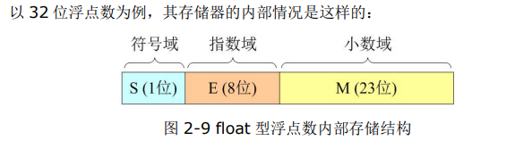
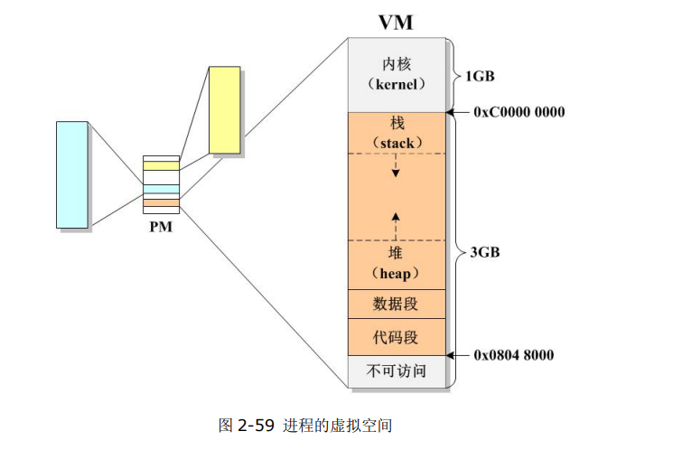
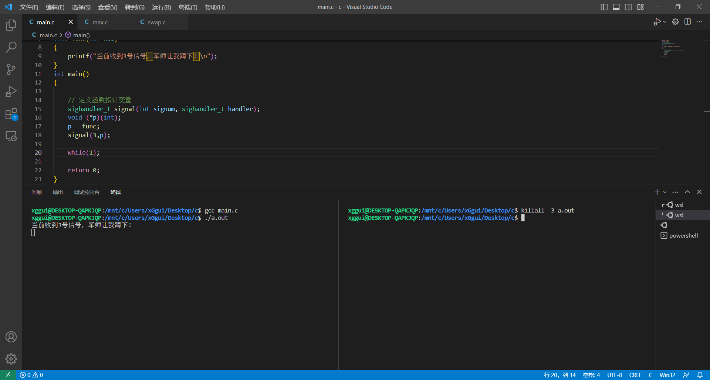

# C语言基础

## Linux 基本操作

* 查看工作文件夹
  
```txt
pwd 查看当前用户的工作文件夹路径
```

* cd 切换文件路径
  
```txt
cd /
cd 
cd ~
cd -
cd ..
```

* ls 查看文件

```txt
ls
ls -l
ls -a 显示包括隐藏文件

-rw-r--r-- 1 ubuntu ubuntu 8980 Jul 6 2020 examples.img
rw- 文件的拥有者 权值6
r-- 同组用户 权值4
r-- 其他用户 权值4
1：链接数 
普通文件：指该文件有多少个链接（当电脑删除文件时，就是指无法访问，链接数为0，等待新文件将其覆盖，才是真正意义上的删除）
目录文件：指该目录下还有多少个目录
ubuntu： 拥有者
ubuntu： 所属组
Jul 6 2020 修改时间
examples.img 文件名

R可读 W可写 X可执行
1   0   0  权值4 只读
0   1   0  权值2 只写
0   0   1  权值1 只执行
1   1   1  权值7 都可

文件类型（共7种）:
- 普通文件（mp3,avi,mp4..）
d 目录文件（文件夹）
p 管道文件（一般用于进程间的通信）
l 链接文件（快捷方式）
s 套接字文件（一般用于网络通信）
b 块设备文件（驱动的设备文件由驱动生成）
c 字符设备文件（驱动的设备文件由驱动生成）
```

* find & locate查找

```txt
find -name 文件名 在当前目录下查找出文件的路径
locate 文件名 在根目录下查找出文件的路径
```

* clear 清除

```tst
快捷键 Ctrl L
```

* cat 打印输出文件的内容

```txt
cat evens [-n 显示行数]
head 查看某个文件的头部
head -25 stdio.h 查看前25行
tail -25 stdio.h 查看后25行
```

* grep 在文件中查找字符

```txt
grep printf stdio.h
```

* chmod 修改文件权限

```txt
chmod 367 文件名
```

* cp 复制文件

```txt
cp 源文件名字（路径） 新文件名字（路径）
cp 源文件夹名字（路径） 新文件夹名字（路径） -r //递归复制文件夹
```

* mv 移动文件或文件夹

```txt
mv 源文件名字（路径） 文件夹名字（路径）
mv 源文件夹名字（路径） 文件夹名字（路径）
重命名文件(取决于第三个参数的文件不存在)
mv 源文件名字 新文件名字
```

* mkdir & touch 创建文件夹&文件

```txt
mkdir dir01
touch file01
```

* rm 删库跑路

```txt
rm abc.c 
rm dir -r 递归删除文件夹
rm -rf
```

* sudo 临时获得超级权限

```txt
sudo touch /abc.c 获得超级权限在根目录下创建文件
sudo -s 成为超级用户
exit 退出超级权限
```

```txt
bin目录的作用：存放二进制可执行的命令文件
```

* man 查看手册

```txt
man man 查看man的第1本
man -f mkfifo 列举mkfifo所有本的手册
man 3 mkfifo 查看mkfifo的第3本
```

| 数字 | 说明                                                         |
| ---- | ------------------------------------------------------------ |
| 1    | 可执行程序或 Shell 命令                                      |
| 2    | 系统调用（内核提供的函数）                                   |
| 3    | 库调用                                                       |
| 4    | 特殊文件（通常位于 /dev 目录）                               |
| 5    | 文件格式和约定（比如 /etc/passwd）                           |
| 6    | 游戏                                                         |
| 7    | 杂项（包和一些约定）Miscellaneous (including macro packages and conventions), e.g. man(7), groff(7) |
| 8    | 系统管理命令（通常是 root 用户执行的命令）                   |
| 9    | 内核相关的文件 Kernel routines [Non standard]                |

linux安装gcc

```txt
更换成国内软件源后
sudo apt install gcc
```

标准输入： stdin 对应键盘文件

标准输出： stdout 对应终端《带缓冲区》（屏幕）

标准出错： stderr 对应终端《无缓冲区》（屏幕）

编译

```txt
gcc test.c //生成a.out可执行文件
```


```txt
/n刷新缓冲区，把字符打印出来
```

```c
//输出文件名字，函数名字， 行号
printf("%s--%s--%d\n", __FILE__, __FUNCTION__, __LINE__);
```

gcc编译器

```txt
gcc Hello.c //默认生成a.out 文件
gcc Hello.c -o TieZhu //生成特定名字的文件
gcc Hello.c -v //显示编译的过程详细信息，包括头文件的寻找路径
gcc Hello.c -o TieZhu -I/mnt/d/ -v //-I指定头文件的寻找路径
```

vim编辑器

```txt
三种模式 命令模式 编辑模式 尾行模式
默认情况下使用vim大开编辑器会处于命令模式下

按下: 切入尾行模式
--:w 保存文件（写入到文件）
--:q 退出
--:wq 保存退出
--:! 强制
--:q!不保存退出
--:wq 保存并退出
--:w filename 另存为
尾行模式下按下esc 则可以退出尾行模式，回到命令模式

按下i o a I O A 进入编辑模式
i 在光标前面插入
I 在当前行首进行插入
o 在当前光标的下一行新建一行进行插入 
O 在当前光标的上一行新建一行进行插入 
a 在当前光标的后面插入
A 在当前行尾进行插入
编辑模式下按下esc可以退出编辑模式，回到命令模式
```

## 数据类型

* 标准格式化输出

```c
printf();

printf("%10d", 100)
out:-------100

printf("%-10d", 100)
out:100
```

* 标准格式化输入

```c
scanf(); //扫描键盘
getchar();//获取一个字符

scanf()函数
头文件:
    #include <stdio.h>
函数原型:
    int scanf(const char *format,...);
参数分析:
    format --> 格式化
    ... ---> 省略，根据format所写的格式控制符，对应的内存地址
返回值:
    success: 返回具体获取到的items
    false: 返回0        
        
sample: 
    int a;
    int ret_val = scanf("%d",&a);

getchar()函数
头文件:
    #include <stdio.h>
函数原型:
    int getchar(void);
返回值:
    success: 返回具体获取到的字符（unsigned）
    false: 返回EOF   
        
        

//scanf配合getchar使用
int main(int argc,char const *argv[])
{   
   int i = '0';
    i  = scanf("%d",&i);//不符合类型的数据会忽略，残留在缓冲区里
    while(getchar()!='\n');//清空缓冲区

    printf("%d",i);

    return 0;       
}
//[^\n]表示只有回车符才是结束标记
//scanf("%[^\n]s",p)
```

* %必须有， 格式化的开头标记

* \- 对齐的方式，向左对齐(空格在右边)，如果没有则是向右对齐（空格在左边）

* m.n  m指域的宽度，n指精度(默认精度为6)
  * 如果m的值比实际数据小则按实际输出，反之则用空格来填补
* l 指的是long表示长整型
* h 短整型

格式控制符：

* 十进制整型 %d %9d  %ld  %u 无符号 %lu长无符号
* 八进制整型 %o %O %#o 输出进制的符号
* 十六进制 %x %X %#x
* 字符 %c
* 字符串 %s
* 单精度浮点 %f %.nf
* 双精度浮点 %lf
* 长双精度 %Lf
* 地址 %p

整型

```c
unsigned 提高正整数的取值范围 (最高位31位表示符号位, 1表示负数)
long long 
long 
short
正整数直接使用源码存储
100的二进制存储 100-> 0000 0000 0000 0000 0000 0000 0110 0100
负整数直接使用补码存储
-100的二进制存储 -100-> 1000 0000 0000 0000 0000 0000 0110 0100
取反+1(符号位不取反) -> 1111 1111 1111 1111 1111 1111 1001 1100
```

浮点型

```c
单精度浮点型 float 典型的是4字节
双精度浮点型 double 典型的是8字节
长双精度 long double 
IEEE浮点型的计算公式 V = (-1)^sXMX2^E
S M E
```



字符串的计算公式 v = (-1)^s^  \*M\* 2^E^

字符类型

```c
char c = 'k';
```

1.申请一片内存命名为c

2.确定内存的大小为char

3.把'k'的ascii码值转换为二进制，并且存储到内存当中

```c
char k = 'H'
printf("%c\n", k+1);
printf("%c\n", k-1);
```

字符串

字符串表现形式

```c
char s1 [] = "hello";
//先申请一片内存名字为s1
//确定内存用来表示数组
//确定元素的类型是char
char *s2 = "hello";
//申请一片内存名字为s2
//确定内存中用来存放一个指针
//指针指向常量"hello"
```

布尔类型

```c
#include <stdbool.h> //c语言中要包括头文件<stdbool.h>
#include <stdio.h>
```

常量与变量

```c
100整型常量
100L 长整型
100LL 长长整型
100UL 无符号的长整型
3.14 编译器默认升级为双精度
3.14L 长的双精度浮点型
'a' 字符常量
"Hello" 字符串常量(char 指针 char*)
```

## 类型转换

隐式： 自动转为高精度类型 float+int+double = double

强制：`float f = (float)'c';`

char->shot->int->long->float->double->long double

数据类型的本质：用户与系统之间的一个约定，约定是如何解析内存中的二进制编码

类型转换就是打破之前的约定

* 可移植的数据类型

不管在什么系统中，数据的尺寸都是固定的

关键字： typedef

````c
linux路径下有这样一个头文件: 
xggui@DESKTOP-QAPKJQP:/usr/include/x86_64-linux-gnu/bits$ vim types.h
typedef int __int32_t;
typedef long __long_64_t;
系统提供了一些预定义的可以直接使用的数据类型
/* Convenience types.  */
typedef unsigned char __u_char;
typedef unsigned short int __u_short;
typedef unsigned int __u_int;
typedef unsigned long int __u_long;

/* Fixed-size types, underlying types depend on word size and compiler.  */
typedef signed char __int8_t;
typedef unsigned char __uint8_t;
typedef signed short int __int16_t;
typedef unsigned short int __uint16_t;
typedef signed int __int32_t;
typedef unsigned int __uint32_t;
#if __WORDSIZE == 64
typedef signed long int __int64_t;
typedef unsigned long int __uint64_t;
#else
__extension__ typedef signed long long int __int64_t;
__extension__ typedef unsigned long long int __uint64_t;
#endif
````

## 运算符

(a)&&(b)  逻辑与： 前面运行了后面不会运行

位运算符

`~ 按位取反`

`^ 位逻辑异或`

`& 位与`

`| 位或`

```c
a+=b;
a-=b;
a*=b;
a/=b;
//求余
a %= b;
//位运算
a &= b;
a |= b;
a ^= b;
a >>= b;
a <<= b;
```

## 数组

数组只有在初始化的时候才可以统一赋值

```c
int arr[5] = {1,2,3,4,5}; //定义并初始化数组
int arr[5] = {1,2,3}; //可以，不完全初始化
int arr[5] = {1,2,3,4,5,6,7,8,9};// 错误（但是可以用）只存了前5个值，越界的部分会被编译器舍弃
int arr[] = {1,2,3,4,5,6,7,8,9};//可以，用户没有直接给定数组大小
//但是有初始化，因此数组的大小会在初始化时确定，大小为9

```

==注意：==

* 数组在定义的时候必须确定他的大小

* 数组只有在初始化的时候才可以整体赋值

* 说白了就算中括号必须有数组的大小，如果没有就必须初始化

```c
char ch1[5] = {'h','e','l','l','o'};
char ch2[6] = {"hello"};
char ch3[6] = "hello";
```

**定义数组时没有初始化会怎么样?**

结论：是随机值

**不完全初始化又会怎么样？**

结论：不完全初始化。已经初始化部分已知值，其余为0

**基地址**

单字节的数据：char 它所在地址的编号就是该数据的地址

多字节的数据：int 它拥有4个连续的地址的编号，其中地址值最小的称为该变量的地址

==注意：==

虽然不同数据类型所占用的内存不同，但是他们的地址所占用的内存空间（地址的大小）是恒定的，由系统的位数来决定32位还是64位


## 指针

```c
int a; //定义一片内存名字叫a ,约定好该内存用来存放整型数据
int *p; //定义一片内存名字叫p, 约定好该内存用来存放整型数据的地址
char *p;
double *p;

double d = 1024.1024;
double *d = &d;
```

==注意：==

指针的类型，并不是用来决定该指针的大小，而是用来告诉编译器如果我们通过指针来访问内存时需要访问的内存的大小尺寸

* 野指针

指向一片未知内存的指针被称为野指针

产生原因有3个：

1.定义指针没有初始化

2.指向的内存被释放，系统已经回收，指针没有重新初始化

3.确认所申请的内存的大小，谨防越界(char 指针一定要指向char类型的变量)

```c
//指针越界的例子
int a = 100;
long *p = &a;
printf("*p: %ld", *p);
//out: *p: -2360688659251855260
```

```c
int *p; //野指针，地址是随机值
```

* 空指针

```c
int *p = NULL;
```

程序中会有一片区域，里面值为0，任何程序都无法访问该区域，称为NULL

指针在加减过程中，加减的大小取决于该指针他自己的类型，与它所执行的数据实际的类型没有关系

==不用第三个变量交换数据==

```c
p1 = p1^p2;
p2 = p1^p2;
p1 = p1^p2;
```

==地址指向==

```c
int main()
{
    int arr[5] = {1,2,3,4,5};
    int *p1 = &arr; //p1指向整个数组的首地址
    int *p2 = arr; //p2指向数组首元素的地址
    
    printf("*p1: %d\n",*(p1+1));//p1加1是加的是指针自己的类型大小
    printf("*p2: %d\n",*(p2+1));//p2加1也是加的是指针自己的类型大小
    
    
    return 0;
}

int (*p)[5]; //定义一个名为p的指针
int arr[5] = {1,2,3,4,5}
int (*p1)[5] = arr;
int (*p2)[5] = &arr;
```

* 数组指针

```c
int main()
{
    //这是一个指针，指针指向的类型是int[5] 如果指针加1，那么地址会加一个int[5]的大小
    int (*p) [5] = {1,2,3,4,5};
    printf("%p\n",p);//0x1
    printf("%p\n",p+1);//0x15 
    //0x15-0x01 = 20(d)刚好就是5个int的大小
    return 0;
}
```

* 指针数组

```c
int main()
{
    int a = 1;
    int b = 2;
    int c = 3;
    int d = 4;
    int e = 5;
    int *p [5] = {&a,&b,&c,&d,&e};
    
    return 0;
}
```

数组名字的含义

* 表示整个数组的首地址
  * 在数组定义的时候
  * 在使用sizeof 运算符中数组名表示整个数组的首地址
  * 在取地址符中&arr，arr表示整个数组
* 表示整个数组首元素的首地址
  * 其他情况

数组下标

数组的下标实际上只是编译器提供的一种简写，实际上如下：

```c
int a[100];
a[10] = 250; ==> *(a+10) = 250;

//通过加法交换律可以得到如下结果
int main()
{
    int a [20] = {};
    10[a] = 100;
    printf("a[10] = %d",a[10]);//a[10] = 100
    return 0;
}

```

字符串常量

```c
//字符串常量是存放在常量区的字符串，实际上也可以称为一个匿名数组
char *msg = "hello word";
printf("%s\n", "hello word");//表示字符串常量的首个字母的地址
printf("%s\n", &"hello word");//表示整个字符串常量的地址
printf("%c\n", "hello word"[6]);
```

零长数组

```c
//数组长度为0 arr[0];
//一般会放在结构体的末尾，作为可变长度的入口
struct node 
{
    int a;
    char b;
    float c;
    ...
    int len;
    char arr[0];
}
struct node *p = malloc(sizeof(struct node)+20);//+20就是在原有的基础上增加20字节
p->len = 20;//设置额外增加长度为20字节,所增加的空间可以由零长数组arr[0]来访问
```

变长数组

```c
int a = 10;
int arr[a];
```

多级指针拆解

```c
char *p1; //第一部分 *p1 ， 第二部分 char
char **p2; //第一部分 *p2, 第二部分 char*
char (*p4) [3]; //第一部分 *p4 第二部分 char [3]

//函数指针
char (*p5) (int, float); //第一部分 *p5 第二部分char (int, float)
void*(*p6) (void*); //第一部分*p6 第二部分 void* (void*)

//以上p1, p2, p3, p4, p5, p6都是指针，他们的大小都是8字节（64位系统）
//唯一的不同就是他们所指向的内容的类型不同
```

void类型指针

表示该指针类型暂时不确定

```c
//该指针没有办法直接解引用获得数据，需要强转成相应类型
//该指针类型不确定，无法直接进行加减运算


//void 关键字的作用
/*
修饰指针，表示该指针指向未知类型的数据
修饰函数的参数列表，表示该函数没有参数
修饰返回值
*/
void *p = malloc(4);//使用malloc来申请4个字节的内存，并且让p来指向
*(int*)p = 250;
printf("%d",*(int*)p);
*(float*)p = 3.14;
printf("%f",*(float*)p);
```

## 内存管理

```c
/*
程序： 写好的编译完成的二进制文件
进程： 把磁盘中的二进制文件拷贝到内存中去执行，让它运行起来
*/

```

* Linux 会将 PM 中的某些内存映射为三个大小均为 4GB 的虚拟内存 （Virtual Memory），让每个进程都以为自己独自拥有了完整的内存空间，这样极大地方 便了应用层程序的数据和代码的组织。




内核： 不可访问

栈：从上往下增长，每当有一个函数被调用则会先增长一段

堆：从下往上增长，用户自定义的（用户自己申请和释放）

数据段：存放常量数据

代码段：存放用户的代码/初始化代码


* 环境变量

在linux终端中输入env则会显示环境变量


* 命令行参数

比如main函数的参数

```c
int main(int argc, char* argv[])
{
    return 0;
}
```

* 局部变量

```c
//函数结束会销毁的变量
```

**栈空间的特点：**

* 空间非常有限，尤其在嵌入式环境下，因此我们应该尽可能少的使用栈空间的内存，特别是要存放比较大的数据

  * linux中输入`ulimit -a`可以查看到栈的空间是8M

  * `ulimit -s 1024`可以临时修改栈的空间，重启系统将恢复默认，除非更改配置文件


* 每当一个函数被调用时，栈空间会向下增长一段，用于存放该函数的局部变量
* 当一个函数退出的时候，栈空间会向上回缩一段，该空间的所有权将归还系统
* 栈空间的分配与释放，用户是无法干预的，全部由系统完成

**静态变量：**

* 在c中有两种静态变量
  * 全局变量：定义在函数体之外的变量
  * 静态的局部变量：定义在函数体内部而且被static修改的变量

```c
int c;//函数体之外，全局变量-->静态变量

int main(int argc, char* argv[])//argc argv 属于main函数的局部变量
{
    int a;//局部变量
    static int b;//静态的局部变量，初始化语句只会被执行一次
    return 0;
}
```

* 为什么会用静态变量
  * 当我们需要把一个变量引用到不同的函数内部甚至不在同一个.c文件中，可以使用全局变量来实现
  * 当我们需要一个局部变量来记录某一个值，希望这个直不会被重写初始化的情况下可以使用静态的局部变量

**数据段:**

* 数据段有哪些内容
  * .bss 未初始化的静态数据，会被自动初始化为0
  * .data 已经初始化的静态数据
  * .rodata 存放常量，例如："Hello" 不可以被修改
* 数据段的特点
  * 没有初始化则自动初始化为0
  * 初始化语句只会被执行一次（程序加载过程中已经初始化结束）
  * 静态数据的与进程共生死

**代码段:**

* 用户的代码（.text）
* 系统初始化代码，由编译器根据系统为我们添加的

**堆内存：**

* 堆内存空间的基本特性：
  * 相对于栈空间来说，堆空间大很多，但是受限于物理内存，系统不会对堆空间进行限制
  * 相对于栈空间来说，堆空间从下往上增长
  * 堆空间为匿名内存不像栈空间那样有名字(int a = 10; a是名字)，只能通过指针来访问
  * 堆空间内存的申请与释放都是由用户自己完成，用户申请之后需要自己去释放

* 如何申请堆空间内存
  * malloc

```c
//头文件
#include <stdlib.h>
//函数原型
void *malloc(size_t size);//字节

//success 返回一个指向数据内存的指针
//fail 返回NULL
    
int * p = (int *)malloc(10*sizeof(int));
free(p); 
p = NULL;
```

* calloc 

```c
//一样需要手动free 但申请的内存会自动初始化为0

//头文件
#include <stdlib.h>
//函数原型
void *calloc(size_t nmemb, size_t size);
//nmemb n块连续内存
//size 每一块内存的大小    
```

* realloc

```c
//执行(内存扩大)之后原本的ptr会被释放掉，执行(内存缩小)的话返回的ptr是原本的ptr

//头文件
#include <stdlib.h>
//函数原型
void *realloc(void *ptr, size_t size);
//ptr 目前需要重新分配(扩容/缩小)的内存的入口地址
//size 目前需要的大小

//success 返回一个修改后的地址
//fail 返回原本的地址
```

* 如何释放堆空间内存
  * free

```c
//头文件
#include <stdlib.h>
//函数原型
void free(void *ptr);
```

释放内存的含义：

* 释放内存仅仅意味着将当前的内存的所有权交回给系统
* 释放内存并不会清空内存的内容
* 不会改变指针的指向，需要手动把指针指向NULL，否则成野指针

```c
/*
说出以下6个test 的代码运行情况
说明原因，并提出可行的修改方案
*/
#include <stdio.h>
#include <stdlib.h>
#include <string.h>

// TEST1
            // 把p修改为二级指针， 用来接收 指针str的地址
void GetMemory1(char **p) // p ==== NULL 
{
    *p = (char *)malloc(100); // 向系统申请100个字节的堆空间， 让p 指向该区域
}

void Test1(void) 
{
    char *str = NULL;
    GetMemory1(&str);  /// str ==== NULL 
    // 经过GetMemory1 的操作后 str的指向依然没有变换还是指向NULL 
    strcpy(str, "hello world");  // 提示： 拷贝字符串， 把"hello world" 拷贝到str 所指向的内存空间中
    // 拷贝函数出现段错误 
    
    printf("%s\n"  , str);
}

// TEST2
char *GetMemory2(void)
{ 
    // 数组 p 所存放的位置为 栈空间， 当函数 GetMemory2 退出返回时， 该区域会被系统回收
    // 不应该返回该内存中的地址
    // 可以使用 static 来修饰该数组， 使其的内存区域改为数据段
    char p[] = "hello world";
    return p;
}
void Test2(void)
{
    char *str = NULL;
    str = GetMemory2(); 
    printf("TEST-2:%s\n",str);
}

// TEST3
char *GetMemory3(void)
{ 
    // 直接返回 常量区的内存地址 ， 注意该区域只读
     return "hello world";
}
void Test3(void)
{
    char *str = NULL;
    str = GetMemory3(); 
    printf("TEST-3:%s\n",str);
}

// TEST4
void GetMemory4(char **p, int num)
{
    *p = (char *)malloc(num);
}
void Test4(void)
{
    char *str = NULL;
    GetMemory4(&str, 100);
    strcpy(str, "hello"); 
    printf("TEST-04:%s\n",str); 
    free(str);
}

// TEST5
void Test5(void)
{
    char *str = (char *) malloc(100);
    strcpy(str, "hello");
    free(str);  // 把堆空间进行释放， 但是str依然指向堆空间的位置
    if(str != NULL)
    {
       strcpy(str, "world");  // 虽然可以拷贝， 但是属于非法访问
       printf("TEST-5:%s\n",str); 
    }
}

// TEST6
void Test6()
{
    char *str=(char *)malloc(100);
    strcpy(str, "hello");
    str+=6; // 
    
    if(str!=NULL)
    {
        strcpy(str, "world");
        printf("TEST-6:%s\n" ,str); // 输出 wrold 
        printf("TEST-6:%s\n" ,str-=6); // 输出 Hello 

    }

    free(str); // 释放的时候必须使用 最初申请得到的那个首地址（入口地址）
}

int main(int argc, char const *argv[])
{
    Test6() ;

    return 0;
}

```

## 函数

低耦合高内聚 ：软件设计好坏的标准

函数的定义

* 函数头： 函数对外公开的接口信息。比如

```c
void *malloc(size_t size);
void free(void *ptr);
void *calloc(size_t nmemb, size_t size);
void *realloc(void *ptr, size_t size);
void *reallocarray(void *ptr, size_t nmemb, size_t size);
```

* 形参与实参

  函数调用的时候传递的值，称为实参 max(123.034,'C',"87")

  函数定义中出现的参数列表，称为形参 max(float a, char b, char *c)

  * 实参与形参应该是——对应的
  * 形参的值是由实参进行初始化的
  * 形参与实参是处于两个完全不相关的栈空间当中的，是彼此独立的

* 函数声明

  * 函数声明编译完之后不会出现在二进制文件当中，所以函数声明不占用内存的，对于一些没有定义的变量，他编译完后也不会出现在二进制文件当中

函数的调用过程

函数调用的时候，进程会进行上下文的切换，当指向完被调用的函数后，将会切换回被调用的语句，继续往下执行

局部变量与栈内存

局部变量：函数体内定义的变量

局部变量的特点：

* 属于函数内部的变量，所存储的位置是==该函数所拥有的栈空间==，因此不同函数内部可以拥有完全一样的两个变量名
* 局部变量不会被其他函数所访问
* 形参当中的变量也属于该函数局部变量

栈内存的特点：

* 当有一个函数被调用的时候，栈内存将会增长一段，用来存放该函数的局部变量
* 当函数退出时，所占用的栈内存将会被释放回收
* 增长方式是从上往下增长的特性


特殊函数

* 静态函数：普通函数都是跨文件可见的，就是a.c里面有个函数swap()，在b.c中也可以调用该函数，静态函数只能够在定义的文件中使用，称为静态函数，静态函数也是和普通函数一样存放在代码区

  * 静态函数一般会定义在头文件中，然后被需要使用该函数的源文件包含即可

```c
static int func(int a, int b) 
```

* static的作用
* 修饰局部变量：使得局部变量的存放位置从栈空间改为数据段
* 修饰全局变量：可以缩小全局变量的可见范围，由原本的跨文件可见变为本文件可见，可以降低重名的概率
* 修饰函数：使得函数为本文件可见，减少函数重名的概率

* 递归函数：

函数分文件

* 当函数没有static修饰时

main.c

```c
  #include <stdio.h>
  #include <unistd.h>
  
  void swap(int* a, int* b);
  int max(int a, int b, int c);
  
  int main()
  {
      int a = 10;
      int b = 20;
      swap(&a,&b);
      printf("a:%d,b:%d\n",a,b);
      
      return 0;    
  }
```

  max.c

```c
#include <stdio.h>
#include <unistd.h>

int max(int a, int b, int c)
{
    int res = a > b ? a : b;
    return res > c ? res : c;
}
```

  swap.c

```c
#include <stdio.h>
#include <unistd.h>

void swap(int* a, int* b)
{
    *a^=*b;
    *b^=*a;
    *a^=*b;
}
```

* 多文件的编译

  

  或者`gcc *.c`

* 当有static修饰时，找不到函数的定义

  

  **函数指针**

  指向一个函数的指针，称为函数指针

```c
//int (*p) (int, float);


#include <stdio.h>
#include <unistd.h>
void swap(int *a, int *b);
int max(int a, int b, int c);

int main()
{
    int a = 10;
    int b = 20;
    void (*p) (int *a, int *b);
    p = swap;
    p(&a,&b);
    printf("a:%d,b:%d \n",a,b);
    printf("p:%p\n",&p);
    printf("swap:%p\n",&swap);
    return 0;
}
```

  从中可以看到，函数指针变量存放在高地址上，是栈空间，而函数名是存放在代码段上，地址比较低，但是函数指针变量的内容就是函数名的地址（也就是在代码段的地址）


回调函数

  概念：函数实现方不方便调用该函数,而是由接口提供方来调用该函数，就称为回调函数

  下面是有关signal函数的使用，里面使用到了回调函数

  ```c
  sighandler_t signal(int signum, sighandler_t handler);
  ```

  ```c
  #include <stdio.h>
  #include <signal.h>
  
  // typedef 函数指针
  typedef void (*sighandler_t)(int);
  
  void func(int num)
  {
      printf("当前收到3号信号，军师让我蹲下！\n");
  }
  int main()
  {
  
      // 定义函数指针变量
      sighandler_t signal(int signum, sighandler_t handler);
      void (*p)(int);
      p = func;
      //设置进程捕获信号，如果信号值为3的时候，会自行调用p所指向的函数
      signal(3,p);
  
      while(1);
  
      return 0;
  }
  ```

  

内联函数

函数的调用需要保存现场，然后去调用函数，函数调用完后就要恢复现场，因此会消耗运行的效率，如果采用内敛函数，那么函数的调用就不需要跳来跳去


```c
inline int max_value(int x, int y);


//这是一个使用内联函数的例子
static inline void INIT_LIST_HEAD(struct list_head *list)
{
    list->next = list;
    list->prev = list;
}
main.c:
#include <list.h>
int main()
{
    //当这一行代码在编译完成后会被上面的代码覆盖
    INIT_LIST_HEAD(*p);
    return 0;
}

```

==注意：==

   增加了内存的占用，提高了运行的效率

变参函数

指参数的个数和类型可以根据实际的应用有所变化的

分析打印函数如何实现变参

```c
printf("%d,%c,%lf",100,'x',3.14);
```


```c
#include <stdio.h>
#include <stdarg.h>
 
/*【第一步】:定义一个使用省略号的函数原型 */
double sum(int lim, ...)  
{
 /*【第二步】:声明一个va_list类型的变量ap */
 va_list ap;    
 double sum = 0;  // 用于保存参数之和
 int i;
 /*【第三步】:使用va_start把变量ap初始化为参数列表 */
 va_start(ap, lim); 
 for (i = 0; i < lim; i++)
 {
   /*【第四步】: 使用va_arg访问参数列表。 
   这里第二个参数是double类型，传入的不定参数就应是double类型
   */
   sum += va_arg(ap, double);  
 }
 /*【第五步】:使用va_end完成清理工作 */
 va_end(ap);  
 
 return sum;
}
 
int main(void)
{
     double sum1 = 0, sum2 = 0;
     /* 计算 */
     sum1 = sum(3, 1.1, 2.2, 3.3);  
     sum2 = sum(6, 1.0, 2.0, 3.0, 4.0, 5.0, 6.0);
     printf("sum1 = %f\n", sum1);
     printf("sum2 = %f\n", sum2);
     return 0;
}
```

## 字符串函数

* strstr

```c
//strstr 在字符串中查找指定字符串

char *strstr(const char *haystack, const char *needle);
参数分析：
haystack --> 需要查找的源字符串 
needle --> 需要查找的字符串    
返回值：
返回第一次出现的地址
返回NULL
    
#include <stdio.h>
#include <stdlib.h>
#include <string.h>


//示例
int main()
{
    char *p = calloc(128, sizeof(char));
    for (int i = 0; i < 128; i++)
    {
        *(p + i) = getchar();
        if (*(p + i) == '#' || *(p + i) == '\n')
        {
            *(p+i) = '\0';
            break;
        }

    }

    int len = strlen(p);
    printf("%s:%d\n",p,len);
    if(strstr(p,"Even"))
    {
        printf("find it\n");
    }else printf("not find\n");
    return 0;
}    
```

* strlen

```c
//返回字符串长度
size_t strlen(const char *s);
```

* strtok

```c
char *strtok(char *str, const char *delim);
str --> 需要分割的字符串(需要可读写的内存地址)
delim --> 分隔符(可以有多个分隔符) 
    
//示例
    // strstr 在字符串中查找指定字符串

#include <stdio.h>
#include <stdlib.h>
#include <string.h>

// 示例
int main()
{
    char *p = calloc(128, sizeof(char));
    for (int i = 0; i < 128; i++)
    {
        *(p + i) = getchar();
        if (*(p + i) == '#' || *(p + i) == '\n')
        {
            *(p + i) = '\0';
            break;
        }
    }

    int len = strlen(p);
    printf("%s:%d\n", p, len);

    // 定义分隔符的集合
    char *delim = "$K/";
    char *str = strtok(p, delim);
    printf("%s\n", str);
    while (1)
    {

        //以后每一次调用都不需要p,应为NULL,如果添加了p,那么就重新指定了
        str = strtok(NULL, delim);
        if (!str)
            break;
        printf("%s\n", str);
    }

    return 0;
}
```

* strchr

```c
//寻找第一个出现的char的位置，返回地址
//strrchr //R从后往前寻找  
char *strchr(const char *s, int c);
s --> 需要遍历寻找的字符串（只读地址）
c --> 遵守字符的取值范围
```

* bzero

```c
bzero(将一段内容全清为0)
```

* strcpy

```c
char *strcpy(char *dest, const char *src);
char *strncpy(char *dest, const char *src, size_t n);
strncpy //控制拷贝长度
```

* strcmp

```c
int strcmp(const char *s1, const char *s2);
int strncmp(const char *s1, const char *s2, size_t n);//需要比较的前n个字符
```

* strcat

```c
//strcat链接两个字符串
char *strcat(char *dest, const char *src);
char *strncat(char *dest, const char *src, size_t n);
```

* sprintf

```c
//sprintf(格式化字符串复制)
int sprintf(char *str, const char *format, ...);
int snprintf(char *str, size_t size, const char *format, ...);
```

* errno

```c
//属于全局变量，不需要我们自己定义
//需要包含头文件 include<errno.h>
//当某些函数执行时，会对errno的值进行修改
//可以通过函数perror("执行失败")进行访问errno变量的信息

//给errno赋值为4
errno = 4;
//打印当前errno所对应的msg
perror("error here");

//strerror函数
for (int i = 0; i < 128; i++)
printf("i:%ld, msg:%s\n", i, strerror(i));
/*
out:
i:0, msg:Success
i:1, msg:Operation not permitted
i:2, msg:No such file or directory
i:3, msg:No such process
i:4, msg:Interrupted system call
i:5, msg:Input/output error
i:6, msg:No such device or address
i:7, msg:Argument list too long
i:8, msg:Exec format error
i:9, msg:Bad file descriptor
i:10, msg:No child processes
i:11, msg:Resource temporarily unavailable
i:12, msg:Cannot allocate memory
i:13, msg:Permission denied
i:14, msg:Bad address
i:15, msg:Block device required
i:16, msg:Device or resource busy
i:17, msg:File exists
i:18, msg:Invalid cross-device link
i:19, msg:No such device
i:20, msg:Not a directory
i:21, msg:Is a directory
i:22, msg:Invalid argument
i:23, msg:Too many open files in system
i:24, msg:Too many open files
i:25, msg:Inappropriate ioctl for device
i:26, msg:Text file busy
i:27, msg:File too large
i:28, msg:No space left on device
i:29, msg:Illegal seek
i:30, msg:Read-only file system
i:31, msg:Too many links
i:32, msg:Broken pipe
i:33, msg:Numerical argument out of domain
i:34, msg:Numerical result out of range
i:35, msg:Resource deadlock avoided
i:36, msg:File name too long
i:37, msg:No locks available
i:38, msg:Function not implemented
i:39, msg:Directory not empty
i:40, msg:Too many levels of symbolic links
i:41, msg:Unknown error 41
i:42, msg:No message of desired type
i:43, msg:Identifier removed
i:44, msg:Channel number out of range
i:45, msg:Level 2 not synchronized
i:46, msg:Level 3 halted
i:47, msg:Level 3 reset
i:48, msg:Link number out of range
i:49, msg:Protocol driver not attached
i:50, msg:No CSI structure available
i:51, msg:Level 2 halted
i:52, msg:Invalid exchange
i:53, msg:Invalid request descriptor
i:54, msg:Exchange full
i:55, msg:No anode
i:56, msg:Invalid request code
i:57, msg:Invalid slot
i:58, msg:Unknown error 58
i:59, msg:Bad font file format
i:60, msg:Device not a stream
i:61, msg:No data available
i:62, msg:Timer expired
i:63, msg:Out of streams resources
i:64, msg:Machine is not on the network
i:65, msg:Package not installed
i:66, msg:Object is remote
i:67, msg:Link has been severed
i:68, msg:Advertise error
i:69, msg:Srmount error
i:70, msg:Communication error on send
i:71, msg:Protocol error
i:72, msg:Multihop attempted
i:73, msg:RFS specific error
i:74, msg:Bad message
i:75, msg:Value too large for defined data type
i:76, msg:Name not unique on network
i:77, msg:File descriptor in bad state
i:78, msg:Remote address changed
i:79, msg:Can not access a needed shared library
i:80, msg:Accessing a corrupted shared library
i:81, msg:.lib section in a.out corrupted
i:82, msg:Attempting to link in too many shared libraries
i:83, msg:Cannot exec a shared library directly
i:84, msg:Invalid or incomplete multibyte or wide character
i:85, msg:Interrupted system call should be restarted
i:86, msg:Streams pipe error
i:87, msg:Too many users
i:88, msg:Socket operation on non-socket
i:89, msg:Destination address required
i:90, msg:Message too long
i:91, msg:Protocol wrong type for socket
i:92, msg:Protocol not available
i:93, msg:Protocol not supported
i:94, msg:Socket type not supported
i:95, msg:Operation not supported
i:96, msg:Protocol family not supported
i:97, msg:Address family not supported by protocol
i:98, msg:Address already in use
i:99, msg:Cannot assign requested address
i:100, msg:Network is down
i:101, msg:Network is unreachable
i:102, msg:Network dropped connection on reset
i:103, msg:Software caused connection abort
i:104, msg:Connection reset by peer
i:105, msg:No buffer space available
i:106, msg:Transport endpoint is already connected
*/
```

* memset

```c
memset(将一段内存空间填入某值) 按照字节来填入
void *memset(void *s, int c, size_t n);    
```

* memcpy

```c
memcpy(拷贝内存内容)
void *memcpy(void *dest, const void *src, size_t n);    
    dest --> 目标地址(可读写的内存地址)
    src --> 源数据地址
```

  与strcpy不同的地方在于，strcpy在遇到结束符时停止拷贝，而memcpy会完整拷贝

```c
char *s1 = "Hello GZ2123";
char *s2 = calloc(128,1);
memset(s2, 'A', 128);
//strlen计算的长度并不包括'\0'，因此需要+1才能完整拷贝
memcpy(s2, s1, strlen(s1)+1);
printf("%s\n", s2);
```

* memcmp

```c
int memcmp(const void *s1, const void *s2, size_t n);
```

## 作用域

C语言中所有的标签(变量/名字) 都有可见范围，为了高清楚这些标识符的可见范围，我们来研究一下，而可见范围也被称为作用域

在软件的开发过程中应该尽可能缩小标识符的可见范围，可以尽可能降低同名冲突的问题

函数声明的作用域

一般写在头文件内部，或者源文件的头部，用来告诉编译器函数的模型长什么样子

```c
main.c
bool swap(int* ,int *);
int max(int a, int b, int c);
```

作用域：

只是当前文件可见，虽然写在函数体外，但是并不是全局的

函数头中的作用域

```c
int max(int a, int b, int c)//函数头
{
    //函数体
}
```

作用域:

max默认是全局可见的，例外情况是static修饰后就变成本文件可见

局部作用域

在代码块内部定义的变量，可见范围从定义语句开始到该代码块的右括号右边结束

全局作用域

在代码块的外部定义，它的可见范围可以跨文件可见

```c
int global;
int main()
{
    int a = 1;
    int b = 250;
   
    return 0;
}
```

在函数体外定义,不可以被static修饰，修饰之后变成本文件可见

作用域的临时掩盖

如果有多个不同的作用域互相嵌套，小的作用域的范围会临时掩盖大的作用域（标识符名字相同的情况下）

static关键字

在C语言中非常重要的一个角色，它在不同的场合表现的意义不一样

1.缩小可见范围

* 修饰全局变量

* 修饰普通函数

2.把变量的存储区修改为静态数据

* 修饰局部变量，使得局部变量的存储区从栈改为数据段

## 存储期

C语言中，每一个变量都有一个生命周期，所谓的生命周期指的是某一个变量的内存从申请到释放的过程，申请一个内存相当于某一个变量的诞生，释放掉该内存则是相当于消亡

变量的生命周期有以下三种形式：

* 自动存储期：栈
* 静态存储期：数据段
* 自定义存储期：堆

静态存储期：

* 全局变量，static只是影响他的作用域，并不影响他的存储期

* tatic 修饰局部变量，只是改变了变量的存储期，没有改变它的作用域

```c
int a = 100;
static int b = 200;//a b 都是静态存储期，只不过b的作用域为本文件
int main()
{
    int a = 200;
    static int k = 450;//静态存储期
    return 0;
}
```

==注意：==

* .bss 段：存放未初始化的静态变量

* .data 段：已经初始化的静态变量，初始化语句只会被执行一次

* 静态数据从进程运行之初已经存在，直到进程退出为止

自定义存储期：

在堆内存中分配的变量，都属于自定义存储期，它的申请与释放完全由用户自己把握

==注意：==

* malloc 只负责申请空间，并不会清空内存，因此一般使用bzero清空

* calloc 负责申请内存，并会默认清空为0

* free 负责释放，也不会清空，更不会让指针指向空，因此最后要把指针指向NULL

## 结构体

如何定义与初始化

```c
#include <stdio.h>

// 声明结构体,与函数声明一样不占用存储空间
struct TieZhu
{
    char *Book;
    float Price;
    char Author[32];
};

// 示例
int main()
{
    //定义与初始化(实际上在栈里面为结构体分配内存空间)
    struct TieZhu c = {"Guide of Programming in the LINUX",12.3,"xGgui"};
    //引用
    printf("book: %s \nprice: %.2f \nauthor: %s\n",c.Book,c.Price,c.Author);
    return 0;
}
```

* 用堆来申请

```c
//在堆上定义与初始化
struct TieZhu * p = malloc(sizeof(struct TieZhu));
strcpy(p->Author,"xGgui");
p->Book = "C Program";
p->Price = 23.3;
```

* 指定成员的初始化

```c
//指定成员的初始化
struct TieZhu a = {
    .Author = "xGgui",
    .Book = "Guide of Programming in the LINUX",
    .Price = 23
};
printf("book: %s \nprice: %.2f \nauthor: %s\n",a.Book,a.Price,a.Author);
```

结构体声明的变异

* 变异1

```c
struct TieZhu
{
    int Num;
    char *Book;
    float Price;
    char Name[32];

}Even, *Jacy;//在声明结构体类型时，顺便定义了2个变量
```

* 变异2

```c
struct//定义结构体时，省略了标签名字
{
    int Num;
    char *Book;
    float Price;
    char Name[32];

}Even, *Jacy;//在声明结构体类型时，顺便定义了2个变量

//一般用于结构体嵌套结构体
```

* 变异3

```c
//使用typedef来给结构体取别名
typedef struct TieZhu
{
        int Num;
    char *Book;
    float Price;
    char Name[32];   
}Tz, *P_Tz;
//Tz相当于struct TieZhu
//P_Tz相当于 struct TieZhu *
```

结构体的内存地址

```c
#include <stdio.h>
#include <string.h>
#include <stdlib.h>
// 声明结构体,与函数声明一样不占用存储空间
typedef struct TieZhu
{
    char* Pc;
    float f;
    int i;
    char c;
    double d;
    long double k;

}Tz,*P_Tz;

// 示例
int main()
{
    Tz tz = {};
    printf("PC:%p\n",&tz.Pc);
    printf("f:%p\n",&tz.f);
    printf("i:%p\n",&tz.i);
    printf("c:%p\n",&tz.c);
    printf("d:%p\n",&tz.d);
    printf("k:%p\n",&tz.k);
    return 0;
}
```

可以发现为了对齐数据，c这片区域是镂空的


CPU字长

字长就是指cpu在执行一条指令时，最大一个运算能力，这个运算能力由两部分决定，一个就是cpu本身的运算能力，另一个就是系统的字长，比如常见的32/64位系统，如果使用32位的系统，那么在处理数据的时候，每一次最多可以处理32位的数据（也就是每次cpu最多存取8个字节的数据），如下图所示


地址对齐

地址没对齐的情况：


 地址对齐的情况：


普通变量的M值

一个数据，它的大小是固定的（比如整型）如果这个数据所存放的地址能够被某一个数所整除（4）那么这个数就称为当前数据的M值

可以根据具体的系统的字长以及数据的大小可以计算得出M值

例子

```c
int i; //i占用4个字节，因此i的地址值能够被4整除，那么就对齐了，因此M值为4
char c;//c占用1个字节，因此i的地址值能够被1整除，那么就对齐了，因此M值为1
short s;//s占用2个字节，因此i的地址值能够被2整除，那么就对齐了，因此M值为2
double d;//d占用8个字节，因此i的地址值能够被4整除，那么就对齐了，因此M值为4
float f;//f占用4个字节，因此i的地址值能够被4整除，那么就对齐了，因此M值为4
//如果一个变量的大小超过4，那么m值则按照4计算即可

//手残干预M值，将char的m值更改为4 
char c __attribute__((aligned(4)));
//out 
//c:0x7fffd98739a4
```

==注意：==

\__attribute__ 机制是GUN特定语法，属于c语言标准的扩展

一个变量它的M值只能提升而不能降低，只能是2的N次幂

结构体的M值

* 结构体中有多个成员，取决于成员中M值最大的成员
* 结构体的地址，必须能够被结构体的M值整除
* 结构体的尺寸必须等于成员当中宽度最宽的倍数

```c
#include <stdio.h>
#include <string.h>
#include <stdlib.h>

typedef struct
{
    int i;//4
    char c;//1
    short s;//2
    double d;//8
    long double ld;//16
    //size 31
} Node;
// 示例
int main()
{

    Node node = {};

    printf("i:%p\n", &node.i);
    printf("c:%p\n", &node.c);
    printf("s:%p\n", &node.s);
    printf("d:%p\n", &node.d);
    printf("ld:%p\n", &node.ld);

    printf("size: %ld\n",sizeof(Node));
    return 0;
}
/*
out:
i:0x7fffdd7242a0
c:0x7fffdd7242a4
s:0x7fffdd7242a6
d:0x7fffdd7242a8
ld:0x7fffdd7242b0
size: 32
*/
//为了减少cpu的存取次数，从而加快程序的运行速率，会将数据进行对齐，但是这不保证不会浪费空间内存，上面程序中为了实现数据的对齐，一共浪费了1字节的内存空间
```

可移植的结构体类型

对于可移植的结构体来说一定要解决好该结构体在不同的操作系统中如何统一该结构体的大小

方法有2个：

方法一：

每个成员之间没有留任何的空隙

```c
#include <stdio.h>
#include <string.h>
#include <stdlib.h>

struct Node
{
    int i;   // 4
    char c;  // 1
    short s; // 2
    float f; // 4
    double d;       // 8
    long double ld; // 16
    // sum 35
}__attribute__((packed)); //使用__attribute__使其压实，结构体的大小不会按照最大的来整除了

int main()
{

    struct Node node = {};

    printf("i:%p\n", &node.i);
    printf("c:%p\n", &node.c);
    printf("s:%p\n", &node.s);
    printf("f:%p\n", &node.f);
    printf("d:%p\n", &node.d);
    printf("ld:%p\n", &node.ld);

    printf("size: %ld\n", sizeof(struct Node));
    return 0;
}
//out: 
//size = 35 没有压实之前是48，能被16整除
```

方法二：

使每个成员单独压实

```c
struct Node
{
    int i __attribute__((aligned(4)));   // 4
    char c __attribute__((aligned(1)));  // 1
    char k __attribute__((aligned(1)));  // 1
    short s __attribute__((aligned(2))); // 2
    float f __attribute__((aligned(4)));//4
    double d __attribute__((aligned(8))); // 8
    long double ld __attribute__((aligned(16)));; // 16
    // sum 35
};
```

==注意：==

结构体的大小取决于多个因素

* 地址对齐，M值的问题，默认情况下结构体的大小为成员中最大的倍数
* 结构体内部的每一个成员大小都与系统的位数有关
* 如果需要实现可移植性，结构体每一个成员需要使用可移植类型+`__attribute__`进行压实

## 联合体

联合体的概念

联合体从表面上看与结构体类似，但是他们的本质完全不同，结构体每一个成员都有一个独立的内存空间，但是联合体的每一个成员共用一个内存空间，因此联合体也被称为共同体

语法：

```c
union Node
{
    成员1;
    成员2;
    成员3;
}
```

联合体的结构

```c
//示例
#include <stdio.h>
#include <string.h>
#include <stdlib.h>

union Node
{
    int i ;   // 4
    char c ;  // 1
    char k ;  // 1
    short s ; // 2
    float f ;//4
    double d ; // 8
    long double ld ; // 16
    // sum 35
};

// 示例
int main()
{

    union Node node = {};

    printf("i:%p\n", &node.i);
    printf("c:%p\n", &node.c);
    printf("s:%p\n", &node.s);
    printf("f:%p\n", &node.f);
    printf("d:%p\n", &node.d);
    printf("ld:%p\n", &node.ld);

    printf("size: %ld\n", sizeof(union Node));
    return 0;
}
//out:
/*
i:0x7fffca5d64b0
c:0x7fffca5d64b0
s:0x7fffca5d64b0
f:0x7fffca5d64b0
d:0x7fffca5d64b0
ld:0x7fffca5d64b0
size: 16
*/
//数据的大小取决于最大数据成员的大小
//成员的地址都是一样的
```


==注意：==

* 联合体的尺寸取决于联合体中成员宽度最宽的

* 联合体中所有的成员的内存地址是同一个

* 在同一时间内，有效的成员只有一个

* 当我们给联合体某一个成员赋值的时候，其他的成员则失效（数据无效）

联合体的初始化

```c
//联合体也可以使用typedef
typedef union
{
    int i;          // 4
    char c;         // 1
    char k;         // 1
    short s;        // 2
    float f;        // 4
    double d;       // 8
    long double ld; // 16
    // sum 35
} Node;


// 示例
int main()
{

    //从右往左赋值并且会覆盖
    Node node = {1,3,4,5,6};

    printf("--------addr-----------\n");
    printf("i:%d\n", node.i);
    printf("c:%c\n", node.c);
    printf("s:%d\n", node.s);
    printf("f:%f\n", node.f);
    printf("d:%lf\n", node.d);
    printf("ld:%Lf\n", node.ld);
    printf("--------value-----------\n");
    printf("i:%p\n", &node.i);
    printf("c:%p\n", &node.c);
    printf("s:%p\n", &node.s);
    printf("f:%p\n", &node.f);
    printf("d:%p\n", &node.d);
    printf("ld:%p\n", &node.ld);


    printf("size: %ld\n", sizeof(Node));
    return 0;
}
```

字节序

低有效位存放在低地址中则称为小端序，反之则是大端序


```c
//使用联合体判断是大端序还是小端序
#include <stdio.h>
#include <string.h>
#include <stdlib.h>

typedef union
{
    int i;          // 4
    char c;         // 1
    char k;         // 1
    short s;        // 2
    float f;        // 4
    double d;       // 8
    long double ld; // 16
    // sum 35
} Node;
// 示例
int main()
{

    Node node = {0x12345678};

    printf("--------addr-----------\n");
    printf("i:%x\n", node.i);
    printf("c:%x\n", node.c);
    printf("s:%x\n", node.s);
    printf("f:%f\n", node.f);
    printf("d:%lf\n", node.d);
    printf("ld:%Lf\n", node.ld);
    printf("--------value-----------\n");
    printf("i:%p\n", &node.i);
    printf("c:%p\n", &node.c);
    printf("s:%p\n", &node.s);
    printf("f:%p\n", &node.f);
    printf("d:%p\n", &node.d);
    printf("ld:%p\n", &node.ld);


    printf("size: %ld\n", sizeof(Node));
    return 0;
}
/*
out:
--------addr-----------
i:12345678
c:78
s:5678
f:0.000000
d:0.000000
ld:0.000000
--------value-----------
i:0x7fffcb9cceb0
c:0x7fffcb9cceb0
s:0x7fffcb9cceb0
f:0x7fffcb9cceb0
d:0x7fffcb9cceb0
ld:0x7fffcb9cceb0
size: 16
*/
//显然是小端序
```

联合体的使用

联合体一般来说比较少的使用，如果要用很可能出现在结构体的内部用来表述一种互斥的数据

示例

```c
typedef struct demo
{
    char Name[32];
    char Type; // s 学生 t 老师 f 打饭阿姨 q清洁工
    union
    {
        float score;
        int i;
        char c;

    } state;
} Node;

// 示例
int main()
{

    Node node[3];

    strncpy(node[0].Name, "Even", 32);
    node->Type = 'Q';
    node->state.c = 'A';

    strncpy(node[1].Name,"Jacy",32);
    (node+1)->Type = 'S';
    (node+1)->state.score = 12.34;

    strncpy(*(node+2)->Name,"CuiHua",32);
    (node+2)->Type =  'F';
    (node+2)->state.i = 12;

    return 0;
}
```

## 枚举

概念：范围受到限制的整型

枚举常量列表：

语法：

```c
enum 枚举标签 {open, run, stop, close};
```

使用:

```c
enum MIC{stop, run, open, close};

//enum MIC{stop, run = 4, open, close};//那么open = 5
// 示例
int main()
{
    enum MIC state;
    state = open;
    switch(state)
    {
        case open:
        printf("open %d", open);
        break;
        case run:
        printf("run %d", run);
        break;
        case stop:
        printf("stop %d", stop);
        break;
        case close:
        printf("close %d", close);
        break;                        
    }
    printf("%d\n",run+stop);

    return 0;
}
```

## 编译器

概念：编译器帮助我们把.c源码翻译成计算机能够直接识别的二进制编码，使用不同的编译器可以翻译出不同的机器的编码格式

gcc 编译器：（GNU Compiler Collection，即 GNU 编译器套装）gcc 直接执行预处理，编译，汇编，链接

`gcc hello.c -o hello`

预处理

`gcc hello.c -o hello.i -E`

hello.i的内容如下：


通过观察.i文件和.c文件可以知道，预处理在编译代码之前，先进行预先的处理工作，这些工作包含:

* 头文件被包含进来(复制过来，当然，没用上的头文件是不会复制进来的)

* 宏定义被替换
* 取消宏定义 #undef
* 条件编译 #ifdef #ifndef #elif #else #endif
* 修改行号以及文件名 `#line 998 "Hello.c"`
* 清除注释

预处理大部分工作是在处理#开头的语言，这些语句大部分不属于c语言的范畴，他们在编译阶段被所谓的预处理器所处理

编译

`gcc hello.c -o hello.s -S`

hello.s的内容如下：


编译是4个阶段中最复杂的，涉及到词法，语法的解析，执行之后会发现生成一个符合x86的汇编语言，当然使用不同的编译器会生成适应不同平台的汇编语言，比如使用gcc编译器则会生成x86的汇编语言，使用arm的交叉编译器则会生成arm平台的汇编语言

汇编

`gcc hello.c -o hello.o -c`

hello.o的内容如下：


-c 则是让编译器在对汇编语言文件进行编译后停下来，会生成一个待链接的二进制可执行文件，但是这个二进制文件没有与其他的文件链接，比如a.o调用了b.o文件中的函数，但是没有链接出地址，a.o是调用不了b.o的函数的

可以使用readeif来查看这个重定位文件 hello.o


可以看到这些value的地址都是0，是不能直接使用的

链接

`gcc hello.o -o hello -lc -lgcc`

`-lc ---> -l 链接 c 标准c库`

`-lgcc ---> -l 链接 gcc gcc的库`

这里表示链接了2个库文件

链接有两个很重要的工作没有完成，首先是重定位，其次是合并相同权限的段

经过链接之后，通过readeif查看hello的文件如下：


可以看到，这些value都有相应的地址了

```c
//使用动态链接库时,链接之后的二进制文件比未链接的二进制文件大得多 
//gcc mian.o -o main.out -lgcc -lc
-rwxrwxrwx 1 xggui xggui  2056 Apr 20 14:26 main.o
-rwxrwxrwx 1 xggui xggui 16696 Apr 20 14:32 main.out

//当使用静态链接库时main.out的文件就更加大了
//gcc main.o -o main.out -lgcc -lc -static
-rwxrwxrwx 1 xggui xggui   2056 Apr 20 14:26 main.
-rwxrwxrwx 1 xggui xggui 871824 Apr 20 14:38 main.out
```


## 宏定义

宏就是用来直接无脑替换的

`#define PI 3.14`

无参宏

```c
#define PEOPLE 10
//系统中有预定义一些宏， 如果使用则需要包含它所在的头文件
xggui@DESKTOP-QAPKJQP:/usr/include/linux$ cat input-event-codes.h 
```


带参宏

意味着我们在使用这些宏的时候需要额外传递参数

```c
#define MAX(a,b) a>b?a:b 
// 示例
int main()
{
    printf("%d",MAX(198,233));
    return 0;
}
```

以上MAX的宏在使用的时候把198和233分别作为a，b的值，然后进行替换

==注意：==

* 宏只是直接的文本替换，没有任何判断以及语法检查的操作甚至运算

宏在编译的第一个阶段被处理完成，运行的过程中不占用时间

* 带参宏的副作用：在使用复杂宏的时候要小心注意

```c
#define MAX(a,b) a>b?a:b  
int x = 10;
int y = 20;
printf("%d",MAX(x,y==200?988:1024));

//会被替换成？
int x = 10;
int y = 20;
printf("%d",x>y==200?988:1024?x:y==200?988:1024); 
//如何修改?
#define MAX(a,b) (a)>(b)?(a):(b)
```

* 宏只能够写在同一行中，但是可以使用\换行符进行多行编写

```c
#define MAX(a,b) \
(a)>(b)?(a):(b)
//这里有2个物理行，但是是同一个逻辑行
```

无值宏

在定义的时候不需要给定某一个值，对于无值的宏来说，只是用来做一个简单的判断（是否有定义）

```c
#define DE_BUG
```

条件编译

根据某一个条件来决定某一代码是否需要编译

* 形式1 通过无值宏来判断

```c
#if #ifdef #ifndef #else #elif

#ifdef DE_BUG//判断某一个宏是否有定义

/*如果宏DE_BUG有定义，
那么这部分内部的东西
都会被编译进来*/

#endif//判断结束

#ifndef DE_BUG//判断某一个宏是否有定义
/*

*/
#endif//判断结束
```

* 形式2 通过有值宏来判断

```c
#if MACRO

#endif


// 示例
#define DE_BUG 1 //为非0值则表示为真
int main()
{
#if DE_BUG
    int x = 10;
    int y = 20;
    int z = 32;
    printf("%d", MIN(x, y, z));
#endif
}
```

```c
#if DE_BUG
    printf("debug");
#else    
    int x = 10;
    int y = 20;
    int z = 32;
    printf("%d", MIN(x, y, z));
#endif
```

==注意：==

* 使用有值宏进行条件编译的时候，宏的值只允许出现整型字符
* 可以在编译的时候动态定义宏`gcc main.c -DDE_BUG`

条件编译的实际应用场景

除了打开代码进行修改宏的值，或者是重新定义或删除宏的定义，我们可以在编译的时候添加选项

```c
gcc main.c -DDE_BUG
--> -D 定义宏
--> DE_BUG 宏的名字    
```

## 头文件

头文件内部可以放

* 普通函数的声明
* 宏的定义
* 结构体共同体模板定义（声明）
* 枚举常量列表
* static函数和inline函数定义
* 其他头文件

```c
/*==main.c==*/
#include <stdio.h>
#include <stdlib.h>
#include <main.h>

int main()
{
    swap();
    return 0;
}

void swap(){}

/*==main.h==*/
#define PEOPLE
#define DE_BUG
void swap();

```

* 头文件的gcc指令 -I

通过`gcc main.c -v`可以发现


编译器寻找< > 和 " "的入口地址，可以使用`gcc main.c -I./`可以添加<>头文件的入口地址./

头文件的格式

```c
#ifndef __DEMO_H__
#define __DEMO_H__

#endif
```

文件的分类存放

一般

 .c 文件放在 src 文件夹中

.h 文件放在 inc 文件夹中

.out 二进制文件放在 bin 文件夹中

extern 关键字

```c
//声明外部变量，不占用内存
extern int as;
//说明as 是在外部定义的
```
