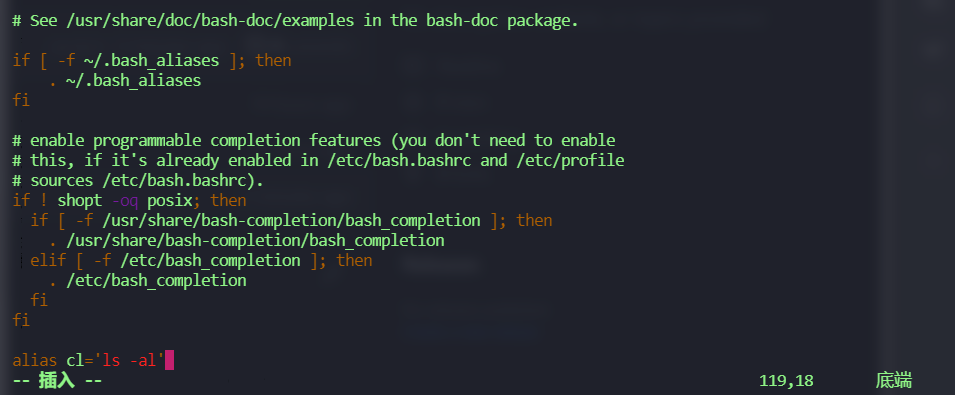
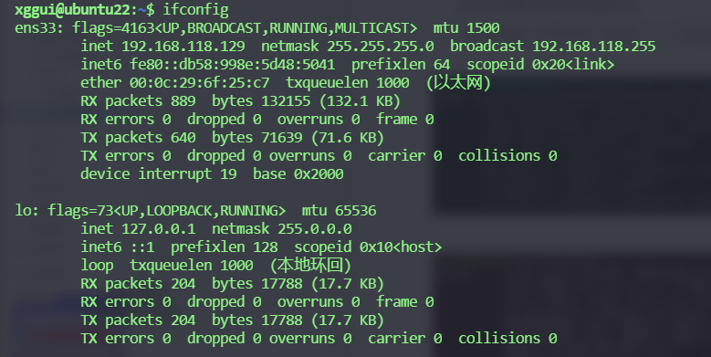
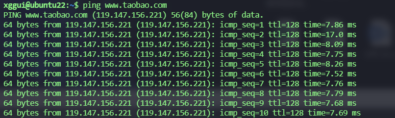
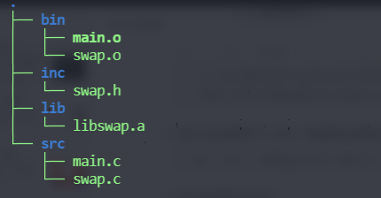
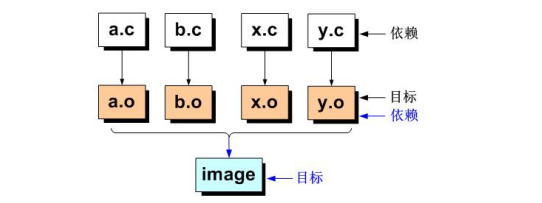
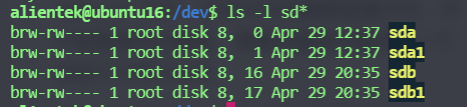
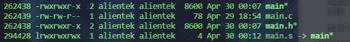

# Linux入门

## 简介

它主要就是为了模仿 UNIX 而来的，最初时有一个叫 Linux 的人写了最开始的代码，然后他头发掉光了，他就公开了他的思路和代码，被世界各国人们共享并且一同完成了这个系统

当我们讲到 Linux 时，他有两层含义：

* Linux 内核它运行于系统的最底层，用户看不见也摸不到
  * 内存的管理
  * 文件管理
  * 任务管理
  * 网络管理
  * 设备管理
* Linux 的发行版本：很多

Ubuntu 的发行规律：每个偶数年的 4 月份就发行一个长期支持版 LTS Ubuntu 20.04.2.0 表示 20 年 4 月发布第 2 次修正

* 什么是shell

  就是一些软件命令，可执行的文件。例如/bin 下的ls，它会执行系统调用函数去操作内核


## 基本命令

### alias

临时取别名`alias 新命令='旧命令'`，例如 `alias cl='ls -al'`

若要永久保存，修改配置文件[每一次开启终端都会执行配置文件]

每个用户的家目录都有一个隐藏文件 `.bashrc`

`-rw-r--r--  1 xggui xggui 3771  4月  21 13:40 .bashrc`



### date

`date` 直接输出日期与时间

### sort

```sh
sort file.txt
```

对文件进行排序（不会改变文件内容）

* -u 在输出中去掉重复行
* -r 将默认的排序次序改为降序
* -o 将结果输出到指定文件保存起来
* -n 将文件中的数字按“数值”而不是“字符”来排序
* -t 指定列分隔符
* -k 指定要排序的列数

### > 重定向

```shell
echo "hi" > file.txt
```

重定向输出 把原本输出到标准输出的内容重定向到 filename 文件当中

### which

查看命令所在的位置

```sh
$ which cp
/bin/cp
```

注意：cd命令是找不到的，因为这个命令太重要了，已经写在内核当中

### | 管道

可以用来连接两个命令，将命令1的输出作为命令2的输入

```sh
命令1|命令2
```

### uniq

去掉文件中重复项然后输出（不会改变文件内容）

```sh
# 对文件进行排序，然后对文件进行去重
sort testFile.txt | uniq 
```

### gedit 

打开可视化的文本编辑器

### diff

检查两个文件是否相同，这是一个非常牛的命令，是（**svn**，**git**等）的基石，可以用来搞补丁文件

* -u 使用合并的格式来输出文件的差异信息
* -r 递归地对比所有子目录下的文件
* -N 将不存在的文件视为空文件
* -B 忽略由空行引起的差异

```sh
# 假如两个文件的cp来的
cp test01.txt test02.txt
diff test01.txt test02.txt
# 不会输出什么东西

# 但假如两个文件存在不同的地方
xggui@ubuntu22:~$ diff testFile.txt testFile02.txt

# out:
35,42c35,36
< e
< a
< sh
< k
< 
< sa
< m
< 
---
> em
> dddd
46c40
< 
---
> aaaa


# 其中 > 表示 testFile02.txt 加入了什么东西，< 表示 testFile02.txt 删除了什么东西
```

### file

查看文件的格式信息

```sh
xggui@ubuntu22:~$ file ./桌面/CProgram/main.c
# ./桌面/CProgram/main.c: C source, ASCII text
xggui@ubuntu22:~$ file /bin/ls
# /bin/ls: ELF 64-bit LSB pie executable, x86-64, version 1 (SYSV), dynamically linked, interpreter /lib64/ld-linux-x86-64.so.2, BuildID[sha1]=897f49cafa98c11d63e619e7e40352f855249c13, for GNU/Linux 3.2.0, stripped
```

### tail / head

查看文件的头部和尾部

### wc

用来计算文件行数，单词数，字符数

```sh
xggui@ubuntu22:~$ wc testFile.txt 
# 47 39 93 testFile.txt
# 47行 39个单词 93个字符数
```

## 进程管理命令

### ps

获取当前进程的信息状态

```sh
xggui@ubuntu22:~$ ps
    PID TTY          TIME CMD
  15232 pts/0    00:00:00 bash
  15500 pts/0    00:00:00 ps
```

* -ef 得到如下输出结果：

```sh
UID          PID    PPID  C STIME TTY          TIME CMD
root           1       0  0 13:14 ?        00:00:03 /sbin/init splash
root           2       0  0 13:14 ?        00:00:00 [kthreadd]
root           3       2  0 13:14 ?        00:00:00 [rcu_gp]
root           4       2  0 13:14 ?        00:00:00 [rcu_par_gp]
root           5       2  0 13:14 ?        00:00:00 [slub_flushwq]
...
xggui      13870   12560  0 15:51 ?        00:00:00 update-notifier
root       15195     819  0 16:20 ?        00:00:00 sshd: xggui [priv]
xggui      15231   15195  0 16:20 ?        00:00:00 sshd: xggui@pts/0
xggui      15232   15231  0 16:20 pts/0    00:00:00 -bash
root       15278       2  0 16:30 ?        00:00:00 [kworker/u256:2-events_unbound]
root       15393       2  0 16:38 ?        00:00:01 [kworker/0:1-events]
root       15503       2  0 17:14 ?        00:00:00 [kworker/u256:1-events_unbound]
root       15512       2  0 17:26 ?        00:00:00 [kworker/u256:0-events_unbound]
xggui      15519   15232  0 17:29 pts/0    00:00:00 ps -ef

# 参数解释：
# UID 用户名
# PID 进程ID
# PPID 父进程ID
# C STIME 时间戳 
# TTY 终端 如果是?表示该进程与终端无关，终端的关闭并不影响该进程，该进程叫【守护进程】
# CMD 进程的名字 
```

### top

动态的进程信息（没错，这些字是会动的），类似于window的任务管理器

### kill

向某一个进程发送信号

* -l 查看并列举Linux中的信号

```sh
 1) SIGHUP       2) SIGINT       3) SIGQUIT      4) SIGILL       5) SIGTRAP
 6) SIGABRT      7) SIGBUS       8) SIGFPE       9) SIGKILL     10) SIGUSR1
11) SIGSEGV     12) SIGUSR2     13) SIGPIPE     14) SIGALRM     15) SIGTERM
16) SIGSTKFLT   17) SIGCHLD     18) SIGCONT     19) SIGSTOP     20) SIGTSTP
21) SIGTTIN     22) SIGTTOU     23) SIGURG      24) SIGXCPU     25) SIGXFSZ
26) SIGVTALRM   27) SIGPROF     28) SIGWINCH    29) SIGIO       30) SIGPWR
31) SIGSYS      34) SIGRTMIN    35) SIGRTMIN+1  36) SIGRTMIN+2  37) SIGRTMIN+3
38) SIGRTMIN+4  39) SIGRTMIN+5  40) SIGRTMIN+6  41) SIGRTMIN+7  42) SIGRTMIN+8
43) SIGRTMIN+9  44) SIGRTMIN+10 45) SIGRTMIN+11 46) SIGRTMIN+12 47) SIGRTMIN+13
48) SIGRTMIN+14 49) SIGRTMIN+15 50) SIGRTMAX-14 51) SIGRTMAX-13 52) SIGRTMAX-12
53) SIGRTMAX-11 54) SIGRTMAX-10 55) SIGRTMAX-9  56) SIGRTMAX-8  57) SIGRTMAX-7
58) SIGRTMAX-6  59) SIGRTMAX-5  60) SIGRTMAX-4  61) SIGRTMAX-3  62) SIGRTMAX-2
63) SIGRTMAX-1  64) SIGRTMAX
```

* `kill 1 16690` 杀掉一个进程

```sh
# 另外开一个终端
# 先查看进程，获取到进程号为16690
xggui@ubuntu22:~$ ps -ef
# 执行叉掉进程操作
xggui@ubuntu22:~$ kill 1 16690
```

* killall 给进程发送信号，可以使用名字访问进程

```sh
# 使用killall给进程名为a.out的进程发送3信号
killall -3 a.out
```

## 压缩与解压命令

### tar

tar命令提供了归档功能，同时它还能通过指定参数调用不同的压缩和解压缩工具来处理文件。归档跟压缩的区别是，归档是不涉及压缩算法的，只是把文件收集起来放在一个档案里面，就像把一堆凌乱的书籍收拾好放在书架上一样，而压缩需要通过一定的算法把数据把数据变得更小更紧凑，将来要用的时候再用逆运算将数据解压缩

* -c 创建归档文件
* -x 释放归档文件
* -t 查看归档文件（或者压缩文件）
* -f 指定要归档，压缩或者查看的文件的名称
* -v 显示命令的执行过程

如何归档

```sh
$ tar -cf demo.tar a.out demo.c main.c mian.out
# 把后面一堆文件整合成一个文件
-c 创建归档文件
-f 指定文件名字
```

查看归档文件

```sh
$ tar -tf demo.tar
```

释放归档文件

```sh
$ tar -xvf demo.tar -C ./dir/
-C 指定释放到的地址
```

* -z 表示创建归档文件之后调用 gzip 压缩工具进行相应的压缩或者是解压

如何压缩与解压 gzip 格式

```sh
# 创建归档文件并且调用 gzip 工具压缩文件
$ tar -czvf demo.tar.gz *
# 释放归档文件并且调用 gzip 工具解压文件
$ tar -xzvf demo.tar.gz -C ~
```

* -j 表示创建归档文件之后调用 bzip2 压缩工具进行相应的压缩或者是解压

```sh
$ tar -cjvf demo.tar.bz2 *
$ tar -xjvf demo.tar.bz2 
$ tar -xjvf demo.tar.bz2 -C /tmp
```

注意：

文件的格式并不取决于文件名的后缀，后缀只是给我们看的，如果想知道文件的真正信息可以`file 文件名`

* -J 解压xz格式的文件

```sh
$ tar -xJvf arm.tar.xz
```

xz 格式的压缩

```sh
# xz 命令不可以单独使用，因此必须先使用 tar 命令对文件进行归档，归档后再进行压缩
$ xz demo.tar
# 生成 demo.tar.xz
```

zip 命令

zip 命令并不是ubuntu自带的，需要我们手动来安装

```sh
sudo apt install zip
# 压缩
$ zip file.zip file main.c
# 使用 -r 递归压缩，这样就可以压缩文件夹里的内容
$ zip file.zip dir -r
# 解压
$ unzip file.zip
```

## 网络命令

### hostname

查看主机名

```sh
$ hostname
unbuntu22
```

### ifconfig

查看当前的网络状态

```sh
$ ifconfig 查看网卡 eth0 --- ens33
```



修改ip地址

```sh
$ ifconfig ens33 192.168.25.3 # 修改ens33网卡
$ ifconfig eth0 192.168.25.3 # 修改eth0网卡
```

通过配置文件修改网络的配置信息

```sh
# unbuntu 不再使用interfaces
```

启动/关闭网卡

```sh
$ ifconfig ens33 down
$ ifconfig ens33 up
```

### ping

检查网络是否连接

```sh
$ ping baidu.com
```



ttl：默认情况下，Linux 系统的 TTL 值为 64 或 255，Windows NT/2000/XP 系统的 TTL 值为 128，Windows 98 系统的 TTL 值为 32，UNIX 主机的 TTL 值为 255。每当进行一次路由跳转时，ttl 减 1

## 软件安装

### AppStore 安装

直接在可视化桌面里打开用就行

### apt 安装

```sh\
sudo apt -get install software
```

-get 会自动安装包括软件的依赖

### deb软件包的安装

```sh
sudo dpkg -i xxx.deb
```

### 源码编译安装

```sh
make
make install
```

## 静态库的制作

有点像 windows 的 .dll 文件

动态库与静态库的区别：体现在链接阶段，静态库在程序的链接阶段会被复制到程序当中；动态库在程序运行时由系统动态加载到内存当中供程序调用，因此静态库在程序运行的过程中一定不会缺失

* 静态库：
  * 优点
    * 当我们运行程序的时候不会发生缺失的问题
  * 缺点
    * 不利于功能的更新，更新的话需要重新编译程序
    * 需要占用更多的内存
* 动态库：
  * 优点
    * 相对于静态库占用更少的内存
    * 提高程序执行的效率
  * 缺点
    * 运行时需要动态库的支持，容易缺失

库文件的命名：

* 必须使用 lib 作为前缀：比如 libDeployPkg.so.0/libhgfs.so.0 ....

* 静态库一般以 .a 为后缀，动态库一般以 .so 为后缀

* 库文件会有不同的版本，一般会写在后缀后面，比如 lib.a.so.0.1.2

```sh
libc.so.1.0.3
lib -库文件的前缀
c -库文件的名字(链接库文件时只需要写上该文件)
.so -后缀，so为动态/共享库 a 则是静态库
.1 -库文件的版本号
.0.3 -修正号
```

如何制作库文件：

不管制作动态库还是静态库，原材料是 .o 文件，也就是可重定位文件

注意：库文件内部一定不能出现主函数

```sh
gcc main.c -o main.o -c
```

1. 先获得 .o 文件

swap.c

```c
#include <stdio.h>
#include <swap.h>
void swap(int* a, int* b)
{
    *a^=*b;
    *b^=*a;
    *a^=*b;
}
```

swap.h

```c
#ifndef __SWAP_H__
#define __SWAP_H__
void swap(int* a,int* b);
#endif
```

```sh
gcc swap.c -o swap.o -c -fPIC -I ./

-c 生成可以重定位的文件
-fPIC 生成与地址无关的可执行文件
```

2. 把以上生成的 .o 文件一起编译生成静态库文件

```sh
ar -rcs libswap.a swap.o
libswap.a -生成的库的名字
swap.o -用于生成库的.o文件，该文件要用-fPIC生成
```

3. 如何使用静态库文件

main.c

```c
#include "swap.h"
#include <stdio.h>
int main()
{
    int a = 10;
    int b = 20;
    printf("before swap: a: %d b: %d\n", a, b);
    swap(&a, &b);
    printf("after swap: a: %d b: %d\n", a, b);
    return 0;    
}
```

```sh
gcc main.c -o main.o -L lib/ -I inc/ -lswap 
-L 添加索引库文件的入口地址
-I 添加索引头文件的入口地址
-l 添加库文件的名字
```

文件结构图：



## 动态库的制作

1. 先获得 .o 文件

```sh
gcc swap.c -o swap.o -c -fPIC -I ./

-c 生成可以重定位的文件
-fPIC 生成与地址无关的可执行文件
```

2. 把 .o 文件制作成动态链接库

```sh
gcc -shared -fPIC -o libswap.so swap.o
-shared 生成动态链接库
-fPIC 生成与地址无关的文件
```

3. 如何使用动态链接库

编译时链接动态库

```sh
gcc src/main.c -I inc -L lib -lswap -o bin/main.o
```

运行时使用动态库

```sh
# 使用以前的方法直接执行文件会出现
$ bin/main.out
bin/main.out: error while loading shared libraries: libswap.so: cannot open shared object file: No such file or directory
```

如何解决：

* 方法 1 [推荐使用]：

系统虽然不知道我们自己的库在哪里，但是它有一些默认路径（在环境变量中预先写好的路径）因此我们可以把自己的动态库文件放到系统默认的路径下即可（`/usr/lib` 或者 `/lib`）

* 方法 2 ：

把库所在的路径写入到环境变量中，打开配置文件 .bashrc 在文本末尾添加如下代码，然后重启或者`$ source ~/.bashrc`来重新生效

```sh
export LD_LIBRARY_PATH=/home/xggui/myLib:$LD_LIBRARY_PATH

export 临时修改环境变量
LD_LIBRARY_PATH= 修改的是库的路径
/home/xggui/myLib 需要添加的自己的路径
: 路径与路径的分隔符
$LD_LIBRARY_PATH 重新引用原有的路径 类似于 a+=b
```

* 方法 3 ：

在系统的默认路径下添加一个新的路径，重新生效库的配置文件`sudo ldconfig`

```sh
$ sudo vim /etc/ld.so.conf.d/libc.conf
#在文本中添加新行
/home/xggui/myLib
```

注意：

如果动态库与静态库的名字一样，而且放在一起，那么在编译链接程序的时候，默认使用动态库，那么如何指定编译器使用静态库呢？

```sh
$ gcc src/*.c -o bin/main -L./lib -I./inc -lswap -static
-static 使用静态链接，指定使用静态库，以后运行的时候也不会使用动态库
```

## 解剖 Makefile

### 概念

当我们需要编译一个比较大的项目的时候，编译命令会很长很复杂，其次项目中并不是每一次编译都需要把所有的文件都重新编译，例如没有被修改过的文件则不需要重新编译。工程管理器就是用来帮助我们优化这两个问题

make 有很多版本：

* qt：qmake

* windows：nmake

* linux：GNUmake

Makefile 就类似于 make 工程管理器的工作的脚本，用来告诉工程管理器如何正确编译我们的程序

依赖与目标的关系：

在 Makefile 中依赖与目标是相互的，并不是绝对的



比如 a.c 是生成 a.o 的依赖文件，对于 a.o 来说则是 a.c 的目标，而 a.o 又是 image 的依赖，在我们使用 make 进行编译的时候，工程管理器则会根据依赖与目标的关系来检查他们之间的时间戳关系，如果依赖有更新，那么目标文件则需要执行

安装make

```sh
sudo apt install make
```

### 第一个 Makefile

语法：

```sh
目标:依赖
	命令
```

注意：

* 目标必须存在
* 依赖可以没有
* 命令前面必须是一个制表符 tab

* Makefile 文件的命名一般是 Makefile

把路径切换到 Makefile 文件所在的路径，执行 `$ make`

```sh
target:
	@echo "hello makefile"
# @ 的作用就是不会把这个命令的代码输出出来
# 这里省略了依赖，注意，依赖省略了，代表这个makefile不需要依赖，这时makefile一定会执行

target:file
	@echo "hello makefile"
# 这里没有省略依赖，如果找不到依赖file，那么这个makefile就不会执行	
```

注意：

* 如果规则中没有写依赖，那么无论如何该规则都会执行
* 如果目标文件已经存在，然后也没有写依赖则不执行该规则

```sh
make: 'target' is up to date.
```

* 如果目标文件已经存在，规则中有写依赖并且依赖文件比目标文件更新，则规则会执行

makefile 就像 python 一样是解析性语言，一行一行执行的

当我们输入`make`的时候：

1. 工程管理器会默认在当前路径下寻找一个名为 Makefile 的文件
2. 确认 Makefile 文件中的目标
3. 检测最终目标是否已经存在
   * 如果最终目标存在，则检查规则中是否有依赖
     * 如果规则中依赖不存在，则不运行规则
     * 如果规则中依赖存在，则检查依赖是否真实存在
       * 依赖真实存在，则判断时间戳是否执行规则
       * 依赖不是真实存在，则直接报错
   * 如果最终目标不存在，则直接运行规则

如果有循环依赖，比如 a 依赖 b ，b 又依赖 a，会自动放弃循环依赖

```sh
Even:Jacy
	@echo "Hello1"
Jacy:ChuiHua
	@echo "Hello2"
ChuiHua:
	@echo "Hello3"
# 执行顺序是先执行ChuiHua的规则，在往上执行
```

```sh
# 指定执行的目标，告诉工程管理器Jacy是我们需要的最终目标
$ make Jacy
# 运行指定的makefile文件
$ make -f MyMakeFile
```

如何使用工程管理器去编译程序


目标：`./bin/main.out`

依赖文件：`./src/*.c`

```sh
./bin/main.o:./src/*.c
	gcc ./src/*.c -o ./bin/main.o -I./inc/ 
```

生成依赖库并编译

```sh
./bin/main.o:./lib/libswap.so
	gcc ./src/main.c -o ./bin/main.o -I./inc/ -L ./lib -lswap
./lib/libswap.so:./bin/swap.o   
	gcc -shared -fPIC -o ./lib/libswap.so ./bin/swap.o
./bin/swap.o:./src/swap.c ./inc/swap.h
	gcc ./src/swap.c -o ./bin/swap.o -fPIC -c -I./inc/     
```

### 变量

在 Makefile 中变量属于弱类型，在 Makefile 变量就是一个名字（C语言中的宏），代表一个文本字符串（变量的值），在 Makefile 的目标，依赖，命令中引用一个变量的地方

1. 自定义变量

```sh
A = apple # 定义并赋值变量
B = I love China
C = $(A) tree # $()则是对变量进行引用
```

通过自定义变量来修改 Makefile

```sh
TAG = ./bin/main.o
SRC = ./src/*.c
CONFIG = -I./inc/ 
$(TAG):$(SRC)
	gcc $(SRC) -o $(TAG) $(CONFIG)
clean:
	rm -f ./bin/*
# 多了一套规则 make clean	
```

2. 系统预定义变量

CFLAGS、CC、MAKE、Shell 等等，是系统预定义的变量，但是可以自己修改去使用

| 变量名   | 含义                                           |
| -------- | ---------------------------------------------- |
| CC       | C编译器的名称，默认值为cc，即默认使用gcc编译器 |
| RM       | 文件删除程序的名称，默认值为rm -f              |
| CFLAGS   | C编译器(gcc)的选项，无默认值，如-Wall、-g、-o  |
| AR       | 库文件维护程序的名称，默认值为 "ar"            |
| CPP      | C预编译器的名称，默认值为"$(CC) –E"            |
| CPPFLAGS | C预编译的选项，无默认值                        |
| CXXFLAGS | C++编译器(g++)的选项，无默认值                 |
| AS       | 汇编程序，默认是 "as"                          |

3. 自动化变量

| 变量名 | 含义                                                 | 备注                                                         |
| ------ | ---------------------------------------------------- | ------------------------------------------------------------ |
| @      | 代表其所在的规则的目标的完整名称                     |                                                              |
| %      | 代表其所在规则的静态库文件的一个成员名               |                                                              |
| <      | 代表其所在规则的依赖列表的第一个文件的完整名称       |                                                              |
| ?      | 代表所有时间戳比目标文件新的依赖文件列表，用空格隔开 |                                                              |
| ^      | 代表其所在规则的依赖列表                             | 同一文件不可重复                                             |
| +      | 代表其所在规则的依赖列表                             | 同一文件可重复，主要用在程序链接时，库的交叉引用场合         |
| *      | 在模式规则和静态模式规则中，代表茎                   | 茎是目标模式中"%"多代表的部分（当文件名中存在目录时，茎也包含目录（斜杠之前）部分） |

@ 代表其所在的规则的目标的完整名称

```sh
TAG = ./bin/main.o
SRC = ./src/*.c
CONFIG = -I./inc/ 
$(TAG):$(SRC)
	gcc $(SRC) -o $(@) $(CONFIG) # 用$(@)替换$(TAG)
```

^ 代表其所在规则的依赖列表

```sh
TAG = ./bin/main.o
SRC = ./src/*.c
CONFIG = -I./inc/ 
$(TAG):$(SRC)
	gcc $(^) -o $(@) $(CONFIG) # 用$(^)替换$(SRC)
```

| 变量名 | 含义                                                       | 备注                                                         |
| ------ | ---------------------------------------------------------- | ------------------------------------------------------------ |
| @D     | 代表目标文件的目录部分（去掉目录部分的最后一个斜杠）       | 如果"\$@"是"dir/foo.o"，那么"\$(@D)"的值为"dir"。如果"$@"不存在斜杠。其值就是"."（当前目录）注意它和函数"dir"的区别 |
| @F     | 目标文件的完整文件名中除目录以外的部分（就是实际的文件名） | 如果"\\$@"是"dir/foo.o"，那么"\$(@F)"的值为"foo.o"           |
| *D     | 代表目标茎中的目录部分                                     |                                                              |
| *F     | 代表目标茎的文件名部分                                     |                                                              |
| %D     | ...                                                        |                                                              |
| %F     | ...                                                        |                                                              |

递归定义：

```sh
# 在第一行使用到变量B但是还没有定义，因此管理器会进行全文搜索找到B并引用
A = I love $(B)
B = China
```

直接定义：

```sh
# 说白了就是A在定义的时候只会在上文找B，找不到就为空
B = China
A := I love $(B)
```

条件定义：

```sh
A = apple
A ?= I love China
# 如果A没有定义，则定义A为"I love China"
```

多行命令的定义方式：

```sh
define commands
	echo "hello!"
	echo "hello!!"
endef
# 这种东西类似于函数
```

追加变量：

```sh
A = apple
A += tree
# A = apple tree
```

修改变量：

```sh
B = str.c string.c tcl.c
echo "$(B:%.c=%.o)"
# 输出 str.o string.o tcl.o
```

继续修改 Makefile

```sh
TAG = ./bin/main.o
SRC = ./src/swap.c ./src/main.c
OBJ = $(SRC:%.c=%.o)
CC = gcc
CONFIG = I:/inc
$(TAG):$(OBJ)
	$(CC) $(^) -o $(@) $(CONFIG)
%.o:%.c
	$(CC) $< -o $(@) $(CONFIG) -c
clean:
	$(RM) ./bin/* /src/*.o
```

### 函数

\$(subst FROM,TO,TEXT)

```sh
$(subst FROM,TO,TEXT)
功能：
将字符串 TEXT 中的字符 FROM 替换为 TO
返回：
替换之后的新字符串
范例：
A=$(subst pp,PP,apple tree)
替换之后变量A的值是 "aPPle tree"
```

\$(wildcard *.c)

```sh
$(wildcard *.c)
功能：
获取匹配模式为*.c的文件名
返回
匹配模式为*.c的文件名
A = $(wildcard *.c)
# 假设当前路径下有两个.c文件a.c和b.c，则处理后A的值为"a.c b.c"
```

override CFLAGS += -Wall

```sh
override CFLAGS += -Wall

A = apple
B = I love China
override C += $(A) tree
Even:
        @echo $(A)
        @echo $(B)
        @echo $(C)
# 在执行make的时候
# make C="this is"
# 那么就会把C输出为 this is apple tree
# 这玩意可以用来修改Makefile的CONFIG，这样在make的时候可以添加设置选项
```

.PHONY

```sh
.PHONY:clean
# 表示对clean这个目标不要使用隐式规则
# 比如当路径下存在clean文件的时候，clean这个规则就不会运行
# 事实上不能使用隐式规则的目标被称为伪目标
```

Makefile 最终版本

```sh
TAG = ./bin/main.o
SRC = $(wildcard src/*.c)
OBJ = $(SRC:%.c=%.o)
CC = gcc
override CONFIG += -I./inc/
$(TAG):$(OBJ)
	$(CC) $(^) -o $(@) $(CONFIG)
%.o:%.c# 这个地方，是makefile的静态规则，一旦上面的TAG发现依赖不存在，就会寻找下面的规则，%是通配符，那么就会找到这条符合的规则，并执行。如果不写的话,makefile会执行隐式规则，但是我们无法给这个隐式规则传递参数，所以要重写成静态规则
	$(CC) $< -o $(@) $(CONFIG) -c
clean:
	$(RM) ./bin/* ./src/*.o
.PHONY:clean
```

## 交叉工具的使用

把 ubuntu 上编译的 main.o 通过 NFS 传送给开发板，在开发板直接执行`./main.o`会报错


程序目前使用 gcc 进行编译，因此不可以直接在开发板上直接执行，需要使用交叉编译

安装交叉编译工具链：

1. 下载交叉编译工具链，复制到share文件夹下，用linux打开并拷贝解压

```sh
sudo tar -Jxvf arm-linux-gnueabi-5.4.0.tar.xz -C /
```

2. 添加环境变量

```sh
vim ~/bashrc
# 添加
export PATH=/usr/local/arm/5.4.0/usr/bin:$PATH
```

3. 刷新配置文件

```sh
$source 
```

4. 查看安装成功

```sh
book@100ask:~$ arm-linux-gcc -v
Using built-in specs.
COLLECT_GCC=/usr/local/arm/5.4.0/usr/bin/arm-linux-gcc.br_real
COLLECT_LTO_WRAPPER=/usr/local/arm/5.4.0/usr/bin/../libexec/gcc/arm-none-linux-gnueabi/5.4.0/lto-wrapper
Target: arm-none-linux-gnueabi
Configured with: ./configure --prefix=/home/geclab/buildroot-2016.11/output/host/usr --sysconfdir=/home/geclab/buildroot-2016.11/output/host/etc --enable-static --target=arm-none-linux-gnueabi --with-sysroot=/home/geclab/buildroot-2016.11/output/host/usr/arm-none-linux-gnueabi/sysroot --disable-__cxa_atexit --with-gnu-ld --disable-libssp --disable-multilib --with-gmp=/home/geclab/buildroot-2016.11/output/host/usr --with-mpc=/home/geclab/buildroot-2016.11/output/host/usr --with-mpfr=/home/geclab/buildroot-2016.11/output/host/usr --with-pkgversion='Buildroot 2016.11' --with-bugurl=http://bugs.buildroot.net/ --disable-libquadmath --enable-tls --disable-libmudflap --enable-threads --without-isl --without-cloog --with-float=soft --disable-decimal-float --with-abi=aapcs-linux --with-cpu=cortex-a15 --with-float=soft --with-mode=arm --enable-languages=c,c++,fortran --with-build-time-tools=/home/geclab/buildroot-2016.11/output/host/usr/arm-none-linux-gnueabi/bin --enable-shared --disable-libgomp
Thread model: posix
gcc version 5.4.0 (Buildroot 2016.11) 
```

5. 使用交叉编译器

```sh
gcc Hello.c -o Hello # 编译的程序只能在x86平台执行
arm-linux-gcc -o Hello # 编译的程序只能在ARM架构平台执行

# 直接编译会报错
book@100ask:~$ arm-linux-gcc main.c -o main
/usr/local/arm/5.4.0/usr/bin/../libexec/gcc/arm-none-linux-gnueabi/5.4.0/cc1: error while loading shared libraries: libmpfr.so.4: cannot open shared object file: No such file or directory
# 发现这个库在这里，版本是so.6的，但是编译器使用的是so.4
book@100ask:/usr/lib/x86_64-linux-gnu$ find -name "libmpfr*"
./libmpfr.so.6
./libmpfr.so.6.0.1
# 创建快捷方式
sudo ln ./libmpfr.so.6 ./libmpfr.so.4 -s
# 我们再来看一下编译之后的文件，这是一个32位ARM格式的
book@100ask:~$ file main
main: ELF 32-bit LSB executable, ARM, EABI5 version 1 (SYSV), dynamically linked, interpreter /lib/ld-, for GNU/Linux 3.2.0, not stripped
```

存在的问题！！！

为什么在 ubuntu 上用交叉编译器编译的文件放在 arm 上执行会出现 No such file or directory ?但是改用静态编译就不会出现这样的情况

猜测：arm板子上没有 libmpfr.so.4这个库

自制命令：

把可执行文件放在`/bin/`里就可以当成`ls`命令一样随时运行了，但是这样会污染环境。当输入`env`时会打印：

```sh
[root@qemu_imx6ul:~]# env
HOSTNAME=qemu_imx6ul
EDITOR=/bin/vi
QT_QPA_FONTDIR=/usr/lib/fonts
USER=root
PAGER=/bin/more
PWD=/root
HOME=/root
SHELL=/bin/sh
TERM=vt100
SHLVL=1
QT_QPA_PLATFORM=linuxfb:fb=/dev/fb0
LOGNAME=root
PATH=/bin:/sbin:/usr/bin:/usr/sbin # 这里就是我们的环境，当输入命令的时候，开发板会先从以上路径进行搜索，当你在.bashrc上配置路径的时候(export PATH=/usr/local/arm/5.4.0/usr/bin:$PATH)，这里也会相应的添加路径
PS1=\e[0;32m[\u@\h:\w]\$ \e[m
_=/usr/bin/env
OLDPWD=/bin
```

开发板的脚本配置文件路径：

```sh
 vi /etc/profile
```


## 开发板网络配置

自动获取网络地址：

```sh
udhcpc
```

使用 tftp 传输文件（开发板上操作）

```sh
[root@qemu_imx6ul:~]# tftp
BusyBox v1.29.3 (2019-10-26 18:12:51 CST) multi-call binary.

Usage: tftp [OPTIONS] HOST [PORT]

Transfer a file from/to tftp server

	-l FILE	Local FILE # 本地文件
	-r FILE	Remote FILE # 远程文件
	-g	Get file
	-p	Put file
	-b SIZE	Transfer blocks of SIZE octets
```

```sh
#tftp 192.168.25.2 -g -r main
main -文件
192.168.25.2 -服务端ip
```

## 文件系统

### /bin

存放二进制可执行文件，这些命令在单用户下也可以使用，可供 root 和 一般账号使用

### /boot

ubuntu 内核和启动文件，比如 vmlinuz-xxx，gurb 引导装载程序

### /cdrom

有光盘的话，光盘的文件会在这里打开

### /dev

基本上存放的都是驱动文件

### /etc

存放系统的配置文件，比如账号密码，服务器的起始地址

### /home

系统默认的用户主文件夹，一般创建用户账户的时候，默认的用户主文件夹都会放到此目录下

### /lib

顾名思义，存放库文件

### /media

此目录下放置可插拔设备，比如SD卡，或者U盘就是挂载到这个目录中

### /mnt

用户可使用的挂载点，如果要挂载一些额外的设备，那么就可以挂载到此处

### /opt

可选的文件和程序存放目录，给第三方软件放置的目录

### /proc

虚拟的文件系统，数据存放到内存当中，存放系统运行信息，比如查看 cpu 信息 /proc/cpuinfo

### /root

给root用户访问的文件夹

### /sbin

和 /bin 类似，也是存放一些二进制可执行文件。sbin 下面的一般是系统开机过程中所需要的命令

### /snap

这是 Ubuntu16 引入的包管理工具

### /var

存放一些变化的文件，比如日志文件

### /sys

记录内核信息，也是一个虚拟文件系统

### /srv

服务相关目录。比如网络服务

### /usr

注意，usr 不是用户的缩写，而是UNIX Software Resource 的缩写，存放于系统用户有关的文件，会占用很大的存储空间，是安装ubuntu 系统占用最大的

## Ubuntu 磁盘文件

/dev/sd* 文件，此类文件是磁盘设备文件，并不能直接访问磁盘，需要将磁盘挂载到某一个目录下才可以访问

/dev/sdb 和 /dev/sdb1 是 u 盘的设备文件

/dev/sdb 表示 u 盘，/dev/sdb1 表示 u 盘的第一个分区



### 磁盘的挂载与卸载

* mount 挂载

ubuntu 默认情况下会帮我们把 u 盘挂载到 /media 里，可以手动卸载挂载的路径然后自己重新挂载

* umount 卸载

* df 查看挂载信息

### 磁盘分区

* 查看磁盘的分区情况

```sh
fdisk -l
```

* 执行分区操作

```sh
sudo fdisk /dev/sdb
#再输入m查看帮助
#n 是创建新的分区
one select 2048
last select 2048+1024^3/512(扇区个数) = 1G
```

* 给新建的磁盘创建文件系统

```sh
sudo mkfs -t vfat /dev/sdb1
sudo mkfs -t vfat /dev/sdb2
```

在 linux 中给 u 盘分好区之后在 windows 中显示如下：


## 用户和用户组

ubuntu 有三种用户

1. 初次创建的用户
2. root 用户
3. 普通用户

初次创建的用户权限比普通用户多，但是没有 root 的权限多

* 查看用户

```sh\
vim /etc/passwd
```

* 查看密码

```sh
vim /etc/shadow
```

* 查看用户组

```sh
vim /etc/group
```

### 管理用户

* 添加用户

```sh
sudo adduser xggui
```

* 查看用户

```sh
# 安装finger
finger xggui
finger
```

* 修改密码

```sh
sudo passwd xggui
```

* 删除用户

```sh
sudo deluser xggui
```

### 管理用户组

* 添加用户组

```sh
sudo addgroup xggui
```

* 显示用户所在的所有组

```SH
groups xggui
```

* 删除用户组

```sh
sudo delgroup xggui
```

## 连接文件

### 创建连接

```sh
# 硬连接
ln main main.h
# 软连接 (使用绝路径)
ln /home/xggui/main main.s -s
```

* 打印输出 inode



硬连接与源文件的 inode 是一样

### 硬连接 

硬链接是多个文件都指向同一个 inode，硬链接知识点：

* 具有相同 inode 的多个文件互为硬链接文件，创建硬链接相当于文件实体多了入口

* 对于硬链接文件，只有删除了源文件以及对应的所有硬连接文件，文件实体才会被删除

* 根据硬链接文件的特点，我们可以通过给文件创建硬连接的方式来防止文件误删除

* 不论修改源文件还是连接文件，另一个文件的数据都会被改变

* 硬连接不能跨文件系统

* 硬连接不能连接到目录

因为以上这些限制，硬链接其实不常用

### 软连接

符号连接类似 Windows 下的快捷方式，符号链接也叫做软连接，软连接要用的多。符号连接相当于创建了一个独立的文件，这个文件会让数据读取指向它连接的哪个文件的文件名。软连接的特点：

* 可以连接到目录

* 可以跨文件系统

* 删除源文件以后，软连接文件也就 “打不开了”

* 符号连接文件通过 -> 来指示具体的连接文件

* 符号连接要使用绝对路径，否则连接出问题

```sh
# cp软连接的话要使用 cp -d 这样就能保证拷贝的是一个连接文件，否则就会是拷贝出一个普通文件，如果不使用绝对路径的话，那么拷贝过去的软连接会失效
```

## Shell 脚本

shell 脚本文件以 .sh 结尾，文本内容以`#!/bin/bash`开头

编写 shell 脚本

```sh
#!/bin/bash
echo "hello world"
```

```sh
# 给脚本添加可执行权限
chomod 777 myshell.sh
```

### 交互式的脚本

read 读取变量

```sh
#!/bin/bash
read -p "input you name and age: " name age
echo "user name is $name age is $age"
```

### 数值计算

```sh
#!/bin/bash
read -p "first num: " first
read -p "second num: " second
echo "sum is $(($first+$second))"
```

### 测试脚本

* 编写一个脚本判断文件是否存在

`a $$ b`当 a 执行成功时，b 才会执行

`a || b`当 a 执行失败时，b才会执行

```sh
#!/bin/bash
read -p "file name: " filename
test -e $filename && echo "$filename exist" || echo "$filename no exist"
```

* 编写一个脚本判断两个字符串是否相等

```sh
  1 #!/bin/bash
  2 read -p "firstStr: " firstStr
  3 read -p "secondStr: " secondStr
  4 test $firstStr == $secondStr && echo "equal" || echo "no equal"
```

### 中括号判断符

`[]`里面只能输入 == 或者 !=

```sh
#!/bin/bash
read -p "firstStr: " firstStr
read -p "secondStr: " secondStr
[ "$firstStr" == "$secondStr" ] && echo "equal" || echo "no equal"
# 注意变量要加" "不然会被空格分开
```

### 默认变量

`$0~$n `表示 shell 脚本的参数，包括 shell 脚本命令本身，shell 脚本命令本身为 \$0

`$#`表示最后一个参数的标号

`$@`表示 \$1，\$2...

示例：

```sh
#!/bin/bash
echo "0 1 2 parameter: $0, $1, $2"
echo "all parameter: $@"
echo "last parameter index: $#"
```


### 条件判断

if 的使用

```sh
#!/bin/bash
read -p "please enter (Y/N)?" sel
if [ "$sel" == "Y" ] || [ "$sel" == "y" ]; then
    echo "you choose yes"     exit 0
fi 
if [ "$sel" == "N" ] || [ "$sel" == "n" ]; then
    echo "you choose no"
    exit 0;
fi
```

if else 的使用

```sh
#!/bin/bash
read -p "please enter (Y/N)?" sel
if [ "$sel" == "Y" ] || [ "$sel" == "y" ]; then
     echo "you choose yes"
     exit 0
else
     echo "you choose no"
     exit 0;
fi
```

elif 的使用

```sh
#!/bin/bash
read -p "please enter (Y/N)?" sel
if [ "$sel" == "Y" ] || [ "$sel" == "y" ]; then
     echo "you choose yes"   
     exit 0
elif [ "$sel" == "N" ] || [ "$sel" == "n" ]; then
    echo "you choose no"
    exit 0
fi
```

case 的使用

```sh
#!/bin/bash
case $1 in
    "a")
        echo "param is a"
        ;;
    "b")
        echo "param is b"
        ;;
      *)
        echo "can't identitfy"
        ;;
esac
```

### 脚本函数

shell 脚本也支持函数，函数的写法如下：

```sh
function fname(){

}
```

写一个带选项的命令

```sh
#!/bin/bash

function help(){
    echo "this is help cmd !"
}

function close(){
    echo "this is close cmd !"
}

case $1 in
    "-h")
        help
        ;;
    "-c")
        close
        ;;
esac
```

带参数的函数

```sh
#!/bin/bash
print(){
	echo "parameter 1: $1"
	echo "parameter 2: $2"
}
# 给函数传入 a b
print a b
```

### 循环

while

```sh
#!/bin/bash
while [ "$value" != "close" ]
do 
    read -p "pls input str: " value
done

echo "stop while"
```

for

```sh
#!/bin/bash

read -p "pls enter a num: " num 
sum=0
for(( i=0; i<=num; i=i+1 ))
do
    sum=$(($sum+$i))
done
echo "for stop sum = $sum"
```

