# ARM 裸机

## 1. FTP 服务

ubuntu 安装 ftp

```sh
sudo apt-get install vsftpd
```

修改配置

```sh
sudo vim /etc/vsftpd.conf
local_enable=YES
write_enable=YES
```

重启服务

```sh
sudo /etc/init.d/vsftpd restart
```

windows 安装 fileZilla

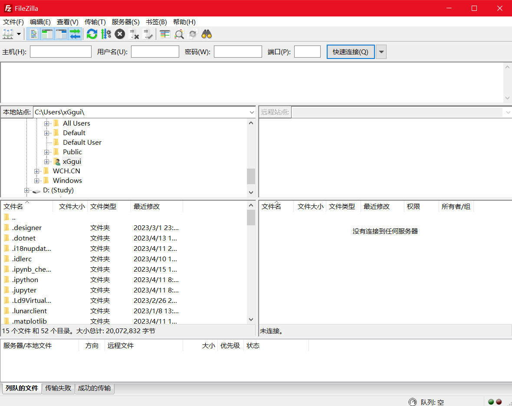

然后直接拖文件就可以传输文件了

## 2. NFS 服务

ubuntu 安装 nfs

```sh
sudo apt-get install nfs-kernel-server
```

在 home 下创一个文件夹用于建立 nfs 服务

```sh
/home/alientek/linux/nfs
```

修改配置文件，添加环境变量

```sh
sudo vim /etc/exports
# 添加
/home/alientek/linux/nfs *(rw,sync,no_root_squash)

# 解释
* 任意主机可以访问
rw 读写 
async 资料会暂存于内存当中，而非直接写入硬盘
no_root_squash 登入 NFS 主机使用分享目录的使用者，如果是 root 的话，那么对于这个分享的目录来说，他就具有 root 的权限，单词 squash 是压缩压扁的意思
Root_squash 在登入 NFS 主机使用分享之目录的使用者如果是 root 时，那么这个使用者的权限将被压缩成为匿名使用者，通常他的 UID 与 GID 都会变成 nobody 那个系统账号的身份
```

重启 nfs 服务

```sh
sudo /etc/init.d/nfs-kernel-server restart
```

## 3. SSH 服务

ubuntu 安装 ssh 服务

```sh
sudo apt-get install openssh-server
```

## 4. 交叉编译器

为什么叫交叉编译器，因为是在 x86 平台上编译给 arm 平台运行

安装：解压编译器压缩包到/usr/local/arm/(没有文件夹就创建)，添加环境变量到`/etc/profile`
环境变量是`/usr/local/arm/gcc-linaro-4.9.4-2017.01-x86_64_arm-linux-gnueabihf/bin`

## 5. VSCode

推荐使用 windows 下的 vscode 使用 remote-ssh 插件进行远程连接 ubuntu 开发

.vscode 文件夹可以连接索引各个头文件 `ctrl + shift + P`可以自动创建

## 6. 开发板

I.MX6ULL芯片 公司 ：[nxp]([i.MX 6ULL Applications Processor | Single Arm® Cortex®-A7 @ 900 MHz | NXP Semiconductors](https://www.nxp.com/products/processors-and-microcontrollers/arm-processors/i-mx-applications-processors/i-mx-6-processors/i-mx-6ull-single-core-processor-with-arm-cortex-a7-core:i.MX6ULL))

arm 架构 CortexA7 公司：[arm]([Cortex-A7 – Arm®](https://www.arm.com/products/silicon-ip-cpu/cortex-a/cortex-a7))

A7 架构，低功耗

I.MX6U IO 表示形式

对于 STM32 管脚名字：PA0-PA15 PB0-PB15 ... PD...

对于 I.MX6ULL 管脚名字：PAD_BOOT_MODE0 （可以查看参考手册，每个管脚名字都会有一个标签）

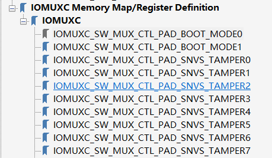

可以查看管脚的复用功能：打开参考手册，选择管脚对应的寄存器标签

比如：IOMUXC_SW_MUX_CTL_PAD_BOOT_MODE0

可以查看管脚的电气特性：打开参考手册，选择管脚对应的寄存器标签

比如：IOMUXC_SW_PAD_CTL_PAD_BOOT_MODE0

## 7. 汇编 LED 驱动实验

### 7.1 汇编 LED 原理分析

为什么要学习 Cortex-A 汇编？

1. 需要用汇编初始化一些 soc 外设
2. 使用汇编初始化 ddr （这一步 i.mx6u 不需要）
3. 设置 sp 指针，一般指向 ddr，设置好 c 语言运行环境

开发板 led 灯硬件原理分析

LED 灯的驱动：当 LED0 为高的时候，灯灭

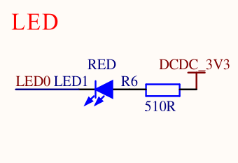

LED 口接到芯片的 GPIO_3 这里

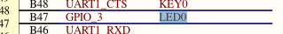

STM32 初始化 GPIO 流程

1. 使能 GPIO 时钟
2. 设置 IO 的复用，将其复用为 GPIO
3. 配置 GPIO 的电气属性
4. 使用 GPIO 输出高低电平

I.MX6U IO 始化流程

1. 使能时钟 CCGR0-CCGR6 这 7 个寄存器控制着这个芯片的所有外设时钟的使能，为了简单设置所有的外设时钟，我们把所有的寄存器 CCGR0-CCGR6 都设置成 0xFFFFFFFF，相当于使能所有外设时钟
2. IO 复用，复用寄存器 IOMUXC_SW\_**MUX**\_CTL_PAD_GPIO1_IO03

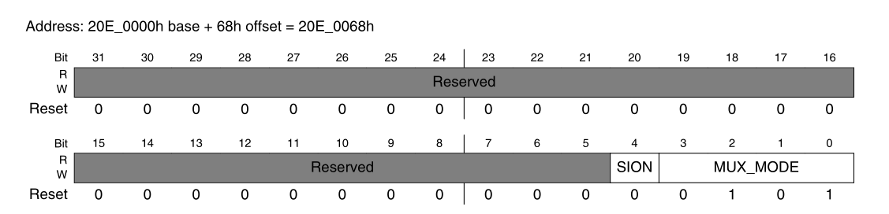

后面 4 位是复用位，其中

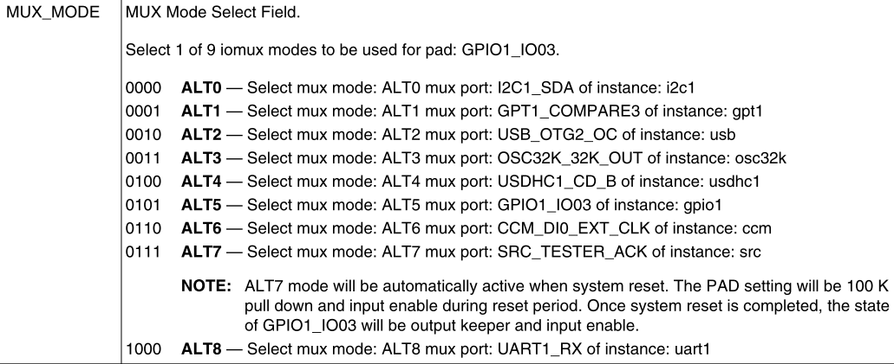

0101的时候，把他当作普通 io 使用

3. 配置电气属性，电气属性寄存器 IOMUXC_SW\_**PAD**_CTL_PAD_GPIO1_IO03

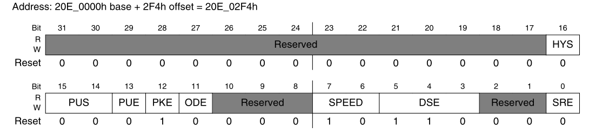

包括压摆率，速度，驱动能力，开路，上下拉等

4. 配置 GPIO 功能，设置输入输出

* 功能寄存器 GPIOx_DR ，用来设置数据位、
* 方向寄存器 GPIOx_GDIR ，用来设置 io 的方向
* 状态寄存器 GPIOx_PSR （只读寄存器）
* 中断寄存器 GPIOx_ICR1
* 中断掩码寄存器 GPIOx_IMR
* 中断状态寄存器 GPIOx_ISR （判断对应的中断是否发生）

这里，设置 GPIO1_DR 寄存器 bit3 为 0 也就是设置为低电平。设置 GPIO1_GDIR 的值为 1 也就是输出方向

### 7.2 汇编基本语法

汇编由一条一条指令构成，指令就设计到汇编指令

```c
int a, b
a = b
```

假设 a 地址为 0x20 ，b 地址为 0x30

```assembly
LDR R0, =0x30 @保存b的地址
LDR R1, [R0] @将b的值赋值给R1
LDR R0, =0x20 @保存a的地址
STR R1, [R0]
```

写汇编最常用的是 LDR STR 指令

### 7.3 编译驱动程序

1. 使用 arm-linux-guneablhf-gcc 将 .c 文件变为 .o
2. 将所有 .o 文件链接为 elf 格式的可执行文件
3. 将 elf 文件转为 bin 文件
4. 将 elf 文件转为汇编 反汇编

链接：

链接就是将所有的 .o 文件链接在一起，并且链接到指定的地方。本实验链接的时候要指定链接的起始地址。链接起始地址就是代码运行的起始地址。

对于 6ULL 来说，链接起始地址应该指向 RAM 地址。RAM 分为内部 RAM 和 外部 RAM，也就是 DDR 。6ULL 内部 RAM 地址范围 0x900000-0x91ffff 。也可以放到外部 DDR 中

本系列视频将文件链接到外部 ram 当中，对于 256M 的 DDR 来说，地址为 0x80000000-0x8FFFFFFF ，我们选用 0x87800000 当然，要使用 DDR 那么必须要初始化 DDR

对于 I.MX 来说 bin 文件不能直接运行，需要添加应该头部，这个头部信息包含了初始化 DDR 的初始参数， I.MX 系列 SOC 内部 boot rom 会从 sd 卡， EMMC 等外置存储中读取头部信息，然后初始化 DDR ，并且将 bin 文件拷贝到指定的地方

Bin 的运行地址一定要和链接起始地址一致，位置无关的代码除外

* 链接 .o 文件并且指定链接的地址，生成 .elf 文件

```sh
arm-linux-gnueabihf-ld -Ttext 0x87800000 leds.o -o leds.elf
```

* 将 .elf 文件转化为 .bin 文件

``` sh
arm-linux-gnueabihf-objcopy -O binary -S -g led.elf led.bin
# -O 表示指定的输出格式
# -S 表示不复制源文件中的重定位信息和符号信息
```

### 7.4 烧写 bin 文件

裸机例程选择烧写到 SD 里面

在 Ubuntu 下向 SD 卡烧写裸机 bin 文件，烧写不是将 bin 文件拷贝到 SD 卡当中，而是将 bin 文件烧写到 SD 卡的绝对地址上，而且对于 I.MX 而言，不能直接烧写 bin 文件，比如先在 bin 文件前面添加头部。完成这个工作，需要使用正点原子提供的 imxdownload 软件

使用方法：

* 确定要烧写的 SD 卡

* 给予 imxdownload 可执行权限
* 执行软件

```sh
./imxdownload led.bin /dev/sdb
# imxdownload 会向 led.bin 添加一个头部，生成新的 load.imx ，这个load.imx 最终烧写到 SD 卡当中
```

JLINK？

1. 6ULL 支持 JTAG，因为没有烧写算法，所以无法烧写
2. 但是可以通过 JTAG 将 bin 文件下载到内部 ram （重启就没了）
3. 奇葩的问题，6ULL 的 JTAG 口 和 SAI 复用，SAI 连接了 WM8960音频 DAC（MINI版没有音频 DAC 因此有 JTAG 口）
4. 在嵌入式 linux 开发中，基本不使用 JLINK
5. 一般用点灯，串口（打印串口信息）来调试程序

## 8. IMX 启动方式的选择

* 硬件启动方式的选择

1. LED 灯实验，是从 SD 卡读取 bin 文件并启动，说明 6UL 支持从 SD 卡启动，6ULL 支持多种启动方式的选择。

2. 6ULL 是怎么支持从多种外置 flash 启动程序的？（手册第8章）

BOOT_MODE0 和 BOOT_MODE1，这两个是两个 IO 进行控制的


这两个 IO 对应着板子上的拨码开关的前 2 位，选择从 USB 启动还是内部 BOOT 启动，其中 00 表示熔丝启动，只能修改一次的。

* 启动设备的选择（前提是设置 MODE1 和 MODE0 是从内部 BOOT 启动的）

支持哪些设备？根据 BOOT_CFG 选择，有 BOOT_CFG1，2，4 每个8位

NOR flash，oneNAND，NAND Flash，QSPI flash，SD/EMMC，EEPROM

BOOT_CFG 是由 LCD_DATA0-23 IO 来设置的，这些 IO 基本都是下拉（接地）

（结合手册和底板的进行研究）

## 9. 解析启动头文件

当我们选择 MODE0 和 MODE1 是内部启动的时候，内部的 BOOTROM就会运行，它读取设备的 bin 文件放入到 RAM 当中运行，期间做出如下操作：

**Boot Rom 做的事情**

1. 设置内核时钟为396MHZ

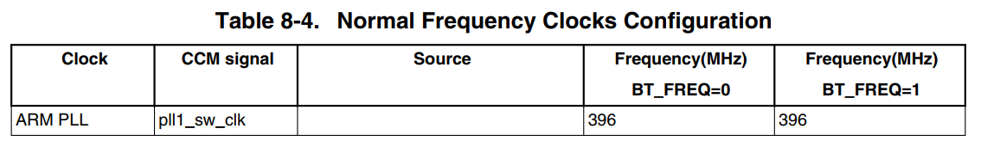

以及其他的外设时钟：

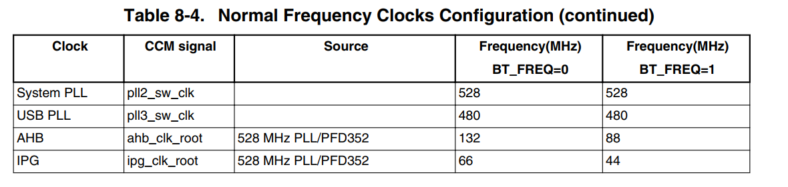

2. 使能 MMU 和 Cashe，使能 L1cache 和 L2cache MMU 目的就是为了加速启动，以及其他的一些操作（比如中断啥的）
3. 从 BOOT_CFG设置的外置存储中，读取 image，然后做相应的处理

**IVT 和 BOOT Data 数据**

bin 文件前面需要添加头部。可以得到，我们烧写到 SD 卡当中的 load.imx 文件在 SD 卡当中的起始地址是 0x400，也就是 1024

头部信息的大小为 3K  因此加上偏移的 1K ，所以在 SD 卡中文件的起始地址为 4096

IVT 的头信息如下：

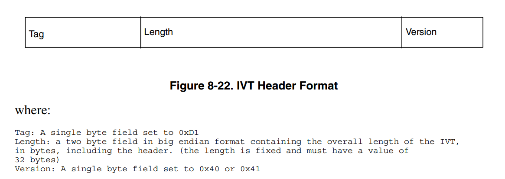

我们打开 IMX 头文件的二进制表：

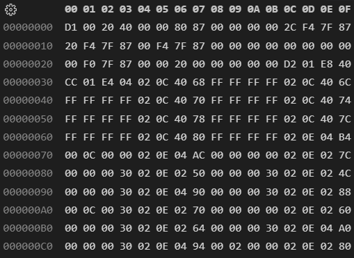、

文件以小端模式打开的，长度字段为 0X20 也就是 32 字节

IVT 大小为 32 字节除以 4 等于 8 条，分别对应如下：

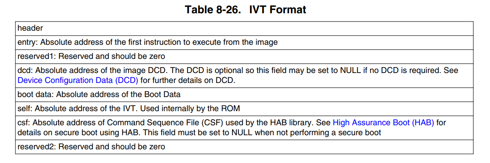

BOOT Data 共有 12 字节

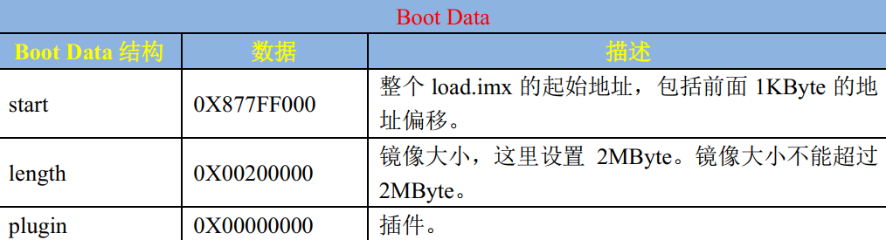

整体结构如下：

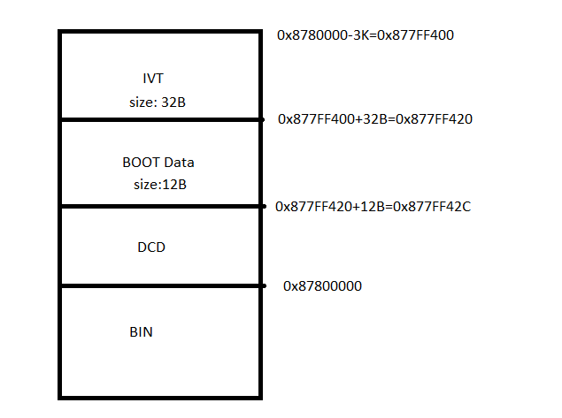

**DCD 数据**

DCD 数据最大不能超过 1768B，DCD 数据的作用就是配置 6ULL  内部寄存器的

首先，将 CCGR0-CCGR6 全部写为 0XFFFFFFFF 表示打开所有外设时钟。

然后就是 DDR 初始化参数，设置 DDR 控制器

**其他数据**

检查数据命令、NOP 命令、解锁命令，这些也都属于 DCD

## 10. C 语言环境搭建

### 10.1 设置处理器模式

设置 6ULL 处于 SVC 模式下，该模式下可以访问 CPU 的所有数据

设置 CPSR 寄存器的 bit 4-0 也就是 M[4:0] 为 10011 = 0x13，但是，读写状态寄存器需要用到 MRS 和 MSR 指令，因为 LDR STR 不能操作状态寄存器

* MRS 将 CPSR 数据读出到通用寄存器里面

* MSR 指令将通用寄存器的值写入到 CPSR 寄存器里面去

### 10.2 设置 SP 指针

sp 可以指向内部的 RAM 也可以指向 DDR 我们将其指向 DDR。sp 设置到哪里？ 512MB EMMC DDR3 的范围是 0x80000000-0x9FFFFFFF。栈打大小是 0x20000000 = 2MB 处理器的栈增长对于 A7 来说是向下增长的，我们可以设置 sp 指向 0x80200000

### 10.3 跳转到 C 语言

使用 b 指令 跳转到 C 语言函数，比如 main 函数

start.S

```assembly
.global __start

__start:
    /*设置处理器进入 SVC 模式*/
    mrs r0, cpsr @ 将 cpsr 的值读取到 r0
    bic r0, r0, #0x1F @相当于 r0 = r0&(~#0x1f) 把 r0 的最后5位清零
    orr r0, r0, #0x13 @相当于 r0 = r0| (#0x13) 把 r0 的最后5位赋值为 0x13
    msr cpsr, r0 @ 将 r0 写入 cpsr
    /*设置 sp 指针*/
    ldr sp, =0x80200000
    b main @ 跳转程序到c语言的 main 函数
```

### 10.4 软件编写

main.h

先在头文件定义一些宏，这些宏用来表示各个寄存器的地址

```c
#ifndef __MAIN_H
#define __MAIN_H
/*定义要使用的寄存器*/

//volatile 是易变的，编译器不会对 volatile修饰变量进行优化
#define CCM_CCGR0 *((volatile unsigned int*)0x020C4068)
#define CCM_CCGR1 *((volatile unsigned int*)0x020C406C)
#define CCM_CCGR2 *((volatile unsigned int*)0x020C4070)
#define CCM_CCGR3 *((volatile unsigned int*)0x020C4074)
#define CCM_CCGR4 *((volatile unsigned int*)0x020C4078)
#define CCM_CCGR5 *((volatile unsigned int*)0x020C407C)
#define CCM_CCGR6 *((volatile unsigned int*)0x020C4080)
//IOMUX 相关寄存器地址
#define SW_MUX__GPUIO1_IO03 *((volatile unsigned int*)0x020E0068)
#define SW_PAD__GPUIO1_IO03 *((volatile unsigned int*)0x020E02F4)
//GPIO1相关寄存器地址
#define GPIO1_DR *((volatile unsigned int*)0x0209C000)
#define GPIO1_GDIR *((volatile unsigned int*)0x0209C004)
#define GPIO1_PSR *((volatile unsigned int*)0x0209C008)
#define GPIO1_ICR1 *((volatile unsigned int*)0x0209C00C)
#define GPIO1_ICR2 *((volatile unsigned int*)0x0209C010)
#define GPIO1_IMR *((volatile unsigned int*)0x0209C014)
#define GPIO1_ISR *((volatile unsigned int*)0x0209C018)
#define GPIO1_EDGE_SEL *((volatile unsigned int*)0x0209C01C)

#endif
```

main.c

```c
#include <stdio.h>
#include "main.h"


/*使能外设时钟*/
void clk_enable(void)
{
    CCM_CCGR0 = 0xFFFFFFFF;
    CCM_CCGR1 = 0xFFFFFFFF;
    CCM_CCGR2 = 0xFFFFFFFF;
    CCM_CCGR3 = 0xFFFFFFFF;
    CCM_CCGR4 = 0xFFFFFFFF;
    CCM_CCGR5 = 0xFFFFFFFF;
    CCM_CCGR6 = 0xFFFFFFFF;
}

/*初始化外设 led */
void led_init(void)
{
    SW_MUX__GPUIO1_IO03 = 0x05; //复用为gpio1_io03
    SW_PAD__GPUIO1_IO03 = 0x10B0; /*设置 gpio1_io03 电气属性*/
    /*GPIO 初始化*/
    GPIO1_GDIR = 0x08;//设置为输出
    GPIO1_DR = 0x0; //打开led灯
}
/*短延时*/
void delay_short(volatile unsigned int n)
{
    while(n--){}
}
/*延时，一次循环大概是1ms n 是延时的毫秒数，在主频396MHZ*/
void delay(volatile unsigned int n)
{
    while(n--)
    {
        delay_short(0x7ff);
    }
}
/*打开 led 灯*/
void led_on(void)
{
    GPIO1_DR &= ~(1<<3); //将 bit 3 清零
}
/*关闭 led 灯*/
void led_off(void)
{
    GPIO1_DR |= (1<<3); //将 bit3 置1
}
int main(void)
{
    clk_enable();
    /*初始化 led*/
    led_init();
    /*设置 led 闪烁*/
    while(1)
    {
        led_on();
        delay(500);
        led_off();
        delay(500);
    }
    return 0;
}
```

### 10.5 编译链接

```makefile
objs = start.o main.o
ledc.bin : $(objs)
	arm-linux-gnueabihf-ld -Ttext 0x87800000 $^ -o ledc.elf
	arm-linux-gnueabihf-objcopy -O binary -S ledc.elf $@
	arm-linux-gnueabihf-objdump -D -m arm ledc.elf > ledc.dis

%.o:%.c
	arm-linux-gnueabihf-gcc -Wall -nostdlib -c -o $@ $<
%.o:%.S
	arm-linux-gnueabihf-gcc -Wall -nostdlib -c -o $@ $<	
clean:
	rm -rf *.o ledc.bin ledc.elf
```

### 10.6 链接脚本

链接脚本描述了要连接的文件，以及链接顺序和链接首地址

一个简单链接脚本如下：

imx6u.lds

```c
SECTIONS{
    . =  0x87800000;
    .text :
    {
        start.o
        *(.text)
    }
    .rodata ALIGN(4) : {*(.rodata*)}
    .data ALIGN(4) : {*(.data)}
     bss_start = .;
    .bss ALIGN(4) : {*(.bss) *(COMMON)}
    __bss_end = .;
}
```

```sh
# 链接脚本的使用，将makefile中的这一句替换成
	arm-linux-gnueabihf-ld -Ttext 0x87800000 $^ -o ledc.elf #(old)
	arm-linux-gnueabihf-ld -Timx6u.lds $^ -o ledc.elf #(new)
```

## 11. 模仿 STM32 驱动开发实验

### 11.1 STM 32 寄存器结构体详解

对于 STM 32 而言，使用一个结构体将一个外设的所有寄存器都放到一起，这样子就可以将这个结构体抽象成一个外设了

### 11.2 修改驱动

1. 添加清除 bss 段的代码
2. 添加寄存器结构体

在结构体中添加寄存器的时候一定要注意地址的连续性，如果不连续的话要添加占位，具体请看代码 imx6u.h

```c
#define __IO volatile

#define CCM_BASE (0x020C4000) // CCM 外设的基地址
/*CCM外设结构体*/
typedef struct
{
    // 由于是32位系统，这里int是32位的
    __IO unsigned int CCR;
    __IO unsigned int CCDR;
    __IO unsigned int CSR;
    __IO unsigned int CCSR;
    __IO unsigned int CACRR;
    __IO unsigned int CBCDR;
    __IO unsigned int CBCMR;
    __IO unsigned int CSCMR1;
    __IO unsigned int CSCMR2;
    __IO unsigned int CSCDR1;
    __IO unsigned int CS1CDR;
    __IO unsigned int CS2CDR;
    __IO unsigned int CDCDR;
    __IO unsigned int CHSCCDR;
    __IO unsigned int CSCDR2;
    __IO unsigned int CSCDR3;
    // 为了使得地址是连续的，根据手册，这里需要预留一些空间
    __IO unsigned int RESERVED_1[1];
    __IO unsigned int CWDR;
    __IO unsigned int CDHIPR;
    __IO unsigned int RESERVED_2[2];
    __IO unsigned int CLPCR;
    __IO unsigned int CISR;
    __IO unsigned int CIMR;
    __IO unsigned int CCOSR;
    __IO unsigned int CGPR;
    __IO unsigned int CCGR0;
    __IO unsigned int CCGR1;
    __IO unsigned int CCGR2;
    __IO unsigned int CCGR3;
    __IO unsigned int CCGR4;
    __IO unsigned int CCGR5;
    __IO unsigned int CCGR6;
    __IO unsigned int RESERVED_3[1];
    __IO unsigned int CMEOR;

} CCM_Type;
// 下面这句话很妙，将地址强转成结构体指针，也就是说，这个结构体指针的内容就是地址CCM_BASE
#define CCM ((CCM_Type *)CCM_BASE)
```

## 12. NXP 官方 SDK

1. 新建 cc.h 文件

SDK 包里会用到许多数据类型，所以我们需要在 cc.h 里面定义一些常用的数据类型。设备为 MCIMX6Y2

2.  io 函数

```c
static inline void IOMUXC_SetPinMux(uint32_t muxRegister,
                                    uint32_t muxMode,
                                    uint32_t inputRegister,
                                    uint32_t inputDaisy,
                                    uint32_t configRegister,
                                    uint32_t inputOnfield)
{
    *((volatile uint32_t *)muxRegister) =
        IOMUXC_SW_MUX_CTL_PAD_MUX_MODE(muxMode) | IOMUXC_SW_MUX_CTL_PAD_SION(inputOnfield);

    if (inputRegister)
    {
        *((volatile uint32_t *)inputRegister) = IOMUXC_SELECT_INPUT_DAISY(inputDaisy);
    }
}


static inline void IOMUXC_SetPinConfig(uint32_t muxRegister,
                                       uint32_t muxMode,
                                       uint32_t inputRegister,
                                       uint32_t inputDaisy,
                                       uint32_t configRegister,
                                       uint32_t configValue)
{
    if (configRegister)
    {
        *((volatile uint32_t *)configRegister) = configValue;
    }
}
#define IOMUXC_GPIO1_IO03_GPIO1_IO03 0x020E0068U, 0x5U, 0x00000000U, 0x0U, 0x020E02F4U
```

## 13. BSP 工程管理

BSP 工程管理的目的就是为了模块化整理代码，同一个属性的文件存放在同一个目录里面

1. 新建所需的文件夹，将同一属性的文件放到相应的文件夹中
2. 修改  clk delay led 驱动，创建对应的驱动文件，然后放到对应的目录中
3. 根据编写的新驱动文件，修改 main.c 文件内容

4. 编写 makefile 

**经过工程管理后的文件树**

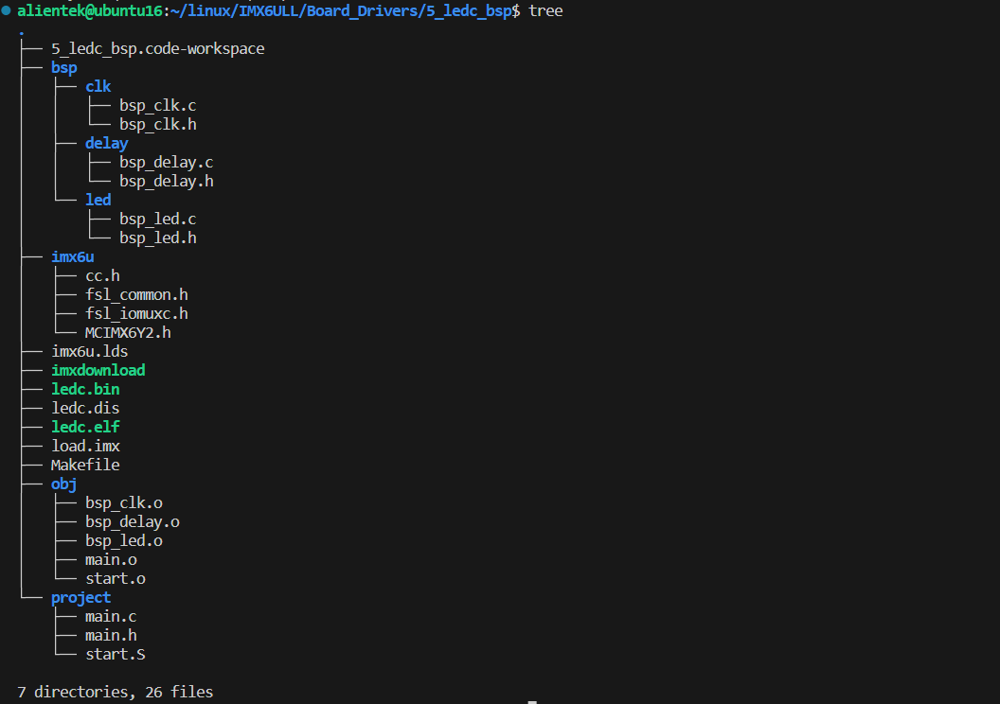

**根据文件树编写 makefile 文件**

```makefile
CROSS_CMOPILE ?= arm-linux-gnueabihf-
TARGET 		  ?= ledc

CC 			:= $(CROSS_CMOPILE)gcc
LD  		:= $(CROSS_CMOPILE)ld 
OBJCOPY		:= $(CROSS_CMOPILE)objcopy 
OBJDUMP		:= $(CROSS_CMOPILE)objdump 
# 包含头文件的文件夹
INCUDIRS	:= imx6u \
			   bsp/clk \
			   bsp/led \
			   bsp/delay

# 包含源文件的文件夹
SECDIRS		:= project \
			   bsp/clk \
			   bsp/led \
			   bsp/delay

# 将头文件的文件夹的字符串 前面加 -I（用于编译的时候指定头文件的路径）
INCLUDES	:= $(patsubst %,-I %,$(INCUDIRS))

# 根据包含源文件的文件夹中的源文件（包括路径）遍历出来并且赋值给变量
SFILES		:= $(foreach dir, $(SECDIRS), $(wildcard $(dir)/*.S))
CFILES		:= $(foreach dir, $(SECDIRS), $(wildcard $(dir)/*.c))

# 将源文件（包括路径）进行去除路径
SFILENDIR	:= $(notdir $(SFILES))
CFILENDIR	:= $(notdir $(CFILES))

# 将源文件的后缀改为 .o 并且在前面添加 obj/
SOBJS		:= $(patsubst %, obj/%, $(SFILENDIR:.S=.o))
COBJS		:= $(patsubst %, obj/%, $(CFILENDIR:.c=.o))
OBJS		:= $(SOBJS)$(COBJS)

VPATH 		:= $(SECDIRS) 

.PHONY : clean


$(TARGET).bin : $(OBJS)
# 链接文件，采用 imx6u.lds 脚本
	$(LD) -Timx6u.lds -o $(TARGET).elf $^
# 将 .elf 文件转化为 .bin 文件	-S 表示不包含重定位信息和符号信息
	$(OBJCOPY) -O binary -S $(TARGET).elf $@
# 将 .elf 文件进行反汇编，指定格式为 arm -D 表示反汇编所有段	
	$(OBJDUMP) -D -m arm $(TARGET).elf > $(TARGET).dis

# 静态模式，编译多文件
$(SOBJS) : obj/%.o : %.S
	$(CC) -Wall -nostdlib -c -O2 $(INCLUDES) -o $@ $<
$(COBJS) : obj/%.o : %.c
	$(CC) -Wall -nostdlib -c -O2 $(INCLUDES) -o $@ $<

clean :
	rm -rf $(TARGET).elf $(TARGET).bin $(TARGET).dis $(OBJS)	

```

## 14. 蜂鸣器实验

### 14.1 开发板上蜂鸣器的原理图分析


从图上可以发现，这是一个 PNP 三极管，当 BEEP 管脚输出低电平时，三极管导通，发射极是正向电压，此时蜂鸣器发声。


其中 BEEP 管脚链接芯片的 SNVS TAMPER1 IO管脚，管脚的地址如下：

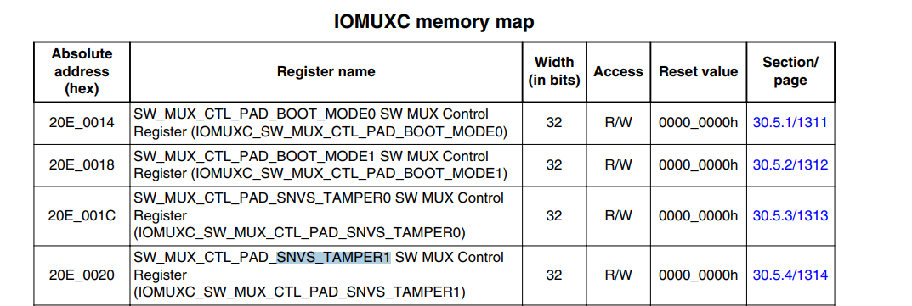

### 14.2 实验程序的编写

1. 初始化 SNVS_TAMPER1 这个 IO 复用为 GPIO 这个 IO 复用为 GPIO5_IO01
2. 设置 SNVS_TAMPER1 这个 IO 的电气属性
3. 初始化 GPIO
4. 控制 GPIO 输出高低电平

详看代码

## 15. 按键输入实验

### 15.1 按键输入原理图分析

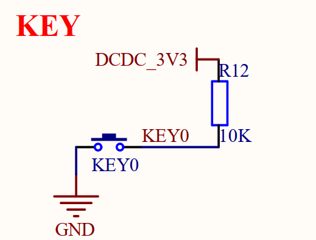


按键 IO KEY0 连接到 UART1 CTS 引脚上，这个引脚是上拉的，KEY0 默认输出高电平，当按键按下时，KEY0 被接地，变成低电平。所以我们可以轮询地读取 UART1 CTS 这个引脚，如果为低电平则视为按键被按下

IO 复用 为


### 15.2 实验程序编写

1. 设置 UART1_CTS 复用为 GPIO1_IO18
2. 设置 UART1_CTS 的电气属性
3. 配置 GPIO1_IO18 为输入模式
4. 读取按键的值，也就是 GPIO1_IO18 的高低电平

### 15.3 通用 GPIO 驱动编写

封装结构体和枚举类型

```c
#ifndef __BSP_GPIO_H
#define __BSP_GPIO_H
#include "fsl_common.h"
#include "fsl_iomuxc.h"
#include "MCIMX6Y2.h"

/*枚举类型和GPIO结构体*/
/*设置一个io的输入输出状态*/
typedef enum _gpio_pin_direction
{
    //U表示 unsigned 在嵌入式中很常见
    kGPIO_DigitalInput = 0U,
    kGPIO_DigitalOutput = 1U
}gpio_pin_direction_t;

/*io的配置的结构体*/
typedef struct _gpio_pin_config
{
    gpio_pin_direction_t direction; //io方向
    uint8_t outputLogic; //输出电平
}gpio_pin_config_t;

/*初始化gpio*/
void gpio_init(GPIO_Type *base, int pin, gpio_pin_config_t *config);
/*控制GPIO高低电平*/
void gpio_pinwrite(GPIO_Type *base, int pin, int value);
/*读取GPIO的值*/
int gpio_pinread(GPIO_Type *base, int pin);

#endif
```

```c
#include "bsp_gpio.h"
/*初始化 gpio*/
void    gpio_init(GPIO_Type *base, int pin, gpio_pin_config_t *config)
{
    if (config->direction == kGPIO_DigitalInput)
    {
        base->GDIR &= ~(1 << pin);
    }
    else if (config->direction == kGPIO_DigitalOutput)
    {
        base->GDIR |= (1 << pin);
        // 设置默认输出电平 
        gpio_pinwrite(base, pin, config->outputLogic);
    }
}
/*控制GPIO 高低电平*/
void gpio_pinwrite(GPIO_Type *base, int pin, int value)
{
    if (value == 0)
    {
        base->DR &= ~(1 << pin);
    }
    else if (value == 1)
    {
        base->DR |= (1 << pin);
    }
}
/*读取GPIO 的值*/
int gpio_pinread(GPIO_Type *base, int pin)
{
    return (((base->DR) >> pin) & 0x01U);
}
```

## 16. 主频和时钟配置实验

### 16.1 硬件原理图分析

1. 32.768KHz 的晶振，供给 RTC 使用，这个时钟并不会参与到系统时钟当中去


2. 在 6ULL 的 T16 T17 这两个 IO 上接了一个 24MHZ 的晶振，整个系统的时钟由这个晶振提供

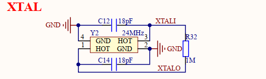


### 16.2 I.MX6U 系统时钟分析

1. 7 路 PLL

为了方便生成时钟， 6U 从 24MHz 晶振生出来 7 路 PLL。这 7 路 PULL 中有的又生出来 PFD 

PLL1：ARM_PLL 供给 ARM  内核

PLL2：SYSTEM_PLL ,528 MHZ，又叫 528_PLL 由22*24MHZ 倍频得到

PLL3：USB1PLL 480MHZ，480_PLL，又分出 FPD

PLL4：AURDIO_PLL，主供音频使用

PLL5：VIDEO_PLL，主供视频外设，比如 RGB LCD接口，和图像处理有关的外设

PLL6：ENET_PLL，主供网络外设

PLL7：USB2PLL 480MHZ，无FPD

2. 各路 PULL 分出的 PFD

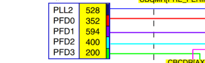

3. 时钟树

4. 外设是如何选择时钟树的

比如 ESAI 时钟源选择:

PLL4 、PLL3_PFD2、PLL5、PLL3

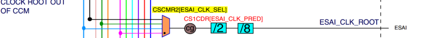

5. 要初始化的 PLL 和 PFD

PLL1 PLL2 以及 PLL2 _FPD0-3

PLL3 以及 PLL3_PFD0-PFD3

一般按照时钟树里面的值进行设置

### 16.3 I.MX6U 系统时钟的配置

1. 系统主频的配置

① 要设置 ARM 内核主频为 528MHz，则设置 CACRR 寄存器的 ARM_PODF 位为 2 分频，然后设置 PLL1=1056MHz 即可。CACRR 的 bit3-0 为 ARM_PODF 位，可设置 0-7 分别对应 1-8 分频，有关设置CACRR 寄存器的值为 001

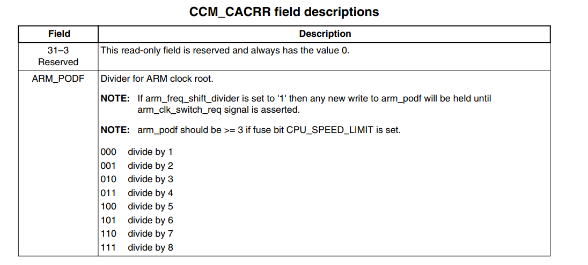

② 设置 PLL1 = 1056MHz ，PLL1=pll1_sw_clk。pll1_sw_clk 通过由 2 路可以选择，分别为 pll1_main_clk 和 step_clk 通过 CCSR 寄存器 pll1_sw_clk_sel 位来选择

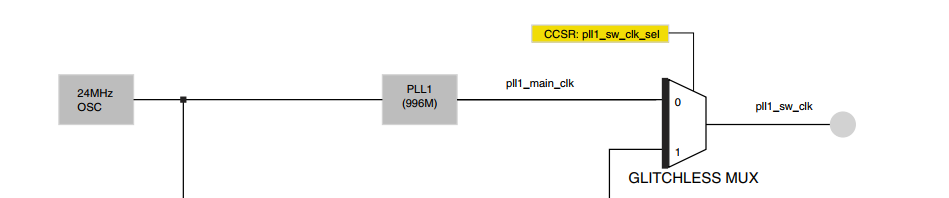

这个 pll1_sw_clk_sel 位在 CCSR 的这里

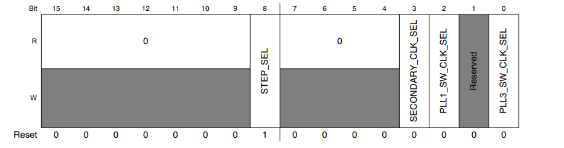

③ 在修改 PLL1 的时候，也就是修改系统时钟的时候，需要给 6ULL 一个临时的时钟，也就是 step_clk。在修改 PLL1 的时候需要将 pll1_sw_clk 切换到 step_clk。step_clk 也有两路来源，由 CCSR 的 step_sel 位（bit8） 来设置

④ 时钟切换成功以后就可以修改 PLL1 的值

⑤ 通过 CCM_ANALOG_PLL_ARM 寄存器的 DIV_SELECT 位（bit 6-0）设置 PLL1 的频率，公式为

Output =Fref\*DIV_SEL/2 1056 = 24* DIV_SEL/2 => DIEV_SEL = 88

还要设置 CCM_ANALOG_PLL_ARM 这个寄存器的 ENABLE 位(bit13) 为 1，也就是使能输出

⑥ 在切换回 PLL1 之前，设置 ARM_PODF  = 1 切记！！！

2. 各个 PLL 时钟的配置

3. 指定外设的时钟配置

### 16.4 各个 PLL 时钟的配置

有 7 个 PLL 我们现在只需要关注 PLL2 和 PLL3 其他的到时候用到再说

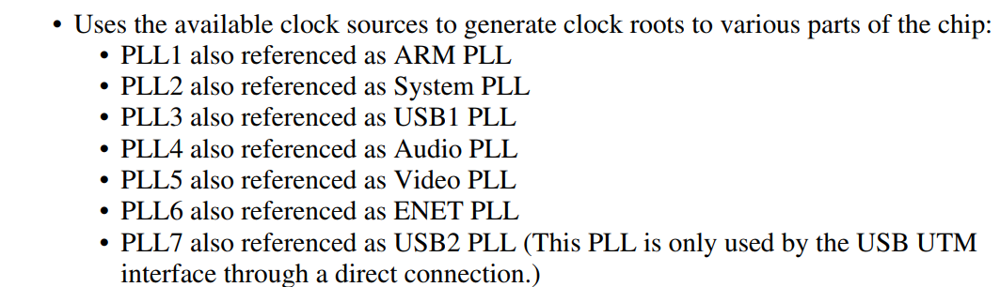

**System PLL - PLL2**  ：this PLL will only be run at the default frequency of 528 MHz  

**USB PLL - PLL3 **：this PLL should always be set to 480 MHz in normal operation

1. 初始化 PLL2_PFD0~PFD3 寄存器 CCM_ANALOG_PFD_528 用于设置 4 路 PFD 的时钟，比如 PFD0= 518*18/PFD0_FRAC

2. 初始化 PLL3_PFD0~PFD3

### 16.5 其他外设时钟源的配置

AHB_CLK_ROOT、PERCLK_CLK_ROOT、IPG_CLK_ROOT

PERCLK_CLK_ROOT、IPG_CLK_ROOT 这两个时钟很多外设都要使用

为什么要初始化AHB_CLK_ROOT ？因为后面两个 IO 用到这个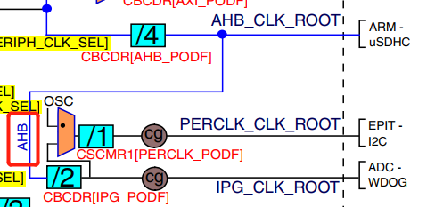

我们设置 PERCLK_CLK_ROOT = IPG_CLK_ROOT = 66MHz

1. 初始化 AHB_CLK_ROOT

AHB 是 PERCLK 的两倍，所以设置它为 132MHz

设置寄存器 CBCMR 的 PRE_PERIPH_CLK_SEL 位

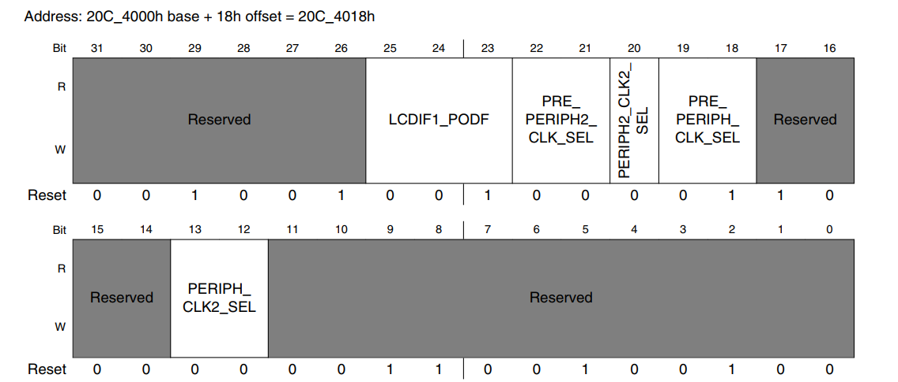

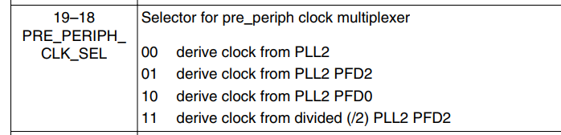

我们选择 PLL2 _PFD2 这一条路，设置 CBCDR 寄存器的 PERIPH_CLK_SEL 位为 0，设置 CBCDR 寄存器的AHB_FODF 位为 2 ,3分频，因此396/3 就是 132MHz 

2. 设置 PERCLK_CLK_ROOT = 66MHz

设置 CSCMR1 寄存器的

3. 设置 IPG_CLK_ROOT = 66MHz

设置 CBCDR 寄存器 IP_PODF= 1，也即是 2分频

详情看代码...

## 17. Cortex-A 中断原理（难点重点）

### 17.1 回顾 STM32 中断向量表

ARM 芯片从 0x00000000 开始运行，执行指令。在程序开始的地方存放着中断向量表。中断向量表主要功能是描述中断对应的中断服务函数。

对于 STM32 来说代码最开始的地址存放堆栈栈顶指针

一般 ARM 从 0x00000000开始运行，对于 STM32 我们设置连接首地址为 0x80000000

如果代码一定要从 0x80000000 开始运行，那么需要告诉一下 SOC 内核，也就是设置中断向量偏移，设置 SCB 的 VTOR 寄存器为新的中断向量表起始地址即可

### 17.2 Cortex-A 中断系统

1. Cortex-A 中断向量表有 8 个中断，其中重点关注 IRQ 。Cortex-A 的中断向量表需要用户自己去定义
2. 中断向量偏移，我们的裸机例程都是从 0x87800000 开始的，因此要设置中断向量偏移

**GIC 中断控制器**

同 NVIC 一样，GIC 用于管理 Cortex-A 的中断，GIC 提供了开关中断，设置中断优先级

**IMX6U 中断号**

为了区分不同的中断，引入了中断号

ID 0-15 是给 SGI

ID 16-31 是给 PPI

剩下的 ID 32-1019 是给 SPI 的也就是按键中断，串口中断，等等

对于 6ULL 来说，它支持 128个中断

**中断服务函数的编写**

一个是 IRQ 中断服务函数的编写，另一个就是在 IRQ 中断服务函数里面去查找并运行的具体 的外设中断服务函数

### 17.3 中断实验编写

1. 编写按键中断例程

KEY0 使用 UART1_CTS 这个 IO 编写 UART1_CTS 的中断代码

修改start.S 添加中断向量表，编写复位中断服务函数和 IRQ 中断服务函数

2. 编写复位中断服务函数，内容如下：

* 关闭 I Cache D Cache MMU

* 设置处理器进入 9 种工作模式下对应的 sp 指针，要使用中断那么必须设置 irq模式下的 sp 指针，索性直接设置所有模式下的 sp 指针

* 清除 bss 段

* 跳转到 c 函数(main)

3. CP15 协处理器

MRC：将 CP15 协处理器中的寄存器数据读到 ARM 寄存器中

MCR：就是读 CP15 寄存器，MCR 就是写 CP15 寄存器，MCR 指令格式如下

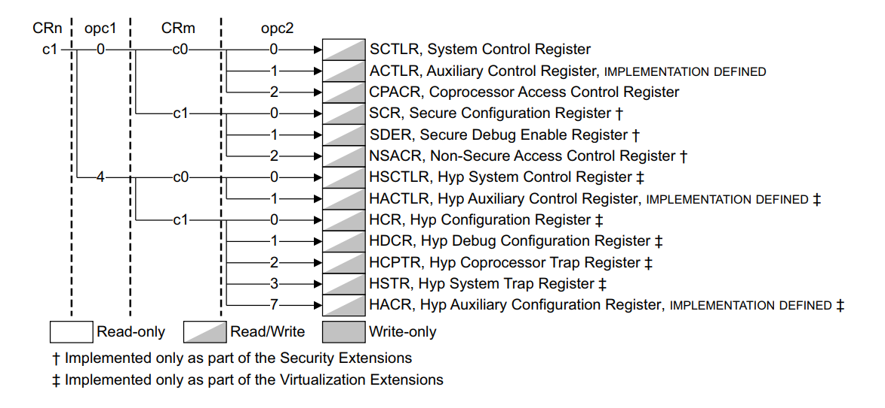

MCR{cond} p15, \<opc1>,\<Rt>,\<CRn>,\<CRM>,\<opc2>

现在要关闭 I,D Cache 和 MMU 打开 Cortex-A7 参考手册到 105 页，找到 SCTILR 寄存器，也就是系统控制寄存器，此寄存器 bit0 用于打开和关闭 MMU, bit1 对齐控制位，bit2控制 D Cache 的打开和关闭，bit11 用于控制分支预测，bit12 用于控制 I Cache

**中断向量偏移设置**

将新的中断向量表首地址写入到 CP15 的 c12 寄存器

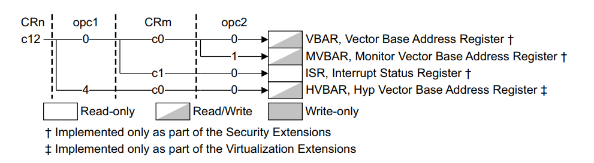

MRC p15, 0, r0, c12, c0, 0 //读取 vbar 寄存器

MCR p15, 0, r0, c12, c0, 0 //写入

**IRQ 中断服务函数**

 mrc p15,4,r1,c15,c0,0 读取 CP15 的 CBAR 寄存器， CBAR 寄存器保存了 GIC 控制器的寄存器组首地址。GIC 寄存器组偏移 0x1000~0x1fff 为 GIC 的分发器

0x2000 - 0x3fff 为 cpu 接口端，意味着我们可以访问 GIC 控制器了

代码中 R1 寄存器保存着 GIC 控制器的 CPU 接口端基地址，读取 CPU 接口端的GICC_IAR 寄存器的值保存到 R0 里面。可以从 GICC_IAR 的 bit 0-9 读取中断 ID。我们读取中断 ID 的目的就是为了得到对应的中断处理函数。

system_irqhandler 就是具体的中断处理函数，此函数有一个参数，为 GICC_IAR 寄存器的值（就是中断id，通过r0 传入到c语言函数里了）

system_irqhandler 处理完具体的中断以后，需要将对应的中断 ID 的值写入到 GICC_EOIR寄存器里面。

**6ULL GPIO 中断设置**

1. 我们首先要设置 GPIO 的中断触发方式，也就是 GPIO_ICR1 或 GPIO_ICR2 寄存器，触发方式有低电平，高电平，上升沿，下降沿。对于本例程来说我们设置为下降沿(原理图显示，只要一按下按键，io 就会接地)
2. 还记得 IMR 吗，这个可以使能 GPIO 对应的中断，设置 GPIO_IMR 寄存器
3. 处理完中断以后需要清除中断标志位，也就是清除 GPIO_ISR 相应的位（通过写 1 来清零）
4. GIC 配置

* 使能相应的中断 ID ，GPIO1_18对应的中断 ID 为 67+32 = 99


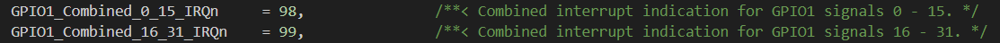

* 设置中断优先级

* 注册 GPIO1_IO18 的中断处理函数

## 18. EPIT 定时器实验

### 18.1 EPIT 简介

1. EPIT 是 32 位的一个向下计数器（给定一个值不断减1，直到减到0）


2. EPIT 的时钟源可以选择，我们选择 ipg_clk = 66MHz


3. 可以对时钟源进行分频（有 12 位的分频器，0-4095 分别表示 1-4096 分频）


4. 开启定时器后，计数寄存器会每个时钟减 1 ，如果和比较寄存器的值相等，则触发中断
5. EPIT 有两种工作模式 set-add-forget 和 free_running
6. 6ULL 有两个 EPIT 定时器，每个定时器又有多个寄存器


EPIT_CR 寄存器用于配置 EPIT 

### 18.2 实验原理简介

**EPIT_CR 寄存器**

bit0 为 1，设置 EPIT 使能 

bit1 为 1，设置计数器的初始值为加载寄存器的值

bit2 为 1，使能比较中断

bit3 为 1，设置工作模式为 set-add-forget 模式

bit15-4， 设置分频值

bit25-24，设置时钟源的选择，我们设置为 1，那么 epit 的时钟源就为 ipg_clk = 66MHz

**EPIT_SR 寄存器**

只有 bit0 有效，表示中断状态，写 1 清零，当 ocif 位为 1 时表示中断发生，为 0 时，表示中断未发生，我们处理完中断以后一定要清除中断标志位


注意：这里如果中断发生就会读取到 1，但是中断执行完毕之后要写 1 进行中断位的清除

**EPIT_LR 寄存器**

设置计数器的加载值，计数器每次计时到 0 以后就会读取 lR 寄存器的值，重新开始计时

**EPIT_CMPR 寄存器**

当计数器的值和 CMPR 的值相同以后就会产生有效中断

**EPIT_CNR 寄存器**

只读寄存器，可以随时读取当前的计数值

使用 EPIT 实现 500ms 周期的定时器，我们在 EPIT 中断服务函数里面让 led 灯亮灭

最后要初始化中断， ENABLE 这个中断id ，并且注册中断服务函数


实验程序编写参考代码


## 19. 定时器按键消抖实验

### 19.1 定时器按键消抖简介

就是每次按键一次会执行一个按键的 io 中断，此中断会重置并且开启计时器，如果期间计时器没有计时满又触发了按键中断（由于抖动会触发多次按键中断），则将计时器计时重置，进行再一次周期计时，如果计时器周期计时满则判定为有效触发按键，当定时器产生周期中断以后就在中断服务函数里面做具体处理，比如开关蜂鸣器

### 19.2 实验原理简介

按键中断处理函数里开启计时器中断，计时器满了便再次对按键的状态判断，如果还是按下则判定为有效

### 19.3 实验程序编写

查看代码

## 20. GPT 定时器简介

以前的延时函数就采用空指令来实现，延时肯定不准确，当我们修改了 6ULL 的主频以后，采用空指令的延时函数就不准了！ 因此我们需要高级精度的延时函数，而且不随着主频的变化而改变。

STM32 使用 SYSTICK 这个硬件定时器来实现高精度延时。因此我们可以在 6U 里面使用一个硬件定时器来实现高精度延时。

本讲我们使用 6U 的 GPT 定时器来实现高精度延时

GPT 定时器是 32 位**向上**计数器

GPT 定时器有捕获的功能，GPT也支持比较输出或中断功能

GPT 定时器也有一个 12 位的分频器

GPT 时钟源可以选择，这里我们使用 ipg_clk 做为 GPT 的时钟源


从图上可以看出，GPT 有 3 路比较输出 2 路捕获输入

GPT 定时器有两种工作模式

Restart 模式下，定时计数值与比较寄存器的值相等的话就会重新重0开始计时，该模式仅限比较通道 1

Free-run 模式所有比较通道都适用，该模式下，计数值不会复位，只会一直加，加到0xFFFFFFFF 然后重新重 0 开始计数

### 20.1 高精度延时原理简介

**GPT_CR 寄存器**

bit0 为 GPT 使能位 为 0 的时候关闭 GPT 为 1 的时候使能 GPT

bit1 为 GPT 定时器的初始值，为 0 的时候表示GPT 定时器计数值默认为上次关闭时候遗留的值，为 1 的话计数值为 0

bit 6-8 时钟源的选择，设置为 1 ，表示时钟源选择 ipg_clk = 66 mhz

bit 9 设置 GPT 定时器工作模式， 为 0 的时候工作在 restart 模式，为 1 的时候工作在 free -run 模式。

bit15 软件复位

**GPT_PR 寄存器**

bit11-0 为分频值，可设置 1-4096

GPT_SR 寄存器

bit5 表示溢出发生

bit4 和 bit3 分别为输入通道 2 和 1的捕获中断标志位

bit2 ~ bit 0 也就是 OF 3- OF 1 为比较中断

**GPT_IR 寄存器**

捕获使能

### 20.2 软件编写

1. 可以使用 GPT 自带的中断进行调用服务函数
2. 也可以读取 GPT_CNT 寄存器的值实现真正的延时

## 21. 串口实验

### 21.1 实验原理简介

6ULL 的 UART_URXD 寄存器保存着串口接收到的数据，UART_UTXD 寄存器为发送数据寄存器，如果需要通过串口发送数据，只需要往这个寄存器写入数据即可

UART_UCR1 - 4  都是串口的控制寄存器

**UART_ UCR1**

* bit0 UART 的使能位为1 的时候使能 UART

* bit14 为自动检测波特率使能位 为1 时使能自动波特率检测

**UART_UCR2**

* bit0 为软件复位位，为 0 时候复位 UART

* bit 1 是使能UART 的接收，我们要配置为 1

* bit2 为发送使能

* bit5 为数据大小，用来设置数据位的，0 的话表示 7 位数据位，1 的话表示 8 位数据位

* bit6 设置停止位， 0 的话表示 1 位停止位，1 的话表示 2 位停止位

* bit7 是奇偶校验位，为 0 的时候是偶校验，为 1 的时候是奇校验

* bit8 是校验使能位， 0 是关闭校验

**UART_UCR3**

* bit2 必须为 1

**UART_UFCR 寄存器的 bit9-7 设置分频值**

UART的时钟源 = PLL3/6 = 480/6 = 80 MHz

CSCDR1 寄存器的 UART_CLK_SEL 设置 UART 的时钟源为 0 时是 80 MHz，为 1 的时候是 24 M的晶振 UART_CLK_PODF 控制分频，一般设置为 1 分频，因此最终 UART_CLK_ROOT = 80M

UART_UFCR ，UART_UBIR，UART_UBMR 这三个寄存器决定了串口的波特率


**UART_USR2** 

bit0 为 1 表示有数据可以读取（读取数据之前要判断这个位是否为1）

bit3 为 1 表示数据发送完成

### 21.2 实验软件编写

UART1_TXD 使用 IO 为 UART1_TX_DATA 

UART1_RXD 使用 IO 为UART1_RX_DATA

linux 下默认使用 utf-8 编码，因此我们需要设置编码模式为 utf-8

注意：UBIR 必须在 UBMR 之前配置


   ```c 
   uart_putstr("\r\n");
   /*
   1、\n 软回车：
   
   在Windows 中表示换行且回到下一行的最开始位置。相当于Mac OS 里的 \r 的效果。
   在Linux、unix 中只表示换行，但不会回到下一行的开始位置。
   
   2、\r 软空格：
   
   在Linux、unix 中表示返回到当行的最开始位置。
   在Mac OS 中表示换行且返回到下一行的最开始位置，相当于Windows 里的 \n 的效果。
   */
   ```

