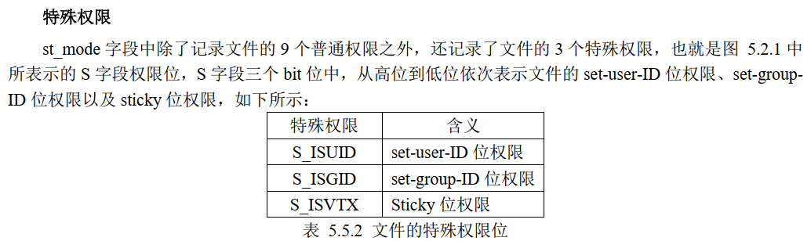
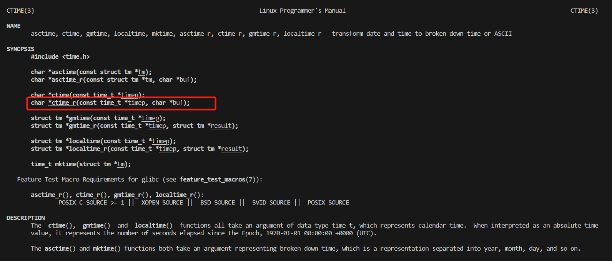
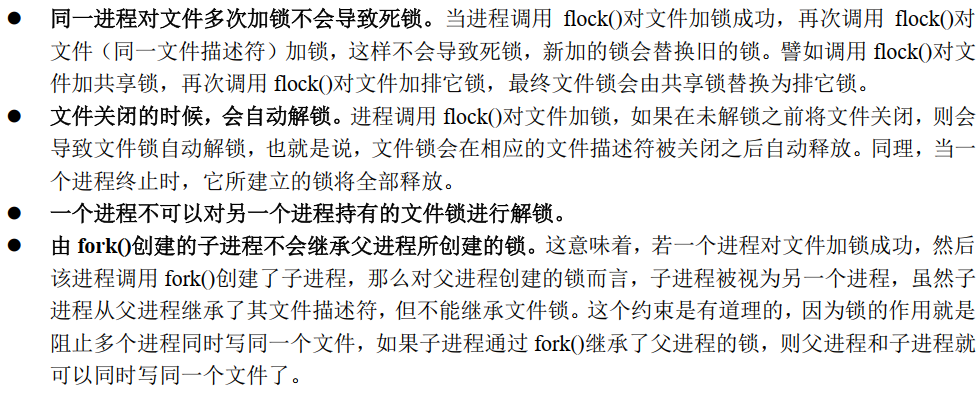

# C 应用开发

## 1. 应用编程概念

略。。。

## 2. 文件 I/O 基础

### 2.1 一个简单的文件 IO 示例

```c
#include <sys/types.h>
#include <sys/stat.h>
#include <fcntl.h>
#include <unistd.h>

int main(void)
{
    char buff[1024];
    int fd1, fd2;
    int ret;
    /* 打开源文件 src_file */
    fd1 = open("./src_file", O_RDONLY);
    if (-1 == fd1)
        return fd1;
    /* 打开目标文件 dest_file(只写方式) */
    fd2 = open("./dest_file", O_WRONLY);
    if (-1 == fd2)
    {
        ret = fd2;
        goto out1;
    }
    /* 读取源文件 1KB 数据到 buff 中 */
    ret = read(fd1, buff, sizeof buff);
    if (-1 == ret)
        goto out2;
    /* 将 buff 中的数据写入目标文件 */
    ret = write(fd2, buff, sizeof buff);
    if (-1 == ret)
        goto out2;
    ret = 0;

out2:
    close(fd2);
out1:
    close(fd1);
    return ret;
}
```

打开源文件和目标文件，将源文件数据传送到目标文件，最后关闭源文件和目标文件

### 2.2 文件描述符

调用 open 函数会有一个返回值，这个返回值就是文件描述符（int 类型的）

一个进程可以打开的文件数是有限制的`ulimit -n` 查看，文件符是按（3-Limit）进行分配的，0，1，2 给系统分配好了

### 2.3 open 打开文件

函数原型如下：

```c
#include <sys/types.h>
#include <sys/stat.h>
#include <fcntl.h>

int open(const char *pathname, int flags);
int open(const char *pathname, int flags, mode_t mode);

/*
pathname 文件路径
flags 标志
mode 当 flags 包含 O_CREAT 或 O_TMPFILE 生效，用来指定所创建的文件的权限
*/
```

c 语言不支持重载，这里是 c 语言的可变参数

mode 标志的用法：


### 2.4 write 写文件

```c
#include <unistd.h>
ssize_t write(int fd, const void *buf, size_t count);
/*
fd 文件描述符
buf 指定写入数据对应的缓冲区
count 指定写入的字节数
失败返回 -1
*/
```

### 2.5 read 读文件

```c
#include <unistd.h>
ssize_t read(int fd, void *buf, size_t count);
/*
fd 文件描述符
buf 指定用于存储数据的缓冲区
count 需要读取的字节数
返回读取到的字节数
*/
```

### 2.6 close 关闭文件

```c
#include <unistd.h>
int close(int fd);
/*
fd 文件描述符
失败返回 -1
*/
```

### 2.7 lseek

```c
#include <sys/types.h>
#include <unistd.h>
off_t lseek(int fd, off_t offset, int whence);

/*
fd 文件描述符
offset 偏移量（字节）
whence 移动读写位置
返回当前的读写，位置错误返回 -1
*/
```

* SEEK_SET：偏移量指向 offset 字节处
* SEEK_CUR：当前位置偏移量 +offset 字节处
* SEEK_END：文件末尾位置 +offset 字节处

## 3. 深入探究文件 I/O

### 3.1 Linux 系统如何管理文件

#### 3.1.1 静态文件与 inode

* 文件没有被打开是存放在磁盘当中，这种以一种固定的形式存放的文件称为静态文件

* 硬盘的最小存储单位是“扇区”，每个扇区 512 字节，硬盘连续读取扇区，多个扇区叫做块，常见的块是 4K 也就是 8 个连续的扇区
* 磁盘在进行格式化的时候会分为两个区域，一个是数据区，一个是 inode 区，inode 存放文件的信息，但是文件名不存放在这里


`ls -i #查看 inode 号`

`stat 文件 # 查看文件 inode 号`

当打开一个文件，将执行如下操作：

> 1. 系统找到这个文件对应的 inode 编号
> 2. 通过 inode 编号从 inode table 中找到对应的结构体
> 3. 根据 inode 结构体中记录的信息确定文件所在的块，并读出数据

#### 3.1.2 文件打开时的状态

当调用 open 函数打开文件的时候，内核会申请一段内存，将静态文件数据内容从磁盘读取到内存中管理（也叫做动态文件）

* 在 linux 系统中，内核为每个进程设置一个专门的数据结构进行管理，用于记录进程的状态信息，运行特征，这个数据结构叫进程控制块（PCB）
* PCB 中有一个指针指向了文件描述符表，该表也是一个数据结构体，表中有很多文件描述符 fd ，每个文件描述符指向一个文件表


### 3.2 返回错误处理与 errno

每个进程当中都有这样一个全局变量 errno，当调用库函数返回错误时，该变量会被修改成错误编号（不是所有库都会修改 errno 具体看 man 手册）

```c
#include <stdio.h>
#include <errno.h>
int main(void)
{
    printf("%d\n", errno);
    return 0;
}
```

#### 3.2.1 strerror 函数

将错误编号转化为错误信息

```c
#include <string.h>
char *strerror(int errnum);

/*
errnum 错误编号 errno
返回值 对应的描述信息
*/
```

#### 3.2.2 perror 函数

这个函数不需要传 errno 就能打印错误信息

```c
#include <stdio.h>
void perror(const char *s);
/*
s 在打印错误字符串时加入自己的信息
*/
```

### 3.3 exit _exit _Exit

#### 3.3.1 _exit 和 -Exit

调用_exit()函数会清除其使用的内存空间，并销毁其在内核中的各种数据结构， 关闭进程的所有文件描述符， 并结束进程、将控制权交给操作系统 

```c
#include <unistd.h>
void _exit(int status);
/*
0 表示正常结束
*/
```

```c
#include <stdlib.h>
void _Exit(int status);
```

这两个都是系统调用函数

#### 3.3.2 exit() 函数

```c
#include <stdlib.h>
void exit(int status);
```

这个是 c 标准库函数

### 3.4 空洞文件

#### 3.4.1 概念

lseek 函数可以移动超出文件大小的偏移量，然后在偏移量外进行写入，那么就会形成空洞，文件空洞不会占用物理空间，但是空洞文件形成时，逻辑上该文件的大小是包含了空洞部分的，空洞文件对多线程共同操作文件是机器有用的

应用场景：

* 在使用迅雷下载文件时， 还未下载完成， 就发现该文件已经占据了全部文件大小的空间， 这也是空洞文件； 下载时如果没有空洞文件， 多线程下载时文件就只能从一个地方写入， 这就不能发挥多线程的作用了； 如果有了空洞文件， 可以从不同的地址同时写入，就达到了多线程的优势  
* 在创建虚拟机时， 你给虚拟机分配了 100G 的磁盘空间，但其实系统安装完成之后，开始也不过只用了 3、 4G 的磁盘空间， 如果一开始就把 100G 分配出去，资源是很大的浪费

### 3.5 O_APPEND 和 O_TRUNC 标志

#### 3.5.1 O_TRUNC 标志

open 函数里的标志，打开文件并清空内容

#### 3.5.2 O_APPEND 标志

open 函数里的标志，当使用 write 函数对文件进行读写操作时，自动把偏移量移动到文件末尾（lseek 也无法改变）

### 3.6 多次打开同一个文件

多个进程同时打开一个文件是被允许的

#### 3.6.1 验证一些现象

* 一个进程多次 open 同一个文件，会得到多个不同的文件描述符 fd

```c
#include <sys/types.h>
#include <sys/stat.h>
#include <fcntl.h>
#include <unistd.h>
#include <stdio.h>
#include <stdlib.h>

int main(void)
{
    int fd1, fd2, fd3;
    int ret;
    /* 第一次打开文件 */
    fd1 = open("./test_file", O_RDWR);
    if (-1 == fd1)
    {
        perror("open error");
        exit(-1);
    }
    /* 第二次打开文件 */
    fd2 = open("./test_file", O_RDWR);
    if (-1 == fd2)
    {
        perror("open error");
        ret = -1;
        goto err1;
    }
    /* 第三次打开文件 */
    fd3 = open("./test_file", O_RDWR);
    if (-1 == fd3)
    {
        perror("open error");
        ret = -1;
        goto err2;
    }
    
    /* 打印出 3 个文件描述符 */
    printf("%d %d %d\n", fd1, fd2, fd3);
    close(fd3);
    ret = 0;
err2:
    close(fd2);
err1:
    /* 关闭文件 */
    close(fd1);
    exit(ret);
}
//out: 3 4 5
```

* 一个进程内多次 open 打开同一个文件，在内存中并不会存在多份动态文件，也就是说，这种情况下多个文件描述符共享同一个动态文件

* 一个进程内多次 open 打开同一个文件，不同文件描述符所对应的读写位置偏移量是相互独立的  


#### 3.6.2 多次打开同一文件进行读操作与 O_APPEND 标志  

由于不同的文件描述符的偏移量是独立的，如果不管理好各自的偏移量从而实现多线程写一个文件的话，会造成覆盖现象，也就是 fd1 写的覆盖了 fd2 写的，因此在打开文件时使用 O_APPEND 标志可以协调实现操作多个文件描述符对一个文件进行操作

### 3.7 复制文件描述符

可以使用 dup 或 dup2 这两个系统调用对文件描述符进行复制


#### 3.7.1 dup 函数

```c
#include <unistd.h>
int dup(int oldfd);
/*
oldfd 被复制的文件描述符
失败返回 -1 设置 errno 值
*/
```

复制后得到的描述符是和原来的描述符的偏移量共享的，也就是说原描述符的偏移量变了，那么复制的描述符的偏移量也会跟着动态改变

#### 3.7.2 dup2 函数

在 dup 的基础上可以指定文件描述符

```c
#include <unistd.h>
int dup2(int oldfd, int newfd);
/*
oldfd 被复制的文件描述符
newdf 指定一个文件描述符（当前进程中没有使用到的）
失败返回 -1 设置 errno 值
*/
```

### 3.8 文件共享

所谓文件共享指的是同一个文件（譬如磁盘上的同一个文件，对应同一个 inode） 被多个独立的读写体同时进行 IO 操作，同时进行 IO 操作指的是一个读写体操作文件尚未调用 close 关闭的情况下，另一个读写体去操作文件  

**常见三种实现文件共享的方式**

* 在同一个进程中多次调用 open 打开同一个文件


* 不同进程中分别使用 open 函数打开同一个文件


* 同一个进程中通过 dup（dup2）函数对文件描述符进行复制


### 3.9 原子操作与竞争冒险

#### 3.9.1 竞争冒险简介

两个进程对一个文件进行操作，存在竞争冒险现象：


#### 3.9.2 原子操作

问题：上述的问题出在逻辑操作“先定位到文件末尾，然后再写”，它使用了两个分开的函数调用  

解决：解决办法就是将“先定位到文件末尾，然后写”这两个步骤组成一个原子操作即可  

* O_APPEND 实现原子操作

当 open 函数的 flags 参数中包含了 O_APPEND 标志，每次执行 write 写入操作时都会将文件当前写位置偏移量移动到文件末尾，然后再写入数据，这里 “移动当前写位置偏移量到文件末尾、写入数据” 这两个操作步骤就组成了一个原子操作

* pread() 和 pwrite()  

这两个函数都是系统调用，相当于 read() + lseek() 一起操作（原子）

```c
#include <unistd.h>
ssize_t pread(int fd, void *buf, size_t count, off_t offset);
ssize_t pwrite(int fd, const void *buf, size_t count, off_t offset);
/*
offset 表示当前需要进行读或写的位置偏移量
其他参数 与 read 和 wirte 一样

*/
```

1. 调用 pread 函数时，无法中断其定位和读操作（也就是原子操作）；

2. 不更新文件表中的当前位置偏移量  

* 创建一个文件

当两个线程执行如下，会导致一个文件被创建两次：


使用 O_EXCL 标志， 当 open 函数中同时指定了 O_EXCL 和 O_CREAT 标志，如果要打开的文件已经存在，则 open 返回错误；如果指定的文件不存在，则创建这个文件，将“判断文件是否存在、创建文件”这两个步骤合成为一个原子操作  

### 3.10 fcntl 函数和 ioctl 函数

#### 3.10.1 fcntl 函数

类似于一个多功能文件描述符管理工具箱

```c
#include <unistd.h>
#include <fcntl.h>
int fcntl(int fd, int cmd, ... /* arg */ )

/*
fd 文件描述符
cmd 操作命令

复制文件描述符（cmd=F_DUPFD 或 cmd=F_DUPFD_CLOEXEC）；
获取/设置文件描述符标志（cmd=F_GETFD 或 cmd=F_SETFD）；
获取/设置文件状态标志（cmd=F_GETFL 或 cmd=F_SETFL）；
获取/设置异步 IO 所有权（cmd=F_GETOWN 或 cmd=F_SETOWN）；
获取/设置记录锁（cmd=F_GETLK 或 cmd=F_SETLK）；

执行失败情况下，返回-1，并且会设置 errno；执行成功的情况下，其返回值与 cmd（操作命令）有关
*/
```

#### 3.10.2 ioctl 函数

一般用于操作特殊文件或硬件外设

```c
#include <sys/ioctl.h>
int ioctl(int fd, unsigned long request, ...);
/*
request 此参数与具体要操作的对象有关，没有统一值， 表示向文件描述符请求相应的操作
返回值 成功返回 0，失败返回-1
*/
```

### 3.11 截断文件

使用系统调用 truncate() 或 ftruncate() 可将普通文件截断为指定字节长度

```c
#include <unistd.h>
#include <sys/types.h>
int truncate(const char *path, off_t length);
int ftruncate(int fd, off_t length);

/*
path 指定文件路径
length 截断的长度（字节）
调用成功返回 0，失败将返回-1，并设置 errno 以指示错误原因
*/
```

使用 ftruncate() 函数进行文件截断操作之前，必须调用 open() 函数打开该文件得到文件描述符，并且必须要具有可写权限，也就是调用 open() 打开文件时需要指定 O_WRONLY 或 O_RDWR  

## 4. 标准 I/O 库

标准 io 库就是对系统调用（open，read，write，lseek，close）的进一步封装

* 虽然标准 I/O 和文件 I/O 都是 C 语言函数，但是标准 I/O 是标准 C 库函数，而文件 I/O 则是 Linux
  系统调用
* 标准 I/O 是由文件 I/O 封装而来，标准 I/O 内部实际上是调用文件 I/O 来完成实际操作的
* 可移植性：标准 I/O 相比于文件 I/O 具有更好的可移植性，通常对于不同的操作系统，其内核向应用层提供的系统调用往往都是不同，譬如系统调用的定义、功能、参数列表、返回值等往往都是不一样的；而对于标准 I/O 来说，由于很多操作系统都实现了标准 I/O 库，标准 I/O 库在不同的操作系统之间其接口定义几乎是一样的，所以标准 I/O 在不同操作系统之间相比于文件 I/O 具有更好的可移植性
* 性能、效率： 标准 I/O 库在用户空间维护了自己的 stdio 缓冲区， 所以标准 I/O 是带有缓存的，而
  文件 I/O 在用户空间是不带有缓存的，所以在性能、效率上，标准 I/O 要优于文件 I/O

### 4.2 FILE 指针

标准 io 是围绕 FILE 指针展开的相当于文件 io 的 fd，FILE 是一个结构体数据类型

### 4.3 标准输入、标准输出和标准错误

* 进程将从标准输入文件（stdin）中得到输入数据，将其输出到标准输出文件（stdout），将错误信息输出到标准错误（stderr）文件，所以进程启动后会占用三个文件描述符 0,1,2 分别代表 输入 输出 错误

* 标准输出文件和标准错误文件都对应终端的屏幕，而标准输入文件则对应于键盘  

在 unistd.h 头文件中有如下宏代表文件描述符：

```c
/* Standard file descriptors. */
#define STDIN_FILENO 0 /* Standard input. */
#define STDOUT_FILENO1 /* Standard output. */
#define STDERR_FILENO2 /* Standard error output. */
```

对应于标准 io 的 FILE 指针，有如下宏表示：

```c
/* Standard streams. */
extern struct _IO_FILE *stdin; /* Standard input stream. */
extern struct _IO_FILE *stdout; /* Standard output stream. */
extern struct _IO_FILE *stderr; /* Standard error output stream. */
/* C89/C99 say they're macros. Make them happy. */
#define stdin stdin
#define stdout stdout
#define stderr stderr
```

### 4.4 打开文件 fopen

```c
#include <stdio.h>
FILE *fopen(const char *path, const char *mode);
/*
path 文件路径
mode 指定对文件的读写权限
返回值： 调用成功返回一个指向 FILE 类型对象的指针（FILE *），该指针与打开或创建的文件相关联，后续的标准 I/O 操作将围绕 FILE 指针进行。 如果失败则返回 NULL，并设置 errno 以指示错误原因
*/
fopen(path, "r");
```

**fclose () 关闭文件**

 ```c
 #include <stdio.h>
 int fclose(FILE *stream);
 ```

### 4.5 读写文件

fread() 和 fwrite() 库函数对文件进行读、写操作  

```c
#include <stdio.h>
size_t fread(void *ptr, size_t size, size_t nmemb, FILE *stream);
size_t fwrite(const void *ptr, size_t size, size_t nmemb, FILE *stream);
/*
ptr 数据缓存区
size nmemb个数据项，每个数据项 size 个字节
stream FILE 指针
调用成功时返回读取到的数据项的数目(与 nmemb 比对)
*/
```

### 4.6 fseek 定位

```c
#include <stdio.h>
int fseek(FILE *stream, long offset, int whence);
/*
stream FILE 指针。
offset 与 lseek()函数的 offset 参数意义相同。
whence 与 lseek()函数的 whence 参数意义相同。
返回值 成功返回 0；发生错误将返回-1，并且会设置 errno 以指示错误原因；
*/
```

**ftell 函数**

获取文件当前的读写位置偏移量

```c
#include <stdio.h>
long ftell(FILE *stream);
```

### 4.7 检查或复位状态

调用 fread()读取数据时，如果返回值小于参数 nmemb 所指定的值，表示发生了错误或者已经到了文件末尾（文件结束 end-of-file）但 fread()无法具体确定是哪一种情况； 在这种情况下，可以通过判断错误标志或 end-of-file 标志来确定具体的情况  

#### 4.7.1 feof 函数

```c
#include <stdio.h>
int feof(FILE *stream);
/*
用于测试 stream 所指文件的 end-of-file 标志，如果该标志被设置返回非 0，未被设置返回 0

当文件的读写位置移动到了文件末尾时， end-of-file 标志将会被设置
*/
```

#### 4.7.2 ferror 函数

```c
#include <stdio.h>
int ferror(FILE *stream);
/*
库函数 ferror()用于测试参数 stream 所指文件的错误标志，如果错误标志被设置了，则调用 ferror()函数将返回一个非零值，如果错误标志没有被设置，则返回 0
*/
```

#### 4.7.3 clearerr 函数

```c
#include <stdio.h>
void clearerr(FILE *stream);
/*
库函数 clearerr()用于清除 end-of-file 标志和错误标志，当调用 feof()或 ferror()校验这些标志后，通常需要清除这些标志，避免下次校验时使用到的是上一次设置的值，此时可以手动调用 clearerr()函数清除标志。
*/
```

### 4.8 格式化 I/O

#### 4.8.1 格式化输出

```c
#include <stdio.h>
int printf(const char *format, ...);
int fprintf(FILE *stream, const char *format, ...);
int dprintf(int fd, const char *format, ...);
int sprintf(char *buf, const char *format, ...);
int snprintf(char *buf, size_t size, const char *format, ...);

/*
fprintf 将数据写入到 FILE 指针指向的文件中
dprintf 将数据写入到 fd 文件描述符中
sprintf 将数据写入到 buf 缓存当中
snprintf 同 sprintf 但是解决了缓冲溢出的问题 
*/
```

#### 4.8.2 格式化输入

```c
#include <stdio.h>
int scanf(const char *format, ...);
int fscanf(FILE *stream, const char *format, ...);
int sscanf(const char *str, const char *format, ...);
```

### 4.9 I/O 缓冲

#### 4.9.1 文件 I/O 的内核缓冲

调用 write 后仅仅只是将数据从用户空间缓冲拷贝到了内核缓冲区，在后面某个时刻，内核才会将内核缓冲区的数据写入到磁盘当中，这使得系统调用 read()、 write()的操作更为快速，不需要等待磁盘操作  

#### 4.9.2 刷新文件 I/O 的内核缓冲区

强制将缓冲的数据写入到磁盘设备当中

**控制文件 I/O 内核缓冲的系统调用**

* fsync 函数

```c
#include <unistd.h>
int fsync(int fd);
/*
系统调用 fsync()将参数 fd 所指文件的内容数据和元数据写入磁盘，只有在对磁盘设备的写入操作完成之后， fsync()函数才会返回
函数调用成功将返回 0，失败返回-1 并设置 errno 以指示错误原因
*/
```

* fdatasync 函数

```c
#include <unistd.h>
int fdatasync(int fd);
/*
与 fsync 相同，但是不包括文件的元数据（文件的特征信息，通过stat file 可以查询）
*/
```

* sync 函数

```c
#include <unistd.h>
void sync(void);
/*
在 Linux实现中，调用 sync()函数仅在所有数据已经写入到磁盘设备之后才会返回；然后在其它系统中，sync()实现只是简单调度一下 I/O 传递，在动作未完成之后即可返回
*/
```

**控制文件 I/O 内核缓冲的标志**

open 函数里的标志

* O_DSYNC 标志

相当于每次调用 write 之后调用 fdatasync

* O_SYNC 标志

相当于每次调用 write 之后调用 fsync

**对性能的影响**

在程序中频繁调用 fsync()、 fdatasync()、 sync()（或者调用 open 时指定 O_DSYNC 或 O_SYNC 标志）对性能的影响极大，大部分的应用程序是没有这种需求的，所以在大部分应用程序当中基本不会使用到  

#### 4.9.3 直接 I/O 绕过内核缓冲

就是从用户空间直接将数据传送到磁盘（一些测试磁盘的应用会用到）

用法：在 open 文件的时候添加 O_DIRECT 标志

**直接 I/O 的对齐限制**

* 应用程序中用于存放数据的缓冲区，其内存起始地址必须以块大小的整数倍进行对齐
* 写文件时，文件的位置偏移量必须是块大小的整数倍
* 写入到文件的数据大小必须是块大小的整数倍  

这里的块可以用如下命令查看：

```sh
tune2fs -l /dev/sda1 | grep "Block size"
```

**直接 I/O 测试与普通 I/O 对比测试**

```sh
time ./app # 查看运行程序的时间
```

#### 4.9.4 stdio 缓冲

标准 io 性能要优于 文件 io 原因在于，其维护了一个缓冲，就是 stdio

标准 I/O 函数会将用户写入或读取文件的数据缓存在 stdio 缓冲区，然后再一次性将 stdio 缓冲区中缓存的数据通过调用系统调用 I/O（文件 I/O）写入到文件 I/O 内核缓冲区或者拷贝到应用程序的 buf 中  

**对 stdio 进行设置**

* setvbuf 函数

```c
#include <stdio.h>
int setvbuf(FILE *stream, char *buf, int mode, size_t size);
/*
buf 指定 size 大小的内存区域作为缓冲区，这个内存区最好是申请在堆里的，而不是栈中的局部变量
mode 指定缓冲区的类型
成功返回 0，失败将返回一个非 0 值，并且会设置 errno 来指示错误原因
*/
```


当 stdio 缓冲区的数据被刷新到内核或读取之后，数据就不会存在缓冲区里了

* setbuf 函数

```c
#include <stdio.h>
void setbuf(FILE *stream, char *buf);
/*
与 setvbuf 相比，除了不返回值之外，相当于
setvbuf(stream, buf, buf ? _IOFBF : _IONBF, BUFSIZ);
其中 BUFSIZ 定义在头文件 stdio.h 当中，通常为 8192
*/
```

* setbuffer 函数

```c
#include <stdio.h>
void setbuffer(FILE *stream, char *buf, size_t size);
/*
类似于 setbuf 但是允许指定大小
*/
```

**刷新 stdio 缓冲区**

就是将数据写入到内核缓冲区

```c
#include <stdio.h>
int fflush(FILE *stream);
/*
函数调用成功返回 0，否则将返回-1，并设置 errno 以指示错误原因
*/
```

当 stdio 文件关闭或者程序退出时，都会为我们自动刷新 stdio 缓冲区

* 关闭文件时刷新 stdio 缓冲区

```c
#include <stdio.h>
#include <stdlib.h>
#include <unistd.h>
int main(void)
{
    printf("Hello World!\n");
    printf("Hello World!");
    fclose(stdout); //关闭标准输出
    for ( ; ; )
    sleep(1);
}
```

* 程序退出时刷新

```c
#include <stdio.h>
#include <stdlib.h>
#include <unistd.h>
int main(void)
{
    printf("Hello World!\n");
    printf("Hello World!");
}
```

这里只有使用 exit() 和 return 时才会刷新，使用 _exit() 和 _Exit() 退出是不会刷新的

#### 4.9.5 I/O 缓冲小节


### 4.10 文件描述符与 FILE 指针互转

```c
#include <stdio.h>
int fileno(FILE *stream);
/*
成功返回 文件描述符，失败返回 -1
*/
FILE *fdopen(int fd, const char *mode);
/*
mode 与 fopen 函数的 mode 含义相同
若该参数与文件描述符 fd 的访问模式不一致，则会导致调用 fdopen()失败
*/
```

## 5. 文件属性与目录

### 5.1 Linux 系统中的文件类型

Linux 系统下一共分为 7 种文件类型

#### 5.1.1 普通文件

文本文件，二进制文件，可以访问文件中的内容，以字节为单位存储于访问

**普通文件可以分为两大类：文本文件和二进制文件**

* 文本文件：带编码的文本
* 二进制文件：无编码的 0 1

#### 5.1.2 目录文件

文件夹

#### 5.1.3 字符设备文件和块设备文件

设备文件并不存在于磁盘中，而是由文件系统虚拟出来的，一般由内存来维护，当系统关机，设备文件都会消失

> 字符设备文件一般存放在 /dev/ 下，因此该目录也称为虚拟文件系统

#### 5.1.4 符号链接文件

软件链接：快捷方式

硬链接：共用一个 inode

#### 5.1.5 管道文件

管道文件主要用于进程间的通信

#### 5.1.6 套接字文件

套接字文件（socket）也是一种进程间通信的方式，与管道文件不同的是，它们可以在不同主机上的进程间通信，实际上就是网络通信  

### 5.2 stat 函数

```sh
stat file # 这个命令其实是通过调用 stat 函数来获取文件属性的，该函数是系统调用
```

```c
#include <sys/types.h>
#include <sys/stat.h>
#include <unistd.h>
int stat(const char *pathname, struct stat *buf);

/*
pathname 文件路径
buf 获取到的文件属性信息就记录在 struct stat 结构体当中，需要传入这样一个结构体
成功返回 0；失败返回-1，并设置 error
*/
```

#### 5.2.1 struct stat 结构体

struct stat 是内核定义的一个结构体，在 <sys/stat.h> 头文件中声明，所以可以在应用层使用  

```c
struct stat
{
    dev_t st_dev; /* 文件所在设备的 ID */
    ino_t st_ino; /* 文件对应 inode 节点编号 */
    mode_t st_mode; /* 文件对应的模式 */
    nlink_t st_nlink; /* 文件的链接数 */
    uid_t st_uid; /* 文件所有者的用户 ID */
    gid_t st_gid; /* 文件所有者的组 ID */
    dev_t st_rdev; /* 设备号（指针对设备文件） */
    off_t st_size; /* 文件大小（以字节为单位） */
    blksize_t st_blksize; /* 文件内容存储的块大小 */
    blkcnt_t st_blocks; /* 文件内容所占块数 */
    struct timespec st_atim; /* 文件最后被访问的时间 */
    struct timespec st_mtim; /* 文件内容最后被修改的时间 */
    struct timespec st_ctim; /* 文件状态最后被改变的时间 */
};
```

#### 5.2.2 st_mode 变量

st_mode 是 struct stat 结构体中的一个成员变量， 是一个 32 位无符号整形数据，该变量记录了文件的类型、文件的权限这些信息  


**用法：**

```c
/* 判断是不是普通文件 */
if ((st.st_mode & S_IFMT) == S_IFREG) {
/* 是 */
}
/* 判断是不是链接文件 */
if ((st.st_mode & S_IFMT) == S_IFLNK) {
/* 是 */
}
```

**使用宏进行判断：**

```sh
S_ISREG(m) #判断是不是普通文件，如果是返回 true，否则返回 false
S_ISDIR(m) #判断是不是目录，如果是返回 true，否则返回 false
S_ISCHR(m) #判断是不是字符设备文件，如果是返回 true，否则返回 false
S_ISBLK(m) #判断是不是块设备文件，如果是返回 true，否则返回 false
S_ISFIFO(m) #判断是不是管道文件，如果是返回 true，否则返回 false
S_ISLNK(m) #判断是不是链接文件，如果是返回 true，否则返回 false
```

#### 5.2.3 struct timespec 结构体

```c
struct timespec
{
    time_t tv_sec; /* 秒 */
    syscall_slong_t tv_nsec; /* 纳秒 */
};
```

### 5.3 fstat 和 lstat 函数

#### 5.3.1 fstat 函数

```c
#include <sys/types.h>
#include <sys/stat.h>
#include <unistd.h>
int fstat(int fd, struct stat *buf);
/*
和 stat 函数一样只不过不使用路径而是使用 fd
*/
```

#### 5.3.2 lstat 函数

```c
#include <sys/types.h>
#include <sys/stat.h>
#include <unistd.h>
int lstat(const char *pathname, struct stat *buf);

/*
lstat 查阅的是符号链接文件本身的属性
*/
```

### 5.4 文件属主

系统是通过用户组 id 和用户 id 来识别文件的属主的


进程中也有相关联的 id


* 实际用户 ID 和实际组 ID 标识我们究竟是谁，也就是执行该进程的用户是谁、以及该用户对应的所属组； 实际用户 ID 和实际组 ID 确定了进程所属的用户和组

* 进程的有效用户 ID、有效组 ID 以及附属组 ID 用于文件访问权限检查  

#### 5.4.1 有效用户 ID 和有效组 ID

绝大部分情况下，进程的有效用户等于实际用户（有效用户 ID 等于实际用户 ID） ，有效组等于实际组（有效组 ID 等于实际组 ID）

当进行权限检查时，并不是通过进程的实际用户和实际组来参与权限检查的，而是通过有效用户和有效组来参与文件权限检查，就是进程用这个 id 来判断是否可以访问某个文件的

#### 5.4.2 chown 函数

```c
#include <unistd.h>
int chown(const char *pathname, uid_t owner, gid_t group);
/*
pathname 用于指定一个需要修改所有者和所属组的文件路径。
owner 将文件的所有者修改为该参数指定的用户（以用户 ID 的形式描述） ；
group 将文件的所属组修改为该参数指定的用户组（以用户组 ID 的形式描述）；
返回值 成功返回 0；失败将返回-1，兵并且会设置 errno
*/
```

使用限制：

* 只有超级用户进程能改变文件的用户 id

* 普通用户进程可以将文件的组 ID 修改为其所从属的任意附属组 ID，前提是该进程的有效用户 ID 等于文件的用户 ID，而超级用户进程可以将文件的组 ID 修改为任意值

**getuid 和 getgid**

```c
#include <unistd.h>
#include <sys/types.h>
uid_t getuid(void);
gid_t getgid(void);
/*
获取当前进程（应用程序）的实际用户 ID 和用户组 ID
*/
```

#### 5.4.3 fchown 和 lchown 函数

这两个函数与 chown()的区别就像是 fstat()、 lstat()与 stat 的区别

### 5.5 文件访问权限

所有文件类型都有访问权限

#### 5.5.1 普通权限和特殊权限


如何判断权限？站在进程的角度看就是：

* 如果进程的有效用户 ID 等于文件所有者 ID（st_uid） ，意味着该进程以文件所有者的角色存在
* 如果进程的有效用户 ID 并不等于文件所有者 ID，意味着该进程并不是文件所有者身份；但是进程的有效用户组 ID 或进程的附属组 ID 之一等于文件的组 ID（st_gid），那么意味着该进程以文件所属组成员的角色存在，也就是文件所属组的同组用户成员  
* 如果进程的有效用户 ID 不等于文件所有者 ID、并且进程的有效用户组 ID 或进程的所有附属组 ID 均不等于文件的组 ID（st_gid），那么意味着该进程以其它用户的角色存在
* 如果进程的有效用户 ID 等于 0（root 用户），则无需进行权限检查，直接对该文件拥有最高权限



* 当进程对文件进行操作的时候、将进行权限检查，如果文件的 set-user-ID 位权限被设置，内核会将进程的有效 ID 设置为该文件的用户 ID（文件所有者 ID） ，意味着该进程直接获取了文件所有者的权限、以文件所有者的身份操作该文件  
* 当进程对文件进行操作的时候、将进行权限检查，如果文件的 set-group-ID 位权限被设置，内核会将进程的有效用户组 ID 设置为该文件的用户组 ID（文件所属组 ID） ，意味着该进程直接获取了文件所属组成员的权限、以文件所属组成员的身份操作该文件  

#### 5.5.2 目录权限

* 目录的读权限： 可列出（譬如：通过 ls 命令） 目录之下的内容（即目录下有哪些文件）
* 目录的写权限： 可以在目录下创建文件、删除文件
* 目录的执行权限： 可访问目录下的文件，譬如对目录下的文件进行读、写、执行等操作

要想访问目录下的文件，譬如查看文件的 inode 节点、大小、权限等信息，还需要对目录拥有执行权限

#### 5.5.3 检查文件权限 access 函数

```c
#include <unistd.h>
int access(const char *pathname, int mode);
/*
pathname 文件路径
mode
F_OK：检查文件是否存在
R_OK：检查是否拥有读权限
W_OK：检查是否拥有写权限
X_OK：检查是否拥有执行权限
检查项通过则返回 0，表示拥有相应的权限并且文件存在；否则返回-1，如果多个检查项组合在一起，只要其中任何一项不通过都会返回-1
*/
```

#### 5.5.4 修改文件权限 chmod

```c
#include <sys/stat.h>
int chmod(const char *pathname, mode_t mode);
/*
mode 描述文件权限，和 open 的第三个参数一样
成功返回 0；失败返回-1，并设置 errno
*/
```

**fchmod 函数**

```c
#include <sys/stat.h>
int fchmod(int fd, mode_t mode);
/*
使用文件描述符
*/
```

使用：

```c
#include <stdlib.h>
int main(void)
{
    int ret;
    ret = chmod("./test_file", 0777); // 八进制数字前面加 0
    if (-1 == ret) {
        perror("chmod error");
        exit(-1);
    }
    exit(0);
}
```

#### 5.5.5 umask 函数

当我们新建文件时，文件的实际权限并不等于我们所设置的权限，调用 open 函数新建文件时，文件的实际权限为：

```c
mode & ~umask
```

比如当 mode 参数指定为 0777 时，假设 umask 为 0002 那么实际权限为 0775：

```c
0777 & (~0002) = 0775
```

进程的 umask 通常继承至父进程

```c
#include <sys/types.h>
#include <sys/stat.h>
mode_t umask(mode_t mask);
/*
mask 需要设置的权限掩码值
返回设置之前的 umask 值，也就是旧的 umask
*/
```

需要注意的是，umask 是进程自身的一种属性

### 5.6 文件的时间属性


* 文件最后被访问的时间： 访问指的是读取文件内容，文件内容最后一次被读取的时间，譬如使用 read() 函数读取文件内容便会改变该时间属性
* 文件内容最后被修改的时间： 文件内容发生改变，譬如使用 write()函数写入数据到文件中便会改变该时间属性  

* 状态更改指的是该文件的 inode 节点最后一次被修改的时间，譬如更改文件的访问权限、更改文件的用户 ID、用户组 ID、更改链接数等，但它们并没有更改文件的实际内容，也没有访问（读取）文件内容  

#### 5.6.1 utime()、 utimes() 修改时间属性

只能修改文件的最后一次访问时间和文件内容最后被修改的时间，不能显式修改文件状态最
后被改变的时间  

**utime() 函数**

```c
#include <sys/types.h>
#include <utime.h>
int utime(const char *filename, const struct utimbuf *times);
/*
times 将时间属性修改为该参数所指定的时间值， times 是一个 struct utimbuf 结构体类型的指针，如果将 times 参数设置为 NULL，则会将文件的访问时间和修改时间设置为系统当前时间

成功返回值 0；失败将返回-1，并会设置 errno
*/
```

utimbuf 结构体

```c
struct utimbuf {
    time_t actime; /* 访问时间 单位是秒 */
    time_t modtime; /* 内容修改时间 单位是秒 */
};
```

time_t 就是 long int 类型

* 超级用户进程（以 root 身份运行的进程）
* 有效用户 ID 与该文件用户 ID（文件所有者）相匹配的进程
* 在参数 times 等于 NULL 的情况下，对文件拥有写权限的进程

**utimes() 函数  **

```c
#include <sys/time.h>
int utimes(const char *filename, const struct timeval times[2]);
/*
times 有两个元素，代表分别访问时间，修改时间
*/
```

timeval 结构体

```c
struct timeval {
	long tv_sec; /* 秒 */
    long tv_usec; /* 微秒 */
};
```

#### 5.6.2 futimens()、utimensat() 修改时间属性

* 可按纳秒级精度设置时间戳。 相对于提供微秒级精度的 utimes() 
* 可单独设置某一时间戳。譬如，只设置访问时间、而修改时间保持不变，如果要使用 utime()或 utimes()来实现此功能，则需要首先使用 stat()获取另一个时间戳的值，然后再将获取值与打算变更的时间戳一同指定
* 可独立将任一时间戳设置为当前时间。使用 utime() 或 utimes() 函数虽然也可以通过将 times 参数设置为 NULL 来达到将时间戳设置为当前时间的效果，但是不能单独指定某一个时间戳，必须全部设置为当前时间

**futimens() 函数  **

```c
#include <fcntl.h>
#include <sys/stat.h>
int futimens(int fd, const struct timespec times[2]);
/*
times 这个结构体能设置纳秒级别
成功返回 0；失败将返回-1，并设置 errno
*/
```

通过 UTIME_NOW 和 UTIME_OMIT 宏实现修改单一时间

* 如果 times 参数是一个空指针，也就是 NULL，则表示将访问时间和修改时间都设置为当前时间
* 如果 times 参数指向两个 struct timespec 结构体类型变量的数组，任一数组元素的 **tv_nsec** 字段的值设置为 **UTIME_NOW**，则表示相应的时间戳设置为当前时间，此时忽略相应的 tv_sec 字段
* 如果 times 参数指向两个 struct timespec 结构体类型变量的数组，任一数组元素的 **tv_nsec** 字段的值设置为 **UTIME_OMIT**，则表示相应的时间戳保持不变，此时忽略 tv_sec 字段
* 如果 times 参数指向两个 struct timespec 结构体类型变量的数组，且 tv_nsec 字段的值既不是 **UTIME_NOW** 也不是 **UTIME_OMIT**，在这种情况下，相应的时间戳设置为相应的 tv_sec 和 tv_nsec
  字段指定的值

**utimensat() 函数**

功能和上述一样

```c
#include <fcntl.h>
#include <sys/stat.h>
int utimensat(int dirfd, const char *pathname, const struct timespec times[2], int flags);
/*
dirfd 该参数可以是一个目录的文件描述符，也可以是特殊值 AT_FDCWD；如果 pathname 参数指定的是文件的绝对路径，则此参数会被忽略
pathname 指定文件路径。如果 pathname 参数指定的是一个相对路径、并且 dirfd 参数不等于特殊值AT_FDCWD，则实际操作的文件路径是相对于文件描述符 dirfd 指向的目录进行解析。如果 pathname 参数指定的是一个相对路径、并且 dirfd 参数等于特殊值 AT_FDCWD， 则实际操作的文件路径是相对于调用进程的当前工作目录进行解析
flags 为 AT_SYMLINK_NOFOLLOW 时，如果是链接文件，就只是修改链接文件本身
成功返回 0；失败返回-1
*/
```

### 5.7 符号链接与硬链接

硬链接： ln 源文件 链接文件
软链接： ln -s 源文件 链接文件

硬链接就是 inode 相同，他们指向同一个物理空间，文件本身就是一个硬链接，软链接内容是路径

inode 节点中记录的连接数并未将软链接计算在内

软链接的优势：

* 不能对目录创建硬链接（超级用户可以创建，但必须在底层文件系统支持的情况下）
*  硬链接通常要求链接文件和源文件位于同一文件系统中。
  而软链接文件的使用并没有上述限制条件，优点如下所示：
  *  可以对目录创建软链接
  * 可以跨越不同文件系统
  * 可以对不存在的文件创建软链接  

#### 5.7.1 创建链接文件

**创建硬链接 link()**

```c
#include <unistd.h>
int link(const char *oldpath, const char *newpath);
/*
oldpath 指定被链接的源文件路径
newpath 指定硬链接文件的路径
成功返回 0；失败将返回-1，并且会设置 errno
*/
```

**创建软链接 symlink()**

```c
#include <unistd.h>
int symlink(const char *target, const char *linkpath);
/*
target 指定被链接的源文件路径
成功返回 0；失败将返回-1，并会设置 errno
*/
```

#### 5.7.2 读取软链接文件

```c
#include <unistd.h>
ssize_t readlink(const char *pathname, char *buf, size_t bufsiz);
/*
pathname 软链接文件路径，不是软链接报错
失败将返回-1，并会设置 errno；成功将返回读取到的字节数
*/
```

### 5.8 目录

目录其实也是文件，一种特殊文件

#### 5.8.1 目录的存储形式


目录文件也有 inode 的同时还有一个叫目录块的东西，里面有多个目录条目，每个目录条目对应一个文件的名字和 inode 编号

#### 5.8.2 创建和删除目录

**mkdir 函数**

```c
#include <sys/stat.h>
#include <sys/types.h>
int mkdir(const char *pathname, mode_t mode);
/*
mode 是文件的权限
*/
```

**rmdir 函数**

删除目录

```c
#include <unistd.h>
int rmdir(const char *pathname);
```

#### 5.8.3 打开，读取和关闭目录

3 个 C 库函数 opendir readdir closedir

**opendir 函数**

```c
#include <sys/types.h>
#include <dirent.h>
DIR *opendir(const char *name);
/*
name 指定需要打开的目录路径名，可以是绝对路径，也可以是相对路径
返回值 成功将返回指向该目录的句柄，一个 DIR 指针（其实质是一个结构体指针），其作用类似于 open 函数返回的文件描述符 fd，后续对该目录的操作需要使用该 DIR 指针变量；若调用失败，则返回NULL
*/
```

**readdir 函数**

```c
#include <dirent.h>
struct dirent *readdir(DIR *dirp);
/*
dirp 目录句柄 DIR 指针
返回值 返回一个指向 struct dirent 结构体的指针， 该结构体表示 dirp 指向的目录流中的下一个目录条
目。在到达目录流的末尾或发生错误时，它返回 NULL（就是每读一次返回一个目录条目，也就是文件的 inode 和文件名）
*/
```

dirent 结构体

```c
struct dirent {
    ino_t d_ino; /* inode 编号 */
    off_t d_off; /* not an offset; see NOTES */
    unsigned short d_reclen; /* length of this record */
    unsigned char d_type; /* type of file; not supported by all filesystem types */
    char d_name[256]; /* 文件名 */
};
```

**rewinddir 函数  **

```c
#include <sys/types.h>
#include <dirent.h>
void rewinddir(DIR *dirp);
```

**closedir 函数**

```c
#include <sys/types.h>
#include <dirent.h>
int closedir(DIR *dirp);
/*
成功返回 0；失败将返回-1，并设置 errno
*/
```

#### 5.8.4 进程的当前工作目录

使用 getcwd 来获取进程的当前工作目录

```c
#include <unistd.h>
char *getcwd(char *buf, size_t size);
/*
buf 缓冲区
如果调用成功将返回指向 buf 的指针，失败将返回 NULL，并设置 errno

若传入的 buf 为 NULL，且 size 为 0，则 getcwd()内部会按需分配一个缓冲区，并将指向该缓冲区的指针作为函数的返回值，为了避免内存泄漏，调用者使用完之后必须调用 free()来释放这一缓冲区所占内存空间
*/
```

**改变当前工作目录**

```c
#include <unistd.h>
int chdir(const char *path);
int fchdir(int fd);
/*
path 将进程的当前工作目录更改为 path 参数指定的目录，可以是绝对路径、也可以是相对路径
fd 将进程的当前工作目录更改为 fd 文件描述符所指定的目录

成功均返回 0；失败均返回-1，并设置 errno
*/
```

### 5.9 删除文件

**unlink 函数**

```c
#include <unistd.h>
int unlink(const char *pathname);
/*
pathname 需要删除的文件路径
成功返回 0；失败将返回-1，并设置 errno
*/
```

**remove 函数**

```c
#include <stdio.h>
int remove(const char *pathname);
```

与 unlink()、 rmdir()一样， remove()不对软链接进行解引用操作

### 5.10 文件重命名

```c
#include <stdio.h>
int rename(const char *oldpath, const char *newpath);
/*
oldpath 原文件路径
newpath 新文件路径
成功返回 0；失败将返回-1，并设置 errno
*/
```

该操作仅仅改变目录条目，对软链接不解引用

## 6. 字符串处理

### 6.1 字符串输入/输出

#### 6.1.1 字符串输出

**puts 函数**

puts 用来向标准输出设备输出字符串并自行换行（将\0 替换成 \n）

```c
#include <stdio.h>
int puts(const char *s);
/*
成功返回一个非负数；失败将返回 EOF， EOF 其实就是-1
*/
```

**putchar 函数**

```c
#include <stdio.h>
int putchar(int c);
```

**fputc 函数**

```c
#include <stdio.h>
int fputc(int c, FILE *stream);
/*
stream 文件指针 FILE
c 需要进行输出的字符
*/
```

**fputs 函数**

```c
#include <stdio.h>
int fputs(const char *s, FILE *stream);
```

#### 6.1.2 字符串输入

**gets 函数**

```c
#include <stdio.h>
char *gets(char *s);
/*
s 指向字符数组的指针， 用于存储字符串
返回值 如果成功， 该函数返回指向 s 的指针； 如果发生错误或者到达末尾时还未读取任何字符，则返回 NULL
*/
```


这个函数很危险，不建议使用，建议使用 fgets 代替

**getchar 函数**  

```c
#include <stdio.h>
int getchar(void);
/*
只读取一个字符
*/
```

**fgets 函数**

```c
#include <stdio.h>
char *fgets(char *s, int size, FILE *stream);
/*
s 指向字符数组的指针，用于存储字符串
size 这是要读取的最大字符数
stream 文件指针
*/
```

* gets()只能从标准输入设备中获取输入字符串，而 fgets()既可以从标准输入设备获取字符串、也可以从一个普通文件中获取输入字符串

* fgets()可以设置获取字符串的最大字符数
* gets()会将缓冲区中的换行符'\n'读取出来、将其丢弃、将'\n'替换为字符串结束符'\0'； fgets()也会将缓冲区中的换行符读取出来，但并不丢弃，而是作为字符串组成字符存在，读取完成之后自动在最后添加字符串结束字符'\0'  

**fgetc 函数**

```c
#include <stdio.h>
int fgetc(FILE *stream);
```

### 6.2 字符串长度

```c
#include <string.h>
size_t strlen(const char *s);
/*
'\0' 不在计算范围内
*/
```

### 6.3 字符串拼接

**strcat 函数**
strcat() 函数会把 src 所指向的字符串追加到 dest 所指向的字符串末尾  

```c
#include <string.h>
char *strcat(char *dest, const char *src);
/*
dest 目标字符串
src 源字符串
返回值 返回指向目标字符串 dest 的指针
*/
```

**strncat 函数**

```c
#include <string.h>
char *strncat(char *dest, const char *src, size_t n);
/*
n 要追加的最大字符数
*/
```

### 6.4 字符串拷贝

```c
#include <string.h>
char *strcpy(char *dest, const char *src);
char *strncpy(char *dest, const char *src, size_t n);
```

还有 memcpy、 memmove、 bcopy  等函数

### 6.5 内存填充

一般用来初始化

**memset 函数**

```c
#include <string.h>
void *memset(void *s, int c, size_t n);
/*
s 需要进行数据填充的内存空间起始地址
c 要被设置的值，该值以 int 类型传递
n 填充的字节数
返回指向内存空间 s 的指针
*/
```

```c
char str[100];
memset(str, 0x0, sizeof(str));
```

**bzero 函数**

```c
#include <strings.h>
void bzero(void *s, size_t n);
```

### 6.6 字符串比较

```c
#include <string.h>
int strcmp(const char *s1, const char *s2);
/*
如果返回值小于 0，则表示 str1 小于 str2
如果返回值大于 0，则表示 str1 大于 str2
如果返回值等于 0，则表示字符串 str1 等于字符串 str2

比较的是字符的 ASCII 码值
*/
```

**strncmp 函数**

```c
#include <string.h>
int strncmp(const char *s1, const char *s2, size_t n);
/*
n 最多比较前n个字符
*/
```

### 6.7 字符串查找

**strchr 函数**

```c
#include <string.h>
char *strchr(const char *s, int c);
/*
s 给定的目标字符串
c 需要查找的字符
返回字符 c 第一次在字符串 s 中出现的位置，如果未找到字符 c，则返回 NULL，'\0'也可以找
*/
```

**strrchr 函数**

```c
#include <string.h>
char *strrchr(const char *s, int c);
```

**strstr 函数**

找子字符串

```c
#include <string.h>
char *strstr(const char *haystack, const char *needle);
/*
haystack 目标字符串
needle 需要查找的子字符串
找到返回首次出现位置（偏移指针），找不到返回 NULL
*/
```

### 6.8 字符串与数字互转

#### 6.8.1 字符串转整型数据

**atoi atol atoll 函数**

```c
#include <stdlib.h>
int atoi(const char *nptr);
long atol(const char *nptr);
long long atoll(const char *nptr);
```

**strtol strtoll 函数**

支持不同进制数的转换

```c
#include <stdlib.h>
long int strtol(const char *nptr, char **endptr, int base);
long long int strtoll(const char *nptr, char **endptr, int base);
```

```c
printf("strtol: %ld\n", strtol("0x500", NULL, 16));
printf("strtol: %ld\n", strtol("0x500", NULL, 0));
printf("strtol: %ld\n", strtol("500", NULL, 16));
printf("strtol: %ld\n", strtol("0777", NULL, 8));
printf("strtol: %ld\n", strtol("0777", NULL, 0));
printf("strtol: %ld\n", strtol("1111", NULL, 2));
printf("strtol: %ld\n", strtol("-1111", NULL, 2));
```

#### 6.8.2 字符串转浮点数据

**atof 函数**

```c
#include <stdlib.h>
double atof(const char *nptr);
```

**strtod、 strtof、 strtold 函数**

```c
#include <stdlib.h>
double strtod(const char *nptr, char **endptr);
float strtof(const char *nptr, char **endptr);
long double strtold(const char *nptr, char **endptr);
/*
endptr: 就是字符串中不是“字符”的首地址
*/
```

#### 6.8.3 数字转字符串

sprintf() 或 snprintf() 

### 6.9 给应用程序传参

```c
int main(int argc, char **argv)
{
	/* 代码 */
}
int main(int argc, char *argv[])
{
	/* 代码 */
}
```

### 6.10 正则表达式

#### 6.10.1 初识正则表达式

许多程序设计语言都支持正则表达式。譬如，在 Perl 中就内建了一个功能强大的正则表达式引擎、Python提供了内置模块 re 用于处理正则表达式， 正则表达式这个概念最初是由 Unix 中的工具软件（例如 sed 和 grep）普及开的，使用过 sed 命令的朋友想必对正则表达式并不陌生。同样，在 C 语言函数库中也提供了用于处理正则表达式的接口供程序员使用

### 6.11 C 语言中使用正则表达式

- 编译正则表达式，regcomp
- 匹配正则表达式，regexec
- 释放正则表达式，regfree

正则表达式语法自学

## 7. 系统信息与系统资源

### 7.1 系统信息

#### 7.1.1 系统标识 uname

uname 获取当前操作系统内核的名称和信息

```c
#include <sys/utsname.h>
int uname(struct utsname *buf);
/*
buf struct utsname 结构体类型指针， 指向一个 struct utsname 结构体类型对象
返回值 成功返回 0；失败将返回-1，并设置 errno
*/
```

uname 结构体：

```c
struct utsname {
    char sysname[]; /* 当前操作系统的名称 */
    char nodename[]; /* 网络上的名称（主机名） */
    char release[]; /* 操作系统内核版本 */
    char version[]; /* 操作系统发行版本 */
    char machine[]; /* 硬件架构类型 */
#ifdef _GNU_SOURCE
    char domainname[];/* 当前域名 */
#endif
};
```

#### 7.1.2 sysinfo 函数

获取一些系统统计信息

```c
#include <sys/sysinfo.h>
int sysinfo(struct sysinfo *info);
/*
info struct sysinfo 结构体类型指针，指向一个 struct sysinfo 结构体类型对象
返回值 成功返回 0；失败将返回-1，并设置 errno
*/
```

sysinfo 结构体

```c
struct sysinfo {
    long uptime; /* 自系统启动之后所经过的时间（以秒为单位） */
    unsigned long loads[3]; /* 1, 5, and 15 minute load averages */
    unsigned long totalram; /* 总的可用内存大小 */
    unsigned long freeram; /* 还未被使用的内存大小 */
    unsigned long sharedram; /* Amount of shared memory */
    unsigned long bufferram; /* Memory used by buffers */
    unsigned long totalswap; /* Total swap space size */
    unsigned long freeswap; /* swap space still available */
    unsigned short procs; /* 系统当前进程数量 */
    unsigned long totalhigh; /* Total high memory size */
    unsigned long freehigh; /* Available high memory size */
    unsigned int mem_unit; /* 内存单元大小（以字节为单位） */
    char _f[20-2*sizeof(long)-sizeof(int)]; /* Padding to 64 bytes */
};
```

#### 7.1.3 gethostname 函数

获取 Linux 系统主机名

```c
#include <unistd.h>
int gethostname(char *name, size_t len);
/*
name 指向用于存放主机名字符串的缓冲区
len 缓冲区长度
返回值 成功返回 0,；失败将返回-1，并会设置 errno
*/
```

#### 7.1.4 sysconf 函数

获取系统的一些配置信息，譬如页大小（page size）、主机名的最大长度、进程可以打开的最大文件数、 每个用户 ID 的最大并发进程数等  

```c
#include <unistd.h>
long sysconf(int name);
/*
name 指定要获取什么信息
*/
```


### 7.2 时间、日期

#### 7.2.1 时间的概念

**GMT 时间与 UTC 时间**

都是 格林威治时间为准（也就是中时区的时间，北京20：00就是GMT 12:00），UTC 要比 GMT 更加精准

`date -u 查看系统的 UTC 时间`

**CST 时间**

也就是中国标准时间就，也就是北京时间

系统的本地时间由时区配置文件 /etc/localtime 定义

修改本地系统的时区：

```sh
sudo rm -rf localtime #删除原有链接文件
sudo ln -s /usr/share/zoneinfo/EST localtime #重新建立链接文件
```

#### 7.2.2 Linux 系统中的时间

时间点和时间段

**实时时钟 RTC**

操作系统中有两个时钟，一个是系统时钟，一个是实时时钟（RTC）系统时钟在关机的状态下是不存在的，而实时时钟是由 RTC 时钟芯片提供，芯片里有相应的电池为其充电

**Linux 系统如何记录时间**

系统开机后首先会读取 RTC 硬件获取实时时钟作为系统时钟的初始值（其实就是初始化 jiffies 变量），然后内核再开始维护自己的系统时钟，系统关机时，会将系统时钟写入到 RTC 硬件，进行同步操作

**jiffies 的引入**

内核中定义的全局变量，记录系统的节拍数，系统节拍通常为 100 Hz，高节拍率会导致中断产生频繁，加剧系统的负担，默认都是100HZ

time gettimeofday 等函数都是通过计算 jiffies 变量得到的结果

#### 7.2.3 获取时间 time/gettimeofday

**time 函数**

```c
#include <time.h>
time_t time(time_t *tloc);
/*
tloc 如果 tloc 参数不是 NULL，则返回值也存储在 tloc 指向的内存中
成功则返回自 1970-01-01 00:00:00 +0000 (UTC)以来的时间值（以秒为单位） ；失败则返回-1，并会设置 errno
*/
```

打印 time_t 返回值得到的结果：


**gettimeofday 函数**

更加精确的获取时间

```c
#include <sys/time.h>
int gettimeofday(struct timeval *tv, struct timezone *tz);
/*
tv 是结构体指针变量，这个结构体懂得都懂
tz 历史的产物，废弃了，设置为 NULL
成功返回 0 失败返回 -1 设置 errno
*/
```

#### 7.2.4 时间转换函数

通过 time 或 gettimeofday 函数获取到的时间是相对于 1970-01-01 所经历的时间段，需要进一步转化

**ctime 函数**

```c
#include <time.h>
char *ctime(const time_t *timep);
char *ctime_r(const time_t *timep, char *buf);
/*
timep time_t 时间变量指针
成功将返回一个 char *类型指针，指向转换后得到的字符串；失败将返回 NULL
*/
```

转换后的结果：


**localtime 函数**

```c
#include <time.h>
struct tm *localtime(const time_t *timep);
struct tm *localtime_r(const time_t *timep, struct tm *result);
/*
timep time_t 结构体指针
result tm 结构体指针
执行成功返回 tm 执行失败返回 NULL
*/
```

tm 结构体

```c
struct tm {
    int tm_sec; /* 秒(0-60) */
    int tm_min; /* 分(0-59) */
    int tm_hour; /* 时(0-23) */
    int tm_mday; /* 日(1-31) */
    int tm_mon; /* 月(0-11) */
    int tm_year; /* 年(这个值表示的是自 1900 年到现在经过的年数) */
    int tm_wday; /* 星期(0-6, 星期日 Sunday = 0、星期一=1…) */
    int tm_yday; /* 一年里的第几天(0-365, 1 Jan = 0) */
    int tm_isdst; /* 夏令时 */
};    
```

```c
/* 打印输出 */
printf("当前时间: %d 年%d 月%d 日 %d:%d:%d\n",t.tm_year + 1900, t.tm_mon, t.tm_mday,t.tm_hour, t.tm_min, t.tm_sec);
```

**gmtime 函数**

和上一个函数一样转化为一个结构体但是得到的是 UTC 国际标准时间

```c
#include <time.h>
struct tm *gmtime(const time_t *timep);
struct tm *gmtime_r(const time_t *timep, struct tm *result);
```

**mktime 函数**

与 localtime 相反，把 tm 结构体分解为 time_t

```c
#include <time.h>
time_t mktime(struct tm *tm);
/*
失败返回 -1
*/
```

**asctime 函数**

将 tm 结构体转化为字符串时间表示

```c
#include <time.h>
char *asctime(const struct tm *tm);
char *asctime_r(const struct tm *tm, char *buf);
/*
tm tm 结构体指针
buf 缓冲区
失败返回 NULL 成功返回缓冲区指针
*/
```

**strftime 函数**

可以自定义格式表示的

```c
#include <time.h>
size_t strftime(char *s, size_t max, const char *format, const struct tm *tm);
/*
s 缓冲区指针
max 字符串的最大字节数
format 格式字符串
*/
```

| 说明符 |                   表示含义                   |   实例   |
| :----: | :------------------------------------------: | :------: |
|   %a   |                  星期的缩写                  |   Sun    |
|   %A   |                星期的完整名称                |  Sunday  |
|   %b   |                  月份的缩写                  |   Mar    |
|   %B   |                月份的完整名称                |  March   |
|   %c   | 系统当前语言环境对应的首选日期和时间表示形式 |          |
|   %C   |                世纪（年/100）                |    20    |
|   %d   |    十进制数表示一个月中的第几天（01-31）     | 15、 05  |
|   %D   |              相当于％m/％d/％y               | 01/14/21 |
|   %e   |  与%d 相同，但是单个数字时，前导 0 会被去掉  |  15、 5  |

| 说明符 |                           表示含义                           |    实例     |
| :----: | :----------------------------------------------------------: | :---------: |
|   %F   |                        相当于%Y-%m-%d                        | 2021-01-14  |
|   %h   |                           相当于%b                           |     Jan     |
|   %H   |         十进制数表示的 24 小时制的小时（范围 00-23）         |   01、 22   |
|   %I   |         十进制数表示的 12 小时制的小时（范围 01-12）         |   01、 11   |
|   %j   |          十进制数表示的一年中的某天（范围 001-366）          |  050、 285  |
|   %k   |   与%H 相同，但是单个数字时，前导 0 会被去掉（范围 0-23）    |   1、 22    |
|   %l   |   与%I 相同，但是单个数字时，前导 0 会被去掉（范围 1-12）    |   1、 11    |
|   %m   |               十进制数表示的月份（范围 01-12）               |   01、 10   |
|   %M   |               十进制数表示的分钟（范围 00-59）               |   01、 55   |
|   %n   |                            换行符                            |             |
|   %p   |               根据给定的时间值，添加“AM”或“PM”               |     PM      |
|   %P   |               与%p 相同，但会使用小写字母表示                |     pm      |
|   %r   |                      相当于%I:%M:%S %p                       | 12:15:31 PM |
|   %R   |                         相当于%H:%M                          |    12:16    |
|   %S   |               十进制数表示的秒数（范围 00-60）               |   05、 30   |
|   %T   |                        相当于%H:%M:%S                        |  12:20:03   |
|   %u   |          十进制数表示的星期（范围 1-7，星期一为 1）          |    1、 5    |
|   %U   | 十进制数表示，当前年份的第几个星期（范围 00-53），从第 一个星期日作为 01 周的第一天开始 |             |
|   %W   | 十进制数表示，当前年份的第几个星期（范围 00-53）， 从第 一个星期一作为第 01 周的第一天开始 |             |
|   %w   |          十进制数表示的星期，范围为 0-6，星期日为 0          |             |
|   %x   |         系统当前语言环境的首选日期表示形式，没有时间         |  01/14/21   |
|   %X   |         系统当前语言环境的首选时间表示形式，没有日期         |  12:30:16   |
|   %y   |               十进制数表示的年份（后两字数字）               |     21      |
|   %Y   |                十进制数表示的年份（4 个数字）                |    2021     |
|   %%   |                          输出%符号                           |      %      |

```c
strftime(tm_str, sizeof(tm_str), "%Y-%m-%d %A %H:%M:%S", &local_t);
```

#### 7.2.5 设置时间 settimeofday

```c
#include <sys/time.h>
int settimeofday(const struct timeval *tv, const struct timezone *tz)
/*
tv 要设置的时间
tz 历史产物 NULL
成功返回0 失败返回 -1 设置 errno
*/
```

#### 7.2.6 总结


### 7.3 进程时间

* 用户 CPU 时间：进程在用户空间下运行所花费的时间，也叫做虚拟时间
* 系统 CPU 时间：进程在内核空间下运行所花费的 CPU 时间，这个是内核执行系统调用或者代表进程执行的其他任务所花费的时间

一般来说进程时间是上面两者之和

#### 7.3.1 times 函数

获取当前的进程时间

```c
#include <sys/times.h>
clock_t times(struct tms *buf);
/*
buf 将进程时间信息存在 struct tms 结构体中
成功返回系统启动时间到现在所经过的系统节拍数（不一定是进程的使用时间），失败返回 -1 设置 errno
*/
```

tms 结构体

```c
struct tms {
    clock_t tms_utime; /* user time, 进程的用户 CPU 时间, tms_utime 个系统节拍数 */
    clock_t tms_stime; /* system time, 进程的系统 CPU 时间, tms_stime 个系统节拍数 */
    clock_t tms_cutime; /* user time of children, 已死掉子进程的 tms_utime + tms_cutime 时间总和 */
    clock_t tms_cstime; /* system time of children, 已死掉子进程的 tms_stime + tms_cstime 时间总和 */
};
```

#### 7.3.2 clock 函数

返回总的进程使用时间

```c
#include <time.h>
clock_t clock(void);
/*
注意 这个返回值不是系统节拍数，不能除以系统节拍率而得到秒数，应该除以 CLOCKS_PER_SEC
*/
```

### 7.4 产生随机数

**随机数与伪随机数**

通过算法得到一个伪随机数

**rand 函数**

```c
#define	RAND_MAX	2147483647

#include <stdlib.h>
int rand(void);
/*
返回一个介于 0 到 RAND_MAX（包含）之间的值，也就是[0,RAND_MAX]
*/
```

**srand 函数**

使用 srand() 函数为 rand() 设置随机数种子

```c
#include <stdlib.h>
void srand(unsigned int seed);
/*
seed 指定一个随机数种，一般常将时间作为随机数种赋给参数
*/

//常用
srand(time(NULL));
```

还有其他随机数函数 random()、 srandom()、 initstate()、 setstate() 

### 7.5 休眠

有时需要将进程暂停或休眠，进入休眠状态后，程序将暂停运行 sleep()、 usleep()以及 nanosleep() 

#### 7.5.1 秒级休眠：sleep

```c
#include <unistd.h>
unsigned int sleep(unsigned int seconds);
/*
seconds 秒
返回剩余的秒数，如果完成休眠没有信号被打断则返回 0
*/
```

#### 7.5.2 微秒级休眠：usleep

```c
#include <unistd.h>
int usleep(useconds_t usec);
/*
usec: 休眠时长
成功返回 0 失败返回 -1 设置 errno
*/
```

### 7.5.3 高精度休眠：nanosleep

```c
#include <time.h>
int nanosleep(const struct timespec *req, struct timespec *rem);
/*
req: 指向一个 timespec 结构体指针，设置休眠时间长度，纳秒级别
rem: 也是一个timespec 结构体指针
如果成功完全休眠完，返回0 若被信号打断，返回-1，将剩余时间记录到 rem
*/
```

### 7.6 申请堆内存

#### 7.6.1 在堆上分配内存：malloc 和 free

```c
#include <stdlib.h>
void *malloc(size_t size);
/*
size: 需要分配的内存大小，字节为单位
分配成功（强转空指针），分配失败返回 NULL
*/
```

**free 函数**

```c
#include <stdlib.h>
void free(void *ptr);
```

**调用 free 还是不调用 free**

当进程终止时，内核会自动关闭它没有关闭的所有文件（未close），同样对于内存也是，当进程终止时，内核会将其占用的所有内存都返还给系统（包括 malloc）这一自动释放机制，导致很多应用程序通常会省略对 free() 函数的调用（free 函数会消耗大量的 cpu 时间），当还是建议要 free （防止内存泄漏）

#### 7.6.2 在堆上分配内存的其他方法

**calloc 分配内存**

```c
#include <stdlib.h>
void *calloc(size_t nmemb, size_t size);
/*
分配 nmemb 个长度为 size 的连续空间，并且将每个字节初始化为0
成功返回内存地址，失败返回 NULL
*/
```

#### 7.6.3 分配对齐内存

```c
#include <stdlib.h>
int posix_memalign(void **memptr, size_t alignment, size_t size);
void *aligned_alloc(size_t alignment, size_t size);
void *valloc(size_t size);
#include <malloc.h>
void *memalign(size_t alignment, size_t size);
void *pvalloc(size_t size);
```

其实 malloc 和 calloc 分配的内存返回的地址也是对齐的，但是对齐是固定，对齐的字节边界比较小

**posix_memalign 函数**

```c
/*
memptr 内存申请成功后将分配的内存地址存放在 *memptr 中
alignment 设置内存对其的字节数，alignment 必须是2的幂次方，也是 sizeof(void* )的整数倍
size 设置分配的内存大小
*/
```

**aligned_alloc 函数**

```c
/*
成功返回内存空间的指针，失败返回 NULL
*/
```

**memalign 函数**

```c
/*
过时了不使用
*/
```

**valloc 函数**

```c
/*
过时了不使用
*/
```

### 7.7 proc 文件系统

proc 文件系统是一个虚拟文件系统，以文件系统的方式为应用层访问系统内核数据提供了接口，用户和应用程序可以通过 proc 文件系统得到系统信息和进程相关的信息，该文件系统本身不存在于磁盘当中，只存在于内存当中

查看该 /proc 文件夹可以看到：


每个数字对应一个进程的 PID 号，以及其他一些虚拟文件


#### 7.7.1 proc 文件系统的使用

cat 直接读取里面的文件或者使用 read 函数读取


## 8. 信号：基础

### 8.1 基本概念

信号是事件发生时对进程的通知机制，也可以称为软件中断。它能够打断程序的执行流程

**信号的目的是用来通信的**

以下情况都可以产生信号，信号的作用：


**信号由谁处理，怎么处理**

通常进程会对信号进行如下的处理：


**信号是异步的**

因为应用进程无法预知信号是何时产生的，只有当事件产生了才会告知程序，然后转而区执行中断服务函数，这就是异步处理方式

**信号本质上就是 int 类型数字编号**

就好比硬件中断对应的中断号，信号的名字和信号编号是一一对应关系，但是不同的系统编号可能不一样，所以一般使用信号的名字（也就是宏定义）

信号在 signum.h 中定义（每个信号都是 SIGXXX）

```c
/* Signals. */
#define SIGHUP 1 /* Hangup (POSIX). */
#define SIGINT 2 /* Interrupt (ANSI). */
#define SIGQUIT 3 /* Quit (POSIX). */
#define SIGILL 4 /* Illegal instruction (ANSI). */
#define SIGTRAP 5 /* Trace trap (POSIX). */
#define SIGABRT 6 /* Abort (ANSI). */
#define SIGIOT 6 /* IOT trap (4.2 BSD). */
#define SIGBUS 7 /* BUS error (4.2 BSD). */
#define SIGFPE 8 /* Floating-point exception (ANSI). */
#define SIGKILL 9 /* Kill, unblockable (POSIX). */
#define SIGUSR1 10 /* User-defined signal 1 (POSIX). */
#define SIGSEGV 11 /* Segmentation violation (ANSI). */
#define SIGUSR2 12 /* User-defined signal 2 (POSIX). */
...
```

不存在编号为 0 的信号

### 8.2 信号的分类

* 可靠信号与不可靠信号

* 实时信号与非实时信号

#### 8.2.1 可靠信号与不可靠信号

Linux 的信号机制是从 UNIX 系统中继承下来的，出现一些问题

* 进程每次处理信号之后，就对响应设置为系统的默认操作，因此用户要在信号处理函数结尾再调用一次 signal() 函数重新绑定相应的处理函数
* 早期的 UNIX 下的不可靠信号主要指的是进程对信号做出错误的反应以及信号可能丢失

Linux 解决了第一条，因此在 Linux 下的不可靠信号主要指的是信号可能丢失。在 Linux 下信号值小于 SIGRTMIN （34）都是不可靠信号，后来增加了一些信号 （SIGRTMIN-SIGRTMAX）为可靠信号

**查看信号**


由图可知，可靠信号并没有一个具体的名字

可靠信号支持排队，不会丢失，同时，信号的发送和绑定也出现了新版本，信号发送函数 sigqueue 以及信号绑定函数 sigaction

#### 8.2.2 实时信号与非实时信号

实时信号与非实时信号其实是从时间关系上进行分类的，非实时信号都不支持排队，是不可靠信号（又叫标准信号），实时信号支持排队，都是可靠信号

### 8.3 常见信号与默认行为

* SIGINT

当按下中断字符（CTRL+C）内核将发送该信号给**前台进程组**中的每一个进程，该信号的系统默认操作是终止进程的运行

* SIGQUIT

当用户按下退出字符（CTRL+\）时，内核将发送 SIGQUIT 信号给前台进程组中的每一个进程，该信号的系统默认操作也是终止进程的运行

* SIGILL

进程试图执行非法的机器语言指令，系统会向进程发送该信号，该信号的系统默认操作是终止进程的运行

* SIGABRT

等等。。。太多了


### 8.4 进程对信号的处理

当进程收到内核或者用户发送过来的信号之后，可以采用不同的处理方式：忽略信号，捕获信号，执行系统默认操作

#### 8.4.1 signal 函数

```c
#include <signal.h>
typedef void (*sig_t)(int);
sig_t signal(int signum, sig_t handler);
/*
signum 指定信号
handler 1.设置为用户自定义函数，2.SIG_IGN 或 SIG_DFL 前者表示忽略信号，后者表示系统默认操作
成功的话返回指向信号处理函数，失败返回 SIG_ERR 设置 errno
*/
#define SIG_ERR ((sig_t) -1) /* Error return. */
#define SIG_DFL ((sig_t) 0) /* Default action. */
#define SIG_IGN ((sig_t) 1) /* Ignore signal. */
```

有没有想过，如果程序刚启动未运行到 signal 处，那么进程收到的信号后是如何处理的呢？

* 程序启动

当一个应用刚启动的时候（没有调用 signal 函数）通常情况下进程都设置为默认操作

* 进程创建

当有个进程调用了 fork 创建子进程的时，其子进程将会继承父进程的信号处理方式，子进程在开始的时候复制了父进程的内存映像，所以信号捕获函数的地址在子进程中是有意义的

#### 8.4.2 sigaction 函数

该函数允许单独获取信号的处理函数而不是设置

```c
#include <signal.h>
int sigaction(int signum, const struct sigaction *act, struct sigaction *oldact);
/*
signum 需要设置的信号，除了 SIGKILL 信号和 SIGSTOP 信号之外的任何信号
act 一个 sigaction 类型指针，该数据结构描述了信号的处理方式
oldact 将信号之前的处理方式等信息通过参数 oldact 返回出来，不想要就设置为 NULL
成功返回 0 失败返回 -1 设置 errno
*/
```

sigaction 结构体

```c
struct sigaction {
    void (*sa_handler)(int);
    void (*sa_sigaction)(int, siginfo_t *, void *);
    sigset_t sa_mask;
    int sa_flags;
    void (*sa_restorer)(void);
};
/*
sa_handler 指定信号处理函数
sa_sigaction 指定信号函数，不能与上面那个同时设置，通过 SA_SIGINFO 进行选择
sa_mask 设置一些信号到这里，当执行该handle时，如果出现mask当中的信号就会阻塞这些信号，直到该信号从信号掩码中移除
sa_restorer 过时
sa_flags 指定了一些标志，控制信号的处理过程
*/
```

siginfo_t 结构体（后面异步 IO 会用到）

```c
siginfo_t {
    int si_signo; /* Signal number */
    int si_errno; /* An errno value */
    int si_code; /* Signal code */
    int si_trapno; /* Trap number that caused hardware-generated signal(unused on most architectures) */
    pid_t si_pid; /* Sending process ID */
    uid_t si_uid; /* Real user ID of sending process */
    int si_status; /* Exit value or signal */
    clock_t si_utime; /* User time consumed */
    clock_t si_stime; /* System time consumed */
    sigval_t si_value; /* Signal value */
    int si_int; /* POSIX.1b signal */
    void *si_ptr; /* POSIX.1b signal */
    int si_overrun; /* Timer overrun count; POSIX.1b timers */
    int si_timerid; /* Timer ID; POSIX.1b timers */
    void *si_addr; /* Memory location which caused fault */
    long si_band; /* Band event (was int in glibc 2.3.2 and earlier) */
    int si_fd; /* File descriptor */
    short si_addr_lsb; /* Least significant bit of address(since Linux 2.6.32) */
    void *si_call_addr; /* Address of system call instruction(since Linux 3.5) */
    int si_syscall; /* Number of attempted system call(since Linux 3.5) */
    unsigned int si_arch; /* Architecture of attempted system call(since Linux 3.5) */
};
```

信号处理函数和中断处理函数一样，越简单越好，越快越好

### 8.5 向进程发送信号

#### 8.5.1 kill 函数

```c
#include <sys/types.h>
#include <signal.h>
int kill(pid_t pid, int sig);
/*
pid: 指定接收此信号的进程 pid，可以设置为 0 或者-1 以及小于 -1
sig: 指定需要发送的信号，也可以设置为0，如果设置为0表示不发送信号(通常用于检测进程是否存在)
成功返回0 失败返回-1 设置 errno
*/
```

* 如果 pid 为正，则信号 sig 将发送到 pid 指定的进程
* 如果 pid 等于 0，则将 sig 发送到当前进程的进程组中的每个进程
* 如果 pid 等于-1，则将 sig 发送到当前进程有权发送信号的每个进程，但进程 1（init）除外
* 如果 pid 小于-1，则将 sig 发送到 ID 为-pid 的进程组中的每个进程

发送者进程的实际用户 id 或者有效用户 id 必须等于接收者进程的实际用户 ID 或有效用户 ID

#### 8.5.2 raise

进程向自身发送信号

```c
#include <signal.h>
int raise(int sig);
/*
sig 需要发送的信号
成功返回0 失败返回非零值
*/
```

```c
//等价于
kill(getpid(),sig);
```

### 8.6 alarm 和 pause 

#### 8.6.1 alarm 函数

使用 alarm() 函数可以设置一个定时器（闹钟） ，当定时器定时时间到时，内核会向进程发送 SIGALRM 信号

```c
#include <unistd.h>
unsigned int alarm(unsigned int seconds);
/*
seconds 设置定时时间
返回值 如果在调用 alarm()时，之前已经为该进程设置了 alarm 闹钟还没有超时，则该闹钟的剩余值作为本次 alarm()函数调用的返回值，之前设置的闹钟则被新的替代；否则返回 0
*/
```

一个进程只能设置一个 alarm 闹钟，一般会对 SIGALRM 信号进行捕获（默认是终止进程）

#### 8.6.2 pause 函数

该系统调用可以使得进程暂停运行，进入休眠，直到进程捕获到一个信号为止，只有执行了信号处理函数并且从其返回时，pause 才返回，返回-1 并且将 errno设置为 EINTR

```c
#include <unistd.h>
int pause(void);
```

### 8.7 信号集

表示多个信号的数据类型--信号集

其实就是 sigset_t 类型数据结构

```c
# define _SIGSET_NWORDS (1024 / (8 * sizeof (unsigned long int)))
typedef struct
{
	unsigned long int __val[_SIGSET_NWORDS];
} sigset_t;
/*
该数据结构体可以表示一组信号，将多个信号添加到该数据结构中
*/
```

#### 8.7.1 初始化信号集

```c
#include <signal.h>
int sigemptyset(sigset_t *set); // 不包含信号
int sigfillset(sigset_t *set); // 包含所有信号

/*
成功返回 0；失败将返回-1，并设置 errno
*/
```

#### 8.7.2 向信号集中添加/删除信号

```c
#include <signal.h>
int sigaddset(sigset_t *set, int signum); // 添加
int sigdelset(sigset_t *set, int signum); // 删除
/*
成功返回 0；失败将返回-1，并设置 errno
*/
```

#### 8.7.3 测试信号是否在信号集中

```c
#include <signal.h>
int sigismember(const sigset_t *set, int signum);
/*
成功返回 0；失败将返回-1，并设置 errno
*/
```

### 8.8 获取信号的描述信息

每个信号都有一串与之对应的字符串描述信息在 sys_siglist 数组中（很简洁的信息）

```c
printf("SIGINT 描述信息: %s\n", sys_siglist[SIGINT]);
printf("SIGQUIT 描述信息: %s\n", sys_siglist[SIGQUIT]);
printf("SIGBUS 描述信息: %s\n", sys_siglist[SIGBUS]);
```

#### 8.8.1 strsignal 函数

```c
#include <string.h>
char *strsignal(int sig);
```

#### 8.8.2 psignal 函数

在标准错误上输出信号描述信息，还允许添加自己的信息

```c
#include <signal.h>
void psignal(int sig, const char *s);
```

### 8.9 信号掩码（阻塞信号传递）

内核为每一个进程维护了一个信号掩码，（就是一个信号集），当进程接收到一个属于信号掩码中定义的信号时，会将该信号阻塞，无法给进程进行处理，直到该信号从信号掩码中移除

**向信号掩码添加信号**


**sigprocmask 函数**

```c
#include <signal.h>
int sigprocmask(int how, const sigset_t *set, sigset_t *oldset);
/*
how 参数 how 指定了调用函数时的一些行为（看下图）
set 将参数 set 指向的信号集内的所有信号添加到信号掩码中或者从信号掩码中移除；如果参数 set 为 NULL，则表示无需对当前信号掩码作出改动
oldset 如果参数 oldset 不为 NULL，在向信号掩码中添加新的信号之前，获取到进程当前的信号掩码，存放在 oldset 所指定的信号集中；如果为 NULL 则表示不获取当前的信号掩码
返回值 成功返回 0；失败将返回-1，并设置 errno
*/
```


## 8.10 阻塞等待信号 sigsuspend

用信号掩码实现关键代码段的保护

```c
sigset_t new_set, old_set;
/* 信号集初始化 */
sigemptyset(&new_set);
sigaddset(&new_set, SIGINT);
/* 向信号掩码中添加信号 */
if (-1 == sigprocmask(SIG_BLOCK, &new_set, &old_set))
exit(-1);
/* 受保护的关键代码段 */
......
/**********************/
/* 恢复信号掩码 */
if (-1 == sigprocmask(SIG_SETMASK, &old_set, NULL))
exit(-1); // <<<--- 要是唤醒信号发生在这里怎么办？
pause();/* 等待信号唤醒 */
```

但是考虑到一种情况就是唤醒信号发生在这里怎么办？也就是说，信号传递过来执行信号处理函数，处理函数返回后又回到主程序继续执行，从而进入到 pause 被阻塞，直到下一个信号过来唤醒。因此需要将恢复信号与等待唤醒作为原子操作，可使用该函数实现

```c
#include <signal.h>
int sigsuspend(const sigset_t *mask);
/*
mask 指向一个信号集（恢复信号掩码）
始终返回-1，并设置 errno 来指示错误（通常为 EINTR） ，表示被信号所中断，如果调用失败，将 errno 设置为 EFAULT
*/
```

该函数是会恢复原来的信号集的，相当于以原子的方式执行如下操作

```c
sigprocmask(SIG_SETMASK, &mask, &old_mask);
pause();
sigprocmask(SIG_SETMASK, &old_mask, NULL);
```

完善关键代码段保护程序

```c
#include <stdio.h>
#include <stdlib.h>
#include <signal.h>
#include <unistd.h>
static void sig_handler(int sig)
{
    printf("执行信号处理函数...\n");
}
int main(void)
{
    struct sigaction sig = {0};
    sigset_t new_mask, old_mask, wait_mask;
    /* 信号集初始化 */
    sigemptyset(&new_mask);
    sigaddset(&new_mask, SIGINT);
    sigemptyset(&wait_mask);
    /* 注册信号处理函数 */
    sig.sa_handler = sig_handler;
    sig.sa_flags = 0;
    if (-1 == sigaction(SIGINT, &sig, NULL))
        exit(-1);
    /* 向信号掩码中添加信号 */
    if (-1 == sigprocmask(SIG_BLOCK, &new_mask, &old_mask))
        exit(-1);
    /* 执行保护代码段 */
    puts("执行保护代码段");
    /******************/
    /* 挂起、等待信号唤醒(执行完这一段之后，进程中的掩码还是存在 SIGINT 信号的) */
    if (-1 != sigsuspend(&wait_mask))
        exit(-1);
    /* 恢复信号掩码（移除 SIGINT 信号） */
    if (-1 == sigprocmask(SIG_SETMASK, &old_mask, NULL))
        exit(-1);
    exit(0);
}
```

### 8.11 实时信号

如果该信号是信号掩码中的信号，那么内核会将其阻塞，将信号添加到进程的等待集合，为了确定进程中处于等待状态的是哪些信号，使用 sigpending 函数查看

#### 8.11.1 sigpending 函数

```c
#include <signal.h>
int sigpending(sigset_t *set);
/*
set 处于等待的信号会存放在这里
成功返回 0；失败将返回-1，并设置 errno
*/
```

使用示例：

```c
/* 定义信号集 */
sigset_t sig_set;
/* 将信号集初始化为空 */
sigemptyset(&sig_set);
/* 获取当前处于等待状态的信号 */
sigpending(&sig_set);
/* 判断 SIGINT 信号是否处于等待状态 */
if (1 == sigismember(&sig_set, SIGINT))
	puts("SIGINT 信号处于等待状态");
else if (!sigismember(&sig_set, SIGINT))
	puts("SIGINT 信号未处于等待状态");
```

#### 8.11.2 发送实时信号

等待信号集只是一个掩码，无法知道被阻塞的信号的发送次数

实时信号的优势：


使用实时信号的要求：


**sigqueue 函数**

```c
#include <signal.h>
int sigqueue(pid_t pid, int sig, const union sigval value);
/*
pid 指定接收信号的进程对应的pid
sig 需要发送的信号，也可以为0
value 参数指定了信号的伴随数据
成功返回0 失败返回-1 设置 errno
*/
```

union sigval 数据类型（是一个共用体）

```c
typedef union sigval
{
    int sival_int;
    void *sival_ptr;
} sigval_t;
```

携带的伴随数据，可以指定一个整型，也可以指定一个指针

发送带数据的实时信号示例：

* 发送进程

```c
#include <stdio.h>
#include <stdlib.h>
#include <signal.h>
int main(int argc, char *argv[])
{
    union sigval sig_val;
    int pid;
    int sig;
    /* 判断传参个数 */
    if (3 > argc)
        exit(-1);
    /* 获取用户传递的参数 */
    pid = atoi(argv[1]);
    sig = atoi(argv[2]);
    printf("pid: %d\nsignal: %d\n", pid, sig);
    /* 发送信号 */
    sig_val.sival_int = 10; // 伴随数据
    if (-1 == sigqueue(pid, sig, sig_val))
    {
        perror("sigqueue error");
        exit(-1);
    }
    puts("信号发送成功!");
    exit(0);
}
```

* 接收进程

```c
#include <stdio.h>
#include <stdlib.h>
#include <signal.h>
#include <unistd.h>
static void sig_handler(int sig, siginfo_t *info, void *context)
{
    sigval_t sig_val = info->si_value;
    printf("接收到实时信号: %d\n", sig);
    printf("伴随数据为: %d\n", sig_val.sival_int);
}
int main(int argc, char *argv[])
{
    struct sigaction sig = {0};
    int num;
    /* 判断传参个数 */
    if (2 > argc)
        exit(-1);
    /* 获取用户传递的参数 */
    num = atoi(argv[1]);
    /* 为实时信号绑定处理函数 */
    sig.sa_sigaction = sig_handler;
    sig.sa_flags = SA_SIGINFO; // 注意，这里要使用第二种，所以要添加标志，不然就没法接收信号的数据了
    if (-1 == sigaction(num, &sig, NULL))
    {
        perror("sigaction error");
        exit(-1);
    }
    /* 死循环 */
    for (;;)
        sleep(1);
    exit(0);
}
```

### 8.12 异常退出 abort 函数

```c
#include <stdlib.h>
void abort(void);
```

该函数使内核产生 SIGABRT 信号来终止调用该函数的进程，系统默认操作是终止程序，生成核心转储文件

（该信号可以被捕获，但是不能被阻塞）

## 9. 进程

### 9.1 进程与程序

#### 9.1.1 main 函数由谁调用

操作系统下的应用程序在运行 mian 函数之前先执行一段引导代码，最终引导代码去调用应用程序的 mian 函数，在编译链接时，由链接器将引导代码链接到程序当中，生成可执行文件

> 程序的运行需要通过系统的加载器实现，加载器是系统的程序，当执行程序时，加载器将应用程序加载内存中去执行

参数是如何传给应用程序的？shell 进程会将参数传递给加载器，加载器加载应用的时候会将其传递给应用程序引导代码，引导代码再传给 main

#### 9.1.2 程序如何结束

程序结束就是进程终止，分为正常终止和异常终止

正常终止：

* return 语句
* exit() 函数
* _exit() 或 _Exit() 函数

异常终止：

* 程序调用 abort 函数
* 进程接收到一个信号，比如 SIGKILL 信号

**注册进程终止处理函数**

atexit 库函数用于注册一个进程在**正常终止**时要调用的函数

```c
#include <stdlib.h>
int atexit(void (*function)(void));
/*
function 指向注册函数
成功返回0 失败返回非0
*/
```

需要说明的是，调用 _exit 和 _Exit 函数来终止进程是不会调用的

#### 9.1.3 何为进程

进程其实就是一个可执行程序的实例，当静态可执行文件执行后，将会对系统环境产生一定的影响，进程是一个动态的过程，它是程序的一次运行过程，当应用程序被加载到内存中运行之后就称为一个进程，程序运行结束之后进程就终止，这就是一个进程的生命周期

#### 9.1.4 进程号

进程号的作用就是标识系统中的某一个进程，进程号可以作为参数传入也可以作为返回值 `ps 查看进程 pid`

**getpid 函数**

获取本进程的进程号

```c
#include <sys/types.h>
#include <unistd.h>
pid_t getpid(void);
/*
返回进程号
*/
```

获取父进程的进程号

```c
#include <sys/types.h>
#include <unistd.h>
pid_t getppid(void);
/*
返回父进程的进程号
*/
```

### 9.2 进程的环境变量

每个进程都有一组与其相关的环境变量，通过 env 命令可以看到 shell 进程的所有环境变量


**添加环境变量**

`export LINUX_APP=123456 # 添加 LINUX_APP 环境变量`

**删除环境变量**

`export -n LINUX_APP # 删除 LINUX_APP 环境变量`

#### 9.2.1 在应用程序中获取环境变量

事实上，进程的环境变量是从其父进程中继承过来的，环境变量存在一个字符串数组当中，通过 environ 变量指向它，是一个全局变量

```c
extern char **environ; // 声明外部全局变量 environ
```

**获取指定的环境变量**

库函数 getenv 可以获取指定的环境变量

```c
#include <stdlib.h>
char *getenv(const char *name);
/*
name 指定要获取的环境变量的名称
如果存在该环境变量，返回对应字符串的指针，不存在返回 NULL
*/
```

#### 9.2.2 添加/删除/修改环境变量

**putenv 函数**

```c
#include <stdlib.h>
int putenv(char *string);
/*
string 指向 name=value 形式的字符串
成功返回 0 失败返回非0 设置 errno
*/
```

注意，该函数调用成功之后，environ 变量的某个元素指向传入的指针，因此，不能随意改变这个字符串，应该将 string 在堆中开辟空间存储

**setenv 函数**

该函数可以代替 putenv 函数

```c
#include <stdlib.h>
int setenv(const char *name, const char *value, int overwrite);
/*
name 需要添加或修改的环境变量值
value 环境变量的值
overwrite 若为0则不覆盖原有的环境变量（有重名则不添加），不为0则覆盖
成功返回0 失败返回-1 设置 errno
*/
```

* putenv不会为字符串分配内存
* setenv 可以控制是否覆盖变量，修改变量

一个很简单的向进程中添加环境变量

```sh
NAME=value ./app #就是在执行的应用路径前面添加环境变量
```

#### 9.2.3 清空环境变量

1. 将环境变量指针置空

```c
environ = NULL;
```

2. 使用 clearenv 函数

```c
int clearenv(void);
```

注意，该函数不会释放 setenv 函数分配的缓冲区，会导致内存泄漏（怎么办？）

#### 9.2.4 环境变量的作用

环境变量常见的用途之一是在 shell 中， 每一个环境变量都有它所表示的含义，譬如 HOME 环境变量表示用户的家目录， USER 环境变量表示当前用户名， SHELL 环境变量表示 shell 解析器名称， PWD 环境变量表示当前所在目录等， 在我们自己的应用程序当中，也可以使用进程的环境变量。  

### 9.3 进程的内存布局

C 语言程序一直都是由以下几部分组成：


Linux 下可以使用 `size app` 来查看二进制可执行文件的文本段、数据段、bss 段的段大小

结构图如下：


### 9.4 进程的虚拟地址空间

在 Linux 中每一个进程都在自己独立的地址空间中运行。在 32 位系统中，每个进程的逻辑地址为 4G 其中用户空间 3G 内核态 1G


虚拟地址会通过 MMU 映射到实际的物理地址当中，对虚拟地址的读写相当于就是对物理地址的读写，MMU 会将虚拟地址翻译为对应的物理地址


这样子的话，在程序中读写 0x80800000 这个地址实际上并不对应于硬件的 0x80800000

**为什么需要引入虚拟地址呢？**


使用虚拟地址的好处：


### 9.5 fork 创建子进程

调用 fork 函数的进程为父进程，创建出来的是子进程

```c
#include <unistd.h>
pid_t fork(void);
```

看下面一段代码：

```c
#include <stdio.h>
#include <stdlib.h>
#include <unistd.h>

int main(void)
{
    int value = 666;
    // 进程的pid号
    pid_t pid;
    pid = fork();
    // fork 函数后面的代码(包括 fork 本身)执行两次 先返回父进程pid，然后再返回子进程pid
    switch (pid)
    {
    case -1:
        perror("forl error");
        exit(-1);
    case 0:
        printf("这是子进程打印信息<pid: %d, 父进程pid: %d>\r\n", getpid(), getppid());
        printf("子进程：返回值 pid 为： %d\r\n",pid);
        printf("子进程：value值为： %d\r\n",value);
        _exit(0); // 子进程使用 _exit() 退出
    default:
        printf("这是父进程打印信息<pid: %d, 子进程pid: %d>\r\n", getpid(), pid);
        printf("父进程：返回值 pid 为： %d\r\n",pid);
        printf("父进程：value值为： %d\r\n",value);
        exit(0);
    }
}
```

当执行到 fork 函数的时候，便会有父进程和子进程来执行下面的函数（包括fork的返回值），两个进程互不干扰。在父进程中，fork 返回的是子进程的 pid ，在子进程中，返回的 pid 是 0，于是可以根据 pid 的值不同来选择不同的分支继续执行下去

执行结果如下：

```sh
xggui@ubuntu:~/linux/Linux_App/9_process$ ./test03
这是父进程打印信息<pid: 7100, 子进程pid: 7101>
这是子进程打印信息<pid: 7101, 父进程pid: 7100>
子进程：返回值 pid 为： 0
父进程：返回值 pid 为： 7101
子进程：value值为： 666
父进程：value值为： 666
```

父进程和子进程共享代码段，但是不共享数据段，堆，栈等，而是子进程用于父进程数据段，堆，栈等**副本**，所以对于同一个局部变量 pid ，他们打印出来的值是不相同的，而对于 value 变量他们打印的是相同的

**关于子进程**

子进程在被创建出来之后，便是一个独立的进程，拥有自己的独立空间，独立的进程号，拥有自己独立的 PCB ，子进程也会被内核同等调度执行，参与到系统的进程调度之中。所以上面的输出结果不是定死的，有可能父进程先执行完，也有可能是子进程先执行完（系统调度的基本单元是线程）

>  当然，子进程于父进程多多少少存在着 “羁绊关系”

### 9.6 父、子进程间的文件共享

调用 fork 函数之后，子进程会获取父进程的所有文件描述符的副本，相当于 dup() 函数，也就是说，父、子进程对应的文件描述符均指向相同的文件表


这就是说，当子进程的文件描述符的偏移量发生了改变，也会改变父进程的文件偏移量，看如下示例：

```c
#include <stdio.h>
#include <stdlib.h>
#include <unistd.h>
#include <sys/types.h>
#include <sys/stat.h>
#include <fcntl.h>
int main(void)
{
    pid_t pid;
    int fd;
    int i;
    fd = open("./test.txt", O_RDWR | O_TRUNC);
    if (0 > fd)
    {
        perror("open error");
        exit(-1);
    }
    pid = fork();
    switch (pid)
    {
    case -1:
        perror("fork error");
        close(fd);
        exit(-1);
    case 0:
        /* 子进程 */
        for (i = 0; i < 4; i++) // 循环写入 4 次
        {
            write(fd, "1122", 4);
            printf("子进程写入1次\r\n");
        }

        close(fd);
        _exit(0);
    default:
        /* 父进程 */
        for (i = 0; i < 4; i++) // 循环写入 4 次
        {
            write(fd, "AABB", 4);            
            printf("父进程写入1次\r\n");
        }

        close(fd);
        exit(0);
    }
}
```

输出结果：（每次的输出结果都不一样，但是最后的字符串长度都没有少，也就是说两个进程写一个文件没有造成覆盖现象）

```sh
xggui@ubuntu:~/linux/Linux_App/9_process$ cat test.txt 
AABB1122AABB1122AABBAABB11221122
```

**fork 使用场景**


### 9.7 系统调用 vfork

和 fork 差不多，存在细节的差别

```c
#include <sys/types.h>
#include <unistd.h>
pid_t vfork(void);
```

事实上，调用 fork 函数的代价是很大的，子进程要复制父进程的各种数据段，但是往往子进程调用 fork 之后便执行其他 app 的代码，根本不需要父进程的数据，这该怎么办呢？

vfork 是为子进程立即执行 exec() 新程序而专门设计的


vfork 能共享父进程的数据，但是会导致很多难以察觉的 bug 尽量不使用

### 9.8 fork 之后的竞争条件

绝大部分的情况下，父进程会先于子进程被执行，但是子进程作为独立的进程，与父进程享有相同的调度条件，那么如何要求他们的执行顺序呢？采用某种同步技术来实现

```c
#include <stdio.h>
#include <stdlib.h>
#include <unistd.h>
#include <signal.h>
#include <sys/types.h>
static void sig_handler(int sig)
{
    printf("接收到信号\n");
}
int main(void)
{
    struct sigaction sig = {0};
    sigset_t wait_mask;
    /* 初始化信号集 */
    sigemptyset(&wait_mask);
    /* 设置信号处理方式 */
    sig.sa_handler = sig_handler;
    sig.sa_flags = 0;
    if (-1 == sigaction(SIGUSR1, &sig, NULL))
    {
        perror("sigaction error");
        exit(-1);
    }
    switch (fork())
    {
    case -1:
        perror("fork error");
        exit(-1);
    case 0:
        /* 子进程 */
        printf("子进程开始执行\n");
        printf("子进程打印信息\n");
        printf("~~~~~~~~~~~~~~~\n");
        sleep(2);
        kill(getppid(), SIGUSR1); // 发送信号给父进程、唤醒它
        _exit(0);
    default:
        /* 父进程 */
        if (-1 != sigsuspend(&wait_mask)) // 挂起、阻塞
            exit(-1);
        printf("父进程开始执行\n");
        printf("父进程打印信息\n");
        exit(0);
    }
}
```

输出

```sh
xggui@ubuntu:~/linux/Linux_App/9_process$ ./test05
子进程开始执行
子进程打印信息
~~~~~~~~~~~~~~~
接收到信号
父进程开始执行
父进程打印信息
```

就是将父进程进行睡眠，直到子进程唤醒父进程（两个进程之间发送信号嘛）

### 9.9 进程的诞生和终止

#### 9.9.1 进程的诞生

事实上，所有的进程都是由父进程创建而来的，比如执行一个 app 的进程就是由 shell 终端进程创建的，也就是说 shell 是该 app 的父进程，那么谁是祖先呢？通过 `ps -aux` 查看所有进程


可以看到，进程号为 1 的进程便是祖先，init 进程是由内核启动的，因此它是没有父进程的

#### 9.9.2 进程的终止

两种终止方式：异常终止和正常终止

_exit 函数和 exit 函数的 status 参数定义了进程的终止状态，父进程可以调用 wait 函数获取该状态

在程序当中，我们一般使用 exit 库函数，它是 _exit 函数的封装，会执行如下操作：


为什么推荐子进程使用 _exit 退出而父进程使用 exit 退出，看如下示例：

```c
#include <stdio.h>
#include <stdlib.h>
#include <unistd.h>
int main(void)
{
    printf("Hello World!");
    switch (fork())
    {
    case -1:
        perror("fork error");
        exit(-1);
    case 0:
        /* 子进程 */
        exit(0);
    default:
        /* 父进程 */
        exit(0);
    }
}
```

在该示例中，因为没有换行符，导致父进程的 stdio 缓冲区里存在这一串字符，而子进程会复制父进程的缓冲区，所以如果两个都使用 exit() 函数进行退出的话，就会都刷新自己的缓冲区，导致该字符被打印两次。

当然，上述情况的解决方式不止一种：


### 9.10 监视子进程

在很多情况下，父进程需要知道子进程的状态

#### 9.10.1 wait 函数

```c
#include <sys/types.h>
#include <sys/wait.h>
pid_t wait(int *status);
/*
status 用于存放子进程终止时的状态信息，为 NULL 时表示不接收子进程的终止信息
若成功则返回终止的子进程对应的进程号，失败返回 -1
*/
```

系统调用 wait 将执行如下操作：

* 调用 wait 函数，如果所有子进程都在运行则一直阻塞等待
* 如果该进程没有子进程则返回 -1 设置 errno 为 ECHILD
* 如果在调用这个函数之前，子进程已经有一个或者多个终止了，那么 wait 也不会因此阻塞而是去回收资源了，wait 的作用还能帮子进程 “收尸”，也就是回收子进程的资源，一次 wait 只能回收一次资源

可以用以下宏来查看 wait 返回的子进程的状态


结合创建多个子进程以及 wait 函数的实例：

```c
#include <stdio.h>
#include <stdlib.h>
#include <unistd.h>
#include <sys/types.h>
#include <sys/wait.h>
#include <errno.h>
int main(void)
{
    int status;
    int ret;
    int i;
    /* 循环创建 3 个子进程 */
    for (i = 1; i <= 3; i++)
    {
        switch (fork())
        {
        case -1:
            perror("fork error");
            exit(-1);
        case 0:
            /* 子进程 */
            printf("子进程<%d>被创建\n", getpid());
            sleep(i);
            _exit(i);
        default:
            /* 父进程 */
            break;
        }
    }
    sleep(1);
    printf("~~~~~~~~~~~~~~\n");
    for (i = 1; i <= 3; i++)
    {
        ret = wait(&status);
        if (-1 == ret)
        {
            if (ECHILD == errno)
            {
                printf("没有需要等待回收的子进程\n");
                exit(0);
            }
            else
            {
                perror("wait error");
                exit(-1);
            }
        }
        printf("回收子进程<%d>, 终止状态<%d>\n", ret,
               WEXITSTATUS(status));
    }
    exit(0);
}
```

输出结果：

```sh
xggui@ubuntu:~/linux/Linux_App/9_process$ ./test07
子进程<8236>被创建
子进程<8238>被创建
子进程<8237>被创建
~~~~~~~~~~~~~~
回收子进程<8236>, 终止状态<1>
回收子进程<8237>, 终止状态<2>
回收子进程<8238>, 终止状态<3>
```

#### 9.10.2 waitpid 函数

使用 wait 系统调用存在如下限制：

* 如果父进程创建了多个子进程，无法等待特定的子进程完成，只能按照顺序来等待子进程，谁先终止处理谁
* 如果子进程没有终止，那么 wait 总是保持阻塞
* 只能发现哪些被终止的子进程，对于子进程因什么信号而终止的情况不知

而 waitpid 可以突破这些限制：

```c
#include <sys/types.h>
#include <sys/wait.h>
pid_t waitpid(pid_t pid, int *status, int options);
/*
如果 pid 大于 0，表示等待进程号为 pid 的子进程
如果 pid 等于 0，则等待与调用进程（父进程）同一个进程组的所有子进程
如果 pid 小于-1，则会等待进程组标识符与 pid 绝对值相等的所有子进程
如果 pid 等于-1，则等待任意子进程。 wait(&status)与 waitpid(-1, &status, 0)等价
status 与 wait()函数的 status 参数意义相同
返回值 在参数 options 包含了 WNOHANG 标志的情况下，返回值会出现 0
options
1. WNOHANG 如果子进程没有发生状态改变（也就是终止，暂停等）就立即返回
2. WUNTRACED 除了返回终止的子进程的状态信息以外，还要返回因信号而停止的子进程的状态信息
3. WCONTINUED 返回那些收到 SIGCONT 信号而恢复运行的子进程的状态信息
*/
```

采用轮询的方式回收子进程：

```c
#include <stdio.h>
#include <stdlib.h>
#include <unistd.h>
#include <sys/types.h>
#include <sys/wait.h>
#include <errno.h>
int main(void)
{
    int status;
    int ret;
    int i;
    /* 循环创建 3 个子进程 */
    for (i = 1; i <= 3; i++)
    {
        switch (fork())
        {
        case -1:
            perror("fork error");
            exit(-1);
        case 0:
            /* 子进程 */
            printf("子进程<%d>被创建\n", getpid());
            sleep(i);
            _exit(i);
        default:
            /* 父进程 */
            break;
        }
    }
    sleep(1);
    printf("~~~~~~~~~~~~~~\n");
    for (;;)
    {
        // 采用轮询的方式回收子进程
        printf("循环\r\n");
        ret = waitpid(-1, &status, WNOHANG);
        if (0 > ret)
        {
            if (ECHILD == errno)
                exit(0);
            else
            {
                perror("wait error");
                exit(-1);
            }
        }
        else if (0 == ret)
            continue;
        else
            printf("回收子进程<%d>, 终止状态<%d>\n", ret,
                   WEXITSTATUS(status));
    }
    exit(0);
}
```

#### 9.10.3 waitid 函数

也是一个系统调用，与 waitpid 类似，不过提供更多功能

#### 9.10.4 僵尸进程与孤儿进程

会出现两种情况：

* 父进程先于子进程结束

* 子进程先于父进程结束

**孤儿进程**

也就是父进程先于子进程结束，这时候，子进程的父进程就会变更为 init 进程，也就是 pid 为 1 的进程

**僵尸进程**

正常来说，当子进程结束之后，父进程会为其 “收尸” ，但是如果父进程没有来得及给子进程收尸的话，就会使子进程处于僵尸进程的状态，如果父进程在结束的时候也没有调用 wait 之类的函数的话，init 进程会为子进程进行收尸

#### 9.10.5 SIGCHLD 信号

* 当父进程的某个子进程终止时，父进程会收到 SIGCHLD 信号
* 当父进程的某个子进程因收到信号而终止，父进程也可能收到该信号

父进程捕获该信号，然后在 handle 函数里面执行对子进程的回收

但是要注意：

当执行 handle 时，信号会被作为信号掩码，如果此时其他子进程也终止了，就会屏蔽掉其他子进程的信号

解决方案，在处理函数上轮询非阻塞 waitpid：

```c
while (waitpid(-1, NULL, WNOHANG) > 0)
continue;
```

### 9.11 执行新程序

运行另一个新程序的函数 exec 族函数

#### 9.11.1 execve 函数

将新程序加载到进程的内存空间替换旧的程序（包括进程的栈，数据，以及堆数据）然后从 main 函数执行（该函数是系统调用）

```c
#include <unistd.h>
int execve(const char *filename, char *const argv[], char *const envp[]);
/*
filename 新程序的路径
argv 对应于mian中的argv argv[0] 便是新程序自身的路径
envp 指定新程序的环境变量列表，也就是 environ 指向的字符串格式为 name=value
调用成功不返回，失败返回-1 设置 errno
*/
```

使用示例：

testApp

```c
#include <stdio.h>
#include <stdlib.h>
#include <unistd.h>
int main(int argc, char *argv[])
{
    /* 给新程序的参数 */
    char *arg_arr[5];
    /* 给新程序的环境变量 */
    char *env_arr[5] = {"NAME=app", "AGE=25",
                        "SEX=man", NULL};
    if (2 > argc)
        exit(-1);
    arg_arr[0] = argv[1];
    arg_arr[1] = "Hello";
    arg_arr[2] = "World";
    arg_arr[3] = NULL;

    /* 执行新程序 传入环境变量和参数*/
    execve(argv[1], arg_arr, env_arr);
    perror("execve error");
    exit(-1);

}
```

newApp：

```c
#include <stdio.h>
#include <stdlib.h>
extern char **environ;
int main(int argc, char *argv[])
{
    char **ep = NULL;
    int j;
    /* 打印参数 */
    for (j = 0; j < argc; j++)
        printf("argv[%d]: %s\n", j, argv[j]);

    puts("env:");
    /* 打印环境变量 */
    for (ep = environ; *ep != NULL; ep++)
        printf(" %s\n", *ep);
    exit(0);
}
```

#### 9.11.2 exec 库函数

```c
#include <unistd.h>
extern char **environ;
int execl(const char *path, const char *arg, ... /* (char *) NULL */);
int execlp(const char *file, const char *arg, ... /* (char *) NULL */);
int execle(const char *path, const char *arg, ... /*, (char *) NULL, char * const envp[] */);
int execv(const char *path, char *const argv[]);
int execvp(const char *file, char *const argv[]);
int execvpe(const char *file, char *const argv[], char *const envp[]);
```

* execl 函数和 execv 都是用来执行一个新程序，区别在于参数的传递方式

```c
// execv 传参
char *arg_arr[5];
arg_arr[0] = "./newApp";
arg_arr[1] = "Hello";
arg_arr[2] = "World";
arg_arr[3] = NULL;
execv("./newApp", arg_arr);

// execl 传参
execl("./newApp", "./newApp", "Hello", "World", NULL);
```

* execlp 和 execvp 在 execl 和 execv 的基础上加了一个 p，这个 p 表示 PATH ，允许只提供新程序的文件名，然后从 linux 环境变量中寻找相应的路径（可用于执行命令）
* execlpe 和 execvpe 在命名上加了一个 e ，表示环境变量，意味着可以指定自定义的环境变量列表给新程序

#### 9.11.3 exec 族函数的使用

```c
#include ...
int main(void)
{
    execl("/bin/ls", "ls", "-a", "-l", NULL);
    perror("execl error");
    exit(-1);
}
```

```c
#include ...
int main(void)
{
    char *arg_arr[5];
    arg_arr[0] = "ls";
    arg_arr[1] = "-a";
    arg_arr[2] = "-l";
    arg_arr[3] = NULL;
    execv("/bin/ls", arg_arr);
    perror("execv error");
    exit(-1);
}
```

```c
#include ...
int main(void)
{
    execlp("ls", "ls", "-a", "-l", NULL);
    perror("execlp error");
    exit(-1);
}
```

```c
#include ...
int main(void)
{
    char *arg_arr[5];
    arg_arr[0] = "ls";
    arg_arr[1] = "-a";
    arg_arr[2] = "-l";
    arg_arr[3] = NULL;
    execvp("ls", arg_arr);
    perror("execvp error");
    exit(-1);
}
```

```c
extern char **environ;
int main(void)
{
	execle("/bin/ls", "ls", "-a", "-l", NULL, environ);
	perror("execle error");
    exit(-1);
}
```

```c
extern char **environ;
int main(void)
{
    char *arg_arr[5];
    arg_arr[0] = "ls";
    arg_arr[1] = "-a";
    arg_arr[2] = "-l";
    arg_arr[3] = NULL;
    execvpe("ls", arg_arr, environ);
    perror("execvpe error");
    exit(-1);
}
```

#### 9.11.4 system 函数

该函数可以方便在程序中执行任意 shell 命令，该函数内部是调用 fork wait execl 实现的

```c
#include <stdlib.h>
int system(const char *command);
/*
command shell命令，比如 ls -al
返回值有多种情况
*/
```

system 返回值如下：


### 9.12 进程状态与进程关系

#### 9.12.1 进程状态

进程通常存在 6 种状态，分为：就绪态、运行态、僵尸态、可中断睡眠状态、不可中断睡眠状态以及暂停态


当进程被创建时，处于就绪状态，等待 cpu 调度，进程各状态关系切换如下：


#### 9.12.2 进程关系

除了子进程与父进程的关系之外，进程之间还有存在其他关系

**1. 无关系**

两个进程独立，无任何关系

**2. 父子进程关系**

不多解释

**3. 进程组关系**

每个进程除了有一个进程 ID 之外，还有一个进程组 ID 用于标识该进程属于哪一个进程组，可以方便一次性管理多个进程

进程组的注意事项：

* 每个进程必定属于且只能属于一个进程组
* 每一个进程组有一个组长进程，该进程的 ID 就是组 ID
* 在组长进程 ID 前面加上一个符号就是操作进程组
* 组长进程不能再创建新的进程组
* 只要进程组种存在一个进程，该进程组就存在，与组长是否终止无关
* 进程组的周期是从被创建开始到所有进程终止
* 默认，新创建的进程会继承父进程的进程组 ID

**获取进程组 ID**

```c
#include <unistd.h>
pid_t getpgid(pid_t pid);
pid_t getpgrp(void);
/*
pid 获取 pid 进程的进程组 ID ，0表示本进程
getpgrp 等价于 getpgid(0)
成功返回 pid 失败返回 -1 设置 errno
*/
```

**加入或者创建一个进程组**

```c
#include <unistd.h>
int setpgid(pid_t pid, pid_t pgid);
int setpgrp(void);
/*
pid 指定本进程或子进程的id，为0表示本进程
pgid 将pid进程组id设置为pgid，pid=pgid表示该进程是组长，如果 pgid =0 表示创建新的进程组，由pid 进程作为组长
setpgrp = setpgid(0,0)
*/
```

一个进程只能为它自己或者子进程设置组 ID，但是如果子进程调用了 exec 函数之后便不能再设置（独立出去了？）

**4. 会话关系（一个终端就是一个会话）**

会话是一个或者多个进程组的集合


一个会话只能有一个前台进程组，其他都是后台进程组，每个会话都有一个会话首领，也就是创建会话的进程

当会话首领进程连接上终端之后该终端就称为会话的控制终端（该首领进程被称为控制进程）产生在终端上的输入和信号将发送给会话的**前台进程组**中的所有进程

当用户在某个终端登录，新的会话就开始，当我们打开多个终端窗口时，实际上就是创建了多个终端会话

会话 ID 就是首领进程的进程组 ID

**查看会话 ID**

```c
#include <unistd.h>
pid_t getsid(pid_t pid);
/*
pid 0表示本进程
成功返回会话 id 失败返回 -1 设置 errno
*/
```

**创建会话**

```c
#include <unistd.h>
pid_t setsid(void);
/*
调用成功返回新会话的会话ID 失败返回-1 设置 errno
*/
```

### 9.13 守护进程

#### 9.13.1 什么是守护进程

守护进程的特点：

* 长期运行

守护进程从系统启动开始运行，到系统关闭（在没有强行关闭的情况下）

* 与控制终端脱离

当终端关闭的话，会话的所有进程都会关闭，但是守护进程不与终端进行绑定，使得守护进程能不受终端输入的影响

守护进程的进程名后面一般带 d ，守护进程自成进程组，自成会话，也就是说 pid=gid=sid


在 TTY 一栏中是问号表示该进程没有终端，是一个守护进程，[]括起来的表示内核线程，这些线程在内核创建，通常用 K 开头的名字

#### 9.13.2 编写守护进程程序

* 创建子进程，终止父进程

父进程调用 fork 创建了子进程。子进程继承了父进程的进程组 ID ，但是子进程不是进程组的组长，这保证了子进程能够独自创立进程组，进而创建会话

* 子进程调用 setsid 创建会话

三个作用：

1. 让子进程摆脱原会话的控制
2. 让子进程摆脱原进程组的控制
3. 让子进程摆脱原控制终端的控制

* 将工作目录更改为根目录

子进程继承了父进程的工作目录，由于守护进程在一直工作，而工作中的进程的文件系统是无法卸载的，通常将子进程的工作目录更改为其他目录（推荐根目录）

* 重设文件权限掩码 umask

子进程也继承了父进程的 umask ，通常将守护进程的 umask 设置为 0 `umask(0)` 让其拥有最大的操作权限

* 关闭不需要的文件描述符

子进程继承了父进程的文件描述符，建议关闭不需要的文件描述符

* 将文件描述符号为 0、1、2 定位到 /dev/null

这样使得守护线程的输入输出无法进行（因为也不需要，已经和终端脱离了）

* 其他：忽略 SIGCHLD 信号

linux 下将 SIGCHLD 信号处理方式设置成 SIG_IGN ，能够让 init 进程去处理子进程的残余，这样便省去了父进程处理的时间

创建守护进程实例：

```c
#include <stdio.h>
#include <stdlib.h>
#include <unistd.h>
#include <sys/types.h>
#include <sys/stat.h>
#include <fcntl.h>
#include <signal.h>
int main(void)
{
    pid_t pid;
    int i;
    /* 创建子进程 */
    pid = fork();
    if (0 > pid)
    {
        perror("fork error");
        exit(-1);
    }
    else if (0 < pid) // 父进程
        exit(0);      // 直接退出
    /*
     *子进程
     */
    /* 1.创建新的会话、脱离控制终端 */
    if (0 > setsid())
    {
        perror("setsid error");
        exit(-1);
    }
    /* 2.设置当前工作目录为根目录 */
    if (0 > chdir("/"))
    {
        perror("chdir error");
        exit(-1);
    }
    /* 3.重设文件权限掩码 umask */
    umask(0);
    /* 4.关闭所有文件描述符 */
    for (i = 0; i < sysconf(_SC_OPEN_MAX); i++)
        close(i);
    /* 5.将文件描述符号为 0、 1、 2 定位到/dev/null */
    open("/dev/null", O_RDWR); // 因为上一步已经关闭了所有文件描述符，所以 0 就是 /dev/null
    dup(0); // 在复制两份作为 1 2
    dup(0); // 最终 0,1,2 都重定向到 /dev/null 中
    
    /* 6.忽略 SIGCHLD 信号 */
    signal(SIGCHLD, SIG_IGN);
    /* 正式进入到守护进程 */
    for (;;)
    {
        sleep(1);
        puts("守护进程运行中......");
    }
    exit(0);
}
```

守护进程可以通过终端命令启动，通常是由系统初始化脚本启动，比如 /etc/rc* 或者 /etc/init.d/* 等

#### 9.13.3 SIGHUP 信号

当用户退出会话时，系统向会话发送该信号，会话将该信号发送给所有子进程，当子进程收到该信号时便会终止，一般不会对该信号进行处理，系统默认就是终止进程（这就是为什么会话终止，所有子进程都会退出）

* 当应用程序忽略该信号会发生什么？

忽略该信号的话，会话没有关闭（因为该进程还在），这时候，进程将变成没有终端的进程（也就是守护进程），控制终端只是会话的一个进程

### 9.14 单例模式运行

一个程序可以被执行多次，比如 qq 的多开，但是有些程序不允许出现这种情况，比如守护进程，这些守护进程一般都是服务器进程，只需运行一次即可，那么如何实现呢？

#### 9.14.1 通过文件存在与否进行判断

就是运行程序时，检测一个文件是否存在，若存在表明该程序已经运行，若不存在则创建，在程序结束的时候删除该文件（open 函数可以检测文件）

```c
#include <stdio.h>
#include <stdlib.h>
#include <sys/file.h>
#include <sys/types.h>
#include <sys/stat.h>
#include <unistd.h>
#define LOCK_FILE "./testApp.lock"
static void delete_file(void)
{
    remove(LOCK_FILE);
}
int main(void)
{
    /* 打开文件 */
    int fd = open(LOCK_FILE, O_RDONLY | O_CREAT | O_EXCL, 0666);
    if (-1 == fd)
    {
        fputs("不能重复执行该程序!\n", stderr);
        exit(-1);
    }
    /* 注册进程终止处理函数 */
    if (atexit(delete_file))
        exit(-1);
    puts("程序运行中...");
    sleep(10);
    puts("程序结束");
    close(fd); // 关闭文件
    exit(0);
}
```

但是会出现问题：

* 程序使用 _exit 退出，那么将无法执行 delete_file 函数，特定文件没有删除
* 程序异常退出，也无法删除特定文件
* 计算机掉电关机，文件也没有删除，下次就打不开该程序了

针对第一种问题，使用 exit() 函数代替

针对第二种问题，忽略终止进程的信号

针对第三种问题，可以将特定文件放到 /tmp 目录下

#### 9.14.2 使用文件锁

同样也是要特定的文件来实现，程序启动之后打开该文件，没有则创建，然后尝试去获取文件锁，若是成功则将进程号写入文件中，写入之后不关闭文件或解锁，保证该进程一直持有该文件锁，若程序获取锁失败，则退出本次启动

```c
#include <stdio.h>
#include <stdlib.h>
#include <sys/file.h>
#include <sys/types.h>
#include <sys/stat.h>
#include <unistd.h>
#include <string.h>
#define LOCK_FILE "./testApp.pid"
int main(void)
{
    char str[20] = {0};
    int fd;
    /* 打开 lock 文件，如果文件不存在则创建(这个文件可以长久存在) */
    fd = open(LOCK_FILE, O_WRONLY | O_CREAT, 0666);
    if (-1 == fd)
    {
        perror("open error");
        exit(-1);
    }
    /* 以非阻塞方式获取文件锁 */
    if (-1 == flock(fd, LOCK_EX | LOCK_NB))
    {
        fputs("不能重复执行该程序!\n", stderr);
        /* 关闭文件 */
        close(fd);
        exit(-1);
    }
    puts("程序运行中...");
    ftruncate(fd, 0); // 将文件长度截断为 0
    sprintf(str, "%d\n", getpid());
    write(fd, str, strlen(str)); // 写入 pid
    for (;;)
        sleep(1);
    exit(0);
}
```

关于设置文件锁的函数后面再讨论

> 事实上 Linux 系统中的 /var/run 目录下有很多以 .pid 为后缀结尾的文件，就是保证程序单例运行而设计

如果我们要实现单例模式运行的程序，文件也可以放到该目录

## 10. 进程间通信

### 10.1 进程间通信（IPC）简介

每个进程都处于自己的地址空间中，所以同一个进程的不同模块之间通信是很简单的，比如使用全局变量，但是进程之间通信是比较难实现的，而且也很少去这样做，大部分程序都是单进程的程序

### 10.2 进程间通信的机制有哪些

一部分是从 UNIX 继承下来的，还有些是 BSD 和 AT&T 的贝尔实验室研发的


### 10.3 管道和 FIFO

管道是 UNIX 系统上最古老的 IPC 方法，把一个进程连接到另外一个进程的数据流就叫管道，抽象成一个文件也就是管道文件（pipe）

管道包括：


## 10.4 信号

不多说，进程间互相发送信号进行通信

### 10.5 消息队列

消息队列是消息的链表，存放在内核中由消息队列标识符标识，包括 POSIX 消息队列和 SYSTEM V 消息队列，有足够权限的进程可以向队列中添加消息，被赋予读权限的进程则可以读
走队列中的消息

### 10.6 信号量

主要用于控制多个进程间或一个进程内的多个线程间对共享资源的访问，常作为锁机制，防止多个进程同时防止该共享资源

### 10.7 共享内存

最快的 IPC 方式，共享内存就是映射一段能被其他进程访问的内存，该内存由一个进程创建，其他多个进程都能访问

### 10.8 套接字（Socket）

Socket 也是一种 IPC 方法，基于网络，允许位于同一主机或网络连接起来的主机的应用程序间进行通信

通信方式如下：

> 各个应用程序创建一个 socket，socket 是一个允许通信的“设备”，两个应用程序都需要用到它。
>
> 服务器将自己的 socket 绑定到一个众所周知的地址（名称）上使得客户端能够定位到它的位置。

## 11. 线程

### 11.1 线程概述

#### 11.1.1 线程概念

**什么是线程**

线程是系统调度的最小单位，是进程中实际运行的单位，一个线程指的是进程中一个单一顺序的控制流

**线程是如何创建的**

当一个程序启动时，就有一个进程被系统创建，同时主线程也创建，应用程序都是以 main 函数入口运行的，所以main  函数所执行的任务就是主线程所要执行的任务

* 单线程进程

只有主线程的进程

* 多线程进程

其他线程通常由主线程来创建（pthread_create 函数创建子线程）

主线程的作用：

1. 创建子线程
2. 最后结束运行，执行各种清理工作

**线程的特点**

线程是程序最基本的运行单位，可以认为进程仅仅是一个装线程运行所需的数据的容器，在同一个进程中的多个线程都共享该进程的全部资源。但是各个线程有各自的调用栈、寄存器环境、线程本地存储

线程有如下特点：


**选择多进程还是多线程？**

废话，肯定多线程，理由如下：

* 进程间的切换开销大，比进程内的多线程切换要大的开销
* 进程间的通信麻烦，不如进程内各线程之间的通信
* 线程的创建速度要快过进程的创建速度
* 多线程在多核处理器上更加有优势

但是多线程的应用程序编程难度更高

#### 11.1.2 并发和并行

很好理解


### 11.2 线程 ID

线程 ID 只有在它所属的进程上下文中才有意义（而进程 ID 在整个系统中是唯一的）

**获取线程 ID**

```c
#include <pthread.h>
pthread_t pthread_self(void);
/*
该函数总数调用成功
*/
```

**比较两个线程 ID**

```c
#include <pthread.h>
int pthread_equal(pthread_t t1, pthread_t t2);
/*
相等 返回非0值
不相等 返回 0
*/
```

### 11.3 创建线程

```c
#include <pthread.h>
int pthread_create(pthread_t *thread, const pthread_attr_t *attr, void *(*start_routine) (void *), void *arg);
/*
thread 当创建成功时，id 会保存在该内存当中
attr 设置线程的属性，NULL 的话表示默认值
start_routine 线程创建后的函数入口
arg 函数入口的参数，一般指向一个堆变量或者全局变量，也就是线程生命周期中，该参数要存在，设置为 NULL 表示不需要参数
成功返回 0 失败返回错误码，thread指向内容也会不定
*/
```

每个线程都提供了全局变量的 errno 副本，错误是不干扰的

创建示例：

```c
#include <pthread.h>
#include <string.h>
#include <unistd.h>
#include <sys/types.h>
#include <unistd.h>
#include <stdio.h>
#include <stdlib.h>

static void* new_thread_start(void *arg)
{
    printf("新线程：进程ID<%d> 线程ID<%lu>\r\n",getpid(),pthread_self());
    return (void*)0;
}

int main(void)
{
    pthread_t tid;
    int ret;
    /* 创建线程 */
    ret = pthread_create(&tid,NULL,new_thread_start,NULL);
    if(ret)
    {
        /* 创建线程失败 */
        fprintf(stderr,"Error:%s\n",strerror(ret));
        exit(-1);
    }

    /* 打印主线程信息 */
    printf("主线程：进程ID<%d> 线程ID<%lu>\r\n",getpid(),pthread_self());
    sleep(1); // 不睡眠的话可能子线程还没来得及打印信息进程就退出了
    exit(0);
}
```

编译注意事项（pthread 库不是 Linux 系统默认的库，连接时需要使用静态库 libpthread.a）：

```sh
gcc test01.c -o test01 -lpthread
```

### 11.4 终止线程

上面是使用 return 函数来终止线程，还可以通过如下方式：

* 线程的 start 函数执行 return 并返回指定值（线程的退出码）
* 线程调用 pthread_exit 函数
* 调用 pthread_cancel 函数取消线程

注意：如果进程中的线程调用 exit _exit _Exit 那么整个进程都会终止

**pthread_exit 函数**

```c
#include <pthread.h>
void pthread_exit(void *retval);
/*
retval 线程的返回值（退出码），所以该参数不应该分配在线程栈中
*/
```

pthread_exit 与 return 不同之处在于，只要是在各种嵌套函数内调用一次这个函数，那么线程便会终止，如果在主线程当中调用该函数，则终止主线程，不影响其他子线程

### 11.5 回收线程

线程中通过使用 pthread_join 函数来阻塞等待线程的终止，获取线程的退出码，回收线程资源

```c
#include <pthread.h>
int pthread_join(pthread_t thread, void **retval);
/*
thread 指定需要等待的线程
将目标线程的退出状态（即目标线程通过 pthread_exit 退出时指定的返回值或者在线程 start 函数中执行 return 语句对应的返回值）复制到*retval 所指向的内存区域；如果目标线程被 pthread_cancel()取消， 则将 PTHREAD_CANCELED 放在*retval 中。如果对目标线程的终止状态不感兴趣，则可将参数 retval 设置为 NULL
成功返回0 失败返回错误码
*/
```

如果指定的线程已经释放，那么立即返回，如果多个线程同时调用 pthread_join 等待指定线程终止，结果不确定

如果线程并未分离，则必须调用 pthread_join 来等待线程终止，没被回收的线程被称为僵尸线程

pthread_join 执行的功能类似于针对进程的 waitpid 调用，不过二者之间存在一些显著差别：


### 11.6 取消线程

通常情况下：线程中会调用 pthread_exit 退出，或在线程 start 函数执行 return 语句退出

但是有时候，需要向线程发送一个请求，要求他立即退出，这种操作叫做取消线程

#### 11.6.1 取消一个线程的请求

```c
#include <pthread.h>
int pthread_cancel(pthread_t thread);
/*
成功返回0 失败返回错误码
*/
```

发送取消请求后，函数立即返回，但是，线程可以设置自己不被取消或者控制，所以该函数只是提出请求而已

```c
#include <stdio.h>
#include <stdlib.h>
#include <pthread.h>
#include <string.h>
#include <unistd.h>
#include <sys/types.h>
#include <unistd.h>
static void *new_thread_start(void *arg)
{
    printf("新线程--running\n");
    for (;;)
        sleep(1);
    return (void *)0;
}
int main(void)
{
    pthread_t tid;
    void *tret;
    int ret;
    /* 创建新线程 */
    ret = pthread_create(&tid, NULL, new_thread_start, NULL);
    if (ret)
    {
        fprintf(stderr, "pthread_create error: %s\n", strerror(ret));
        exit(-1);
    }
    sleep(1);
    /* 向新线程发送取消请求 */
    ret = pthread_cancel(tid);
    if (ret)
    {
        fprintf(stderr, "pthread_cancel error: %s\n", strerror(ret));
        exit(-1);
    }
    
    /* 等待新线程终止 */
    ret = pthread_join(tid, &tret);
    if (ret)
    {
        fprintf(stderr, "pthread_join error: %s\n", strerror(ret));
        exit(-1);
    }
    printf("新线程终止, code=%ld\n", (long)tret);
    exit(0);
}
```

当然，还是要主线程等待子线程的资源回收的

#### 11.6.2 取消状态以及类型

默认情况下，线程是响应其它线程发送过来的取消请求的， 响应请求然后退出线程。当然，线程可以选择不被取消或者控制如何被取消，通过 pthread_setcancelstate 和 pthread_setcanceltype 来设置线程的取消性状态和类型

 **pthread_setcancelstate 函数**

```c

int pthread_setcancelstate(int state, int *oldstate);
/*
state 和 oldstate 将调用线程的取消性状态设置为 state 中的值，保存旧的 state（可以设置为 NULL）
调用成功返回0 失败返回非 0 错误码
*/
```


**pthread_setcanceltype 函数**

```c
#include <pthread.h>
int pthread_setcanceltype(int type, int *oldtype);
/*
和上面的函数差不多
*/
```


当某个线程调用 fork()创建子进程时，子进程会继承调用线程的取消性状态和取消性类型，而当某线程调 用 exec 函 数 时 ， 会 将 新 程 序 主 线 程 的 取 消 性 状 态 和 类 型 重 置 为 默 认 值 ， 也 就 是 PTHREAD_CANCEL_ENABLE 和 PTHREAD_CANCEL_DEFERRED

#### 11.6.3 取消点

若将线程的取消性类型设置为 PTHREAD_CANCEL_DEFERRED  时，需要到达某个取消点才能执行退出线程，取消点其实就是函数


通过 `man 7 pthreads  ` 查看更多

```c
static void *new_thread_start(void *arg)
{
    /* 设置取消点类型 */
    pthread_setcanceltype(PTHREAD_CANCEL_DEFERRED,NULL);
    for (;;){
        sleep(1); // 不断执行取消点函数 sleep
    }
    return (void *)0;
}
```

#### 11.6.4 产生取消点的函数

如果线程没有取消点的话，可以调用如下函数，使得线程如果收到取消请求便会产生取消点，从而终止线程

```c
#include <pthread.h>
void pthread_testcancel(void);
```

使用该函数产生取消点：

```c
static void *new_thread_start(void *arg)
{
    /* 设置取消点类型 */ pthread_setcanceltype(PTHREAD_CANCEL_DEFERRED,NULL);
    for (;;){
        //sleep(1); // 不断执行取消点函数 sleep
        pthread_testcancel(); // 产生取消点函数
    }
    return (void *)0;
}
```

### 11.7 线程分离

如果不关心线程的返回状态，只是希望系统在线程终止时能够自动回收线程资源并将其移除的话可以使用 pthread_detach 函数来将线程分离

```c
#include <pthread.h>
int pthread_detach(pthread_t thread);
/*
thread 指定要分离的线程
成功返回 0 失败返回错误码
*/
```

  当然也能将自己分离：

```c
pthread_detach(pthread_self());
```

一旦线程分离之后，便不能够通过使用 pthread_join 函数来将其回收，而是自动回收（线程的退出状态不会被该函数收集到）

### 11.8 注册线程清理处理函数

和 atexit 函数类似，当线程结束的时候会执行线程清理处理函数

* 但是与进程不同，线程的函数是可以多个的，以栈的方式记录，也就是说先注册的函数会最后执行

线程通过函数 pthread_cleanup_push 和 pthread_cleanup_pop 分别负责向调用线程的清理函数栈中添加和移除清理函数

```c
#include <pthread.h>
void pthread_cleanup_push(void (*routine)(void *), void *arg);
void pthread_cleanup_pop(int execute);
/*
routine 清理处理函数指针
arg 清理处理函数的参数
*/
```

当线程执行以下操作时，清理函数才会执行

* 线程调用 pthread_exit 退出
* 线程响应取消请求
* 用非 0 参数调用 pthread_cleanup_pop

事实上，这一对函数是用宏来实现的，如果不匹配来使用，连编译都过不去（用宏定义把 { } 拆开了）

### 11.9 线程属性

在 Linux 下使用 pthread_attr_t 数据类型定义线程的所有属性，当使用 pthread_attr_t 对象之后，需要使用 pthread_attr_init 函数堆该对象进程初始化操作，当不使用时，需要使用 pthread_attr_destroy 函数将其摧毁

```c
#include <pthread.h>
int pthread_attr_init(pthread_attr_t *attr);
int pthread_attr_destroy(pthread_attr_t *attr);
/*
调用成功返回 0 调用失败返回非0值的错误码
*/
```

#### 11.9.1 线程栈属性

在 pthread_attr_t 数据结构中定义了栈的起始地址以及栈的大小，使用 pthread_attr_getstack 可以获取该信息，而使用 pthread_attr_setstack 函数可以设置栈的起始地址和栈大小

```c
#include <pthread.h>
int pthread_attr_setstack(pthread_attr_t *attr, void *stackaddr, size_t stacksize);
int pthread_attr_getstack(const pthread_attr_t *attr, void **stackaddr, size_t *stacksize);
/*
attr 指向线程属性对象
stackaddr 获取栈起始地址，信息存储在 *stackaddr 中
stacksize 获取栈大小，信息存在 stacksize 所指的内存中
成功返回0 失败返回非0的错误码
*/
```

单独获取栈的大小或者栈的起始地址

````c
#include <pthread.h>
int pthread_attr_setstacksize(pthread_attr_t *attr, size_t stacksize);
int pthread_attr_getstacksize(const pthread_attr_t *attr, size_t *stacksize);
int pthread_attr_setstackaddr(pthread_attr_t *attr, void *stackaddr);
int pthread_attr_getstackaddr(const pthread_attr_t *attr, void **stackaddr);
````

```c
/* 对 attr 对象进行初始化 */
pthread_attr_init(&attr);
/* 设置栈大小为 4K */
pthread_attr_setstacksize(&attr, 4096);
/* 创建新线程 */
ret = pthread_create(&tid, &attr, new_thread_start, NULL);
/* 销毁 attr 对象 */
pthread_attr_destroy(&attr);
```

#### 11.9.2 分离状态属性

可以使用 pthread_detach 将线程分离，系统自动回收它所占用的资源，如果想在创建线程的时候分离，就修改 pthread_attr_t 中的detachstate 线程属性，让线程一开始就处于分离状态，获取和设置  detachstate 线程属性

```c
#include <pthread.h>
int pthread_attr_setdetachstate(pthread_attr_t *attr, int detachstate);
int pthread_attr_getdetachstate(const pthread_attr_t *attr, int *detachstate);
/*
attr pthread_atte_t 对象
detachstate 取值如下
*/
```


### 11.10 线程安全

当我们编写的程序是多线程的程序，就不得不考虑线程安全问题

#### 11.10.1 线程栈

进程中创建的每一个线程都有自己的栈地址空间，称为线程栈，比如调用 pthread_create 创建了新线程，那么该线程就有自己独立的栈地址空间

也就是说，每个线程定义的局部变量都是分配在自己的线程栈当中的

下面代码中，每个线程都调用了相同的函数入口，但是局部变量都是不一样的，分别是自己线程对应的线程 ID

```c
#include <stdio.h>
#include <stdlib.h>
#include <pthread.h>
static void *new_thread(void *arg)
{
    int number = *((int *)arg);
    unsigned long int tid = pthread_self();
    printf("当前为<%d>号线程, 线程 ID<%lu>\n", number, tid);
    return (void *)0;
}

static int nums[5] = {0, 1, 2, 3, 4};
int main(int argc, char *argv[])
{
    pthread_t tid[5];
    int j;
    /* 创建 5 个线程 */
    for (j = 0; j < 5; j++)
        pthread_create(&tid[j], NULL, new_thread, &nums[j]);
    /* 等待线程结束 */
    for (j = 0; j < 5; j++)
        pthread_join(tid[j], NULL); // 回收线程
    exit(0);
}
```

#### 11.10.2 可重入函数

先区分单线程程序和多线程程序，单线程程序只有一条执行流，而多线程则存在多条独立并发的执行流，除此之外，执行流的数量也与信号有关，当接收到信号时会跳转执行信号处理函数（从而增加了一条执行流，这是因为信号是异步的，如果是同步就不叫执行流了）

**什么叫可重入函数呢**

就是如果正在执行该函数，然后被信号打断，跳到该函数里重头开始执行，执行完之后再跳回该函数的原来位置继续执行，最后的执行结果与没信号打断的情况的结果一样，就是可重入函数了


函数被多个执行流同时调用的两种情况：

* 在一个含有信号处理的程序当中，主程序正执行函数 func 此时进程收到接收信号，主程序被打断，跳转到信号处理函数里执行，信号处理函数中也调用 func 函数
* 多线程环境下，多个线程并发调用同一个函数

**可重入函数的分类**

* 绝对的可重入函数

指的是该函数不管如何调用，都能得到预期的结果

* 带条件的可重入函数

在满足某种/些条件下，该函数是可重入的，不管怎么调用都能得到预期的结果

**绝对可重入函数**

```c
static int func(int a)
{
    int local;
    int j;
    for (local = 0, j = 0; j < 5; j++)
    {
        local += a * a;
        a += 2;
    }
    return local;
}
```

该函数的变量均是局部变量，且参数和返回类型都是值类型，而不是引用类型（指针），这样的函数就是 purecode 可重入，允许该函数的多个副本运行

可重入函数的特点：

* 函数内所使用的变量均为局部变量，也就是说，函数操作的内存地址均为本地栈地址
* 函数参数和返回值均是值类型
* 函数内调用的其他函数也均是绝对可重入函数

**带条件的可重入函数**

```c
static int glob = 0;
static void func(int loops)
{
    int local;
    int j;
    for (j = 0; j < loops; j++)
    {
        local = glob;
        local++;
        //glob = local;  条件：函数内不对该全局变量进行修改
    }
}
```

上面代码中的全局变量如果在多线程下访问，不是原子操作的情况下会导致数据不一致等问题，如果函数对该全局变量只读的话，就是安全的

再来看一个带条件的可重入函数

```c
static void func(int *arg)
{
    int local = *arg;
    int j;
    for (j = 0; j < 10; j++)
        local++;
    *arg = local;
}
```

虽然该函数的参数是指针，而且还修改了指针指向的内存，如果参数传入的是某一个线程的局部变量的话，也就是说该变量其他线程访问不到，是独立的（条件）那就是线程安全的

> 事实上，很多 C 库函数有两个版本，也就是可重入版本和不可重入版本，可重入版本函数名称后面家 _r 比如执行 main 3 ctime 可以查看 ATTRIBUTES




> 函数的线程安全和线程不安全，env 表示该函数内部会读取进程的某个/些环境变量，如 getenv 函数；local 表示本地，就是传入的参数是该线程独有的

#### 11.10.3 线程安全函数

可重入函数一定是线程安全函数，但线程安全函数不一定是可重入函数，也可以是不可重入函数（满足条件的情况下）


#### 11.10.4 一次性初始化

假如我有这样的需求，一个函数中有一段初始化代码，该代码只能被执行一次（哪个线程执行都可以）

```c
static void func(void)
{
    /* 只能执行一次的代码段 */
    init_once();
    ...
}
```

**pthread_once 函数**

```c
#include <pthread.h>
pthread_once_t once_control = PTHREAD_ONCE_INIT;
int pthread_once(pthread_once_t *once_control, void (*init_routine)(void));
/*
在多线程当中尽管该函数会被调用多次，但是会保证 init_routine 函数仅执行一次
once_control 指向一个 pthread_once_t 类型的变量，该变量在传入之前应该使用 PTHREAD_ONCE_INIT 宏进行初始化
调用成功返回 0 调用失败则返回错误编码指示原因
*/
```

使用实例：

```c
#include <stdio.h>
#include <stdlib.h>
#include <pthread.h>
static int nums[5] = {0, 1, 2, 3, 4};
/* 初始化一次性函数的变量 */
static pthread_once_t once_control = PTHREAD_ONCE_INIT;
/* 执行一次的函数 */
void once_func(void)
{
    printf("一次性函数正在执行\r\n");
    unsigned long int tid = pthread_self();
    printf("线程 ID<%lu>\n", tid);
}
/* 线程入口函数 */
static void *new_thread(void *arg)
{
    /* 调用一次性函数 */
    pthread_once(&once_control, once_func);
    return (void *)0;
}
int main(int argc, char *argv[])
{
    pthread_t tid[5];
    int j;
    /* 创建 5 个线程 */
    for (j = 0; j < 5; j++)
        pthread_create(&tid[j], NULL, new_thread, &nums[j]);
    /* 等待线程结束 */
    for (j = 0; j < 5; j++)
        pthread_join(tid[j], NULL); // 回收线程
    exit(0);
}
```

#### 11.10.5 线程特有数据

* 在函数内部为每一个调用线程开辟空间，函数结束释放空间，从而能线程安全地返回指针类型的变量

线程特有数据也叫做线程私有数据，为每一个调用线程分别维护一份变量的副本，每个线程通过特有数据键访问时，这个特有数据键都会获取到本线程绑定的变量副本。从而避免变量成为多个线程间的共享数据

当一个非线程安全的函数内部维持一个缓冲区，并且将指向缓冲区的指针返回出去时，就会使得各个线程对该函数内部的缓冲进行多线程操作，所以应该为每一个调用线程分配属于该线程的私有数据区，为每一个调用线程分别维护一份变量的副本

**pthread_key_create 函数**

在为线程分配私有数据区之前，需要创建一个特有的数据键，并且只需要调用一次即可

```c
#include <pthread.h>
int pthread_key_create(pthread_key_t *key, void (*destructor)(void*));
/*
key 调用该函数会创建一个特有的数据键，并将key指针指向的缓冲区返回给调用者
destructor 函数指针，指向一个自定义函数
该函数通常用于释放与特有数据关联的线程私有数据区占用的内存空间（类似于C++中的析构函数）
成功返回0，失败返回一个错误编号 errno
*/
```

**pthread_setspecific 函数**

调用上个函数创建特有数据键后，需要为调用线程分配私有数据缓冲区，如 malloc 申请堆内存，每个调用线程分配一次，分配好之后调用 pthread_setspecific 函数，该函数执行了如下操作：

* 保存指向线程私有数据缓冲区的指针

* 将其与特有数据键以及当前调用线程关联起来

```c
#include <pthread.h>
int pthread_setspecific(pthread_key_t key, const void *value);
/*
key 特有数据键
value 指向由调用者分配的一块内存作为线程的私有数据缓冲区，当线程终止时，会自动调用参数 key 指定的特有数据键对应的解构函数来释放这一块动态申请的内存空间
调用成功返回0 失败将返回一个错误编码
*/
```

**pthread_getspecific 函数**

获取调用线程的私有数据区

```c
#include <pthread.h>
void *pthread_getspecific(pthread_key_t key);
/*
key 特有数据键
返回当前调用线程关联到特有数据键的私有数据缓冲区，如果没有设置私有数据则返回 NULL （可以由此判断当前线程是否初次调用该函数）
*/
```

**pthread_key_delete 函数**

删除特有数据键

```c
#include <pthread.h>
int pthread_key_delete(pthread_key_t key);
/*
key 要删除的键，成功返回0 失败返回错误编号
*/
```

该函数不会触发解构函数，不会释放资源，所以通常在调用删除键函数之前确保：

* 所有线程已经释放了私有数据区（显示调用解构函数或线程终止）
* 参数 key 指定了特有数据键将不再使用

线程特有数据的使用实例：

```c
#define _GNU_SOURCE
#include <stdio.h>
#include <string.h>
#include <stdlib.h>
#include <pthread.h>
#define MAX_ERROR_LEN 256

/* 初始化一次性代码变量 */
static pthread_once_t once = PTHREAD_ONCE_INIT;
/* 数据键 */
static pthread_key_t strerror_key;

/* 解构函数 */
static void destructor(void *buf)
{
    free(buf); // 释放内存
}

static void create_key(void)
{
    /* 创建一个键(key)，并且绑定键的解构函数 */
    if (pthread_key_create(&strerror_key, destructor))
        pthread_exit(NULL);
}

/******************************
 * 对 strerror 函数重写
 * 使其变成为一个线程安全函数
 ******************************/

static char *my_strerror(int errnum)
{
    char *buf;
    /* 创建一个键(只执行一次 create_key) */
    if (pthread_once(&once, create_key))
        pthread_exit(NULL);
    /* 获取调用线程的私有数据缓冲区，如果为空则开辟空间 */
    buf = pthread_getspecific(strerror_key);
    if (NULL == buf)
    {                                // 首次调用 my_strerror 函数，则需给调用线程分配线程私有数据
        buf = malloc(MAX_ERROR_LEN); // 分配内存
        if (NULL == buf)
            pthread_exit(NULL);
        /* 保存缓冲区地址,与键、线程关联起来 */
        if (pthread_setspecific(strerror_key, buf))
            pthread_exit(NULL);
    }
    if (errnum < 0 || errnum >= _sys_nerr || NULL == _sys_errlist[errnum])
        snprintf(buf, MAX_ERROR_LEN, "Unknown error %d", errnum);
    else
    {
        /* 将错误信息拷贝到该线程的私有数据缓冲区 */
        strncpy(buf, _sys_errlist[errnum], MAX_ERROR_LEN - 1);
        buf[MAX_ERROR_LEN - 1] = '\0'; // 终止字符
    }
    return buf;
}

/* 线程入口函数 */
static void *thread_start(void *arg)
{
    char *str = my_strerror(2); // 获取错误编号为 2 的错误描述信息（事实上返回的就是全局变量的指针）
    printf("子线程: str (%p) = %s\n", str, str);
    pthread_exit(NULL);
}

int main(int argc, char *argv[])
{
    char *str = NULL;
    int ret;
    str = my_strerror(1); // 获取错误编号为 1 的错误描述信息
    pthread_t tid[5];
    int j;

    /* 创建 5 个线程 */
    for (j = 0; j < 5; j++)
        pthread_create(&tid[j], NULL, thread_start, NULL);
    /* 等待线程结束 */
    for (j = 0; j < 5; j++)
        pthread_join(tid[j], NULL); // 回收线程

    printf("主线程: str (%p) = %s\n", str, str);
    exit(0);
}
```

#### 11.10.6 线程局部存储

通常情况下，程序中定义的全局变量是进程中所有线程共享的，所有线程都可以访问这些全局变量。线程局部存储在定义全局或静态变量时，使用 __thread 修饰符修饰，每一个线程都会拥有一份对该变量的拷贝。线程局部存储中的变量将一直存在，直至线程终止，届时会自动释放这一存储

> 使用要比线程特有数据简单，只需要在全局或静态变量的声明中包含 __thread 修改符即可

```c
static __thread char buf[512];
```

但凡带有这种修饰符的变量，每个线程都拥有一份对变量的拷贝，从而避免了全局变量成为多个线程的共享数据

关于线程局部变量的声明和使用，需要注意：

* 如果变量声明中使用了关键字 static 或 extern，那么关键字 __thread 必须紧随其后
* 与一般的全局或静态变量声明一样，线程局部变量在声明时可以设置一个初始值
* 可以使用 C 语言取值操作符 & 来获取线程局部变量的地址

**__thread 的使用**

```c
#include <stdio.h>
#include <stdlib.h>
#include <string.h>
#include <pthread.h>
static __thread char buf[100];
static void *thread_start(void *arg)
{
    strcpy(buf, "Child Thread\n");
    printf("子线程: buf (%p) = %s", buf, buf);
    pthread_exit(NULL);
}

int main(int argc, char *argv[])
{
    pthread_t tid;
    int ret;
    strcpy(buf, "Main Thread\n");
    /* 创建子线程 */
    if (ret = pthread_create(&tid, NULL, thread_start, NULL))
    {
        fprintf(stderr, "pthread_create error: %d\n", ret);
        exit(-1);
    }
    /* 等待回收子线程 */
    if (ret = pthread_join(tid, NULL))
    {
        fprintf(stderr, "pthread_join error: %d\n", ret);
        exit(-1);
    }
    printf("主线程: buf (%p) = %s", buf, buf);
    exit(0);
}
```

输出：


可以看到尽管表面上看是一个全局变量，但是在这两个线程里该变量的地址是不同的

### 11.11 更多细节问题

#### 11.11.1 线程与信号

信号是进程与进程之间通信的方法之一，当进程是多线程的话会将问题变得更加复杂

**信号如何映射到线程**

* 当一个多线程的进程接收到一个信号时，且该信号绑定了处理函数，那么进程会任意选择一个线程去处理，因为对单个信号进程重复处理是没有任何意义的
* 其实信号掩码是属于线程层面的，之前的那个 sigprocmask 函数可以设置进程的信号掩码，其实这个函数只能使用在单线程程序中，设置的也只是该线程的信号掩码。对于多线程的情况，可以使用 pthread_sigmask 函数来设置他们各自的信号掩码
* 针对整个进程所挂起的信号以及每个线程挂起的信号，内核都会分别维护和记录

**线程的信号掩码**

使用 pthread_sigmask 函数来设置各个线程的信号掩码

```c
#include <signal.h>
int pthread_sigmask(int how, const sigset_t *set, sigset_t *oldset);
/*
用法和 sigprocmask 函数一样
*/
```

**向线程发送信号**

之前调用  kill 或者 sigqueue 发送的信号都是进程层面的，进程会调用某一个线程去处理信号，可以使用以下函数给同一进程下指定的线程发送信号

```c
#include <signal.h>
int pthread_kill(pthread_t thread, int sig);
/*
thread 线程 ID 
sig 0表示不发送信号
调用成功返回0 失败返回错误编号
*/
```

相应的，也有 pthread_sigqueue 函数

```c
include <signal.h>
#include <pthread.h>
int pthread_sigqueue(pthread_t thread, int sig, const union sigval value);
/*
thread 线程ID
sig 0表示不发送信号
value 伴随数据
调用成功返回0 失败返回错误编号
*/
```

**异步信号安全函数**

异步信号安全函数指的是可以在信号处理函数中可以被安全调用的线程安全函数， 所以它比线程安全函数的要求更为严格，可重入函数满足这一要求

## 12. 线程同步

### 12.1 为什么需要线程同步

* 线程同步是为了对共享资源的访问进行保护
* 保护的目的是为了解决数据一致性的问题
* 出现数据一致性问题其本质在于进程中的多个线程对共享资源的并发访问（同时访问）

当一个线程在修改变量时，其他的线程可能会看到不一样的值


比如，两个线程同时对一个全局变量进程+1，最后得到的结果与预期不一样

**如何解决该问题？**

原子操作，线程锁呗

### 12.2 互斥锁

#### 12.2.1 互斥锁的初始化

**使用 PTHREAD_MUTEX_INITIALIZER 宏初始化互斥锁**

互斥锁使用 pthread_mutex_t 数据类型表示，这是一个结构体，宏其实是对该结构体赋值操作的封装

```c
# define PTHREAD_MUTEX_INITIALIZER \
{ { 0, 0, 0, 0, 0, __PTHREAD_SPINS, { 0, 0 } } }
```

```c
pthread_mutex_t mutex = PTHREAD_MUTEX_INITIALIZER;
```

**使用 pthread_mutex_init 函数初始化互斥锁**

```c
#include <pthread.h>
int pthread_mutex_init(pthread_mutex_t *mutex, const pthread_mutexattr_t *attr);
/*
mutex 互斥锁指针
attr 指向一个 pthread_mutexattr_t 类型，用于定义互斥锁的属性，设置为 NULL 表示默认
成功返回0失败返回 非0 错误码
*/
```

初始化实例：

```c
pthread_mutex_t mutex;
pthread_mutex_init(&mutex, NULL);
```

```c
pthread_mutex_t *mutex = malloc(sizeof(pthread_mutex_t));
pthread_mutex_init(mutex, NULL);
```

#### 12.2.2 互斥锁加锁和解锁

```c
#include <pthread.h>
int pthread_mutex_lock(pthread_mutex_t *mutex);
int pthread_mutex_unlock(pthread_mutex_t *mutex);
/*
调用成功返回0，调用失败返回非0错误码
调用之后会阻塞，直到原来的锁解锁，然后拿到锁才会返回
*/
```

以下行为均属于错误：

* 对处于未锁定状态的互斥锁进行解锁操作
* 解锁由其它线程锁定的互斥锁

#### 12.2.3 pthread_mutex_trylock 函数

该函数不会阻塞，拿不到锁就返回错误码 EBUSY

```c
#include <pthread.h>
int pthread_mutex_trylock(pthread_mutex_t *mutex);
/*
成功返回 0 失败返回错误码
*/
```

#### 12.2.4 销毁互斥锁

```c
#include <pthread.h>
int pthread_mutex_destroy(pthread_mutex_t *mutex);
/*
成功返回 0 失败返回错误码
*/
```

以下行为均属于错误：

* 不能销毁还没有解锁的互斥锁，否则错误
* 不能销毁没有初始化的互斥锁

销毁之后需要再次进行初始化才能使用

#### 12.2.5 互斥锁死锁

当线程 A 锁住互斥锁 1 的同时在等待互斥锁 2，线程 B 锁住互斥锁 2的同时在等互斥锁 1 ，就会发生死锁

```c
// 线程 A
pthread_mutex_lock(mutex1);
pthread_mutex_lock(mutex2);
// 线程 B
pthread_mutex_lock(mutex2);
pthread_mutex_lock(mutex1);
```

对于这种情况，有一种解决方法：

先使用 pthread_mutex_lock 锁定第一个互斥锁，然后使用 try 锁定其余的互斥锁，如果任意一个返回 EBUSY 就释放所有的锁

#### 12.2.6 互斥锁的属性

初始化和销毁互斥锁属性对象

```c
#include <pthread.h>
int pthread_mutexattr_destroy(pthread_mutexattr_t *attr);
int pthread_mutexattr_init(pthread_mutexattr_t *attr);
/*
调用成功返回 0，失败将返回非 0 值的错误码
*/
```

互斥锁的属性有很多，如共享属性，健壮属性，类型属性，这里说一下类型属性：


**获取和设置互斥锁的类型属性**

```c
#include <pthread.h>
int pthread_mutexattr_gettype(const pthread_mutexattr_t *attr, int *type);
int pthread_mutexattr_settype(pthread_mutexattr_t *attr, int type);
/*
*/
```

互斥锁的完整使用

```c
pthread_mutex_t mutex;
pthread_mutexattr_t attr;
/* 初始化互斥锁属性对象 */
pthread_mutexattr_init(&attr);
/* 将类型属性设置为 PTHREAD_MUTEX_NORMAL */
pthread_mutexattr_settype(&attr, PTHREAD_MUTEX_NORMAL);
/* 初始化互斥锁 */
pthread_mutex_init(&mutex, &attr);

/* 加锁解锁操作 */
......
/* 使用完之后 */
pthread_mutexattr_destroy(&attr);
pthread_mutex_destroy(&mutex);
```

### 12.3 条件变量

条件变量是线程可用的另外一种同步机制，用于自动阻塞线程，通常和互斥锁一起搭配使用

* 一个线程等待某个条件满足而被阻塞
* 在另外一个线程中，条件满足时发出信号

**生产-消费模式**

```c
#include <stdio.h>
#include <stdlib.h>
#include <pthread.h>
#include <unistd.h>
#include <string.h>

static pthread_mutex_t mutex;
static int g_avail = 0;
/* 消费者线程 */
static void *consumer_thread(void *arg)
{
    for (;;)
    {
        pthread_mutex_lock(&mutex); // 上锁
        while (g_avail > 0)
            g_avail--;                // 消费
        pthread_mutex_unlock(&mutex); // 解锁
    }
    return (void *)0;
}
/* 主线程（生产者） */
int main(int argc, char *argv[])
{
    pthread_t tid;
    int ret;
    /* 初始化互斥锁 */
    pthread_mutex_init(&mutex, NULL);
    /* 创建新线程 */
    ret = pthread_create(&tid, NULL, consumer_thread, NULL);
    if (ret)
    {
        fprintf(stderr, "pthread_create error: %s\n", strerror(ret));
        exit(-1);
    }
    for (;;)
    {
        pthread_mutex_lock(&mutex);   // 上锁
        g_avail++;                    // 生产
        pthread_mutex_unlock(&mutex); // 解锁
    }
    exit(0);
}
```

#### 12.3.1 条件变量初始化

条件变量使用 Pthread_cond_t 数据类型来表示，使用之前要初始化

```c
pthread_cond_t cond = PTHREAD_COND_INITIALIZER;
```

**初始化与销毁**

```c
#include <pthread.h>
int pthread_cond_destroy(pthread_cond_t *cond);
int pthread_cond_init(pthread_cond_t *cond, const pthread_condattr_t *attr);
/*
和互斥锁一样用法
pthread_condattr_t 是条件变量的属性
*/
```

* 在使用条件变量之前必须对条件变量进行初始化操作，使用 PTHREAD_COND_INITIALIZER 宏或者函数 pthread_cond_init 都行
* 对已经初始化的条件变量再次进行初始化，将可能会导致未定义行为
* 对没有进行初始化的条件变量进行销毁，也将可能会导致未定义行为
* 对某个条件变量而言，仅当没有任何线程等待它时，将其销毁才是最安全的
* 经 pthread_cond_destroy 销毁的条件变量， 可以再次调用 pthread_cond_init 对其进行重新初始化

#### 12.3.2 通知和等待条件变量

条件变量的主要操作便是发送信号和等待信号

**条件变量发送信号**

```c
#include <pthread.h>
int pthread_cond_broadcast(pthread_cond_t *cond);
int pthread_cond_signal(pthread_cond_t *cond);
/*
cond 指向目标条件变量
调用成功返回0 失败返回非0错误码
*/
```

这两个函数的区别在于，前者能唤醒所有等待在 pthread_cond_wait 的线程，而后者至少能唤醒一个线程

**条件变量等待信号**

```c
#include <pthread.h>
int pthread_cond_wait(pthread_cond_t *cond, pthread_mutex_t *mutex);
/*
cond 需要等待的条件变量
mutex 指向一个互斥锁变量
调用成功返回 0；失败将返回一个非 0 值的错误码
*/
```

执行该函数之后，线程阻塞并且释放所有锁，当被唤醒时再上锁

#### 12.3.3 条件变量的判断条件

```c
/* 消费者线程 */
static void *consumer_thread(void *arg)
{
    for (;;)
    {

        pthread_mutex_lock(&mutex); // 上锁
        while(g_avail <= 0) // 这里为什么要使用 while ？
        pthread_cond_wait(&cond, &mutex);// 这里线程阻塞并且释放所有锁，当被唤醒时再上锁

        while (g_avail > 0)
            g_avail--;                // 消费
        pthread_mutex_unlock(&mutex); // 解锁
    }
    return (void *)0;
}
```

这里为什么要使用 while 循环而不是 if 来判断呢？

首先 while 与 if 的区别就是 while 的话如果 wait 函数返回之后还要再对条件进行判断，而 if 则没有二次判断

* 从 pthread_cond_wait 返回后，并不能确定判断条件是真还是假，其理由如下：
  当有多于一个线程在等待条件变量时，任何线程都有可能会率先醒来获取互斥锁， 率先醒来获取到互斥锁的线程可能会对共享变量进行修改，进而改变判断条件的状态。譬如示例代码 12.3.2 中，如果有两个或更多个消费者线程， 当其中一个消费者线程从 pthread_cond_wait 返回后，它会将全局共享变量 g_avail 的值变成 0， 导致判断条件的状态由真变成假
* 可能会发出虚假的通知

#### 12.3.4 条件变量的属性

条件变量包括两个属性：进程共享属性和时钟属性。

每个属性都提供了相应的 get 方法和 set 方法，自行查阅

### 12.4 自旋锁

自旋锁与互斥锁的区别就是，互斥锁拿不到锁时就会让线程陷入阻塞状态，而自旋锁会让线程反复查看锁的状态，直到获取到锁，这操作确实会吃 CPU

自旋锁在内核代码中使用较多，下面是自旋锁与互斥锁的区别：


#### 12.4.1 自旋锁初始化

```c
#include <pthread.h>
int pthread_spin_destroy(pthread_spinlock_t *lock);
int pthread_spin_init(pthread_spinlock_t *lock, int pshared);
/*
lock 自旋锁指针
pshared 自旋锁的共享属性
调用成功的情况下返回 0；失败将返回一个非 0 值的错误码
PTHREAD_PROCESS_SHARED： 共享自旋锁。该自旋锁可以在多个进程中的线程之间共享
PTHREAD_PROCESS_PRIVATE： 私有自旋锁。只有本进程内的线程才能够使用该自旋锁
*/
```

#### 12.4.2 自旋锁加锁和解锁

```c
#include <pthread.h>
int pthread_spin_lock(pthread_spinlock_t *lock);
int pthread_spin_trylock(pthread_spinlock_t *lock);
int pthread_spin_unlock(pthread_spinlock_t *lock);
/*
调用成功返回 0，失败将返回一个非 0 值的错误码
*/
```

自旋锁的效率要比互斥锁的效率高

> 在 vscode 里定义自旋锁结构体变量会发现未找到该结构体，通过转到声明发现需要定义宏 __USE_XOPEN2K ，但是编译能过，说明在  /usr/include/stdio.h:27:0 里已经定义了该宏，只是 vscode 里跨了头文件的宏定义会不显示其作用的效果


### 12.5 读写锁

读写锁有三种状态：读模式下的加锁状态，写模式下的加锁状态和不加锁状态。一次只有一个线程可以占有写模式的读写锁，但是可以有多个线程同时占有读模式的读写锁  


该锁有两个规则：


读写锁适合于对共享数据读的次数远大于写的次数的情况

> 读写锁又叫做共享互斥锁，当读模式锁住时，又叫做共享模式锁住，当写模式锁住时，又叫互斥模式锁住

#### 12.5.1 读写锁的初始化

读写锁用 pthread_rwlock_t 数据类型表示，也可以用宏或函数对其初始化，可以使用 pthread_rwlock_destroy 将其摧毁

```c
pthread_rwlock_t rwlock = PTHREAD_RWLOCK_INITIALIZER;
```

```c
#include <pthread.h>
int pthread_rwlock_destroy(pthread_rwlock_t *rwlock);
int pthread_rwlock_init(pthread_rwlock_t *rwlock, const pthread_rwlockattr_t *attr);
/*
调用成功返回 0，失败将返回一个非 0 值的错误码
attr 锁属性，不多解释
*/
```

#### 12.5.2 读写锁上锁和解锁

```c
#include <pthread.h>
int pthread_rwlock_rdlock(pthread_rwlock_t *rwlock); // 读模式上锁
int pthread_rwlock_wrlock(pthread_rwlock_t *rwlock);
// 写模式上锁
int pthread_rwlock_unlock(pthread_rwlock_t *rwlock);
// 解锁
/*
调用成功返回 0，失败返回一个非 0 值的错误码
*/
```

**非阻塞的方法**

```c
#include <pthread.h>
int pthread_rwlock_tryrdlock(pthread_rwlock_t *rwlock);
int pthread_rwlock_trywrlock(pthread_rwlock_t *rwlock);
/*
加锁成功返回 0，加锁失败则返回 EBUSY
*/
```

使用实例

```c
#include <stdio.h>
#include <stdlib.h>
#include <pthread.h>
#include <unistd.h>
#include <string.h>
static pthread_rwlock_t rwlock; // 定义读写锁

static int g_count = 0;
static void *read_thread(void *arg)
{
    int number = *((int *)arg);
    int j;
    for (j = 0; j < 10; j++)
    {
        pthread_rwlock_rdlock(&rwlock); // 以读模式获取锁
        printf("读线程<%d>, g_count=%d\n", number + 1, g_count);
        pthread_rwlock_unlock(&rwlock); // 解锁
        sleep(1);
    }
    return (void *)0;
}
static void *write_thread(void *arg)
{
    int number = *((int *)arg);
    int j;
    for (j = 0; j < 10; j++)
    {
        pthread_rwlock_wrlock(&rwlock); // 以写模式获取锁
        printf("写线程<%d>, g_count=%d\n", number + 1, g_count += 20);
        pthread_rwlock_unlock(&rwlock); // 解锁
        sleep(1);
    }
    return (void *)0;
}
static int nums[5] = {0, 1, 2, 3, 4};
int main(int argc, char *argv[])
{
    pthread_t tid[10];
    int j;
    /* 对读写锁进行初始化 */
    pthread_rwlock_init(&rwlock, NULL);
    /* 创建 5 个读 g_count 变量的线程 */
    for (j = 0; j < 5; j++)
        pthread_create(&tid[j], NULL, read_thread, &nums[j]);
    /* 创建 5 个写 g_count 变量的线程 */
    for (j = 0; j < 5; j++)
        pthread_create(&tid[j + 5], NULL, write_thread, &nums[j]);
    /* 等待线程结束 */
    for (j = 0; j < 10; j++)
        pthread_join(tid[j], NULL); // 回收线程
    /* 销毁自旋锁 */
    pthread_rwlock_destroy(&rwlock);
    exit(0);
}
```

#### 12.5.3 读写锁的属性

读写锁的属性对象也需要进行初始化，读写锁只有共享进程属性

```c
#include <pthread.h>
int pthread_rwlockattr_destroy(pthread_rwlockattr_t *attr);
int pthread_rwlockattr_init(pthread_rwlockattr_t *attr);
/*
函数调用成功返回 0，失败将返回一个非 0 值的错误码
*/
```

**获取和设置属性**

```c
#include <pthread.h>
int pthread_rwlockattr_getpshared(const pthread_rwlockattr_t *attr, int *pshared);
int pthread_rwlockattr_setpshared(pthread_rwlockattr_t *attr, int pshared);
/*
attr 属性对象
pshared 将属性保存到 pshared 中
成功返回0 失败返回非0的错误码
*/
```

* PTHREAD_PROCESS_SHARED： 共享读写锁。该读写锁可以在多个进程中的线程之间共享
* PTHREAD_PROCESS_PRIVATE： 私有读写锁。只有本进程内的线程才能够使用该读写锁，这是读写锁共享属性的默认值

完整使用：

```c
pthread_rwlock_t rwlock; //定义读写锁
pthread_rwlockattr_t attr; //定义读写锁属性
/* 初始化读写锁属性对象 */
pthread_rwlockattr_init(&attr);
/* 将进程共享属性设置为 PTHREAD_PROCESS_PRIVATE */
pthread_rwlockattr_setpshared(&attr, PTHREAD_PROCESS_PRIVATE);
/* 初始化读写锁 */
pthread_rwlock_init(&rwlock, &attr);
......
/* 使用完之后 */
pthread_rwlock_destroy(&rwlock); //销毁读写锁
pthread_rwlockattr_destroy(&attr); //销毁读写锁属性对象
```

## 13. 高级 I/O

### 13.1 非阻塞 I/O

阻塞其实就是进入了休眠状态，交出了 CPU 的控制权。当对文件进行读操作时，如果数据没有准备好，那么就让读文件的线程阻塞，直到有数据可读才被唤醒，如果是非阻塞，即使没有数据可读，也不会被阻塞，而是立即返回

#### 13.1.1 阻塞 I/O 与非阻塞 I/O 读文件

使用 open 打开文件，如果指定了 O_NONBLOCK 标志，那么就是非阻塞读取，默认是阻塞读取。前面也说过，普通文件来说，指定与未指定 O_NONBLOCK 是对普通文件没有影响的（可以多个描述符同时读写操作一个文件）

**阻塞读鼠标设备文件**

普通文件没法设置阻塞标志来实现阻塞读取，那么我们使用阻塞来读取设备文件

鼠标设备文件在 /dev/input/mouse0 ，可以通过 od 指令进行测试

```sh
sudo od -x /dev/input/mouse0
```

使用阻塞式读取鼠标设备文件：

```c
#include <stdio.h>
#include <stdlib.h>
#include <sys/types.h>
#include <sys/stat.h>
#include <fcntl.h>
#include <unistd.h>
#include <string.h>
int main(void)
{
    char buf[100];
    int fd, ret;
    /* 打开文件 默认以阻塞方式打开 */
    fd = open("/dev/input/mouse0", O_RDONLY);
    if (-1 == fd)
    {
        perror("open error");
        exit(-1);
    }
    /* 读文件 */
    memset(buf, 0, sizeof(buf));
    ret = read(fd, buf, sizeof(buf));
    if (0 > ret)
    {
        perror("read error");
        close(fd);
        exit(-1);
    }
    printf("成功读取<%d>个字节数据\n", ret);
    /* 关闭文件 */
    close(fd);
    exit(0);
}
```

#### 13.1.2 阻塞 I/O 的优点与缺点

很显然，阻塞 io 能让出 cpu ，提高 cpu 的处理效率。但是也有用到非阻塞 io 情况

#### 13.1.3 使用非阻塞 I/O 实现并发读取

**读取键盘和鼠标**

键盘是标准输入设备 stdin ，进程会从父进程中继承该设备文件描述符（0），直接使用即可，不用再 open

```c
#include <stdio.h>
#include <stdlib.h>
#include <sys/types.h>
#include <sys/stat.h>
#include <fcntl.h>
#include <unistd.h>
#include <string.h>

#define MOUSE "/dev/input/event3"
int main(void)
{
    char buf[100];
    int fd, ret;
    /* 打开鼠标设备文件 */
    fd = open(MOUSE, O_RDONLY);
    if (-1 == fd)
    {
        perror("open error");
        exit(-1);
    }
    /* 读鼠标 */
    memset(buf, 0, sizeof(buf));
    ret = read(fd, buf, sizeof(buf));
    printf("鼠标: 成功读取<%d>个字节数据\n", ret);
    /* 读键盘 */
    memset(buf, 0, sizeof(buf));
    ret = read(0, buf, sizeof(buf));
    printf("键盘: 成功读取<%d>个字节数据\n", ret);
    /* 关闭文件 */
    close(fd);
    exit(0);
}
```

上面操作中，鼠标设备采用了阻塞读取，也就是说，只有移动了鼠标，程序才会运行下去，键盘才能够读取，这样就不符合预期的键盘和鼠标同时读取，所以需要采用非阻塞 IO 的方法

### 13.2 I/O 多路复用

但是使用非阻塞 IO 的方法需要不断轮询，造成 CPU 占用率很高，这个问题需要解决

#### 13.2.1 什么是 IO 多路复用

多路复用通过一种机制监视多个文件描述符，一旦某个文件描述符可以执行 IO 时，能够通知应用程序进行相应的读写操作，一般多用于并发式非阻塞 IO

#### 13.2.2 select 函数介绍

系统调用 select 用于执行 IO 多路复用操作，调用 select 会一直阻塞，直到某一个或多个文件描述符成为就绪态

```c
#include <sys/select.h>
int select(int nfds, fd_set *readfds, fd_set *writefds, fd_set *exceptfds, struct timeval *timeout);
/* 
有三个 fd_set 类型的参数（全部设置为 NULL= sleep）：
readfds 检测读是否就绪的文件描述符集合
writefds 检测写是否就绪的文件描述符集合
exceptfds 检测异常是否发生的文件描述符集合
nfds 表示最大文件描述符编号值 +1（三个集合中的最大文件描述符编号值）
timeout 指select 阻塞的时间上限，设置为 NULL 表示一直阻塞，直到某个文件描述符就绪，设置为 0表示不阻塞
*/
```

使用实例：

```c
#include <stdio.h>
#include <stdlib.h>
#include <sys/types.h>
#include <sys/stat.h>
#include <fcntl.h>
#include <unistd.h>
#include <sys/select.h>
#define MOUSE "/dev/input/mouse0"

int main(void)
{
    char buf[100];
    int fd, ret = 0, flag;
    fd_set rdfds; // 信号集
    int loops = 100;
    /* 非阻塞打开鼠标设备文件 */
    fd = open(MOUSE, O_RDONLY | O_NONBLOCK);
    if (-1 == fd)
    {
        perror("open error");
        exit(-1);
    }
    /* 将键盘设置为非阻塞方式 */
    flag = fcntl(0, F_GETFL); // 先获取原来的 flag
    flag |= O_NONBLOCK;       // 将 O_NONBLOCK 标准添加到 flag
    fcntl(0, F_SETFL, flag);  // 重新设置 flag
    /* 同时读取键盘和鼠标 */
    while (loops--)
    {
        FD_ZERO(&rdfds);
        FD_SET(0, &rdfds);  // 添加键盘到符号集
        FD_SET(fd, &rdfds); // 添加鼠标到符号集
        ret = select(fd + 1, &rdfds, NULL, NULL, NULL);
        if (0 > ret)
        {
            perror("select error");
            goto out;
        }
        else if (0 == ret)
        {
            fprintf(stderr, "select timeout.\n");
            continue;
        }
        /* 当 ret 大于0 时表示有符号处于就绪状态 */
        /* 检查键盘是否为就绪态 */
        if (FD_ISSET(0, &rdfds))
        {
            ret = read(0, buf, sizeof(buf));
            if (0 < ret)
                printf("键盘: 成功读取<%d>个字节数据\n", ret);
        }
        /* 检查鼠标是否为就绪态 */
        if (FD_ISSET(fd, &rdfds))
        {
            ret = read(fd, buf, sizeof(buf));
            if (0 < ret)
                printf("鼠标: 成功读取<%d>个字节数据\n", ret);
        }
    }

out:
    /* 关闭文件 */
    close(fd);
    exit(ret);
}
```

当有符号处于就绪状态时，返回 ret 大于 0 ，此时通过 &rdfds 返回就绪状态的符号集

#### 13.2.3 poll 函数

系统调用 poll 与 select 很相似，但是在添加符号集的时候要构造一个结构体

```c
#include <poll.h>
int poll(struct pollfd *fds, nfds_t nfds, int timeout);
/*
fds struct pollfd 数组，每个元素都会指定一个文件描述符以及我们所关心的条件
nfds 指定了 fds 数组的元素个数
timeout 
-1 一直阻塞
0 不会阻塞
>0 毫秒
*/
```

struct pollfd 结构体

```c
struct pollfd {
    int fd; /* file descriptor */
    short events; /* requested events */
    short revents; /* returned events */
};
/*
fd 文件描述符 
当函数返回时， 设置 events 后返回 revents
*/
```


可以选择一个或者多个标志

**poll 函数返回值**


就是说，当有符号设备就绪时，poll 函数就会返回大于 0 的数，这时候，就去查看各个结构体的 revents 的值，如果不为 0 则表示该结构体对应的设备就绪

> 注意：当一个设备文件就绪的话，要去执行 io 操作以清楚就绪状态，否则该状态将一直存在

### 13.3 异步 IO

异步 IO 就是当某个设备就绪时，内核向进程发送一个信号，这个信号通常是 SIGIO ，当进程收到信号时，便会在处理函数里执行 IO 操作

使用异步 IO 需要按照如下步骤执行:


**O_ASYNC 标志**

用于使能文件描述符的异步 IO 时间，当可以执行 IO 操作时，内核向接收进程发送（进程可以设置）信号

> 调用 open 无法设置该标志，可以使用 fcntl 函数添加

```c
int flag;
flag = fcntl(0, F_GETFL); //先获取原来的 flag
flag |= O_ASYNC; //将 O_ASYNC 标志添加到 flag
fcntl(fd, F_SETFL, flag); //重新设置 flag
```

**设置异步 IO 时间的接收进程**

使用 fcntl 设置

```c
fcntl(fd, F_SETOWN, getpid());
```

**注册 SIGIO 信号的处理函数**

使用 signal 或者 sigaction 函数进行注册

```c
#include <stdio.h>
#include <stdlib.h>
#include <sys/types.h>
#include <sys/stat.h>
#include <unistd.h>
#include <string.h>
#include <signal.h>
#include <fcntl.h>
static int fd;
static char buf[100];

void handle_func(int arg)
{
    int ret = 0;
    /* 读文件 */
    ret = read(fd, buf, sizeof(buf));
    if (0 > ret)
    {
        perror("read error");
        close(fd);
        exit(-1);
    }
    printf("成功读取<%d>个字节数据\n", ret);
}

int main(void)
{
    int flag;
    /* 打开文件 */
    fd = open("/dev/input/mouse0", O_RDONLY | O_NONBLOCK);
    if (-1 == fd)
    {
        perror("open error");
        exit(-1);
    }
    /* 指定标志使能异步 IO */
    flag = fcntl(fd, F_GETFL);
    flag |= O_ASYNC;
    fcntl(fd, F_SETFL,flag);
    /* 设置接收进程 */
    fcntl(fd, F_SETOWN, getpid());
    /* 注册处理函数 */
    signal(SIGIO, handle_func);
    /* 初始化缓存 */
    memset(buf, 0, sizeof(buf));
    while(1);
    /* 关闭文件 */
    close(fd);
    exit(0);
}
```

### 13.4 优化异步 I/O

在一个需要同时检查大量文件描述符的程序中，与 select 和 poll 相比，异步 IO 更加显优势，因为 select 和 poll 内部的实现是轮询，当文件描述符较多时，会消耗大量 CPU 资源

> 或者使用 epoll 解决 select 或 poll 性能低的问题

上面的异步 IO 实现存在缺陷如下：


#### 13.4.1 使用实时信号代替默认信号 SIGIO

SIGIO 是非实时信号，是不可靠信号，不可对信号进行排队，当进程收到信号时，会屏蔽后续的 SIGIO 信号

设置成实时信号：

````c
fcntl(fd, F_SETSIG, SIGRTMIN);
````

#### 13.4.2 使用 sigaction 函数来注册信号处理函数

使用 sigaction 函数来注册，并指定 SA_SIGINFO

siginfo 结构体

* sig_signo 引发处理函数被调用的信号
* si_fd 表示发生异步 IO 事件的文件描述符
* si_code 表示文件描述符发生了什么事，如读就绪，写就绪，异常事件等
* si_band 位掩码，该值与系统调用 poll 中返回的 revents 字段中的值相同


改进后的代码如下：

```c
#define _GNU_SOURCE
#include <stdio.h>
#include <stdlib.h>
#include <sys/types.h>
#include <sys/stat.h>
#include <unistd.h>
#include <string.h>
#include <signal.h>
#include <fcntl.h>
static int fd;

void handle_func(int sig, siginfo_t *info, void *context)
{
    char buf[3] = {0};
    int ret = 0;
    if (SIGRTMIN != sig)
        return;
    /* 引发函数被调用的信号 */
    printf("sig is %d \r\n", info->si_signo);
    /* 判断文件是否可读 */
    if (POLL_IN == info->si_code)
    {
        /* 读文件 */
        ret = read(fd, buf, sizeof(buf));
        if (0 > ret)
        {
            perror("read error");
            close(fd);
            exit(-1);
        }
        printf("成功读取<%d>个字节数据\n", ret);
    }
}

int main(void)
{
    struct sigaction act;
    int flag;
    /* 非阻塞式打开文件 */
    fd = open("/dev/input/mouse0", O_RDONLY | O_NONBLOCK);
    if (-1 == fd)
    {
        perror("open error");
        exit(-1);
    }
    /* 指定标志使能异步 IO */
    flag = fcntl(fd, F_GETFL);
    flag |= O_ASYNC;
    fcntl(fd, F_SETFL, flag);
    /* 将异步IO设置成实时信号 */
    fcntl(fd, F_SETSIG, SIGRTMIN);
    /* 设置接收异步IO信号的进程 */
    fcntl(fd, F_SETOWN, getpid());
    /* 用sigaction注册处理函数 */
    act.sa_sigaction = handle_func;
    act.sa_flags = SA_SIGINFO;
    sigemptyset(&act.sa_mask);
    sigaction(SIGRTMIN, &act, NULL);

    while (1)
        ;
    /* 关闭文件 */
    close(fd);
    exit(0);
}
```

### 13.5 存储映射 I/O

这是一种基于内存区域的高级 IO 操作，将一个文件映射到进程地址空间的一块内存区域中，然后对该内存进行读写就相当于使用基本 IO 函数 read 和 write 对一个文件进行读写

#### 13.5.1 mmap 和 munmap 函数

```c
#include <sys/mman.h>
void *mmap(void *addr, size_t length, int prot, int flags, int fd, off_t offset);
/*
addr 指定映射到内存区域的起始地址，通常设置未 NUL 让系统内核选择
length 指定映射长度，字节为单位，表示将文件中多大的区域映射到内存中
offset 文件映射的偏移量，设置为0 表示从文件头开始映射
fd 文件描述符
prot 指定映射区的保护要求（可指定多个）：
PROT_EXEC： 映射区可执行
PROT_READ： 映射区可读
PROT_WRITE： 映射区可写
PROT_NONE： 映射区不可访问
但是不能超过 open 该文件描述符时设置的权限
返回值，调用成功返回映射区的起始地址，错误返回 -1(MAP_FAILED) 设置 errno 
*/
```

flags 必须选择下面两种之中的一个：


存储映射 IO 的区域


**映射区域的 length**

通常 Length 要求是系统页的整数倍，通过 `getconf PAGE_SIZE `可以查看系统的页大小。通常系统的页大小为 4K  ，如果文件的大小小于一个页的话，系统会自动分配一个完整页，并且填充 0 ，但是这些 0 不可访问，否则内核会发送信号 SIGBUS ，终止进程。

获取页大小的函数

```c
sysconf(_SC_PAGE_SIZE);
sysconf(_SC_PAGESIZE);
```

**与映射区相关的两个信号**


**munmap 解除映射**

```c
#include <sys/mman.h>
int munmap(void *addr, size_t length);
/*
addr 要解除的映射区域的起始地址（地址是系统页的整数倍）
length 要解除的大小（系统的页整数倍）
通常将 length 设置为 mmap 函数的 length 将 addr 设置为 mmap 函数的返回值
*/
```

#### 13.5.2 mprotect 函数

修改现有映射区的保护要求

```c
#include <sys/mman.h>
int mprotect(void *addr, size_t len, int prot);
/*
addr 映射区的起始地址
len 要修改的范围大小
成功返回 0 失败 返回 -1 设置 errno 指示错误
*/
```

#### 13.5.3 msync 函数

调用 read 和 write 系统调用时，从用户空间往内核空间写数据，但是内核空间不会立马将数据刷新到磁盘当中，映射空间也一样，当往目标映射空间写数据时，数据不会立马写入到文件里，因此可以使用 msync 函数来将数据刷写，更新。与 fsync 函数类似，只不过该函数作用在映射区

```c
#include <sys/mman.h>
int msync(void *addr, size_t length, int flags);
/*
addr 和 length 指定要刷新的数据的起始地址和范围
调用成功返回 0 失败返回 -1 设置 errno
*/
```

flags 的设置


> munmap 函数不会影响被映射的文件，不会将映射区的文件写入到磁盘文件当中

#### 13.5.4 普通 IO 与存储映射 IO 的比较

**普通 IO 方式的缺点**

期间通过种种缓存的转存，效率比较低

**存储映射 IO 的优点**

存储映射 IO 实质是共享，与 IPC 之内存共享很相似。

一般普通文件的复制过程：


使用存储映射的文件复制过程：


减少了数据的复制操作，效率上更高，可以认为映射区就是应用层与内核层之间的共享内存

**存储映射 IO 的不足**

存储映射 IO 并不是完美的，映射的文件只能是固定大小，而且要是系统页的整数倍，对于少量数据，使用普通 IO 更方便

**存储 io 的应用场景**

存储 IO 在视频图像处理方面用的比较多，比如 LCD 编程

### 13.6 文件锁

为了避免多个进程同时操作同一个文件，可以使用文件锁（也能实现单例模式），互斥锁，自旋锁，读写锁的应用主要是线程方面，这与文件锁不同

**文件锁的分类**

文件锁分为建议性锁和强制性锁：

* 建议性锁（对于加锁的文件，只是不能再上锁了，但是依然可以执行 IO 操作，正确做法是如果上锁失败，应该自觉退出）

本质上是一种协议，程序访问文件之前，先对文件上锁，上锁成功之后再访问文件

* 强制性锁

如果进程对文件上了强制性锁，其它的进程在没有获取到文件锁的情况下是无法对文件进行访问的

#### 13.6.1 flock 函数加锁

只能产生建议锁

```c
#include <sys/file.h>
int flock(int fd, int operation);
/*
fd fd 为文件描述符
operation 指定操作方式
成功返回 0 失败返回 -1 设置 errno
*/
```

operation 参数的值： 


**关于 flock 的几条规则**



对于复制的文件描述符

```c
flock(fd, LOCK_EX); //加锁
new_fd = dup(fd);
flock(new_fd, LOCK_UN); //解锁
```

#### 13.6.2 fcntl 函数加锁

```c
#include <unistd.h>
#include <fcntl.h>
int fcntl(int fd, int cmd, ... /* struct flock *flockptr */ );
```

与锁相关的 cmd 为 F_SETLK、 F_SETLKW、 F_GETLK，参数 flockptr 是一个 struct flock 结构体指针

* flock 仅支持对整个文件进行加解锁，而 fcntl 可以对文件的某个区域进行加解锁
* flock 仅支持建议性，而 fcntl 可以支持建议性和强制性

struct flock 结构体

```c
struct flock {
    ...
    short l_type; /* Type of lock: F_RDLCK,F_WRLCK, F_UNLCK */
    short l_whence; /* How to interpret l_start: SEEK_SET, SEEK_CUR, SEEK_END */
    off_t l_start; /* Starting offset for lock */
    off_t l_len; /* Number of bytes to lock */
    pid_t l_pid; /* PID of process blocking our lock(set by F_GETLK and F_OFD_GETLK) */
	...
};
```


还要注意以下几项规则：


**两种类型的锁：F_RDLCK 和 F_WRLCK**

分别表示共享性读锁，和独占性写锁，下表展示了这两种锁的区别，和读写锁很相似


如果某一个进程对文件的某一个区域已经上了一把锁，后来该进程又再加一把锁，那么新锁替换旧锁

**F_SETLK、 F_SETLKW 和 F_GETLK**


使用实例：

```c
#include <stdio.h>
#include <stdlib.h>
#include <sys/types.h>
#include <sys/stat.h>
#include <fcntl.h>
#include <unistd.h>
#include <string.h>
int main(int argc, char *argv[])
{
    struct flock lock = {0};
    int fd = -1;
    char buf[] = "Hello World!";
    /* 校验传参 */
    if (2 != argc)
    {
        fprintf(stderr, "usage: %s <file>\n", argv[0]);
        exit(-1);
    }
    /* 打开文件 */
    fd = open(argv[1], O_WRONLY);
    if (-1 == fd)
    {
        perror("open error");
        exit(-1);
    }
    /* 对文件加锁 */
    lock.l_type = F_WRLCK;    // 独占性写锁
    lock.l_whence = SEEK_SET; // 文件头部
    lock.l_start = 0;         // 偏移量为 0
    lock.l_len = 0;
    if (-1 == fcntl(fd, F_SETLK, &lock))
    {
        perror("加锁失败");
        exit(-1);
    }
    printf("对文件加锁成功!\n");
    /* 对文件进行写操作 */
    if (0 > write(fd, buf, strlen(buf)))
    {
        perror("write error");
        exit(-1);
    }
    /* 解锁 */
    lock.l_type = F_UNLCK; // 解锁
    fcntl(fd, F_SETLK, &lock);
    /* 退出 */
    close(fd);
    exit(0);
}
```

**几条规则（和 flock 相似）**

* 文件关闭的时候，会自动解锁
* 一个进程不可以对另一个进程持有的文件锁进行解锁
* 由 fork 创建的子进程不会继承父进程所创建的锁
* 复制的文件描述符和源文件描述符都会引用同一个文件锁

**建议性锁和强制性锁**

一般不建议使用强制性锁，大部分情况都是使用建议性锁

强制性锁机制还得看系统支不支持，在不支持的情况下，尽管拿不到锁，也是可以正常读取文件的

#### 13.6.3 lockf 函数加锁

库函数，基于 fcntl 实现的

## 14. 本篇总结


## 15. 点亮 LED

### 15.1 应用层操控硬件的两种方式

设备文件是各种硬件设备向应用层提供的接口，应用层通过对设备文件的 IO 操作来控制硬件设备，设备文件通常在 /dev/ 目录下，把该目录下的文件叫做设备节点，除此之外，我们还可以通过 sysfs 文件系统对硬件设备进行操控

#### 15.1.1 sysfs 文件系统

是虚拟文件系统，作用是将内核信息以文件的方式提供给应用层

| 内核中的组成要素             | sysfs 中的表现 |
| ---------------------------- | -------------- |
| 内核对象（譬如一个硬件设备） | 目录           |
| 对象属性（譬如设备属性）     | 文件           |
| 对象关系                     | 链接文件       |

#### 15.1.2 sysfs 与 /sys

sysfs 挂载在 /sys 目录下


| /sys 下的子目录 | 说明                                                         |
| :-------------- | :----------------------------------------------------------- |
| /sys/devices    | 这是系统中所有设备存放的目录， 也就是系统中的所有设 备在 sysfs 中的呈现、表达，也是 sysfs 管理设备的最重要 的目录结构。 |
| /sys/block      | 块设备的存放目录，这是一个过时的接口，按照 sysfs 的设 计理念，系统所有的设备都存放在/sys/devices 目录下，所以/sys/block 目录下的文件通常是链接到/sys/devices 目录下 的文件。 |
| /sys/bus        | 这是系统中的所有设备按照总线类型分类放置的目录结 构， /sys/devices 目录下每一种设备都是挂在某种总线下 的，譬如 i2c 设备挂在 I2C 总线下。同样， /sys/bus 目录下 的文件通常也是链接到了/sys/devices 目录。 |
| /sys/class      | 这是系统中的所有设备按照其功能分类放置的目录结构， 同样该目录下的文件也是链接到了/sys/devices 目录。 按照 设备的功能划分组织在/sys/class 目录下，譬如/sys/class/leds 目录中存放了所有的 LED 设备， /sys/class/input 目录中存放 了所有的输入类设备。 |
| /sys/dev        | 这是按照设备号的方式放置的目录结构，同样该目录下的 文件也是链接到了/sys/devices 目录。该目录下有很多以主 设备号:次设备号（major:minor）命名的文件，这些文件都 是链接文件，链接到/sys/devices 目录下对应的设备。 |
| /sys/firmware   | 描述了内核中的固件。                                         |
| /sys/fs         | 用于描述系统中所有文件系统，包括文件系统本身和按文 件系统分类存放的已挂载点。 |
| /sys/kernel     | 这里是内核中所有可调参数的位置。                             |
| /sys/module     | 这里有系统中所有模块的信息。                                 |
| /sys/power      | 这里是系统中电源选项，有一些属性可以用于控制整个系 统的电源状态。 |

系统中所有的设备都会在 devices 中体现出来，是最重要的目录结构

#### 5.1.3 总结

应用层想要对底层硬件进行操控，通常可以通过以下两种方式

* /dev/目录下的设备文件（设备节点）
* /sys/目录下设备的属性文件

一般简单的设备会使用属性文件操控，如 LED GPIO 等，较复杂的设备会使用设备节点的放，如 LCD，触摸屏，摄像头等

#### 15.1.4 标准接口与非标准接口

Linux 针对各种常见的设备进行分类，设计了一套成熟的标准的驱动实现框架，叫做设备驱动框架，除此之外，还有很多硬件外设并不属于 Linux 系统设备分类当中，只归为杂项类

### 15.2 LED 硬件控制方式

板子上的 led 是使用 linux 内核标准 LED 驱动框架注册而成，在 /dev 目录下没有对应的设备节点，其实现使用 sysfs 方式


### 15.3 编写 LED 应用程序

```c
#include <stdio.h>
#include <stdlib.h>
#include <sys/types.h>
#include <sys/stat.h>
#include <fcntl.h>
#include <unistd.h>
#include <string.h>
#define LED_TRIGGER "/sys/class/leds/sys-led/trigger"
#define LED_BRIGHTNESS "/sys/class/leds/sys-led/brightness"

/* 当使用错误时，打印错误信息 */
#define USAGE() fprintf(stderr, "usage:\n"                \
                                " %s <on|off>\n"          \
                                " %s <trigger> <type>\n", \
                        argv[0], argv[0])

                        
int main(int argc, char *argv[])
{
    int fd1, fd2;
    /* 校验传参 */
    if (2 > argc)
    {
        USAGE();
        exit(-1);
    }
    /* 打开 LED 设备文件 */
    fd1 = open(LED_TRIGGER, O_RDWR);
    if (0 > fd1)
    {
        perror("open error");
        exit(-1);
    }
    fd2 = open(LED_BRIGHTNESS, O_RDWR);
    if (0 > fd2)
    {
        perror("open error");
        exit(-1);
    }
    /* 根据传参控制 LED */
    if (!strcmp(argv[1], "on"))
    {
        write(fd1, "none", 4); // 先将触发模式设置为 none
        write(fd2, "1", 1);    // 点亮 LED
    }
    else if (!strcmp(argv[1], "off"))
    {
        write(fd1, "none", 4); // 先将触发模式设置为 none
        write(fd2, "0", 1);    // LED 灭
    }
    else if (!strcmp(argv[1], "trigger"))
    {
        if (3 != argc)
        {
            USAGE();
            exit(-1);
        }
        if (0 > write(fd1, argv[2], strlen(argv[2])))
            perror("write error");
    }
    else
        USAGE();
    exit(0);
}
```

使用交叉编译器编译，拷贝到板子的文件系统的家目录上

## 16. GPIO 应用编程

### 16.1 应用层如何操控 GPIO

与 LED 设备一样，GPIO 同样也是通过 sysfs 方式进行操控，进入到 sys/class/gpio 目录下：


可以看到该目录下包含两个文件 export、 unexport 以及 5 个 gpiochipX（X 等于 0、 32、 64、 96、 128）命名的文件夹  

* gpiochipX

当前芯片一共包含了 5 个 GPIO 控制器，分别是 GPIO 1-5 ，分别对应 gpiochip0 , 32, 64, 96, 12 共 5 个文件夹

进入到文件夹：


base：表示该控制器中所管理的这组 GPIO 引脚中最小的编号，每个引脚有一个对应的编号

label：该组 GPIO 对应的标签，也就是名字 `cat label` 查看

ngpio：该控制器所管理的 GPIO 引脚的数量

对于一个给定的 GPIO 引脚，引脚为 GPIO4_IO16 ，那它对应的编号是多少。首先要确定 GPIO4 对应于 gpiochip96 ，所以编号自然是 96+16 = 112 同理，GPIO3_IO20 对应的编号是 64+20 = 84

* export

用于将指定编号的 GPIO 引脚导出，在使用 GPIO 引脚之前，要将其导出，导出之后才能使用，该文件只能写，不能读取

`echo 0 > export #导出编号为0的GPIO引脚，也就是 GPIO1_IO0`

导出成功之后会生成 gpio0 文件

* unexport

将导出的 GPIO 引脚删除，删除之后 gpio0 文件夹就会消失（如果该引脚被内核使用则无法导出）

`echo 0 > unexport`

**gpioX**

打开 export 生成的 gpio0 文件：


主要关心的文件是 active_low、 direction、 edge 以及 value 这四个属性文件

* direction

配置 GPIO 引脚为输入或输出模式，该文件可读可写

```sh
cat direction # 查看引脚模式
echo "out" > direction # 设置成输出模式
```

* value

在 GPIO 配置为输出模式下，向 value 文件写入 "0" 控制 GPIO 引脚输出低电平，写入 "1" 则控制输出高电平

```sh
# 获取 GPIO 引脚的输入电平状态
echo "in" > direction
cat value
# 控制 GPIO 引脚输出高电平
echo "out" > direction
echo "1" > value
```

* active_low

这个属性文件用于控制极性，可读可写，默认为 0

```c
# active_low 等于 0 时
echo "0" > active_low
echo "out" > direction
echo "1" > value #输出高
echo "0" > value #输出低
# active_low 等于 1 时
$ echo "1" > active_low
$ echo "out" > direction
$ echo "1" > value #输出低
$ echo "0" > value #输出高
```

* edge

控制中断的触发模式，可读可写，在配置 GPIO 引脚的中断触发模式之前，需将其设置为输入模式

```sh
非中断引脚： echo "none" > edge
上升沿触发： echo "rising" > edge
下降沿触发： echo "falling" > edge
边沿触发： echo "both" > edge
```

### 16.2 GPIO 应用编程之输出

使用 open，write，read 等调用实现修改 gpio 文件属性和 export 导出 gpio 等

```c
#include <stdio.h>
#include <stdlib.h>
#include <sys/types.h>
#include <sys/stat.h>
#include <fcntl.h>
#include <unistd.h>
#include <string.h>
static char gpio_path[100];

static int gpio_config(const char *attr, const char *val)
{
    char file_path[100];
    int len;
    int fd;
    sprintf(file_path, "%s/%s", gpio_path, attr);
    if (0 > (fd = open(file_path, O_WRONLY)))
    {
        perror("open error");
        return fd;
    }
    len = strlen(val);
    if (len != write(fd, val, len))
    {
        perror("write error");
        close(fd);
        return -1;
    }
    close(fd); // 关闭文件
    return 0;
}

int main(int argc, char *argv[])
{
    /* 校验传参 */
    if (3 != argc)
    {
        fprintf(stderr, "usage: %s <gpio> <value>\n", argv[0]);
        exit(-1);
    }
    /* 判断指定编号的 GPIO 是否导出 */
    sprintf(gpio_path, "/sys/class/gpio/gpio%s", argv[1]); // 将地址写入到变量 path
    if (access(gpio_path, F_OK)) // 查看文件是否存在
    { // 如果目录不存在 则需要导出
        int fd;
        int len;
        if (0 > (fd = open("/sys/class/gpio/export", O_WRONLY))) // 打开 export
        {
            perror("open error");
            exit(-1);
        }
        len = strlen(argv[1]);
        if (len != write(fd, argv[1], len)) // 写入 echo 编号 > export(也就是写入 编号) 
        { // 导出 gpio
            perror("write error");
            close(fd);
            exit(-1);
        }
        close(fd); // 关闭文件
    }
    /* 配置为输出模式 */
    if (gpio_config("direction", "out"))
        exit(-1);
    /* 极性设置 */
    if (gpio_config("active_low", "0"))
        exit(-1);
    /* 控制 GPIO 输出高低电平 */
    if (gpio_config("value", argv[2]))
        exit(-1);
    /* 退出程序 */
    exit(0);
}
```

### 16.3 GPIO 应用编程之输入

```c
#include <stdio.h>
#include <stdlib.h>
#include <sys/types.h>
#include <sys/stat.h>
#include <fcntl.h>
#include <unistd.h>
#include <string.h>
static char gpio_path[100];

static int gpio_config(const char *attr, const char *val)
{
    char file_path[100];
    int len;
    int fd;
    sprintf(file_path, "%s/%s", gpio_path, attr);
    if (0 > (fd = open(file_path, O_WRONLY)))
    {
        perror("open error");
        return fd;
    }
    len = strlen(val);
    if (len != write(fd, val, len))
    {
        perror("write error");
        close(fd);
        return -1;
    }
    close(fd); // 关闭文件
    return 0;
}
int main(int argc, char *argv[])
{
    char file_path[100];
    char val;
    int fd;
    /* 校验传参 */
    if (2 != argc)
    {
        fprintf(stderr, "usage: %s <gpio>\n", argv[0]);
        exit(-1);
    }
    /* 判断指定编号的 GPIO 是否导出 */
    sprintf(gpio_path, "/sys/class/gpio/gpio%s", argv[1]);
    if (access(gpio_path, F_OK))
    { // 如果目录不存在 则需要导出
        int len;
        if (0 > (fd = open("/sys/class/gpio/export", O_WRONLY)))
        {
            perror("open error");
            exit(-1);
        }
        len = strlen(argv[1]);
        if (len != write(fd, argv[1], len))
        { // 导出 gpio
            perror("write error");
            close(fd);
            exit(-1);
        }
        close(fd); // 关闭文件
    }
    /* 配置为输入模式 */
    if (gpio_config("direction", "in"))
        exit(-1);
    /* 极性设置 */
    if (gpio_config("active_low", "0"))
        exit(-1);
    /* 配置为非中断方式 */
    if (gpio_config("edge", "none"))
        exit(-1);
    /* 读取 GPIO 电平状态 */
    sprintf(file_path, "%s/%s", gpio_path, "value");
    if (0 > (fd = open(file_path, O_RDONLY)))
    {
        perror("open error");
        exit(-1);
    }
    if (0 > read(fd, &val, 1))
    {
        perror("read error");
        close(fd);
        exit(-1);
    }
    printf("value: %c\n", val);
    /* 退出程序 */
    close(fd);
    exit(0);
}
```

```sh
root@ATK-IMX6U:~# ./app2 1 # 查看gpio1输入引脚的值
value: 0
```

### 16.4 GPIO 应用编程之中断

```c
#include <stdio.h>
#include <stdlib.h>
#include <sys/types.h>
#include <sys/stat.h>
#include <fcntl.h>
#include <unistd.h>
#include <string.h>
#include <poll.h>
static char gpio_path[100];

static int gpio_config(const char *attr, const char *val)
{
    char file_path[100];
    int len;
    int fd;
    sprintf(file_path, "%s/%s", gpio_path, attr);
    if (0 > (fd = open(file_path, O_WRONLY)))
    {
        perror("open error");
        return fd;
    }
    len = strlen(val);
    if (len != write(fd, val, len))
    {
        perror("write error");
        return -1;
    }
    close(fd); // 关闭文件
    return 0;
}
int main(int argc, char *argv[])
{
    struct pollfd pfd;
    char file_path[100];
    int ret;
    char val;
    /* 校验传参 */
    if (2 != argc)
    {
        fprintf(stderr, "usage: %s <gpio>\n", argv[0]);
        exit(-1);
    }
    /* 判断指定编号的 GPIO 是否导出 */
    sprintf(gpio_path, "/sys/class/gpio/gpio%s", argv[1]);
    if (access(gpio_path, F_OK))
    { // 如果目录不存在 则需要导出
        int len;
        int fd;
        if (0 > (fd = open("/sys/class/gpio/export", O_WRONLY)))
        {
            perror("open error");
            exit(-1);
        }
        len = strlen(argv[1]);
        if (len != write(fd, argv[1], len))
        { // 导出 gpio
            perror("write error");
            exit(-1);
        }
        close(fd); // 关闭文件
    }
    /* 配置为输入模式 */
    if (gpio_config("direction", "in"))
        exit(-1);
    /* 极性设置 */
    if (gpio_config("active_low", "0"))
        exit(-1);
    /* 配置中断触发方式: 上升沿和下降沿 */
    if (gpio_config("edge", "both"))
        exit(-1);
    /* 打开 value 属性文件 */
    sprintf(file_path, "%s/%s", gpio_path, "value");
    if (0 > (pfd.fd = open(file_path, O_RDONLY)))
    {
        perror("open error");
        exit(-1);
    }
    /* 调用 poll */
    pfd.events = POLLPRI;  // 只关心高优先级数据可读（中断）
    read(pfd.fd, &val, 1); // 先读取一次清除状态
    for (;;)
    {
        ret = poll(&pfd, 1, -1); // 调用 poll
        if (0 > ret)
        {
            perror("poll error");
            exit(-1);
        }
        else if (0 == ret)
        {
            fprintf(stderr, "poll timeout.\n");
            continue;
        }
        /* 校验高优先级数据是否可读 */
        if (pfd.revents & POLLPRI)
        {
            if (0 > lseek(pfd.fd, 0, SEEK_SET))
            { // 将读位置移动到头部
                perror("lseek error");
                exit(-1);
            }
            if (0 > read(pfd.fd, &val, 1))
            {
                perror("read error");
                exit(-1);
            }
            printf("GPIO 中断触发<value=%c>\n", val);
        }
    }
    /* 退出程序 */
    exit(0);
}
```

```sh
./app3 1
#然后使用杜邦线连接 gpio_01 到电源引脚和地之间来回切换，就会触发中断
```


### 16.5 在开发板上测试

自行用万用表测引脚

## 17. 输入设备应用编程

### 17.1 输入类设备编程介绍

#### 17.1.1 什么是输入设备

常见的输入设备有鼠标，键盘触摸屏，遥控器，电脑画图板

#### 17.1.2 input 子系统

基于 input 子系统注册成功的输入设备，都会在 /dev/input 目录下生成对应的设备节点（设备文件），设备节点名称通常为 eventX（X 表示一个数字编号 0、 1、 2、 3 等），譬如 /dev/input/event0、 /dev/input/event1、/dev/input/event2 等， 通过读取这些设备节点可以获取输入设备上报的数据

#### 17.1.3 读取数据的流程

比如触摸屏设备对应设备节点为 /dev/input/event0 那么读取流程如下：

* 应用程序打开 /dev/inut/event0 设备文件
* 应用发起读操作（read），没有数据可读则进入休眠
* 当有数据可读时，应用程序被唤醒，读操作获取到数据返回
* 应用程序对读取到的数据进行解析

#### 17.1.4 应用程序如何解析数据

应用程序打开输入设备对应的设备文件，发起读操作，那么读操作获取的都是一个 input_event 结构体类型数据

```c
struct input_event {
    struct timeval time; // 发生的时间
    __u16 type;
    __u16 code;
    __s32 value;
};
```

* type 表示发生了哪一种类型的事件

```c
/*
* Event types
*/
#define EV_SYN 0x00 //同步类事件，用于同步事件
#define EV_KEY 0x01 //按键类事件
#define EV_REL 0x02 //相对位移类事件(譬如鼠标)
#define EV_ABS 0x03 //绝对位移类事件(譬如触摸屏)
#define EV_MSC 0x04 //其它杂类事件
#define EV_SW 0x05
#define EV_LED 0x11
#define EV_SND 0x12
#define EV_REP 0x14
#define EV_FF 0x15
#define EV_PWR 0x16
#define EV_FF_STATUS 0x17
#define EV_MAX 0x1f
#define EV_CNT (EV_MAX+1)
```

* code 表示该类事件中的哪一个具体事件

```c
#define KEY_RESERVED 0
#define KEY_ESC 1 //ESC 键
#define KEY_1 2 //数字 1 键
#define KEY_2 3 //数字 2 键
#define KEY_TAB 15 //TAB 键
#define KEY_Q 16 //字母 Q 键
#define KEY_W 17 //字母 W 键
#define KEY_E 18 //字母 E 键
#define KEY_R 19 //字母 R 键
……
```

**相对位移事件**

```c
#define REL_X 0x00 //X 轴
#define REL_Y 0x01 //Y 轴
#define REL_Z 0x02 //Z 轴
#define REL_RX 0x03
#define REL_RY 0x04
#define REL_RZ 0x05
#define REL_HWHEEL 0x06
#define REL_DIAL 0x07
#define REL_WHEEL 0x08
#define REL_MISC 0x09
#define REL_MAX 0x0f
#define REL_CNT (REL_MAX+1)
```

**绝对位移事件**

触摸屏设备是一种绝对位移设备，它能够产生绝对位移事件

```c
#define ABS_X 0x00 //X 轴
#define ABS_Y 0x01 //Y 轴
#define ABS_Z 0x02 //Z 轴
#define ABS_RX 0x03
#define ABS_RY 0x04
#define ABS_RZ 0x05
#define ABS_THROTTLE 0x06
#define ABS_RUDDER 0x07
#define ABS_WHEEL 0x08
#define ABS_GAS 0x09
#define ABS_BRAKE 0x0a
#define ABS_HAT0X 0x10
#define ABS_HAT0Y 0x11
#define ABS_HAT1X 0x12
#define ABS_HAT1Y 0x13
#define ABS_HAT2X 0x14
#define ABS_HAT2Y 0x15
#define ABS_HAT3X 0x16
#define ABS_HAT3Y 0x17
#define ABS_PRESSURE 0x18
#define ABS_DISTANCE 0x19
#define ABS_TILT_X 0x1a
#define ABS_TILT_Y 0x1b
#define ABS_TOOL_WIDTH 0x1c
......
```

更多事件在 <linux/input.h> 中包含了

* value 比如说 1 表示 按下按键，0 表示松开按键，触摸点 x 坐标 ABS_X 的值等

**数据同步**

上报同步时间事件，value 值通常为 0

```c
/*
* Synchronization events.
*/
#define SYN_REPORT 0
#define SYN_CONFIG 1
#define SYN_MT_REPORT 2
#define SYN_DROPPED 3
#define SYN_MAX 0xf
#define SYN_CNT (SYN_MAX+1)
```

### 17.2 读取 struct input_event 数据

```c
#include <stdio.h>
#include <stdlib.h>
#include <sys/types.h>
#include <sys/stat.h>
#include <fcntl.h>
#include <unistd.h>
#include <linux/input.h>
int main(int argc, char *argv[])
{
    struct input_event in_ev = {0};
    int fd = -1;
    /* 校验传参 */
    if (2 != argc)
    {
        fprintf(stderr, "usage: %s <input-dev>\n", argv[0]);
        exit(-1);
    }
    /* 打开文件 */
    if (0 > (fd = open(argv[1], O_RDONLY)))
    {
        perror("open error");
        exit(-1);
    }
    for (;;)
    {
        /* 循环读取数据 */
        if (sizeof(struct input_event) !=
            read(fd, &in_ev, sizeof(struct input_event)))
        {
            perror("read error");
            exit(-1);
        }
        printf("type:%d code:%d value:%d\n",
               in_ev.type, in_ev.code, in_ev.value);
    }
}
```

### 17.3 在开发板上验证

板子上的按键是基于 input 系统实现的，所以在 /dev/input 下存在 key0 的设备节点，具体是哪个节点可以通过 `/proc/bus/input/devices `得知，程序打开该文件，然后读取文件信息到结构体 input_event 里，并打印，得到结果


type 1 表示是按键类型的事件，code 对应是什么按键，value 表示按下或者释放

type0 表示同步类事件

### 17.4 按键应用编程

就是解析上面代码中 input_event 结构体里的数据

```c
/* 判断事件 */
if (in_ev.type == EV_KEY)
{
    switch (in_ev.value)
    {
    case 0:
        printf("code<%d>: 松开\n\r", in_ev.code);
        break;
    case 1:
        printf("code<%d>: 按下\n\r", in_ev.code);
        break;
    case 2:
        printf("code<%d>: 长按\n\r", in_ev.code);
        break;
    }
}
```

#### 17.5 触摸屏应用编程

#### 17.5.1 解析触摸屏设备上报的数据

触摸屏设备是一个绝对位移设备，可以上报绝对位移事件

```c
#define ABS_X 0x00 //X 轴坐标
#define ABS_Y 0x01 //Y 轴坐标
#define ABS_Z 0x02 //Z 轴坐标
#define ABS_RX 0x03
#define ABS_RY 0x04
#define ABS_RZ 0x05
#define ABS_THROTTLE 0x06
#define ABS_RUDDER 0x07
#define ABS_WHEEL 0x08
#define ABS_GAS 0x09
#define ABS_BRAKE 0x0a
#define ABS_HAT0X 0x10
#define ABS_HAT0Y 0x11
#define ABS_HAT1X 0x12
#define ABS_HAT1Y 0x13
#define ABS_HAT2X 0x14
#define ABS_HAT2Y 0x15
#define ABS_HAT3X 0x16
#define ABS_HAT3Y 0x17
#define ABS_PRESSURE 0x18 //按压力
#define ABS_DISTANCE 0x19
#define ABS_TILT_X 0x1a
#define ABS_TILT_Y 0x1b
#define ABS_TOOL_WIDTH 0x1c
#define ABS_VOLUME 0x20
#define ABS_MISC 0x28
#define ABS_MT_SLOT 0x2f /* MT slot being modified */
#define ABS_MT_TOUCH_MAJOR 0x30 /* Major axis of touching ellipse */
#define ABS_MT_TOUCH_MINOR 0x31 /* Minor axis (omit if circular) */
#define ABS_MT_WIDTH_MAJOR 0x32 /* Major axis of approaching ellipse */
#define ABS_MT_WIDTH_MINOR 0x33 /* Minor axis (omit if circular) */
#define ABS_MT_ORIENTATION 0x34 /* Ellipse orientation */
#define ABS_MT_POSITION_X 0x35 /* Center X touch position */ //X 轴坐标
#define ABS_MT_POSITION_Y 0x36 /* Center Y touch position */ //Y 轴坐标
#define ABS_MT_TOOL_TYPE 0x37 /* Type of touching device */
#define ABS_MT_BLOB_ID 0x38 /* Group a set of packets as a blob */
#define ABS_MT_TRACKING_ID 0x39 /* Unique ID of initiated contact */ ID
#define ABS_MT_PRESSURE 0x3a/* Pressure on contact area */ //按压力
#define ABS_MT_DISTANCE 0x3b /* Contact hover distance */
#define ABS_MT_TOOL_X 0x3c/* Center X tool position */
#define ABS_MT_TOOL_Y 0x3d /* Center Y tool position */
#define ABS_MAX 0x3f
#define ABS_CNT (ABS_MAX+1)
```

**单点触摸与多点触摸**

单点触摸设备以 ABS_XXX 事件承载，上报触摸点信息，多点触摸设备可支持多点触摸，一轮完整的数据可能包含多个触摸点信息，如 ABS_MT_POSITION_X

**单点触摸设备-事件上报顺序**

```sh
# 点击触摸屏时
BTN_TOUCH
ABS_X
ABS_Y
SYN_REPORT
# 滑动
ABS_X
ABS_Y
SYN_REPORT
# 松开
BTN_TOUCH
SYN_REPORT
```

**多点触摸设备-事件上报顺序**

在 Linux 内核中，多点触摸设备使用多点触摸（MT）协议上报各个触摸点的数据，Type A 协议使用比较少
**MT 协议之 Type B 协议**

该协议适用于能够追踪并且区分触摸点的设备，该协议重点是通过 ABS_MT_SLOT 事件上报各个触摸点信息的更新

```sh
ABS_MT_SLOT 0
ABS_MT_TRACKING_ID 10
ABS_MT_POSITION_X
ABS_MT_POSITION_Y
ABS_MT_SLOT 1
ABS_MT_TRACKING_ID 11
ABS_MT_POSITION_X
ABS_MT_POSITION_Y
SYN_REPORT
```

#### 17.5.2 获取触摸屏的信息

比如触摸屏支持的最大触摸点数，触摸屏 X、Y 坐标的范围，通过 ioctl 函数可以获取这些信息

```c
#include <sys/ioctl.h>
int ioctl(int fd, unsigned long request, ...);
/*
该函数是一个可变参数
*/
```

使用方法：

```c
#define EVIOCGVERSION _IOR('E', 0x01, int) /* get driver version */
#define EVIOCGID _IOR('E', 0x02, struct input_id) /* get device ID */
#define EVIOCGREP _IOR('E', 0x03, unsigned int[2]) /* get repeat settings */
#define EVIOCSREP _IOW('E', 0x03, unsigned int[2]) /* set repeat settings */
#define EVIOCGKEYCODE _IOR('E', 0x04, unsigned int[2]) /* get keycode */
#define EVIOCGKEYCODE_V2 _IOR('E', 0x04, struct input_keymap_entry)
#define EVIOCSKEYCODE _IOW('E', 0x04, unsigned int[2]) /* set keycode */
#define EVIOCSKEYCODE_V2 _IOW('E', 0x04, struct input_keymap_entry)
#define EVIOCGNAME(len) _IOC(_IOC_READ, 'E', 0x06, len) /* get device name */
#define EVIOCGPHYS(len) _IOC(_IOC_READ, 'E', 0x07, len) /* get physical location */
#define EVIOCGUNIQ(len) _IOC(_IOC_READ, 'E', 0x08, len) /* get unique identifier */
#define EVIOCGPROP(len) _IOC(_IOC_READ, 'E', 0x09, len) /* get device properties */

#define EVIOCGMTSLOTS(len) _IOC(_IOC_READ, 'E', 0x0a, len)
#define EVIOCGKEY(len) _IOC(_IOC_READ, 'E', 0x18, len) /* get global key state */
#define EVIOCGLED(len) _IOC(_IOC_READ, 'E', 0x19, len) /* get all LEDs */
#define EVIOCGSND(len) _IOC(_IOC_READ, 'E', 0x1a, len) /* get all sounds status */
#define EVIOCGSW(len) _IOC(_IOC_READ, 'E', 0x1b, len) /* get all switch states */
#define EVIOCGBIT(ev,len) _IOC(_IOC_READ, 'E', 0x20 + (ev), len) /* get event bits */
#define EVIOCGABS(abs) _IOR('E', 0x40 + (abs), struct input_absinfo) /* get abs value/limits */
#define EVIOCSABS(abs) _IOW('E', 0xc0 + (abs), struct input_absinfo) /* set abs value/limits */
#define EVIOCSFF _IOW('E', 0x80, struct ff_effect) /* send a force effect to a force feedback device */
#define EVIOCRMFF _IOW('E', 0x81, int) /* Erase a force effect */
#define EVIOCGEFFECTS _IOR('E', 0x84, int) /* Report number of effects playable at the same time */
#define EVIOCGRAB _IOW('E', 0x90, int) /* Grab/Release device */
#define EVIOCREVOKE _IOW('E', 0x91, int) /* Revoke device access */
```

```c
char name[100];
ioctl(fd,EVIOCGNAME(sizeof(name)),name);
/*
带参宏里如果是 len 就填缓冲区长度吧
带参宏里是 get 表示获取信息
带参宏里是 set 表示设置
*/
```

```c
#define EVIOCGABS(abs) IOR('E', 0x40 + (abs), struct input_absinfo)
/*
带参宏里是abs 表示为一个 ABS_XXX 绝对位移事件
这个宏可以获取触摸屏 slot (slot<0>表示触摸点0)
 EVIOCGABS(ABS_MT_SLOT)，第三个参数指向一个 input_absinfo，获取到的信息放到这个结构体里
*/
```

```c
struct input_absinfo {
    __s32 value; //最新的报告值
    __s32 minimum; //最小值
    __s32 maximum; //最大值
    __s32 fuzz;
    __s32 flat;
    __s32 resolution;
};
```

获取触摸屏支持的最大触摸点数

```c
struct input_absinfo info;
int max_slots;
if(0>ioctl(fd,EVIOCGABS(ABS_MT_SLOT),&info))
    perror("ioctl erro");
max_slots = info.maximum + 1 -info.minimum;
// 最大值为 4 ，最小值为 0
```

**获取触摸屏支持的最大触摸点数**

```c
#include <stdio.h>
#include <stdlib.h>
#include <sys/types.h>
#include <sys/stat.h>
#include <fcntl.h>
#include <unistd.h>
#include <linux/input.h>

int main(int argc, char *argv[])
{
    struct input_absinfo info;
    int fd = -1;
    int max_slots;

    /* 校验传参 */
    if (2 != argc)
    {
        fprintf(stderr, "usage: %s <input-dev>\n", argv[0]);
        exit(EXIT_FAILURE);
    }
    /* 打开文件 */
    if (0 > (fd = open(argv[1], O_RDONLY)))
    {
        perror("open error");
        exit(EXIT_FAILURE);
    }
    /* 获取 slot 信息 */
    if (0 > ioctl(fd, EVIOCGABS(ABS_MT_SLOT), &info))
    {
        perror("ioctl error");
        close(fd);
        exit(EXIT_FAILURE);
    }
    max_slots = info.maximum + 1 - info.minimum;
    printf("max_slots: %d\n", max_slots);
    /* 关闭、退出 */
    close(fd);
    exit(EXIT_SUCCESS);

}
```

#### 17.5.3 单点触摸应用程序

```c
#include <stdio.h>
#include <stdlib.h>
#include <sys/types.h>
#include <sys/stat.h>
#include <fcntl.h>
#include <unistd.h>
#include <linux/input.h>
int main(int argc, char *argv[])
{
    struct input_event in_ev;
    int x, y;  // 触摸点 x 和 y 坐标
    int down;  // 用于记录 BTN_TOUCH 事件的 value,1 表示按下,0 表示松开,-1 表示移动
    int valid; // 用于记录数据是否有效(我们关注的信息发生更新表示有效,1 表示有效,0 表示无效)
    int fd = -1;
    /* 校验传参 */
    if (2 != argc)
    {
        fprintf(stderr, "usage: %s <input-dev>\n", argv[0]);
        exit(EXIT_FAILURE);
    }
    /* 打开文件 */
    if (0 > (fd = open(argv[1], O_RDONLY)))
    {
        perror("open error");
        exit(EXIT_FAILURE);
    }
    x = y = 0; // 初始化 x 和 y 坐标值
    down = -1; // 初始化<移动>
    valid = 0; // 初始化<无效>
    for (;;)
    {
        /* 循环读取数据 */
        if (sizeof(struct input_event) !=
            read(fd, &in_ev, sizeof(struct input_event)))
        {
            perror("read error");
            exit(EXIT_FAILURE);
        }
        switch (in_ev.type)
        {
        case EV_KEY: // 按键事件
            if (BTN_TOUCH == in_ev.code)
            {
                down = in_ev.value;
                valid = 1;
            }
            break;
        case EV_ABS: // 绝对位移事件
            switch (in_ev.code)
            {
            case ABS_X: // X 坐标
                x = in_ev.value;
                valid = 1;
                break;
            case ABS_Y: // Y 坐标
                y = in_ev.value;
                valid = 1;
                break;
            }
            break;
        case EV_SYN: // 同步事件
            if (SYN_REPORT == in_ev.code)
            {
                if (valid)
                { // 判断是否有效
                    switch (down)
                    { // 判断状态
                    case 1:
                        printf("按下(%d, %d)\n", x, y);
                        break;
                    case 0:
                        printf("松开\n");
                        break;
                    case -1:
                        printf("移动(%d, %d)\n", x, y);
                        break;
                    }
                    valid = 0; // 重置 valid
                    down = -1; // 重置 down
                }
            }
            break;
        }
    }
}
```

主要是三类事件： EV_KEY、EV_ABS、EV_SYN

#### 17.5.4 多点触摸屏应用程序

```c
#include <stdio.h>
#include <stdlib.h>
#include <sys/types.h>
#include <sys/stat.h>
#include <fcntl.h>
#include <sys/ioctl.h>
#include <unistd.h>
#include <string.h>
#include <linux/input.h>

/* 多点触摸屏程序 */

/* 用于描述 MT 多点触摸每一个触摸点的信息 */
struct ts_mt
{
    int x;     // X 坐标
    int y;     // Y 坐标
    int id;    // 对应 ABS_MT_TRACKING_ID
    int valid; // 数据有效标志位(=1 表示触摸点信息发生更新)
};

/* 一个触摸点的 x 坐标和 y 坐标 */
struct tp_xy
{
    int x;
    int y;
};

static int ts_read(const int fd, const int max_slots,
                   struct ts_mt *mt)
{
    struct input_event in_ev;
    static int slot = 0;              // 用于保存上一个 slot
    static struct tp_xy xy[12] = {0}; // 用于保存上一次的 x 和 y 坐标值,假设触摸屏支持的最大触摸点数不会超过 12 ;
    /* 对缓冲区初始化操作 */
    int i;
    memset(mt, 0x0, max_slots * sizeof(struct ts_mt)); // 清零
    for (i = 0; i < max_slots; i++)
        mt[i].id = -2; // 将 id 初始化为-2, id=-1 表示触摸点删除, id>=0 表示创建
    for (;;)
    {
        if (sizeof(struct input_event) !=
            read(fd, &in_ev, sizeof(struct input_event)))
        {
            perror("read error");
            return -1;
        }
        switch (in_ev.type)
        {
        case EV_ABS:
            switch (in_ev.code)
            {
            case ABS_MT_SLOT:
                slot = in_ev.value;
                break;
            case ABS_MT_POSITION_X:
                xy[slot].x = in_ev.value;
                mt[slot].valid = 1;
                break;
            case ABS_MT_POSITION_Y:
                xy[slot].y = in_ev.value;
                mt[slot].valid = 1;
                break;
            case ABS_MT_TRACKING_ID:
                mt[slot].id = in_ev.value;
                mt[slot].valid = 1;
                break;
            }
            break;
        // case EV_KEY://按键事件对单点触摸应用比较有用
        //  break;
        case EV_SYN:
            if (SYN_REPORT == in_ev.code)
            {
                for (i = 0; i < max_slots; i++)
                {
                    mt[i].x = xy[i].x;
                    mt[i].y = xy[i].y;
                }
            }
            return 0;
        }
    }
}

int main(int argc, char *argv[])
{
    struct input_absinfo slot;
    struct ts_mt *mt = NULL;
    int max_slots;
    int fd;
    int i;
    /* 参数校验 */
    if (2 != argc)
    {
        fprintf(stderr, "usage: %s <input_dev>\n", argv[0]);
        exit(EXIT_FAILURE);
    }
    /* 打开文件 */
    fd = open(argv[1], O_RDONLY);
    if (0 > fd)
    {
        perror("open error");
        exit(EXIT_FAILURE);
    }
    /* 获取触摸屏支持的最大触摸点数 */
    if (0 > ioctl(fd, EVIOCGABS(ABS_MT_SLOT), &slot))
    {
        perror("ioctl error");
        close(fd);
        exit(EXIT_FAILURE);
    }
    max_slots = slot.maximum + 1 - slot.minimum;
    printf("max_slots: %d\n", max_slots);
    /* 申请内存空间并清零 */
    mt = calloc(max_slots, sizeof(struct ts_mt));
    /* 读数据 */
    for (;;)
    {
        if (0 > ts_read(fd, max_slots, mt))
            break;
        for (i = 0; i < max_slots; i++)
        {
            if (mt[i].valid)
            { // 判断每一个触摸点信息是否发生更新（关注的信息发生更新）
                if (0 <= mt[i].id)
                    printf("slot<%d>, 按下(%d, %d)\n", i, mt[i].x, mt[i].y);
                else if (-1 == mt[i].id)
                    printf("slot<%d>, 松开\n", i);
                else
                    printf("slot<%d>, 移动(%d, %d)\n", i, mt[i].x, mt[i].y);
            }
        }
    }
    /* 关闭设备、退出 */
    close(fd);
    free(mt);
    exit(EXIT_FAILURE);
}
```

主要是两类事件：EV_ABS、EV_SYN，每个触点对应一个槽

### 17.6 鼠标应用编程

这是作业....

* 先找到鼠标对应的设备文件 event3

```sh
cat /proc/bus/devices
```

* 编写程序打印 input_event 结构体

```c
#include <stdio.h>
#include <stdlib.h>
#include <sys/types.h>
#include <sys/stat.h>
#include <fcntl.h>
#include <unistd.h>
#include <linux/input.h>
int main(int argc, char *argv[])
{
    struct input_event in_ev; // 获取input 结构体
    int x, y;  // 触摸点 x 和 y 坐标
    int fd = -1;
    /* 校验传参 */
    if (2 != argc)
    {
        fprintf(stderr, "usage: %s <input-dev>\n", argv[0]);
        exit(EXIT_FAILURE);
    }
    /* 打开文件 */
    if (0 > (fd = open(argv[1], O_RDONLY)))
    {
        perror("open error");
        exit(EXIT_FAILURE);
    }

    for (;;)
    {
        /* 循环读取数据 */
        if (sizeof(struct input_event) !=
            read(fd, &in_ev, sizeof(struct input_event)))
        {
            perror("read error");
            exit(EXIT_FAILURE);
        }
        /* 打印 input_event 信息 */
        printf("type %d, code %d, value %d\r\n",in_ev.type, in_ev.code, in_ev.value);

    }
}
```

输出如下：


编写程序解析如下

```c
#include <stdio.h>
#include <stdlib.h>
#include <sys/types.h>
#include <sys/stat.h>
#include <fcntl.h>
#include <unistd.h>
#include <linux/input.h>
int main(int argc, char *argv[])
{
    struct input_event in_ev; // 获取input 结构体
    int x, y;                 // 触摸点 x 和 y 坐标
    int fd = -1;
    /* 校验传参 */
    if (2 != argc)
    {
        fprintf(stderr, "usage: %s <input-dev>\n", argv[0]);
        exit(EXIT_FAILURE);
    }
    /* 打开文件 */
    if (0 > (fd = open(argv[1], O_RDONLY)))
    {
        perror("open error");
        exit(EXIT_FAILURE);
    }

    for (;;)
    {
        /* 循环读取数据 */
        if (-1 ==
            read(fd, &in_ev, sizeof(struct input_event)))
        {
            perror("read error");
            exit(EXIT_FAILURE);
        }
        /* 打印 input_event 信息 */
        //printf("type %d, code %d, value %d\r\n", in_ev.type, in_ev.code, in_ev.value);
        switch (in_ev.type)
        {
            /* 鼠标同步事件 */
        case EV_SYN:
            break;
            /* 鼠标按键事件 */
        case EV_KEY:
            switch (in_ev.code)
            {
            case BTN_LEFT:
                if (in_ev.value == 0)
                    printf("鼠标释放了左键\r\n");
                if (in_ev.value == 1)
                    printf("鼠标按下了左键\r\n");
                break;
            case BTN_RIGHT:
                if (in_ev.value == 0)
                    printf("鼠标释放了右键\r\n");
                if (in_ev.value == 1)
                    printf("鼠标按下了右键键\r\n");
                break;
            }
            break;
            /* 鼠标移动相对位置事件 */ 
        case EV_REL:
            switch (in_ev.code)
            {
            case REL_X: 
                if (in_ev.value > 0)
                    printf("鼠标右移动了<%d>\r\n", abs(in_ev.value));
                else if (in_ev.value < 0)
                    printf("鼠标左移动了<%d>\r\n", abs(in_ev.value));
                else
                    printf("鼠标没有移动\r\n");
                break;
            case REL_Y:
                if (in_ev.value > 0)
                    printf("鼠标下移动了<%d>\r\n", abs(in_ev.value));
                else if (in_ev.value < 0)
                    printf("鼠标上移动了<%d>\r\n", abs(in_ev.value));
                else
                    printf("鼠标没有移动\r\n");
                break;
            }
            break;
            /* 当不能匹配现有的类型时，使用该类型进行描述 */
        case EV_MSC:
            break;
        }
    }
}
```

使用的是相对事件

## 18. 使用 tslib 库

该库是专门为触摸屏开发的**应用层**函数库

### 18.1 tslib 简介

tslib 为触摸屏驱动和应用层之间的适配层，把应用程序中读取触摸屏 struct input_event 类型数据，并进行解析之后封装，向使用者提供了封装好的API 接口

> tslib 有有个配置文件 ts.conf 文件中提供了一些配置参数，用户可以对其进行修改

tslib 可以作为 Qt 的触摸屏输入插件，为 Qt 提供触摸输入支持

### 18.2 tslib 移植

#### 18.2.1 下载 tslib 源码

首先下载 tslib 源码包，进入到 tslib 的 git 仓库下载源码 https://github.com/libts/tslib/releases

当然开发板的出厂系统已经移植了 tslib 版本为 1.16

`ts_finddev` 查看版本信息

#### 18.2.2 编译 tslib 源码

将 tslib-1.16.tar.gz 源码包拷贝到 Ubuntu 系统的用户家目录下：  解压，创建一个文件夹 tools/tslib ，编译 tslib 库的时候将安装目录指定到这里
开始编译：

* 配置工程

`/configure --host=arm-poky-linux-gnueabi --prefix=/home/dt/tools/tslib/  `

* 编译工程

注意，在 make 之前要设置默认的编译器为交叉编译器，否则就将库编译为 x86 64 位的文件了，该库无法在用交叉编译器的时候进行链接

`export CC=/usr/local/arm/gcc-linaro-4.9.4-2017.01-x86_64_arm-linux-gnueabihf/bin/arm-linux-gnueabihf-gcc`

`export CXX=/usr/local/arm/gcc-linaro-4.9.4-2017.01-x86_64_arm-linux-gnueabihf/bin/arm-linux-gnueabihf-g++`

设置好环境变量后再执行

`make`

* 安装，将编译得到的库文件，可执行文件等安装到指定的目录下

`make install`

安装完成后进入安装目录查看：


**bin 目录**

bin 目录下有一些 tslib 提供的小工具，用于测试触摸屏

**etc 目录**

etc目录下有一个配置文件 ts.conf

**include 目录**

只有一个头文件 tslib.h 头文件中包含了一些结构体数据结构以及 API 接口的声明，要使用 tslib 提供的 API 就需要包含该头文件

**lib 目录**

lib 目录下包含了编译 tslib 源码所得到的库文件，默认这些都是动态库文件，当然也可以通过配置 tslib 工程使其生成静态库文件，ts 目录下存放的是一些插件库

**share 目录**

这个目录可以忽略

#### 18.2.4 在开发板上测试 tslib

将安装目录 bin/目录下的所有可执行文件拷贝到开发板 /usr/bin 目录下
将安装目录 etc/目录下的配置文件 ts.conf 拷贝到开发板 /etc 目录下
将安装目录 lib/目录下的所有库文件拷贝到开发板 /usr/lib 目录下 

配置环境变量

```sh
export TSLIB_CONSOLEDEVICE=none # 用于配置控制台设备文件名，直接配置为 none 
export TSLIB_FBDEVICE=/dev/fb0 # 用于配置显示设备的名称， tslib 提供了手指触摸画线的测试工具，需要在 LCD 上显示，所以这里需要指定一个显示设备的设备节点
export TSLIB_TSDEVICE=/dev/input/event1 # 用于配置触摸屏对应的设备节点，根据实际情况配置
export TSLIB_CONFFILE=/etc/ts.conf # 用于配置 ts.conf 文件的所在路径
export TSLIB_PLUGINDIR=/usr/lib/ts # 用于配置插件所在路径
```

**执行 ts_print 命令**

这个是单点触屏的命令，执行之后，触摸屏幕会打印如下信息：

```c
1626860260.980594:    490    367    255
1626860260.990308:    489    368    255
1626860260.999951:    488    368    255
1626860261.315204:    488    368    255
1626860261.333183:    488    369      0
1626860262.774998:    449    368    255
1626860262.918153:    448    367    255
1626860262.927503:    446    366    255
1626860262.937107:    445    366    255
1626860262.946649:    442    365    255
1626860262.956305:    440    364    255
1626860262.965732:    438    364    255
1626860262.975286:    436    363    255
```

它会打印屏幕触点的坐标，ts_print_mt 支持多点触摸，ts_test 支持触摸屏划线操作

## 18.3 tslib 库函数介绍

使用 tslib 提供的 API 接口来编写触摸屏应用程序步骤

* 打开触摸屏设备
* 配置触摸屏设备
* 读取触摸屏设备

#### 18.3.1 打开触摸屏设备

使用 tslib 提供的库函数 ts_open 打开触摸屏设备

```c
#include "tslib.h"
struct tsdev *ts_open(const char *dev_name, int nonblock);
/*
dev_name 指定触摸屏的设备节点
nonblock 0表示使用阻塞方式打开，非0表示非阻塞方式打开
调用成功返回 struct tsdev* 指针，指向设备句柄（类似 FILE*）调用失败返回 NULL
*/
```

或者使用 ts_setup 函数打开设备

```c
#include "tslib.h"
struct tsdev *ts_setup(const char *dev_name, int nonblock)
/*
与 ts_open 的区别就是，设置为 NULL 时将从环境变量中获取设别节点，该函数除了打开设备外，还对触摸屏设备进行了配置
*/
```

关闭触摸屏设备使用 ts_close 函数

```c
int ts_close(struct tsdev*);
```

#### 18.3.2 配置触摸屏设备

```c
#include "tslib.h"
int ts_config(struct tsdev *ts);
/*
ts 指向触摸屏句柄
调用成功返回0，失败返回-1
该函数的本质就是解析 ts.conf 文件中的配置信息，加载相应的插件
*/
```

#### 18.3.3 读取触摸屏数据

一个是读取单点触摸数据，一个是用于读取多点触摸数据

```c
#include "tslib.h"
int ts_read(struct tsdev *ts, struct ts_sample *samp, int nr);
int ts_read_mt(struct tsdev *ts, struct ts_sample_mt **samp, int max_slots, int nr);
/*
ts 指向一个触摸屏设备句柄，nr 表示对一个触摸点的采样数，设置为1
max_slots 触摸屏支持的最大触摸点数
samp 指向一个 ts_sample 对象，该数据结构描述了触摸点的信息，或者 ts_sample_mt 对象数组（二维指针）
*/
```

ts_sample 结构体

```c
struct ts_sample{
    int x; // x 坐标
    int y; // y 坐标
    unsigned int pressure; // 按压力大小
    struct timeval tv; // 时间
};
```

ts_sample_mt 结构体

```c
struct ts_sample_mt{
    int x;
    int y; 
    unsigned int pressure; // 按压力大小
    int slot; // 触摸点 slot
    int tracking_id; // ID
    
    int tool_type;
    int tool_x;
    int tool_y;
    unsigned int touch_major;
    unsigned int width_major;
    unsigned int touch_minor;
    unsigned int width_minor;
    int orientation;
    int distance;
    int blob_id;
    struct timeval tv; // 时间
    
    short pen_down; // BTN_TOUCH 的状态
    short valid; // 此次样本是否有效标志，触摸点数据是否发生更新
};
```

### 18.4 基于 tslib 编写触摸屏应用程序

#### 18.4.1 单点触摸应用程序

```c
#include "/usr/local/include/tslib.h"
#include <stdio.h>
#include <stdlib.h>

int main(int argc, char *argv[])
{
    struct tsdev *ts = NULL; // 设备文件句柄
    struct ts_sample sample; // 存放触摸点数据
    int pressure = 0;        // 保存上一次的按压力

    /* 打开设备文件，非阻塞方式 */
    ts = ts_setup("/dev/input/event1", 0);
    if (NULL == ts)
    {
        fprintf(stderr, "ts_setup error");
        exit(EXIT_FAILURE);
    }
    /* 读取数据 */
    for (;;)
    {
        if (0 > ts_read(ts, &sample, 1))
        {
            fprintf(stderr, "ts_read error");
            ts_close(ts); // 关闭文件
            exit(EXIT_FAILURE);
        }

        if (sample.pressure) // 如果本次按压力大于0
        {
            if (pressure) // 上一次按压力大于0，表示这次是移动
            {
                printf("移动(%d,%d)\r\n", sample.x, sample.y);
            }
            else // 上一次按压力为0，表示这次是按压
            {
                printf("按压(%d,%d)\r\n", sample.x, sample.y);
            }
        }
        else // 如果本次压力为0
        {
            if (pressure)
            {
                printf("释放(%d,%d)\r\n", sample.x, sample.y);
            }
            else
            {
            }
        }
        pressure = sample.pressure;
    }
    ts_close(ts);
    exit(EXIT_SUCCESS);
}
```

#### 18.4.2 多点触摸应用程序

```c
#include <stdio.h>
#include <stdlib.h>
#include <sys/ioctl.h>
#include <linux/input.h>
#include "tslib.h"

#define DEV_NAME "/dev/input/event1"

int main(int argc, char *argv[])
{
    struct tsdev *ts = NULL;     // 设备句柄
    struct ts_sample_mt *mt_ptr; // 存放触摸点数据的结构体数组指针
    struct input_absinfo slot;
    int max_slots; // 最大支持的触摸点数
    unsigned int pressure[max_slots];
    int i;

    /* 打开并配置触摸屏设备 */
    ts = ts_setup(DEV_NAME, 0);
    if (NULL == ts)
    {
        fprintf(stderr, "ts_setup error");
        exit(EXIT_FAILURE);
    }
    /* 获取屏幕的最大触点数 */
    if (0 > ioctl(ts_fd(ts), EVIOCGABS(ABS_MT_SLOT), &slot))
    {
        fprintf(stderr, "get slot error");
        ts_close(ts);
        exit(EXIT_FAILURE);
    }
    max_slots = slot.maximum - slot.minimum + 1;
    printf("max_slots: %d", max_slots);
    /* 分配内存 */
    mt_ptr = calloc(max_slots, sizeof(struct ts_sample_mt));

    /* 读取数据 */
    for (;;)
    {
        if (0 > ts_read_mt(ts, &mt_ptr, max_slots, 1))
        {
            fprintf(stderr, "ts_read error");
            ts_close(ts);
            exit(EXIT_FAILURE);
        }
        for (i = 0; i < max_slots; i++)
        {
            // 如果该触摸点有效更新
            if (mt_ptr[i].valid)
            {
                if (pressure[i]) // 上一次压力大于0
                {
                    if (mt_ptr[i].pressure) // 本次压力大于0
                    {
                        printf("<%d>移动(%d,%d)\r\n", mt_ptr[i].slot, mt_ptr[i].x, mt_ptr[i].y);
                    }
                    else
                    {
                        printf("<%d>释放(%d,%d)\r\n", mt_ptr[i].slot, mt_ptr[i].x, mt_ptr[i].y);
                    }
                }
                else // 上一次压力为0
                {
                    if (mt_ptr[i].pressure) // 本次压力大于0
                    {
                        printf("<%d>按压(%d,%d)\r\n", mt_ptr[i].slot, mt_ptr[i].x, mt_ptr[i].y);
                    }
                    else
                    {
                    }
                }
            }
            pressure[i] = mt_ptr[i].pressure;
        }
    }
    ts_close(ts);
    exit(EXIT_SUCCESS);
}
```

编译的时候记得指定头文件和库文件

## 19. FrameBuffer 应用编程

### 19.1 什么是 FrameBuffer

Frame 是帧的意思， buffer 是缓冲的意思，也就是帧缓存，也就是说这是一块内存，里面保存着一帧图像，在 Linux 系统中，显示设备被称为 FrameBuffer 设备，对应的设备文件为 /dev/fbX(X 为 数字 0,1,2,3 等)

> 在开发板系统中，/dev/fb0 设备节点是 LCD 屏

应用程序读写 /dev/fbx 相当于读写显示设备的显示缓冲区

`dd if=/dev/zero of=/dev/fb0 bs=1024 count=1125`

上述命令的作用就是将 1125x1024 个字节的数据全部写入到 LCD 显存当中，这些数据都是 0x0

### 19.2 LCD 的基础知识

不多介绍

### 19.3 LCD 应用编程介绍

使用应用程序 IO 操控 /dev/fb0 文件，步骤如下：

1. 首先打开 /dev/fbx 设备文件
2. 使用 ioctl函数获取到当前显示设备的参数信息，如屏幕的分辨率，像素格式，根据屏幕参数计算显示缓冲区的大小
3. 通过存储映射 IO 方式将屏幕的显示缓冲区映射到用户空间（mmap）
4. 映射成功后可以直接读写屏幕的显示缓冲区，进行绘图或者图片显示等操作
5. 完成显示后，使用 munmap 取消映射，调用 close 关闭设备文件

#### 19.3.1 使用 ioctl 获取屏幕参数信息

* FBIOGET_VSCREENINFO

获取 FrameBuffer 设备的可变参数信息，该可变参数使用 struct fb_var_screeninfo 结构体来描述

```c
struct fb_var_screeninfo fb_var;
ioctl(fd, FBIOGET_VSCREENINFO, &fb_var);
```

* FBIOPUT_VSCREENINFO

设置 FrameBuffer 设备的可变参数信息

```c
struct fb_var_screeninfo fb_var = {0};
/* 对 fb_var 进行数据填充 */
...
ioctl(fd, FIOPUT_VSCREENINFO, &fb_var);    
```

* FBIOGET_FSCREENINFO

获取设备的固定信息

```c
struct fb_fix_screeninfo fb_fix;
inctl(fd, FBIOGET_FSCREENINFO, &fb_fix);
```

这三个宏和函数在 /usr/include/linux 的 fb.h 里面

**fb_var_screeninfo 结构体**

```c
struct fb_var_screeninfo {
    __u32 xres; /* 可视区域，一行有多少个像素点， X 分辨率 */
    __u32 yres; /* 可视区域，一列有多少个像素点， Y 分辨率 */
    __u32 xres_virtual; /* 虚拟区域，一行有多少个像素点 */
    __u32 yres_virtual; /* 虚拟区域，一列有多少个像素点 */
    __u32 xoffset; /* 虚拟到可见屏幕之间的行偏移 */
    __u32 yoffset; /* 虚拟到可见屏幕之间的列偏移 */
    __u32 bits_per_pixel; /* 每个像素点使用多少个 bit 来描述，也就是像素深度 bpp */
    __u32 grayscale; /* =0 表示彩色, =1 表示灰度, >1 表示 FOURCC 颜色 */
    /* 用于描述 R、 G、 B 三种颜色分量分别用多少位来表示以及它们各自的偏移量 */
    struct fb_bitfield red; /* Red 颜色分量色域偏移 */
    struct fb_bitfield green; /* Green 颜色分量色域偏移 */
    struct fb_bitfield blue; /* Blue 颜色分量色域偏移 */
    struct fb_bitfield transp; /* 透明度分量色域偏移 */
    __u32 nonstd; /* nonstd 等于 0，表示标准像素格式；不等于 0 则表示非标准像素格式 */
    __u32 activate;
    __u32 height; /* 用来描述 LCD 屏显示图像的高度（以毫米为单位） */
    __u32 width; /* 用来描述 LCD 屏显示图像的宽度（以毫米为单位） */
    __u32 accel_flags;
    /* 以下这些变量表示时序参数 */
    __u32 pixclock; /* pixel clock in ps (pico seconds) */
    __u32 left_margin; /* time from sync to picture */
    ...
}
```

**fb_bitfield 结构体**

```c
struct fb_bitfield {
    __u32 offset; /* 偏移量 */
    __u32 length; /* 长度 */
    __u32 msb_right; /* != 0 : Most significant bit is right */
};
```

**fb_fix_screeninfo 结构体**

```c
struct fb_fix_screeninfo {
    char id[16]; /* 字符串形式的标识符 */
    unsigned long smem_start; /* 显存的起始地址（物理地址） */
    __u32 smem_len; /* 显存的长度 */
    __u32 type;
    __u32 type_aux;
    __u32 visual;
    __u16 xpanstep;
    __u16 ypanstep;
    __u16 ywrapstep;
    __u32 line_length; /* 一行的字节数 */
    unsigned long mmio_start; /* Start of Memory Mapped I/O(physical address) */
    __u32 mmio_len; /* Length of Memory Mapped I/O */
    __u32 accel; /* Indicate to driver which specific chip/card we have */
    __u16 capabilities;
    __u16 reserved[2];
}
```

获取屏幕信息的程序

```c
#include <stdio.h>
#include <stdlib.h>
#include <sys/types.h>
#include <sys/stat.h>
#include <fcntl.h>
#include <unistd.h>
#include <sys/ioctl.h>
#include <linux/fb.h>

int main(int argc, char *argv[])
{
    struct fb_fix_screeninfo fb_fix;
    struct fb_var_screeninfo fb_var;
    int fd;
    /* 打开 framebuffer 设备 */
    if (0 > (fd = open("/dev/fb0", O_WRONLY)))
    {
        perror("open error");
        exit(-1);
    }
    /* 获取参数信息 */
    ioctl(fd, FBIOGET_VSCREENINFO, &fb_var);
    ioctl(fd, FBIOGET_FSCREENINFO, &fb_fix);
    printf("分辨率: %d*%d\n"
           "像素深度 bpp: %d\n"
           "一行的字节数: %d\n"
           "像素格式: R<%d %d> G<%d %d> B<%d %d>\n",
           fb_var.xres, fb_var.yres, fb_var.bits_per_pixel,
           fb_fix.line_length,
           fb_var.red.offset, fb_var.red.length,
           fb_var.green.offset, fb_var.green.length,
           fb_var.blue.offset, fb_var.blue.length);
    close(fd);
    exit(0);           
}
```


从结果可以看到高 5 位是 R 中间 6 位是 G 最后 5 位是 B，这是一个 RGB565 格式的显示设备（当然可以设置设备树使其支持 888 位）

#### 19.3.2 使用 mmap 将显示缓冲区映射到用户空间

因为数据量较大，使用普通 IO 方式效率低下，建议使用存储映射的方式

### 19.4 LCD 应用编程练习之 LCD 基本操作

详情看代码

### 19.5 LCD 应用编程连携之显示 BMP 图片

#### 19.5.1  BMP 图像介绍

BMP 全称 Bitmap 是 window 操作系统中标准图像文件格式，文件后缀为 .bmp，采用位映射存储格式，了图像深度可选以外，图像数据没有进行任何压缩，因此， BMP 图像文件所占用的空间很大，但是没有失真、 并且解析 BMP 图像简单


**bmp 文件头**

这个是 windows 下为 bmp 文件头定义的结构体

```c
typedef struct tagBITMAPFILEHEADER
{
    UINT16 bfType;
    DWORD bfSize;
    UINT16 bfReserved1;
    UINT16 bfReserved2;
    DWORD bfOffBits;
} BITMAPFILEHEADER;
```

| 变量名      | 地址偏移 | 大小    | 作用                                                         |
| ----------- | -------- | ------- | ------------------------------------------------------------ |
| bfType      | 00H      | 2 bytes | 说明 bmp 文件的类型，可取值为： ①BM – Windows ②BA – OS/2 Bitmap Array ③CI – OS/2 Color Icon④CP – OS/2 Color Pointer ⑤IC – OS/2 Icon ⑥PT – OS/2 Pointer |
| bfSize      | 02H      | 4 bytes | 说明该文件的大小，以字节为单位。                             |
| bfReserved1 | 06H      | 2 bytes | 保留字段，必须设置为 0。                                     |
| bfReserved2 | 08H      | 2 bytes | 保留字段，必须设置为 0。                                     |
| bfOffBits   | 0AH      | 4 bytes | 说明从文件起始位置到图像数据**之间**的字节偏移量。 这个参数非常有用，因为位图信息头和调色板的长度 会根据不同的情况而变化，所以我们可以用这个偏移 量迅速从文件中找到图像数据的偏移地址。 |

**位图信息头**

这个是 windows 下为 bmp 位图信息头定义的结构体

```c
typedef struct tagBITMAPINFOHEADER {
    DWORD biSize;
    LONG biWidth;
    LONG biHeight;
    WORD biPlanes;
    WORD biBitCount;
    DWORD biCompression;
    DWORD biSizeImage;
    LONG biXPelsPerMeter;
    LONG biYPelsPerMeter;
    DWORD biClrUsed;
    DWORD biClrImportant;
} BITMAPINFOHEADER;
```

| 变量名          | 地址偏移 | 大小    | 作用                                                         |
| --------------- | -------- | ------- | ------------------------------------------------------------ |
| biSize          | 0EH      | 4 bytes | 位图信息头大小。                                             |
| biWidth         | 12H      | 4 bytes | 图像的宽度，以像素为单位。                                   |
| biHeight        | 16H      | 4 bytes | 图像的高度，以像素为单位。 注意，这个值除了用于描述图像的高度之外， 它还有另外一个用途，用于指明该图像是倒向 的位图、还是正向的位图。 如果该值是一个正数，说明是倒向的位图；如 果该值是一个负数，则说明是正向的位图。 一般情况下， BMP 图像都是倒向的位图，也就 是该值是一个正数。 |
| biPlanes        | 1AH      | 2 bytes | 色彩平面数，该值总被设置为 1。                               |
| biBitCount      | 1CH      | 2 bytes | 像素深度，指明一个像素点需要多少个 bit 数据 来描述，其值可为 1、 4、 8、 16、 24、 32 |
| biCompression   | 1EH      | 4 bytes | 说明图像数据的压缩类型，取值范围如下： ①0 – RGB 方式 ②1 – 8bpp 的 RLE 方式，只用于 8bit 位图 ③2 – 4bpp 的 RLE 方式， 只用于 4bit 位图 ④3 – Bit-fields 方式 ⑤4 – 仅用于打印机 ⑥5 – 仅用于打印机 |
| biSizeImage     | 22H      | 4 bytes | 说明图像的大小，以字节为单位，当压缩类型 为 BI_RGB 时，可设置为 0。 |
| biXPelsPerMeter | 26H      | 4 bytes | 水平分辨率，用像素/米来表示，有符号整数。                    |
| biYPelsPerMeter | 2AH      | 4 bytes | 垂直分辨率，用像素/米来表示，有符号整数。                    |
| biClrUsed       | 2EH      | 4 bytes | 说明位图实际使用的彩色表中的颜色索引数。                     |
| biClrImportant  | 32H      | 4 bytes | 说明对图像显示有重要影响的颜色索引的数 目，如果是 0，则表示都重要。 |

**调色板**

色板是单色、 16 色、 256 色位图图像文件所持有的，如果是 16 位、 24 位以及 32 位位图文件，则 BMP 文件组成部分中不包含调色板  

**位图数据**

位图数据其实就是**图像的数据**， 对于 24 位位图，使用 3 个字节数据来表示一个像素点的颜色，对于 16 位位图，使用 2 个字节数据来表示一个像素点的颜色，同理， 32 位位图则使用 4 个字节来描述


**RGB 和 Bit-Fields**

RGB 格式采用均分的思想 比如 24 位 RGB，32 位的 ARGB

BF 编码格式采用位域操作，人为确定 RGB 三分量所包含的信息容量

> R、 G 和 B 分量的位域掩码分别是 0xF800、 0x07E0 和 0x001F，也就是 R 通道使用 2 个字节中的高 5 位表示， G 通道使用 2 个字节中的中间 6 位表示。而 B 通道则使用 2 个字节中的最低 5 位表示  

#### 19.5.2 在 LCD 上显示 BMP 图像

主要就是自定义 bmp 文件头，位图信息头结构体，然后把数据读到结构体里

## 20. 在 LCD 上显示 jpeg 图像

### 20.1 JPEG 简介

国际标准组织为静态图像所建立的第一个国际数字图像压缩标准，也是至今一直在使用的、应用最广的图像压缩标准  

有损压缩，以 .jph 或者 .jpeg 作为文件后缀

### 20.2 libjpeg 简介

既然 .jpg 是压缩文件，那就可以解压，使用 libjpeg 库对其进行解压，该库完全用 c 语言编写

### 20.3 libjpeg 移植

#### 20.3.1 下载源码包 http://www.ijg.org/files/

#### 20.3.2 编译源码

在 `/usr/local/` 创建安装目录 jpeg

转到源码包，解压，进入文件夹

* 配置工程

先配置编译器为交叉编译器

`export CC=/usr/local/arm/gcc-linaro-4.9.4-2017.01-x86_64_arm-linux-gnueabihf/bin/arm-linux-gnueabihf-gcc`

索引到安装目录生成配置文件

`./configure --host=arm-poky-linux-gnueabi --prefix=/usr/local/jpeg/  `

* 编译工程

`make`

* 安装

`make install`

安装完成


#### 20.3.4 移植到开发板

复制 bin 文件到板子的 /usr/bin 里，复制 lib 的文件到 /usr/lib 里（为了不破坏软链接，建议压缩再复制过去，然后解压）

`djpeg --help 有打印信息表示移植成功`

### 20.4 libjpeg 使用说明

该库提供 jpeg 解码， jpeg 编码和其他 jpeg 功能实现

头文件 <jpeglib.h>

* 解码操作过程

  * 创建 jpeg 解码对象
  * 指定解码数据源
  * 读取图像信息
  * 设置解码参数
  * 开始解码
  * 读取解码后的数据
  * 解码完毕
  * 释放/销毁解码对象

  ```c
  /* 定义 jpeg 解码对象 */
  struct jpeg_decompress_struct cinfo;
  /* 定义错误处理对象 */
  struct jpeg_error_mgr jerr;
  ```

#### 20.4.1 错误处理

```c
//初始化错误处理对象、并将其与解压对象绑定（之后如果解压处理有错误将会执行默认处理）
cinfo.err = jpeg_std_error(&jerr);
// 如果要修改默认的错误处理函数，可以这样操作
void my_error_exit(struct jpeg_decompress_struct *cinfo)
{
/* ... */
}
cinfo.err.error_exit = my_error_exit;
```

#### 20.4.2 创建解码对象

```c
jpeg_create_decompress(&cinfo);
```

创建之后记得使用 jpeg_destroy_decompress 销毁释放对象

#### 20.4.3 设置数据源

```c
FILE *jpeg_file = NULL;
jpeg_file = fopen("./image.jpg","r");
if(NULL == jpeg_file)
{
    perror("fopen error");
    return -1;
}
// 指定图像文件
jpeg_stdio_src(&cinfo, jpeg_file); 
```

#### 20.4.4 读取 jpeg 文件的头信息

```c
jpeg_read_header(&cinfo, TRUE);
```

调用之后，得到 jpeg 图像的一些信息

```c
cinfo.image_width //jpeg 图像宽度
cinfo.image_height //jpeg 图像高度
cinfo.num_components //颜色通道数
cinfo.jpeg_color_space //jpeg 图像的颜色空间
```

支持以下颜色空间

```c
/* Known color spaces. */
typedef enum {
    JCS_UNKNOWN, /* error/unspecified */
    JCS_GRAYSCALE, /* monochrome */
    JCS_RGB, /* red/green/blue, standard RGB (sRGB) */
    JCS_YCbCr, /* Y/Cb/Cr (also known as YUV), standard YCC */
    JCS_CMYK, /* C/M/Y/K */
    JCS_YCCK, /* Y/Cb/Cr/K */
    JCS_BG_RGB, /* big gamut red/green/blue, bg-sRGB */
    JCS_BG_YCC /* big gamut Y/Cb/Cr, bg-sYCC */
} J_COLOR_SPACE;
```

#### 20.4.5 设置解码处理参数


#### 20.4.6 开始解码

调用 jpeg_start_decompress 函数进行解码

```c
jpeg_start_decompress(&cinfo);
/*
调用之后，会将解压后的图像信息填充到 cinfo 结构当中
结构中。譬如 ，输出图像宽度cinfo.output_width，输出图像高度 cinfo.output_height，每个像素中的颜色通道数 cinfo.output_components（比如灰度为 1，全彩色 RGB888 为 3）等
*/
```

#### 20.4.7 读取数据

libjpeg 默认解码得到的图像数据是 BGR888 格式

```c
typedef struct bgr888_color {
    unsigned char red;
    unsigned char green;
    unsigned char blue;
} __attribute__ ((packed)) bgr888_t;
```

分配一个行缓冲区

```c
bgr888_t *line_buf = malloc(cinfo.output_width * cinfo.output_components);
/*
cinfo.output_width 图像的宽度
cinfo.output_components 一个像素的字节大小
*/
```

分配好后，调用 jpeg_read_scanlines 来读取数据

```c
jpeg_read_scanlines(&cinfo, &buf, 1);
/*
1 表示每次读取1行，通常都设置为1
*/
/* 每次读取一行，循环读取 */
while(cinfo.output_scanline < cinfo.output_heiht)
{
    jpeg_read_scanlines(&cinfo, buffer, 1);
    // do some 
}
```

#### 20.4.8 结束解码

```c
jpeg_finish_decompress(&cinfo);
```

#### 20.4.9 释放/销毁解码对象

```c
jpeg_destroy_decompress(&cinfo);
```

### 20.5 libjpeg 应用编程

查看代码

## 21. 在 LCD 上显示 png 图片

### 21.1 PNG 简介

无损压缩算法位图格式，压缩比高，生成文件体积小

**特点**


### 21.2 libpng 简介

免费开源的 c 语言函数库，支持 png 图像的解码编码等功能

### 21.3 zlib 移植

zlib 其实是一套包含了数据压缩算法的函式库，libpng 库依赖 zlib 库

#### 21.3.1 下载源码包

网站：https://www.zlib.net/fossils/  


和以前一样，配置，编译，安装

#### 21.3.2 移植到开发板

将 lib 下多有动态链接库文件拷贝到开发板 Linux 系统 /usr/lib 目录，先删除原来的 zlib 库文件

`rm -rf /usr/lib/libz.* /lib/libz.*`

### 21.4 libpng 移植

#### 21.4.1 下载源码包

网址： https://github.com/glennrp/libpng/releases  

选择 libpng-1.6.35

#### 21.4.2 编译源码

编译之前先添加依赖库的文件路径

```sh
export LDFLAGS="${LDFLAGS} -L/home/dt/tools/zlib/lib"
export CFLAGS="${CFLAGS} -I/home/dt/tools/zlib/include"
export CPPFLAGS="${CPPFLAGS} -I/home/dt/tools/zlib/include"
```

移植到开发板，先删除原来的库

`rm -rf /lib/libpng* /usr/lib/libpng*`

### 21.5 libpng 使用说明

http://www.libpng.org/pub/png/libpng-1.4.0-manual.pdf
http://www.libpng.org/pub/png/libpng-manual.txt

#### 21.5.1 libpng 的数据结构

头文件 <png.h> ，两个重要的数据结构体 png_struct 和 png_info

#### 21.5.2 创建和初始化 png_struct 对象

创建用于 png 解码的 png_struct 对象的函数 png_create_read_struct

创建用于 png 编码的 png_struct 对象的函数 png_create_write_struct

```c
png_structp png_create_read_struct(png_const_charp user_png_ver, png_voidp error_ptr, png_error_ptr error_fn, png_error_ptr warn_fn);
/*
返回的指针指向所创建的 png_struct 对象失败返回 NULL
有4个参数
user_png_ver 指的是 libpng 版本信息 通常设置 PNG_LIBPNG_VER_STRING
error_fn 自定义错误函数
warn_fn 自定义警告函数
*/
```

```c
png_structp png_ptr = NULL;
png_ptr = png_create_read_struct(PNG_LIBPNG_VER_STRING, NULL, NULL, NULL);
if(!png_ptr)
    return -1;
```

#### 21.5.3 创建和初始化 png_info 对象

该数据结构描述 png 图像的信息

```c
png_infop png_create_info_struct(png_const_structrp png_ptr);
/*
创建成功返回 png_infop 指针，失败返回 NULL
*/
```

```c
png_infop info_ptr = NULL;
info_ptr = png_create_info_struct(png_const_structrp png_ptr);
if(NULL == info_ptr)
{
    png_destroy_read_struct(&png_ptr, NULL, NULL);
    return -1;
}
```

png_destroy_read_struct 用于摧毁 png_struct 对象的函数

#### 21.5.4 设置错误返回点

当没有执行自定义错误函数时，系统默认跳转到错误返回点，这个返回点需要执行释放，销毁等清理工作，使用以下两个库函数设置返回点

**setjmp 和 longjmp**

goto 只能在函数内部进行跳转，不能跨越函数，所以可以使用 setjmp 和 longjmp

```c
#include <setjmp.h>
int setjmp(jmp_buf env); // 设置转跳点
void longjmp(jmp_buf env, int val); // 跳到转跳点
```

使用

```c
#include <stdio.h>
#include <stdlib.h>
#include <setjmp.h>
static jmp_buf buf; // 包含了调用 setjmp 时存储的环境信息
static void hello(void)
{
    printf("hello world!\n");
    longjmp(buf, 123); // 跳转到 setjmp 这里
    printf("Nice to meet you!\n");
}
int main(void)
{
    int ret = 0;
    ret = setjmp(buf); // 记录返回值
    if (0 == ret)
    {
        printf("First return\n");
        hello();
    }
    else if (123 == ret)
    {
        printf("Second return\n");
    }
    exit(0);
}
```

**libpng 设置错误返回点**

默认错误处理函数回调用 longjum 来进行跳转，所以要使用 setjmp 来设置一个错误返回点

```c
/* 设置错误返回点 */
if (setjmp(png_jmpbuf(png_ptr))) {
png_destroy_read_struct(&png_ptr, &info_ptr, NULL);
return -1;
}
```

#### 21.5.5 指定数据源

指定需要进行解码的 png 图像，libpng 提供了 png_init_io 函数指定数据源，该数据源以文件输入流的方式提供

```c
png_init_io(png_structrp png_ptr, png_FILE_P fp);
```

使用

```c
FILE *png_file = NULL;
/* 打开 png 文件 */
png_file = fopen("image.png", "r"); //以只读方式打开
if (NULL == png_file) {
perror("fopen error");
return -1;
}
/* 指定数据源 */
png_init_io(png_ptr, png_file);
```

#### 21.5.6 读取 png 图像数据并解码

**heigh-level 接口**

用户的内存空间足够大， 可以一次性存放整个 png 文件解码后的数据
数据输出格式限定为 libpng 预定义的数据转换格式

| libpng 预定义转换类型      | 说明                                            |
| -------------------------- | ----------------------------------------------- |
| PNG_TRANSFORM_IDENTITY     | No transformation                               |
| PNG_TRANSFORM_STRIP_16     | Strip 16-bit samples to 8 bits                  |
| PNG_TRANSFORM_STRIP_ALPHA  | Discard the alpha channel                       |
| PNG_TRANSFORM_PACKING      | Expand 1, 2 and 4-bit samples to bytes          |
| PNG_TRANSFORM_PACKSWAP     | Change order of packed pixels to LSB first      |
| PNG_TRANSFORM_EXPAND       | Perform set_expand()                            |
| PNG_TRANSFORM_INVERT_MONO  | Invert monochrome images                        |
| PNG_TRANSFORM_SHIFT        | Normalize pixels to the sBIT depth              |
| PNG_TRANSFORM_BGR          | Flip RGB to BGR, RGBA to BGRA                   |
| PNG_TRANSFORM_SWAP_ALPHA   | Flip RGBA to ARGB or GA to AG                   |
| PNG_TRANSFORM_INVERT_ALPHA | Change alpha from opacity to transparency       |
| PNG_TRANSFORM_SWAP_ENDIAN  | Byte-swap 16-bit samples                        |
| PNG_TRANSFORM_GRAY_TO_RGB  | Expand grayscale samples to RGB (or GA to RGBA) |

只需要调用一个函数

```c
png_read_png(png_structrp png_ptr, png_inforp info_ptr, int transforms, png_voidp params);
/*
transforms 为上面的参数
params 设置为 NULL
*/
```

使用实例：

```c
png_read_png(png_ptr, info_ptr, PNG_TRANSFORM_STRIP_ALPHA, NULL);
```

该函数相当于调用一系列 low-level 函数

* 调用 png_read_info 获取 png 图像信息
* 根据参数 transforms 所指定的转换类型对数据输出转换格式进行设置
* 调用 png_read_image 一次性把整个 png 文件的数据解码出来，将解码后的数据存放在内存中
* 调用 png_read_end 结束解码

**low-level 接口**

* 读取 png 图像的信息

```c
png_read_info(png_ptr, info_ptr);
```

* 查询图像的信息

```c
unsigned int width = png_get_image_width(png_ptr, info_ptr); //获取 png 图像的宽度
unsigned int height = png_get_image_height(png_ptr, info_ptr); //获取 png 图像的高度
unsigned char depth = png_get_bit_depth(png_ptr, info_ptr); //获取 png 图像的位深度
unsigned char color_type = png_get_color_type(png_ptr, info_ptr); //获取 png 图像的颜色类型，color type 在 png.h 头文件中定义
```

* 设置解码输出参数（转换参数）

这步非常重要，用户可以指定数据输出转换的格式，比如 RGB888， BGR888、 ARGB8888 等数据输出格式  

```c
unsigned char depth = png_get_bit_depth(png_ptr, info_ptr);
unsigned char color_type = png_get_color_type(png_ptr, info_ptr);
if (16 == depth)
	png_set_strip_16(png_ptr); //将 16 位深度转为 8 位深度
if (8 > depth)
	png_set_expand(png_ptr); //如果位深小于 8，则扩展为 24-bit RGB
if (PNG_COLOR_TYPE_GRAY_ALPHA == color_type)
	png_set_gray_to_rgb(png_ptr); //如果是灰度图，则转为 RGB
```

* 更新 png 数据的详细信息

`png_read_update_info(png_ptr, info_ptr);`

* 读取 png 数据并解码

```c
void png_read_image(png_ptr, row_pointers);
/*
row_pointers 是一个 png_byrepp 类型的指针变量
png_bytep row_pointers[height];
*/
```

* 结束读取，解码

```c
png_read_end(png_ptr, info_ptr);
```

> 使用 low-level 需要自己指定内存空间，而 high-level 方式则会自动分配一块内存

#### 21.5.7 读取解码后的数据

对于 low-level 方式，存放图像数据的缓存区是由调用者分配的，直接获取数据即可，对于 high-levle 方式，存放图像数据的缓存是由 png_read_png 函数内部分配的，可以通过 png_get_rows 函数获取

```c
png_bytepp row_pointers = NULL;
row_pointers = png_get_rows(png_ptr, info_ptr);
// 获取到指向每一行数据缓冲区的指针数组
```

#### 21.5.8 结束销毁对象

```c
void png_destroy_read_struct(png_structpp png_ptr_ptr, png_infopp info_ptr_ptr, png_infopp end_info_ptr_ptr);
```

使用方法：

```c
png_destroy_read_struct(png_ptr, info_ptr, NULL);
```

### 21.6 libpng 应用编程

## 22. LCD 横屏切换为竖屏

### 22.1. 横屏显示如何切换为竖屏显示

lcd 各个像素点与显存空间的对应关系


```c
base + ((height - 1- x) * width + y)) * pix_bytes;
/*
x,y 表示竖屏方向下的 x,y 坐标
脑部一下，用数学方法把坐标转一下
*/
```

## 23. 在 LCD 上显示字符

### 23.1 使用传统的字模

```c
static unsigned char ch_char1[86][8] = {
    {0x00, 0x00, 0x00, 0x00, 0x00, 0x00, 0x00, 0x00},
    {0x00, 0x00, 0x00, 0x00, 0x00, 0x00, 0x00, 0x00},
    {0x00, 0x00, 0x00, 0x00, 0x00, 0x00, 0x00, 0x00},
    {0x00, 0x00, 0x00, 0x00, 0x00, 0x00, 0x00, 0x00},
    {0x00, 0x00, 0x00, 0x00, 0x00, 0x00, 0x00, 0x00},
    {0x00, 0x00, 0x00, 0x00, 0x00, 0x00, 0x00, 0x00},
    {0x00, 0x00, 0x00, 0x00, 0x00, 0x00, 0x00, 0x00},
    {0x00, 0x00, 0x00, 0x00, 0x00, 0x00, 0x00, 0x00},
    {0x00, 0x00, 0x00, 0x00, 0x00, 0x00, 0x00, 0x00},
    {0x00, 0x00, 0x00, 0x00, 0x00, 0x00, 0x00, 0x00},
    {0x00, 0x00, 0x00, 0x00, 0x00, 0x00, 0x00, 0x00},
    {0x00, 0x00, 0x00, 0x00, 0x00, 0x00, 0x00, 0x00},
    {0x00, 0x00, 0x00, 0x00, 0x00, 0x00, 0x00, 0x00},
    {0x00, 0x00, 0x00, 0x00, 0x00, 0x00, 0x00, 0x00},
    {0x00, 0x00, 0x00, 0x00, 0x00, 0x00, 0x00, 0x00},
    {0x00, 0x00, 0x00, 0x00, 0x00, 0x00, 0x00, 0x00},
    {0x00, 0x00, 0x00, 0x00, 0x00, 0x00, 0x00, 0x00},
    {0x00, 0x00, 0x00, 0x00, 0x00, 0x00, 0x00, 0x00},
    {0x00, 0x00, 0x00, 0x00, 0x00, 0x00, 0x00, 0x00},
    {0xF0, 0xFF, 0xFF, 0xFF, 0xFF, 0xFF, 0xFF, 0x07},
    {0xF0, 0xFF, 0xFF, 0xFF, 0xFF, 0xFF, 0xFF, 0x07},
    {0xF0, 0xFF, 0xFF, 0xFF, 0xFF, 0xFF, 0xFF, 0x07},
    {0xF0, 0xFF, 0xFF, 0xFF, 0xFF, 0xFF, 0xFF, 0x07},
    {0xF0, 0xFF, 0xFF, 0xFF, 0xFF, 0xFF, 0xFF, 0x07},
    {0xF0, 0xFF, 0xFF, 0xFF, 0xFF, 0xFF, 0xFF, 0x07},
    {0xF0, 0xFF, 0xFF, 0xFF, 0xFF, 0xFF, 0xFF, 0x07},
    {0xF0, 0xFF, 0xFF, 0xFF, 0xFF, 0xFF, 0xFF, 0x07},
    {0xF0, 0xFF, 0xFF, 0xFF, 0xFF, 0xFF, 0xFF, 0x07},
    {0x00, 0x00, 0x00, 0xC0, 0x7F, 0x00, 0x00, 0x00},
    {0x00, 0x00, 0x00, 0xC0, 0x7F, 0x00, 0x00, 0x00},
    {0x00, 0x00, 0x00, 0xC0, 0x7F, 0x00, 0x00, 0x00},
    {0x00, 0x00, 0x00, 0xC0, 0x7F, 0x00, 0x00, 0x00},
    {0x00, 0x00, 0x00, 0xC0, 0x7F, 0x00, 0x00, 0x00},
    {0x00, 0x00, 0x00, 0xC0, 0x7F, 0x00, 0x00, 0x00},
    {0x00, 0x00, 0x00, 0xC0, 0x7F, 0x00, 0x00, 0x00},
    {0x00, 0xFC, 0x07, 0xC0, 0x7F, 0x00, 0x00, 0x00},
    {0x00, 0xFC, 0x07, 0xC0, 0x7F, 0x00, 0x00, 0x00},
    {0x00, 0xFC, 0x07, 0xC0, 0x7F, 0x00, 0x00, 0x00},
    {0x00, 0xFC, 0x07, 0xC0, 0x7F, 0x00, 0x00, 0x00},
    {0x00, 0xFC, 0x07, 0xC0, 0x7F, 0x00, 0x00, 0x00},
    {0x00, 0xFC, 0x07, 0xC0, 0x7F, 0x00, 0x00, 0x00},
    {0x00, 0xFC, 0x07, 0xC0, 0xFF, 0xFF, 0xFF, 0x01},
    {0x00, 0xFC, 0x07, 0xC0, 0xFF, 0xFF, 0xFF, 0x01},
    {0x00, 0xFC, 0x07, 0xC0, 0xFF, 0xFF, 0xFF, 0x01},
    {0x00, 0xFC, 0x07, 0xC0, 0xFF, 0xFF, 0xFF, 0x01},
    {0x00, 0xFC, 0x07, 0xC0, 0xFF, 0xFF, 0xFF, 0x01},
    {0x00, 0xFC, 0x07, 0xC0, 0xFF, 0xFF, 0xFF, 0x01},
    {0x00, 0xFC, 0x07, 0xC0, 0xFF, 0xFF, 0xFF, 0x01},
    {0x00, 0xFC, 0x07, 0xC0, 0xFF, 0xFF, 0xFF, 0x01},
    {0x00, 0xFC, 0x07, 0xC0, 0xFF, 0xFF, 0xFF, 0x01},
    {0x00, 0xFC, 0x07, 0xC0, 0x7F, 0x00, 0x00, 0x00},
    {0x00, 0xFC, 0x07, 0xC0, 0x7F, 0x00, 0x00, 0x00},
    {0x00, 0xFC, 0x07, 0xC0, 0x7F, 0x00, 0x00, 0x00},
    {0x00, 0xFC, 0x07, 0xC0, 0x7F, 0x00, 0x00, 0x00},
    {0x00, 0xFC, 0x07, 0xC0, 0x7F, 0x00, 0x00, 0x00},
    {0x00, 0xFC, 0x07, 0xC0, 0x7F, 0x00, 0x00, 0x00},
    {0x00, 0xFC, 0x07, 0xC0, 0x7F, 0x00, 0x00, 0x00},
    {0x00, 0xFC, 0x07, 0xC0, 0x7F, 0x00, 0x00, 0x00},
    {0x00, 0xFC, 0x07, 0xC0, 0x7F, 0x00, 0x00, 0x00},
    {0x00, 0xFC, 0x07, 0xC0, 0x7F, 0x00, 0x00, 0x00},
    {0x00, 0xFC, 0x07, 0xC0, 0x7F, 0x00, 0x00, 0x00},
    {0x00, 0xFC, 0x07, 0xC0, 0x7F, 0x00, 0x00, 0x00},
    {0x00, 0xFC, 0x07, 0xC0, 0x7F, 0x00, 0x00, 0x00},
    {0x00, 0xFC, 0x07, 0xC0, 0x7F, 0x00, 0x00, 0x00},
    {0x00, 0xFC, 0x07, 0xC0, 0x7F, 0x00, 0x00, 0x00},
    {0xFE, 0xFF, 0xFF, 0xFF, 0xFF, 0xFF, 0xFF, 0x1F},
    {0xFE, 0xFF, 0xFF, 0xFF, 0xFF, 0xFF, 0xFF, 0x1F},
    {0xFE, 0xFF, 0xFF, 0xFF, 0xFF, 0xFF, 0xFF, 0x1F},
    {0xFE, 0xFF, 0xFF, 0xFF, 0xFF, 0xFF, 0xFF, 0x1F},
    {0xFE, 0xFF, 0xFF, 0xFF, 0xFF, 0xFF, 0xFF, 0x1F},
    {0xFE, 0xFF, 0xFF, 0xFF, 0xFF, 0xFF, 0xFF, 0x1F},
    {0xFE, 0xFF, 0xFF, 0xFF, 0xFF, 0xFF, 0xFF, 0x1F},
    {0xFE, 0xFF, 0xFF, 0xFF, 0xFF, 0xFF, 0xFF, 0x1F},
    {0xFE, 0xFF, 0xFF, 0xFF, 0xFF, 0xFF, 0xFF, 0x1F},
    {0x00, 0x00, 0x00, 0x00, 0x00, 0x00, 0x00, 0x00},
    {0x00, 0x00, 0x00, 0x00, 0x00, 0x00, 0x00, 0x00},
    {0x00, 0x00, 0x00, 0x00, 0x00, 0x00, 0x00, 0x00},
    {0x00, 0x00, 0x00, 0x00, 0x00, 0x00, 0x00, 0x00},
    {0x00, 0x00, 0x00, 0x00, 0x00, 0x00, 0x00, 0x00},
    {0x00, 0x00, 0x00, 0x00, 0x00, 0x00, 0x00, 0x00},
    {0x00, 0x00, 0x00, 0x00, 0x00, 0x00, 0x00, 0x00},
    {0x00, 0x00, 0x00, 0x00, 0x00, 0x00, 0x00, 0x00},
    {0x00, 0x00, 0x00, 0x00, 0x00, 0x00, 0x00, 0x00},
    {0x00, 0x00, 0x00, 0x00, 0x00, 0x00, 0x00, 0x00},
    {0x00, 0x00, 0x00, 0x00, 0x00, 0x00, 0x00, 0x00},
    {0x00, 0x00, 0x00, 0x00, 0x00, 0x00, 0x00, 0x00}, /*"正",0*/
};
```

### 23.2 freetype 简介

和 windows 一样，linux 也有字符文件，在 /usr/share/fonts 里

，但是解析这些文件可以使用 freetype 库来进行

### 23.3 freetype 移植

作为一个嵌入式 linux 软件开发人员，学会移植很重要

#### 23.3.1 下载 FreeType 源码

https://download.savannah.gnu.org/releases/freetype/  

我们选择 2.8 版本的

#### 23.3.2 交叉编译源码

进入到源码文件夹

```sh
vi include/freetype/config/ftoption.h
```

使能这两个宏 

```sh
#define FT_CONFIG_OPTION_SYSTEM_ZLIB
#define FT_CONFIG_OPTION_USE_PNG
```

配置工程源码

```sh
./configure --prefix=/usr/local/freetype/ --host=arm-poky-linux-gnueabi --with-zlib=yes --with-bzip2=no --with-png=yes --with-harfbuzz=no ZLIB_CFLAGS="-I/usr/local/zlib/include -L/usr/local/zlib/lib" ZLIB_LIBS=-lz LIBPNG_CFLAGS="-I/usr/local/libpng/include -L/usr/local/libpng/lib" LIBPNG_LIBS=-lpng
```

#### 23.3.3 安装目录下的文件


#### 23.3.4 移植到开发板

### 23.4 freetype 库的使用

FreeType 官方提供了详细地使用帮助文档，以下便是这些文档的链接地址：
https://www.freetype.org/freetype2/docs/tutorial/step1.html
https://www.freetype.org/freetype2/docs/tutorial/step2.html
https://www.freetype.org/freetype2/docs/reference/index.html 

以下这个链接是一份中文参考文档，大家可以看一下，笔者也不知道是哪位作者编写的，写的非常详细！
https://www.doc88.com/p-7178359224563.html?r=1 

几个概念：

* 字形

字符图像就叫字形，比如宋体的国字和微软雅黑的国字就是两种不同的字形

* 字形索引

通过字形索引找到对应的字形，字形索引是由字符编码转换而来的

* 像素点，点，dpi

点是一个简单的物理单位，在数字印刷中，一个点等于 1/72 英寸（1英寸等于 25.4 毫米），dpi 表示每英寸的像素点数，300*400dpi 表示在水平方向，每英寸由 300 个像素点，在垂直方向，每英寸由 400 个像素点

```sh
像素点数 = 点数 * dpi/72
```

**字形的布局**

水平布局和垂直布局


* 基准线，原点

不管是水平布局还是垂直布局，都有一个 origin 点，经过原点的水平线和垂直线称为基准线

* 字形的宽度和高度

图中使用 width 和 height 来表示

* bearingX 和 bearingY

bearingX 表示从垂直基线到字形轮廓最左边的距离

bearingY 则表示从水平基线到字形轮廓最上边的距离

* xMin/xMax、yMin/yMax

通过这4个位置可以构成一个字形的边界框

* advance

advance 表示步进宽度，相邻两个原点位置的距离

字符显示如何对齐？


不同的字，他的最左边的轮廓到垂直基线的距离是不同的，相邻两个垂直基线的距离就叫步进宽度

当我们要在屏幕上画字形的时候，要定位到字形的左上角位置，从左上角开始，从左到右，从上到下，通过 bearingY 和 bearingX 来确定左上角的位置。比如将 （100，100）作为字符的原点，那么左上角的位置就是（100+bearingX，100-bearingY）

#### 23.4.1 初始化 FreeType 库

```c
FT_Library library;
FT_Error error;
error = FT_Init_FreeType(&library);
if(error)
    fprintf(stderr."Error:failed\r\n");
```

FT_Init_FreeType 完成了以下的操作

* 创建了 FreeType 库对象，将 library 作为库对象的句柄
* FT_Init_FreeType 调用成功返回 0，失败返回非零错误码

#### 23.4.2 加载 face 对象

其实就是加载 Linux 系统内的字体文件

"Times New Roman Regular"和"Times New Roman Italic"对应两种不同的 face  

```c
FT_Library library; // 库对象句柄
FT_Face face; // face 对象句柄
FT_Error error; // 
// 初始化 FreeType 库
FT_Init_FreeType(&library);
error = FT_New_Face(library, "/usr/share/fonts/font.ttf", 0, &face);
if(error)
{
    /* 错误处理 */
}
```

**FT_New_Face 函数原型**

```c
FT_Error FT_New_Face(FT_Library library, const char *filepathname, FT_Long face_index, FT_Face *aface);
/*
library 库句柄对象
face_index 通常设置为0
aface 指向新建 face 对象的指针，失败返回 NULL
调用成功返回0失败非零的错误码
*/
```

#### 23.4.3 设置字体大小

**FT_Set_Pixel_Size 函数**

```c
FT_Set_Pixel_Size(face, 50, 50);// 以像素为单位
// 宽度或者高度任意一个为0表示与另外一个相同
```

**FT_Set_Char_Size 函数**

```c
error = FT_Set_Char_Size(
	face,
    16*64, // 以 1/64 点为单位的字体宽度
    16*64, // 以 1/64 点为单位的字体高度
    300, // 水平方向上每英寸的像素点数
    300, // 垂直方向上的每英寸的像素点数
);
```


#### 23.4.4 加载字形图像

获取字符的字形素银

通过 FT_Get_Char_inde 函数将字符编码转换为字形索引，默认使用 UTF-16 编码方式

## 24. PWM 应用编程

### 24.1 应用层如何操控 PWM

也是通过 sys/class/pwm 下的 sysfs 方式，这个 8 个 pwmchipx 对应了 8 个 pwm 控制器


进入到 pwmchip0 目录下：


* npwm 只读属性，可以得知该 pwm 控制器下共有几路 pwm， pwmchip0 对应 PWM1（这个已经被用作 LCD 背光控制了，而且其他的 PWM 都不能使用，因为 IO 资源不够）
* export 使用  pwm 之前，要将其导出 

```sh
echo 0 > export
```

由于每一个控制器只有一个 PWM 所以只能使用编号 0

* unexport 将导出的 PWM 删除

```sh
echo 0 > unexport
```

**如何控制 PWM**

当导出之后，生成 pwm0 目录


* enable 可读可写，写入 0 表示禁止 PWM，写入 1 表示使能 PWM

```sh
echo 0 > enable # 禁止 PWM
echo 1 > enable # 使能 PWM 
```

* polarity 设置极性，可读可写

```sh
echo normal > polarity # 默认极性
echo inversed > polarity # 极性反转
```

* period 配置 PWM 周期，可读可写，写入一个字符串数字值，纳秒为单位

```sh
echo 10000 > period #设置周期为 10 us
```

* duty_cycle 配置 PWM 占空比，可读可写，以纳秒为单位

```sh
echo 5000 > duty_cycle # 设置占空比为 5us
```

### 24.2 编写应用程序

```c
#include <stdio.h>
#include <stdlib.h>
#include <sys/types.h>
#include <sys/stat.h>
#include <fcntl.h>
#include <unistd.h>
#include <string.h>

static char pwm_path[100];

static int pwm_config(const char *attr, const char *val)
{
    char file_path[100];
    int len;
    int fd;
    sprintf(file_path, "%s/%s", pwm_path, attr);
    if (0 > (fd = open(file_path, O_WRONLY)))
    {
        perror("open error");
        return fd;
    }
    len = strlen(val);
    if (len != write(fd, val, len))
    {
        perror("write error");
        close(fd);
        return -1;
    }
    close(fd); // 关闭文件
    return 0;
}
int main(int argc, char *argv[])
{
    /* 校验传参 */
    if (4 != argc)
    {
        fprintf(stderr, "usage: %s <id> <period> <duty>\n",
                argv[0]);
        exit(-1);
    }
    /* 打印配置信息 */
    printf("PWM config: id<%s>, period<%s>, duty<%s>\n",
           argv[1], argv[2],
           argv[3]);
    /* 导出 pwm */
    sprintf(pwm_path, "/sys/class/pwm/pwmchip%s/pwm0", argv[1]);
    if (access(pwm_path, F_OK))
    { // 如果 pwm0 目录不存在, 则导出
        char temp[100];
        int fd;
        sprintf(temp, "/sys/class/pwm/pwmchip%s/export", argv[1]);
        if (0 > (fd = open(temp, O_WRONLY)))
        {
            perror("open error");
            exit(-1);
        }
        if (1 != write(fd, "0", 1)) // 往导出文件里写入字符串0
        { // 导出 pwm
            perror("write error");
            close(fd);
            exit(-1);
        }
        close(fd); // 关闭文件
    }

    /* 配置 PWM 周期 */
    if (pwm_config("period", argv[2]))
        exit(-1);
    /* 配置占空比 */
    if (pwm_config("duty_cycle", argv[3]))
        exit(-1);
    /* 使能 pwm */
    pwm_config("enable", "1");
    /* 退出程序 */
    exit(0);
}
```

如果想要测试 PWM 可以对出厂系统的内核源码进行配置，修改设备树，禁用 LCD 和 backlight 背光设备（status 属性设置为 disabled 即可）

## 25. V4L2 摄像头应用编程

### 25.1 V4L2 简介

V4L2 是 Video for linux two 的简称，使用 V4L2 设备驱动框架注册的设备会在 Linux 系统 /dev/ 目录下生成对应的设备节点文件，设备节点名称通常为 videoX（X 标准一个数字编号 0,1,2,3...），每一个设备节点文件代表一个视频类设备


### 25.2 V4L2 摄像头应用程序

编程的流程如下：


几乎对摄像头的所有操作都是通过 ioctl 完成，搭配不同的指令请求不同的操作，这些指令定义在头文件 linux/videodev2.h 中

```c
/*
* I O C T L C O D E S F O R V I D E O D E V I C E S
*
*/
#define VIDIOC_QUERYCAP _IOR('V', 0, struct v4l2_capability)
#define VIDIOC_RESERVED _IO('V', 1)
#define VIDIOC_ENUM_FMT _IOWR('V', 2, struct v4l2_fmtdesc)
#define VIDIOC_G_FMT _IOWR('V', 4, struct v4l2_format)
#define VIDIOC_S_FMT _IOWR('V', 5, struct v4l2_format)
...
```

每一个不同的指令宏表示向设备请求不同的操作，第三个参数 struct 表示使用宏时要传入相应的结构体

```c
struct v4l2_capability cap;
……
ioctl(fd, VIDIOC_QUERYCAP, &cap);
```

常用的视频采集类设备指令：

| V4L2 指令                  | 描述                                       |
| -------------------------- | ------------------------------------------ |
| VIDIOC_QUERYCAP            | 查询设备的属性/能力/功能                   |
| VIDIOC_ENUM_FMT            | 枚举设备支持的像素格式                     |
| VIDIOC_G_FMT               | 获取设备当前的帧格式信息                   |
| VIDIOC_S_FMT               | 设置帧格式信息                             |
| VIDIOC_REQBUFS             | 申请帧缓冲                                 |
| VIDIOC_QUERYBUF            | 查询帧缓冲                                 |
| VIDIOC_QBUF                | 帧缓冲入队操作                             |
| VIDIOC_DQBUF               | 帧缓冲出队操作                             |
| VIDIOC_STREAMON            | 开启视频采集                               |
| VIDIOC_STREAMOFF           | 关闭视频采集                               |
| VIDIOC_G_PARM              | 获取设备的一些参数                         |
| VIDIOC_S_PARM              | 设置参数                                   |
| VIDIOC_TRY_FMT             | 尝试设置帧格式、用于判断设备是否支持该格式 |
| VIDIOC_ENUM_FRAMESIZES     | 枚举设备支持的视频采集分辨率               |
| VIDIOC_ENUM_FRAMEINTERVALS | 枚举设备支持的视频采集帧率                 |

#### 25.2.1 打开摄像头

用 open 打开，得到文件描述符

```c
int fd = -1;
/* 打开摄像头 */
fd = open("/dev/video0", O_RDWR); // 设置读写权限
if(0>fd)
{
    fprintf(stderr, "open error: %s: %s\n", "/dev/video0", strerror(errno));
    return -1;
}
```

#### 25.2.2 查询设备的属性/能力/功能

```c
ioctl(int fd, VIDIOC_QUERYCAP, struct v4l2_capability *cap);
```

v412_capability 结构体

```c
struct v4l2_capability {
    __u8 driver[16]; /* 驱动的名字 */
    __u8 card[32]; /* 设备的名字 */
    __u8 bus_info[32]; /* 总线的名字 */
    __u32 version; /* 版本信息 */
    __u32 capabilities; /* 设备拥有的能力 */
    __u32 device_caps;
    __u32 reserved[3]; /* 保留字段 */
};
```

capabilities 的字段值如下：（videodev2.h 头文件里）

```c
/* Values for 'capabilities' field */
#define V4L2_CAP_VIDEO_CAPTURE 0x00000001 /* Is a video capture device */
#define V4L2_CAP_VIDEO_OUTPUT 0x00000002 /* Is a video output device */
#define V4L2_CAP_VIDEO_OVERLAY 0x00000004 /* Can do video overlay */
#define V4L2_CAP_VBI_CAPTURE 0x00000010 /* Is a raw VBI capture device */
#define V4L2_CAP_VBI_OUTPUT 0x00000020 /* Is a raw VBI output device */
#define V4L2_CAP_SLICED_VBI_CAPTURE 0x00000040 /* Is a sliced VBI capture device */
#define V4L2_CAP_SLICED_VBI_OUTPUT 0x00000080 /* Is a sliced VBI output device */
...
```

对于摄像头设备来说，它的capabilities 字段必须包含 V4L2_CAP_VIDEO_CAPTURE，表示它支持视频采集功能

```c
/* 查询设备功能 */
struct v4l2_capability cap = {0};
ioctl(fd, VIDIOC_QUERYCAP,&cap);
/* 判断是否是视频采集设备 */
if(!(cap.capabilities & V4L2_CAP_VIDEO_CAPTURE))
{
    fprintf(stderr,"Error: No capture video device!\n");
    return -1;
}
```

#### 25.2.3 设置帧格式、帧率

**枚举出摄像头支持的所有像素格式 VIDIOC_ENUM_FMT**

```c
ioctl(int fd, VIDIOC_ENUM_FMT, struct v4l2_fmtdesc *fmtdesc);
```

v4l2_fmtdesc 结构体

```c
struct v4l2_fmtdesc {
    __u32 index; /* Format number */
    __u32 type; /* enum v4l2_buf_type */
    __u32 flags;
    __u8 description[32]; /* Description string */
    __u32 pixelformat; /* Format fourcc */
    __u32 reserved[4];
};
```

