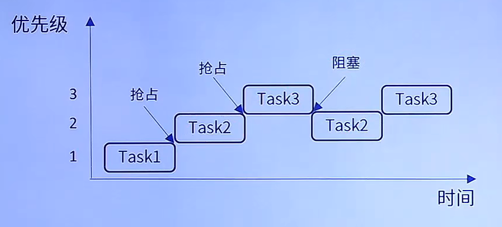
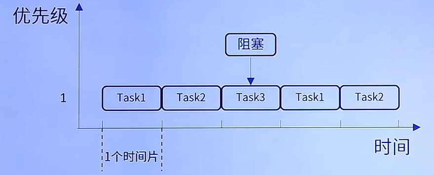
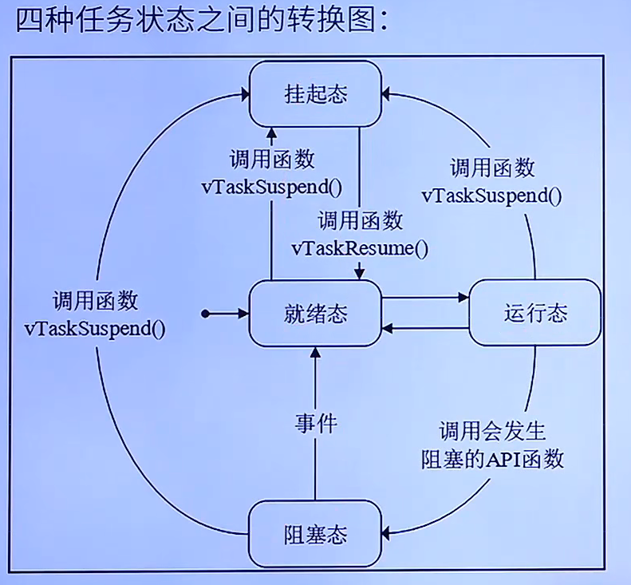

# FreeRTOS

## 1. 简介

**免费开源**

商业产品中使用，无潜在商业风险

**可裁剪**

核心代码 9000+ 行，包含在 3 个 .c 文件中

**优先级不限制**

任务优先级分配没有限制，多任务可同一优先级

**任务不限**

可创建的实时任务数量没有软件限制

## 2. 基础知识

### 2.1 任务调度简介

调度器就是使用相关的调度算法来决定当前需要执行的哪个任务
三种调度方式
* 抢占式调度，针对优先级不同的任务，每个任务都有一个优先级
* 时间片调度，针对优先级相同的任务，每一次系统节拍到的时候切换任务
* 协程式调度，当前执行的任务将会一直运行，同时高优先级的任务不会抢占低优先级的任务，该模式官方已经不再更新

**抢占式调度**

创建了 3 个任务，Task1-3 优先级为 1-3 ，当 Task1 在运行时，Task2 抢占了 Task1 的资源，Task1 进入就绪状态。此时 Task3 抢占了 Task2 的资源，Task2 进入就绪状态。Task3运行之后，进入了阻塞状态，释放了资源，就绪状态中 Task2 的优先级最高，所以 Task2 进入了运行状态。当 Task3 的阻塞解除，进入了就绪状态，此时 Task3 的优先级最高，因此 Task3 运行

**时间片调度**

同等优先级任务轮流地享有相同的 CPU 时间（可设置）叫做时S间片，在 FreeRTOS中，一个时间片等于 SysTick 中断周期

创建了 3 个任务 Task1-3 这些任务同等优先级，同等优先级任务轮流执行，当 Task1执行完毕后切换到 Task2 任务执行，然后切换到 Task3 任务执行。若此时 Task3 任务阻塞了 0.5ms（假设 SystemTick 为 1ms） 那么剩余的 0.5 ms 将丢弃（没有用完的时间片将不会再使用），也就是 CPU 不执行工作，而是切换到下一个任务执行，也即是 Task1

### 2.2 任务状态

共 4 种状态：

* 运行态，正在执行的任务，该任务就处于运行态，在 STM32 中，同一时间仅一个任务处于运行态
* 就绪态，如果该任务已经能够被执行，但是当前还未被执行，那么该任务处于就绪态
* 阻塞态，如果一个任务因延时或者等待外部事件发生，那么这个任务处于阻塞态
* 挂起态，类似暂停，调用函数 vTaskSuspend() 进入挂起态，使用解挂函数之后才开始进入就绪态

只有就绪态可以转变成运行态

除了运行态，其他的状态都有对应的任务状态列表

**就绪列表**

pxReadyTasksLists[x]，其中 x 代表任务优先级数值 0-31，调度器总是在所有处于就绪列表的任务中，选择具有最高优先级的任务来执行

**阻塞列表**

pxDelayedTaskList

**挂起列表**

xSuspendedTaskList

### 2.3 课堂总结

