# Qt Application

## 1. 在 Ubuntu 下编写 C++

### 1.1 C++ 简介

C++ （c plus plus） 是一种静态类型的、编译式的、通用的、大小写敏感的、不规则的编程语言，支持过程化编程、面向对象编程和泛型编程

### 1.2 C++ 环境设置

编译 C 语言使用 GCC

编译 C++ 使用 G++

### 1.3 编写一个简单的 C++ 程序

```cpp
#include <iostream>
using namespace std;
int main()
{
    cout << "hello world!! "<<endl;
    return 0;
}
```

```sh
g++ hello_world.cpp - o hello_world
```

## 2. C++ 基础

### 2.1 C++ 语言新特性

#### 2.1.1 C++ 的新特性

* C++ 比 C 语言新增的数据类型是布尔类型（bool）但是在新的 C 语言标准里已经有布尔类型了

* C++ 可以随时初始化变量（C 语言里只能在前面定义）

* C++ 可以直接初始化，如 `int x(100)`

* 还有很多特性等

### 2.2 C++ 的输入输出方式

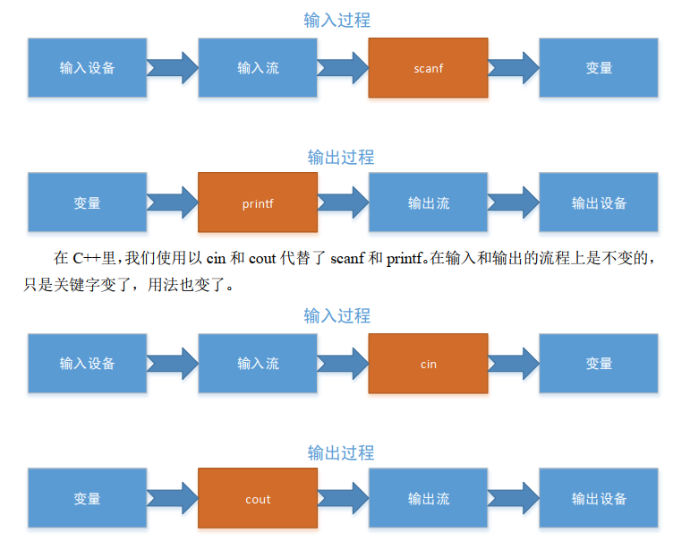

效率上 c 语言的更高，但是没有 C++ 的使用方便

### 2.3 C++ 命名空间

```cpp
#include <iostream>
using namespace std;
/*
注意第一行不要写成 <iostream.h> 有.h 的是非标准的输入输出流，c 的标准库，无 .h 的是标准输入输出流，就要使用命名空间
*/
```

其实 using 是编译指令，声明当前命名空间的关键词

**为什么使用命名空间**

有些名字容易冲突，所以会使用命名空间的方式进行区分，就是加个前缀的意思

命名的空间的示例：

```c
#include <iostream>
using namespace std;
namespace A
{
    int a = 1;
    void func()
    {
        cout << "this is A namespace" << endl;
    }
}

using namespace A;
int main()
{
    func();
    int a = 2;
    cout << "a = " << a << endl;
    cout << "A::a = " << A::a << endl;
    A::func();
    return 0;
}
```

```sh
out:

this is A namespace
a = 2
A::a = 1
this is A namespace
```

### 2.2 C++ 面向对象

#### 2.2.1 类和对象

不多说

##### 2.2.1.1 构造函数和析构函数

```cpp
class Dog
{
public:  
    Dog();
    ~Dog();
};
```

##### 2.2.1.2 this 指针

* this 只能在成员函数中使用，全局函数和静态函数都不能使用 this，事实上，成员函数默认第一个参数为 `T*const this`，也就是一个类里面的成员函数 `int func(int p)` `func` 的原型在编译器看来应该是 `int func(T*const this, int p)`
* this 在成员函数的开始前构造，在成员函数的结束后清除
* this  指针会因编译器不同而有不同的放置位置，可能是栈，也可能是寄存器，甚至全局变量

#### 2.2.2 继承

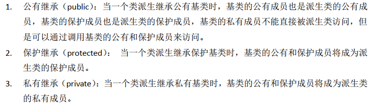

#### 2.2.3 重载

当调用一个重载函数或者重载运算符时，编译器通过把所使用的参数类型与定义中的参数类型进行比较，选出最合适的定义（这个过程为重载决策）

##### 2.2.3.1 函数重载

```cpp
void getWeight(int weight)
{
    
}
void getWeight(double weight)
{
    
}
```

##### 2.2.3.2 运算符重载

```cpp
<返回类型说明符>operator<运算符符号>(<参数列表>)
{
    <函数体>
}
```

可重载的运算符

| 运算符类型     | 具体                                                         |
| -------------- | ------------------------------------------------------------ |
| 双目算术运算符 | + (加)， -(减)， *(乘)， /(除)， % (取模)                    |
| 关系运算符     | ==(等于)， != (不等于)， < (小于)， > (大于)， <=(小于等于)， >=(大于等于) |
| 逻辑运算符     | \|\|(逻辑或)， &&(逻辑与)， !(逻辑非)                        |
| 单目运算符     | + (正)， -(负)， *(指针)， &(取地址)                         |
| 自增自减运算符 | ++(自增)， --(自减）                                         |
| 位运算符       | \| (按位或)， & (按位与)， ~(按位取反)， ^(按位异或)， << (左移)， >>(右移） |
| 赋值运算符     | =, +=, -=, *=, /= , % = , &=,                                |
| 空间申请与释放 | new, delete, new[ ] , delete[]                               |
| 其他运算符     | ()(函数调用)， ->(成员访问)， ,(逗号)， \[](下标)            |

重载示例：

```cpp
Dog operator+(Dog &d)
{
    
}
```

### 2.2.4 多态

调用成员函数时，会根据调用对象的类型来执行不同的函数

形成多态必须要满足的三个条件

* 存在继承关系
* 继承关系必须有同名的虚函数（virtual 声明的函数）
* 存在基类类型的指针或者引用，通过该指针或引用调用虚函数

```cpp
#include <iostream>
using namespace std;

class Animal
{
public:
    Animal()
    {
        cout << "animal construct func" << endl;
    }
    ~Animal()
    {
        cout << "animal destroy func" << endl;
    }
    virtual void eat()
    {
        cout << "animal is eatting" << endl;
    }
};

class Dog : public Animal
{
public:
    void eat()
    {
        cout << "dog is eatting" << endl;
    }
};

int main()
{
    Animal *dog = new Dog();
    dog->eat();
    return 0;
}
```

**虚函数**

```cpp
virtual func()
{
    
}
```

在派生类中重新定义基类中的虚函数时，编译器不会将其静态链接到该函数（而是使用动态链接，在程序中根据调用该成员的对象来执行函数）

> 虚函数必须要实现，不实现编译器报错

**纯虚函数**

包含纯虚函数的类叫做抽象类，不能实例化对象

```cpp
virtual func() = 0;
```

> 纯虚函数一定没有定义，用来规范派生类的行为，也就是接口

虚函数是 C++ 中用于实现多态的机制，核心理念就是通过基类访问派生类定义的函数

### 2.2.5 数据封装

数据封装引申了另一个重要的 OOP 概念，叫做数据隐藏

数据封装是一种把数据和操作数据的函数捆绑在一起的机制，数据抽象是一种仅向用户暴露接口而把具体的实现细节隐藏起来的机制

* 就是 private 数据，提供接口访问该数据（get、set）

### 2.2.6 数据抽象

隐藏函数的细节，提供必要的信息接口

### 2.2.7 接口（抽象类）

C++ 接口是使用抽象类来实现的，设计抽象类的目的，是为了给其他类提供一个可以继承的适当的基类

## 3. 初识 Qt

### 3.1 Qt 是什么

Qt 是一个跨平台的 C++ 开发库，主要用来开发图形用户界面

#### 3.1.1 Qt 与 Qt Creator 的关系

...

#### 3.1.2 Qt 能做什么

...

#### 3.1.3 Qt/C++ 与 QML

Qt C++在底层编写功能更突出，若要做好看的界面且功能强大， Qt C++与 QML 语言结合是必不可少的。 QML 语言负责界面层，而底层调用 Qt C++。 比如文件的读写、图像处理、多线程通信等这些都是需要 C++来编写完成的

### 3.2 如何选择 Qt 版本

先用 Qt5 等用得多了再转 Qt6

### 3.3 Window 下安装 Qt

...

### 3.4 Linux 下安装 Qt

#### 3.4.1 安装 Qt

...

### 3.5 Qt Creator 简单使用

...

### 3.6 第一个 Qt 程序

#### 3.6.1 新建项目

...

## 4. 使用 Qt Designer 开发

..

## 5. 信号与槽

### 5.1 信号与槽机制

```cpp
QObject::connect(sender,SIGNAL(signal()), receiver, SLOT(slot()));
```

跳过。。。

## 6-7. 跳过

## 8. 文本读写

### 8.1 QFile 读写文本

QFile 类提供了读取和写入文件的接口

QFile::open()函数打开文件时需要传递 QIODevice::OpenModeFlag 枚举类型的参数

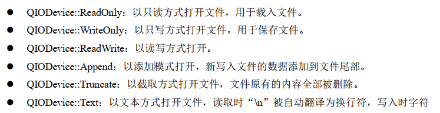

打开文件：  

```cpp
bool MainWindow::openFile()
{
    /* 获取文件的路径 */
    QString fileName = QFileDialog::getOpenFileName(this);
    /* 指向文件 */
    file.setFileName(fileName);
    /* 判断文件是否存在 */
    if (!file.exists())
        return false;
    /* 以读写的方式打开 */
    if (!file.open(QIODevice::ReadOnly | QIODevice::Text))
        return false;
    /* 读取文本到 textEdit */
    textEdit->setPlainText(file.readAll());
    /* 设置打开按钮不可用，需要关闭再打开 */
    openPushButton->setEnabled(false);
    /* 设置关闭按钮为可用属性 */
    closePushButton->setEnabled(true);
    /* 关闭文件 */
    file.close();
    return true;
}
```

关闭文件：

```c
void MainWindow::closeFile()
{
    /* 检测打开按钮是否可用，不可用时，说明已经打开了文件 */
    if (!openPushButton->isEnabled()) {
        /* 获取 textEdit 的文本内容 */
        QString str = textEdit->toPlainText();
        /* 以只读的方式打开 */
        if (!file.open(QIODevice::WriteOnly | QIODevice::Text))
            return;
        /* 转换为字节数组 */
        QByteArray strBytes = str.toUtf8();
        /* 写入文件 */
        file.write(strBytes, strBytes.length());
        /* 清空 textEdit 的显示内容 */
        textEdit->clear();
        /* 关闭文件 */
        file.close();
        /* 重新设置打开和关闭按钮的属性 */
        openPushButton->setEnabled(true);
        closePushButton->setEnabled(false);
    }
}
```

### 8.2 QTextStream 读写文本

QTextStream 类为读写文本提供了一个方便的接口，常与 QFile 结合使用

```cpp
/* 使用文本流读取文件 */
QTextStream stream(&file);
/* 读取文本到 textEdit */
textEdit->setPlainText(stream.readAll());

/* 用文本流读取文件 */
QTextStream stream(&file);
/* 获取 textEdit 的文本内容，转为字符串 */
QString str = textEdit->toPlainText();
/* 使用流提取运算符，写入文本流 */
stream<<str;
```

## 9. 绘图与图表

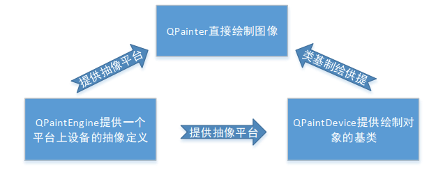

paintEvent 事件，在构造对象实例化时执行，使用 update 方法执行 paintEvent 事件

该 paintEvent 方法是父类给子类提供的接口，父类定义为空，子类去实现

```cpp
void Widget::paintEvent(QPaintEvent *)
{
    /* 指定画图的对象， this 代表是本 Widget */
    QPainter painter(this);
    // 使用 painter 在对象上绘图...
}
```

使用实例：

```cpp
void MainWindow::paintEvent(QPaintEvent *)
{
    qDebug()<<"paint"<<endl;
    /* 绘画 */
    QPainter painter(this);
    /* 设置抗锯齿 */
    painter.setRenderHints(QPainter::Antialiasing|QPainter::SmoothPixmapTransform);
    /* 计算旋转角度 */
    if(angle++ == 360)
        angle = 0;

    /* 新建一个 pixmap */
    QPixmap image;
    if(!image.load("/home/xggui/Qt_projs/imgs/huachengxingzi.png"))
        qDebug()<<"image load fail!!"<<endl;


    QRectF rect((this->width() - image.width()) / 2,
                (this->height() - image.height()) / 2,
                image.width(),
                image.height());
    // 移动图形的坐标系为窗口中点
    painter.translate(0 + rect.x() + rect.width() / 2,
                      0 + rect.y() + rect.height() / 2);
    // 围绕窗口中点进行旋转
    painter.rotate(angle);
    // 移动图形的坐标系为窗口原点
    painter.translate(0 - (rect.x() + rect.width() / 2),
                      0 - (rect.y() + rect.height() / 2));
    /* 画图,QPainter 提供了许多 drawX 的方法 */
    painter.drawImage(rect, image.toImage(), image.rect());
    /* 再画一个矩形 */
    painter.drawRect(rect.toRect());

}

void MainWindow::timerTimeOut()
{
    // qDebug()<<"update"<<endl;
    this->update();
}
```

### 9.2 QChart 图表

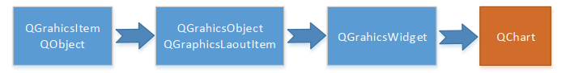

qtCreator 中使用 ctrl shift t 查看继承关系

* 添加模块

```cpp
QT += charts
```

* 添加头文件

```cpp
#include <QChartView>
```

* 使用命名空间

```cPP
using namespace QtCharts;
```

## 10. 多线程

QThread 类提供了一种独立于平台的方法来管理线程

两种启动多线程的方式

* 继承 QThread 的 run 函数
* 把继承于 QObject 的类转移到一个 Thread 里

### 10.1 继承 QThread 的线程

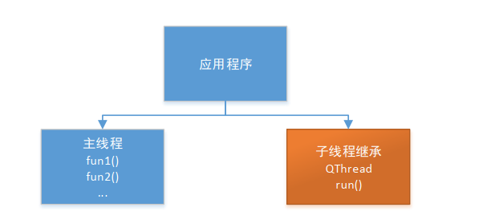

#### 10.1.1 实例

```cpp
class WorkerThread : public QThread
{
    // 使用信号曹必备
    Q_OBJECT
public:
    WorkerThread(QWidget *parent = nullptr)
    {
        Q_UNUSED(parent);
    }
    void run() override
    {
        QString result = "线程开启成功";
        qDebug()<<QThread::currentThreadId()<<endl;
        sleep(2);
        emit resultReady(result);
    }

signals:
    void resultReady(const QString &s);

};

void MainWindow::slot_pushButtonClicked()
{
    /* 检查线程是否在运行，如果没有则开始运行 */
    if (!workerThread->isRunning())
    workerThread->start();
}

MainWindow::~MainWindow()
{
    /* 进程退出，注意本例 run()方法没写循环，此方法需要有循环才生效 */
    workerThread->quit();
    /* 阻塞等待 2000ms 检查一次进程是否已经退出 */
    if (workerThread->wait(2000)) {
        qDebug()<<"线程已经结束！ "<<endl;
    }
    delete ui;
}
```

### 10.2 继承 QObject 的线程

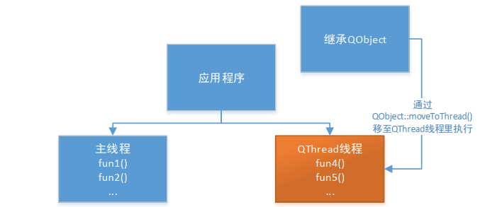

## 11. 网络编程

Qt 网络为我们提供了编写 TCP / IP 客户端和服务器的类

> 它提供了较低级别的类，例
> 如代表低级网络概念的 QTcpSocket， QTcpServer 和 QUdpSocket，以及诸如 QNetworkRequest，QNetworkReply 和 QNetworkAccessManager 之类的高级类来执行使用通用协议的网络操作

* 添加模块

```cpp
QT += network
```

### 11.1 获取本机的网络信息

就像在 cmd 中使用 ifconfig 一样，打印网络信息

Qt 提供了 QHostInfo 和 QNetworkInterface 类可以用于此类信息查询

```cpp
QString MainWindow::getHostInfo()
{
    /* 通过 QHostInfo 的 localHostName 获取主机名称 */
    QString str = "主机名称：" + QHostInfo::localHostName() + "\n";
    /* QNetworkInterface 类提供主机的 IP 地址和网络接口的列表 */
    QList<QNetworkInterface> list = QNetworkInterface::allInterfaces();

    foreach(QNetworkInterface interface, list)
    {
        str += "-----------------------\n";
        str += "网卡设备："+ interface.name() +"\n";
        str += "MAC地址："+ interface.hardwareAddress()+ "\n";
        QList<QNetworkAddressEntry> entryList = interface.addressEntries();

        foreach(QNetworkAddressEntry entry, entryList)
        {
            /* 过滤掉 IPV6 */
            if(entry.ip().protocol() == QAbstractSocket::IPv4Protocol)
            {
                str += "IP 地址："+entry.ip().toString() + "\n";
                str += "子网掩码："+entry.netmask().toString() + "\n";
                str += "广播地址："+entry.broadcast().toString() + "\n";
            }

        }


    }
    return str;
}
```

### 11.2 TCP 通信

#### 11.2.1 TCP 简介

TCP 全称为传输控制协议，是一种面向连接，可靠，基于字节流的传输层通信协议

* TCP 通信必须先建立连接，分为客户端和服务端
* 服务端通过监听某个端口来监听是否有客户端连接到来，如果有则建立新的 socket 连接，客户端通过 ip 和 port 连接服务器端，成功建立连接之后，就可以进行数据的收发了（数据收发通过 read 和 write 进行实现）
* 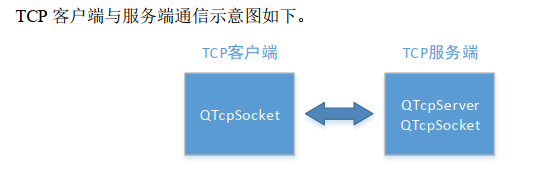

#### 11.2.2 TCP 服务端应用实例

开启监听：

```cpp
/* 开始监听 */
void Widget::slot_startListen()
{
    // 判断当前主机是否有 ip
    if(comboBox->currentIndex()!=-1)
    {
        qDebug()<<"start listen!"<<endl;
        /* 监听 */
        tcpServer->listen(IP_list[comboBox->currentIndex()],spinBox->value());
        // 设置按钮和下拉列表的状态
        btn_start_listen->setEnabled(false);
        btn_stop_listen->setEnabled(true);
        comboBox->setEnabled(false);
        spinBox->setEnabled(false);

        // 显示服务器信息
        textBrowser->append("服务器 ip ："+comboBox->currentText());
        textBrowser->append("正在监听端口："+spinBox->text());

    }
}
```

关闭监听：

```cpp
/* 停止监听 */
void Widget::slot_stopListen()
{
    qDebug()<<"stop listen!"<<endl;
    /* 关闭 */
    tcpServer->close();

    // 断开套接字
    if(tcpSocket->state() == tcpSocket->ConnectedState)
        tcpSocket->disconnectFromHost();

    // 设置按钮和下拉列表的状态
    btn_start_listen->setEnabled(true);
    btn_stop_listen->setEnabled(false);
    comboBox->setEnabled(true);
    spinBox->setEnabled(true);

    // 显示服务器信息
    textBrowser->append("已停止监听："+spinBox->text());
}
```

当开启监听的时候，只要有客户端连接到服务器，就会收到 newConnection 信号

#### 11.2.3 TCP 客户端应用实例

首先获取本地 IP 地址，船舰 tcpSocket 套接字，然后使用 connectToHost 连接服务端的主机 IP 地址和端口

### 11.3 UDP 通信

在发送聊天消息时，通常使用 udp 但是为了保证传输文件的可靠，一般就使用 tcp

QUdpSocket 类提供了一个 UDP 套接字，QUdpSocket 是 QAbstractSocket 的子类，允许发送和接收 UDP 数据报，使用该类最常见的方法就是使用 bind 绑定到一个地址和端口然后调用 writeDatagram 和 readDatagram / receiveDatagram 来传输数据

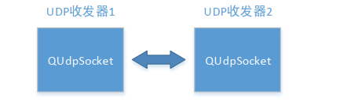

三种传送模式传送：单播，广播，组播

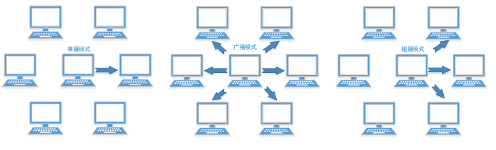

#### 11.3.2 UDP 单播与广播

广播与单播的区别就是 IP 地址不同，所以我们的实例可以写成一个

#### 11.3.2.1 应用实例

测试的话，就打开 2 个程序，然后调到统一组播 ip 和端口，然后两个本地 ip 之间就能通信了

## 12. 多媒体

### 12.1 Qt 多媒体简介

Qt 多媒体模块提供了很多类， 主要有 QMediaPlayer， QSound、 QSoundEffect、 QAudioOutput、QAudioInput、 QAudioRecorder、 QVideoWidget 等

* 添加模块

```cpp
QT += multimedia
```

* ubuntu 16/18 需要安装以下插件

```sh
sudo apt-get install gstreamer1.0-plugins-base gstreamer1.0-plugins-bad gstreamer1.0-plugins-good gstreamer1.0-plugins-ugly gstreamer1.0-pulseaudio gstreamer1.0-libav
```

### 12.2 音效文件播放

```cpp
void MainWindow::slot_clicked_btn()
{
    /* 使用 QSound 来解析 .wav 文件音效*/
    QSound::play("/home/xggui/Qt_projs/10_button_sound/sound.wav");
}
```

### 12.3 音乐播放器

QMediaPlayer 类是一个高级媒体播放类。它可以用来播放歌曲、电影和网络广播等内容。一般用于播放 mp3 和 mp4 等等媒体文件

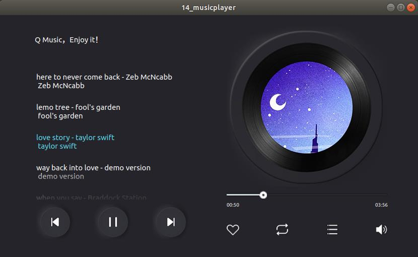

用到两个关键类：

* QMediaPlayer
* QMediaPlaylist

### 12.4 视频播放器

和音乐播放器一样使用 QMediaPlayer 类，但是需要使用 setVideoOutput(QVideoWidget*) 设置一个视频输出窗口，其他步骤都一样

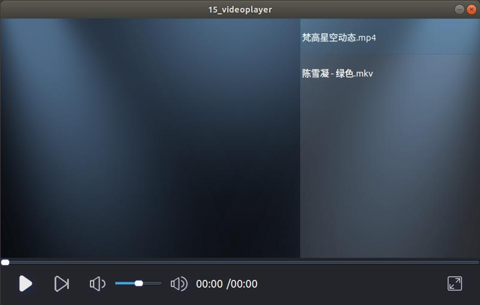

* 添加模块 multimediawidgets

```cpp
/* 媒体播放器初始化 */
void MainWindow::mediaPlayerInit()
{
    videoPlayer = new QMediaPlayer(this);
    mediaPlaylist = new QMediaPlaylist(this);

    mediaPlaylist->clear();
    videoPlayer->setPlaylist(mediaPlaylist); // 设置播放列表
    videoPlayer->setVideoOutput(videoWidget); /* 关键，设置媒体窗口 */
    mediaPlaylist->setPlaybackMode(QMediaPlaylist::Loop);
    videoPlayer->setVolume(50);

}
```

### 12.5 录音

提供了 QAudioRecorder 类录制音频，继承于 QmediaRecorder 类，音频输入可以使用 QAudioRecorder 或者 QAudioInput 类实现

* 添加模块

```cpp
QT += multimedia
```

由于需要板子上的声卡，mini 板没有声卡，所以不测试了，可以看看代码

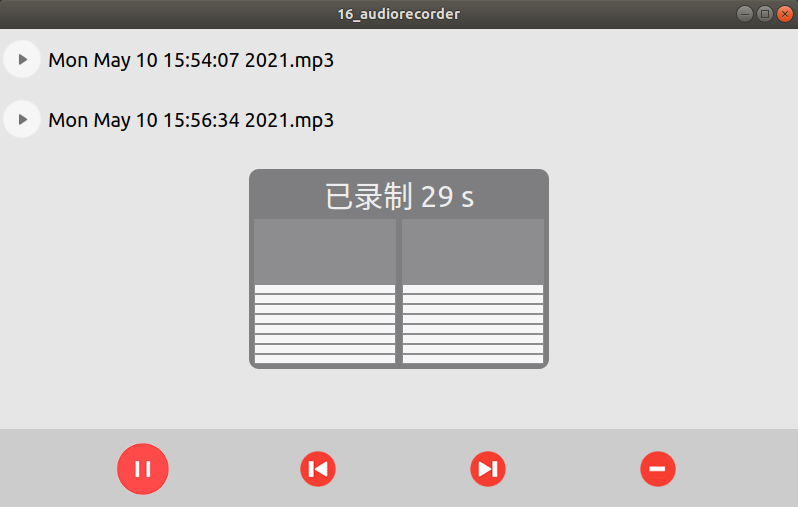

## 13. 数据库

* 添加模块

```cp
QT +=core gui sql
```

### 13.1 Qt SQL 简介

Qt SQL 模块为数据库提供了编程支持， Qt 支持很多种常见的数据库，如 MySQL、Oracle、MS SQL Server、 SQLite 等  

在嵌入式里，一般常用的数据库就是 Sqlite3，这个数据库是轻量级的，是一个进程内的库，不是独立的进程

> 在 QSqlDatabase 连接数据库后，用 QSqlTableModel 从数据库里读取出表格模型，然后通过 Qt 的 QTableView 类显示数据库的内容在我们面前  

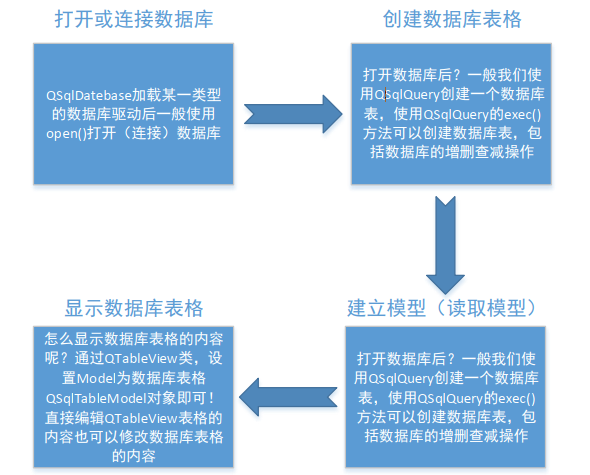

> 执行程序之后会在当前执行文件的目录下创建 alarm.db 文件

### 13.2 实用闹钟

* 主要类

```cpp
 /* 数据库连接类 */               
 QSqlDatabase sqlDatabase;  
 /* 数据库操作模型 */              
 QSqlTableModel *model;     
```

数据库的创建

```cpp
/* 查看本机可用的数据库驱动 */                                     
QStringList drivers = QSqlDatabase::drivers();         
foreach(QString driver, drivers)                       
{                                                      
    qDebug()<<driver;                                  
}                                                      
/* 以QSQLITE 驱动方式打开或者创建数据库 */                           
sqlDatabase = QSqlDatabase::addDatabase("QSQLITE");    
sqlDatabase.setDatabaseName("alarm.db");               
                                                       
/* 以 open 的方式打开 alarm.db 数据库，则会创建一个 alarm.db */        
if(!sqlDatabase.open())                                
    qDebug()<<"连接数据库失败"<<endl;                         
else                                                   
    qDebug()<<"连接数据库成功"<<endl;                         
                                                       
/* 要执行数据库指令则要创建 query 对象 */                            
QSqlQuery query(sqlDatabase);                          
/* 使用指令创建表 */                                          
query.exec("create table alarm"                        
           "(id int primary key, "                     
           "time vchar(15), "                          
           "flag vchar(5))");                          
model = new QSqlTableModel(this,sqlDatabase);          
/* 模型设置表的名字，需要与数据库的表的名字相同 */                           
model->setTable("alarm");                              
/* 设置为: 如果有修改则同步修改到数据库 */                              
model->setEditStrategy(QSqlTableModel::OnFieldChange); 
model->select(); // 用于判断是否存在表                          
```

数据库执行操作

```cpp
// 如果表为空                                                      
if(model->rowCount() == 0)                                    
{                                                             
    // 插入一行                                                   
    model->insertRow(model->rowCount());                      
    // 在该行插入数据                                                
    model->setData(model->index(0,0),1);                      
    model->setData(model->index(0,1),"06:00");                
    model->setData(model->index(0,2),"false");                
    // 提交表                                                    
    model->submit();                                                                                         
    // 插入一行                                                   
    model->insertRow(model->rowCount());                      
    // 在该行插入数据                                                
    model->setData(model->index(1,0),2);                      
    model->setData(model->index(1,1),"18:00");                
    model->setData(model->index(1,2),"true");                 
    // 提交表                                                 
    model->submit();                                    
}                                                             
// 或者用指令插入数据                                               
//query.exec("insert into alarm values(0, '06:00', 'false')");

/* 删除数据库整一行数据 */                           
model->removeRow(listWidget->currentRow());
model->submit();                           
```

关闭数据库

```cpp
MainWindow::~MainWindow()
{
    delete ui;
    /* 关闭数据库 */
    sqlDatabase.close();
}
```

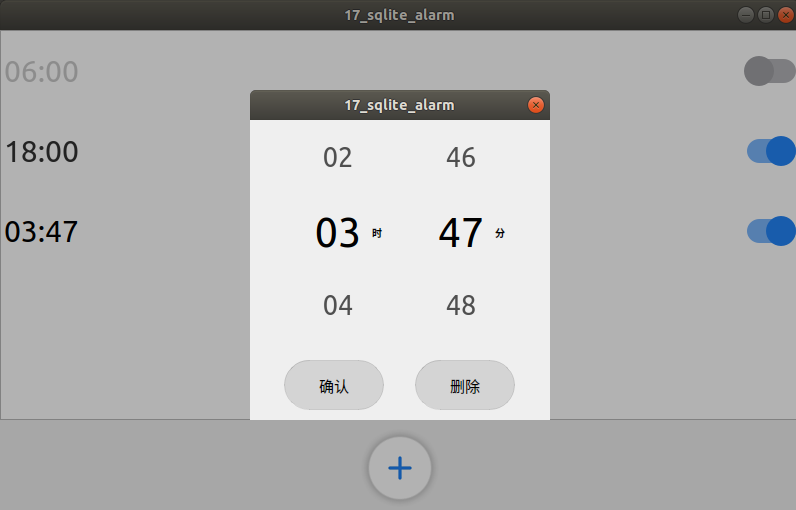

### 13.3 数据库表格

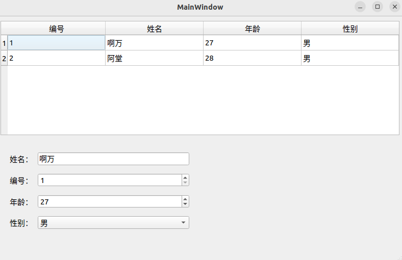

## 14. I.MX6U Qt开发

### 14.1 使用命令行编译

在 unbunt 上交叉编译好程序，然后拷贝到板子上运行

### 14.2 在 Qt Creator 搭建交叉编译环境

使用远程连接开发板进行调试

## 15. Qt 控制 LED

采用 QFile 读取系统中的 `/sys/devices/platform/leds/leds/sys-led/brightness` 文件，往里面写入 0 或者 1 实现对 led 的控制，使用 system 函数实现在系统上执行脚本语言

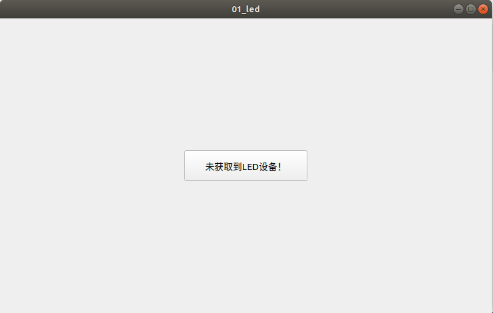

## 16. Qt 控制 BEEP

和上一个项目差不多，只是写入和读取的文件不一样而已

## 17. Serial Port

Qt 提供了串口类，可以直接对串口进行访问

### 17.1 资源简介

板子里默认配置了两路串口可以使用，一路是调试串口 UART1（对应节点 /dev/ttymxc0）另外一路是 UART3（对应节点 /dev/ttymxc2）我们对这一路进行编程

### 17.2 串口助手应用实例

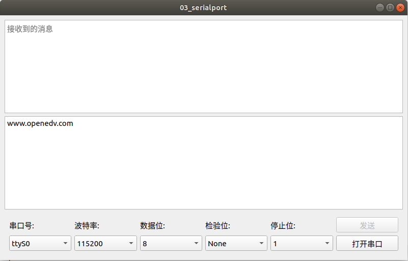

