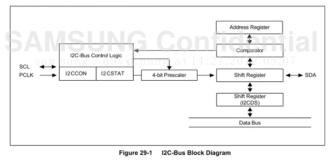

## 一、UART

### 1.1 UART 帧格式讲解

通用异步收发器，**串行**，**异步**通信，两条数据线，可实现**全双工**的发送和接受

* 波特率：每秒传送的 bit 数量


> 为什么叫异步呢？
>
> 因为发送端和接受端各自恰着自己的时钟来对信号进行时分

> 为什么帧最多就传送 8 位？
>
> 因为是异步通信，会有一个累计误差，当累计误差达到一定程度就会导致后面的信号全部错位，短的帧更有利于减少误差带来的后果

> UART 从低位开始发送，比如要发送 101011 则发送顺序为 110101

### 1.2 硬件控制器


有用的就两个口 RXD 和 TXD


由于 COM3 的电平太小，容易受干扰，所以要接上 SP3232 来放大电压，实现更远的信号传送

**设置引脚功能的本质**

让引脚在芯片内部链接到某一个对应的控制器上


**寄存器的设置**


**串口控制器的工作逻辑**

```
The Baud-rate generator uses SCLK_UART.The transmitter and the receiver contain FIFOs and data shifters.The data to be transmitted is written to Tx FIFO, and copied to the transmit shifter. The data is then shifted out bythe transmit data pin (TxDn). The received data is shifted from the receive data pin (RxDn), and copied to Rx FIFOfrom the shifter.

移位器把队列缓冲区的数据拷贝走，然后加上起始位，停止校验位等，从 TX 引脚发送出去
```


### 1.3 UART 寄存器详解


**ULCONn**


设置帧的格式（红外模式，普通模式，校验位，停止位，数据长度）

**UCONn**


主要是设置发送模式和接受模式

* 轮询模式

cpu 每过一段时间就去查看缓冲队列里有没有数据，如果有则进行拷贝等操作

* 中断模式

当有新数据产生，则向 cpu 发送中断，然后 cpu 再对缓存队列进行拷贝等操作

* DMA 模式

直接将数据放到指定的内存当中

**UTRSTAT**

串口通信时的一些状态寄存器（判断串口是否发送完成等）

**UTXHn & URXHn**


将发送的数据写到这个寄存器，发送器会将该数据发送出去 

**UBRDIVn & UFRACVALn**


设置波特率分频值寄存器（小数部分和整数部分）

### 1.4 UART 大致流程

```c
void UART_Send_Byte(char dat)
{
    /* 将要发送的数据写入发送寄存器 UTXH2 */
    while(!(UART2.UTRStAT2 & (1 << 1))); // 读取状态寄存器
    UART2.UTXH2 = dat;    
}

char UART_Rec_Byte(void)
{
    char dat = 0;
    /* 判断是否接受到了数据 */
    if(UART2.UTRSTAT2 & (1 << 0)){
        dat = UART2.URXH2;
        return dat;
    }else{
        return 0;
    }
}

void UART_Init()
{
    /* 将 GPA1_0 和 GPA1_1 分别复用成 UART2 的接受和发送引脚 GPA1CON[7:0] */
    GPA1.CON = GPA1.CON & (~(0xff << 0)) | (0x22 << 0);
    /* 设置帧格式 ULCON2 8 位数据 1 位停止位 无校验 正常模式 */
    UART2.ULCON2 = UART2.ULCON2 & (~(0x7f) << 0) | (0x3 << 0);
    /* 设置 UART2 的接受和发送模式为轮询模式 UCON2[3:0] */
    UART2.UCON2 = UART2.UCON2 & (~(0xf) << 0) | (0x5 << 0);
    /* 设置 UART2 的波特率为 115200 UBRDIV2/UFRACVAL2 */
    UART2.UBRDIV2 = 53;
    UART2.UFRACVAL2 = 4;    
}

int main()
{
    char RecDat = 0;
	UART_Init();
    while(1){
		RecDat = UART_Rec_byte();
        if(!RecDat){
            
        }else{
            RecDat ++;
            UART_Send_byte(RecDat);
        }
    }
    return 0;
}
```

### 1.5 输入输出重定向

将输出重定向到串口（linux 中调用 c 库的 printf 函数可以将输出重定向到显卡然后在屏幕显示）

```c
void UART_Send_Str(char * pstr)
{
    while(*pstr != '\0')
	    UART_Send_Byte(*pstr++);
}

int main()
{
	UART_Init();
    while(1){
		UART_Send_Str("hello world\n\r");
    }
    return 0;
}
```

* linux 中的用法

```c
ls > a.txt
```

## 二、RS232、RS485 协议原理与应用

**串口存在的问题**

* 电气接口不统一

只是对信号的时序进行了定义，未定义接口的电气特性（高电平表示1，但是多少伏不知道，没有统一标准）

* 抗干扰能力差

使用 TTL 表示 0 和 1 ，在传输过程中容易出错

* 通信距离极短

因为抗干扰能力差，所以其通信距离也很短

**RS232 协议**

串口的一种标准（一般只用 RXD TXD GND）

* 接口统一（左边 232 右边 485）


* 信号统一

规定 '1' 为 -5 ~ -15，规定 '0' 为 +5 ~ +15，电平高，传输距离能达到 15 m

**232 的电平转换**


将 TTL 转成 232 信号，然后从 com 发出，或将 com 得到的 232 信号转成 TTL 给芯片

**232 存在的问题**


**RS485 协议**

与 232 相比，具有多站能力，可以组成局域网多对多通信。传输距离长(1500m)，抗噪声能力大，接口信号电平比 232 低，不易损坏接口


* 接口统一


* 信号统一

采用差分信号进行数据传输，两线间信号差 +2 到 +6 表示 1；-2 到 -6 表示 0

**485 的电平转换**


**485 的问题**

采用两线制，所以发送和接受都采用这两根线，只能采用**半双工**的方式工作,写代码的时候就要做出相应改变

## 三、IIC

### 3.1 IIC 总线概述

串行，半双工，近距离，低速，两根线，SDA 用于收发数据，SCL 用于同通信时钟

**IIC 总线协议**


这么多机器分为主机和从机，主机有权发起和结束一次通信，从机只能被动呼叫。每个连接到 IIC 总线上的器件都有一个唯一的地址（7bit）每个器件都能作为主机和从机（同一时间只能有一个主机）

**IIC 总线的通信过程**


这里从机的地址是 7 位，一个字节 8 位，所以最后一位是后续字节数据的传送方向。（注意，这里后续字节的数据的传送方向会重新决定主机和从机）

* 若为 0 表示主 -> 从
* 若为 1 表示 从 -> 主

发送器发送一个字节的数据（这里可以是从机发送或者主机发送，取决于 0 或者 1）接收器也是同理。

```txt
主机在发送起始信号后，必须先发送一个字节的数据，数据的高7位是从机的地址，最后一位是后续字节的传送方向，其中 0 表示主机发送数据（主机为发送器），1 表示从机发送数据（从机为发送器），总线上所有的从机接受到该字节数据后将高7位地址与字节的地址进行比较，如果相同则认为自己被主机寻址，最后再根据最后一位确定自己是发送器还是接受器。
```

### 3.2 IIC 总线信号实现

空闲时，两条线为高电平

**起始信号和停止信号**

* SCL 为高电平时，SDA由高变低表示起始信号
* SCL 为高电平时，SDA由低变高表示停止信号

起始信号和停止信号由主机发出，起始信号产生后总线处于占用状态，停止信号发出后总线处于空闲状态

**字节传送与应答**

通信时每个字节为 8 位，发送顺序是从高到低（UART 是从低位到高位）发送器发送完一个字节后接收器必须发送 1 位应答位来回应发送器


**同步信号**

首先所有的设备都是链接在同一条时钟线上的，也就是说所有的设备的时钟都是同步的。当时钟为低位时，发送器向总线上发送一位数据，在此期间数据线上的信号允许发生变化；当时钟为高位时，接收器从数据线上读取一位数据，在此期间数据线上的数据不允许发生变化，必须保持稳定


### 3.3 典型 IIC 时序


这里主机想要发起下一次的开始信号之前，并没有发送停止信号释放总线（防止被其他主机占用）


### 3.4 Exynos4412 下的 IIC 控制器

**特点**


**工作逻辑**



* 将数据放到 I2CDS 寄存器中，然后会将 I2CDS 寄存器中的数据拷贝到移位寄存器中，然后移位寄存器通过 SDA 数据总线把数据发送出去。
* 作为从机时，把地址放到 Address 寄存器，并比较

**程序编写流程图**

主机发送模式：


```c
解释：
    首先配置寄存器为 Master Yx 模式，将从机的地址写入 I2CDS 寄存器中，然后写下 0xF0 到 I2CSTAT 寄存器中，表示开始信号的产生。  
    然后 I2CDS 的数据被发送（地址），等待得到应答之前，中断挂起。
    如果收到应答，可以选择是否停止，如果不停止，则继续将数据写到 I2CDS ，清除应答位，然后数据发送出去，然后等待应答。得到应答之后，如果要停止，则写下 0xD0 到 I2CSTAT 表示停止信号产生，然后清除应答位，等待停止即可。
```

主机接收模式：


```c
解释：
    前面的步骤和上面一样，发送从机地址，建立连接。
    如果不停止，则直接往 I2CDS 中读取数据，这个数据是从机发过来的。读完之后清除挂起位，这时又有数据从 SDA 总线中传送到 I2CDS 寄存器里。然后中断挂起。
    如果要停止，则写 0x90 到 I2CSTAT 中，并清除挂起位，等待结束。
```

从机发送模式：


从机接收模式：


### 3.5 IIC 寄存器详解

**寄存器总览**


最后一个不常用，应用于滤波器和延时相关的。

**I2CCONn**


**I2CSTATn**


**I2CADDn**


**I2CDSn**


### 3.6 MPU6050 原理

MPU6050 是一个运动处理传感器，内部集成了 3 轴加速度传感器和 3 轴陀螺仪（角速度传感器），以及一个可扩展数字运动处理器

**主要参数**


**通信接口**

可以使用 IIC 总线和其他器件进行数据交互。


### 3.7 MPU6050 寄存器读写时序

MPU6050 在 IIC 通信中是作为从机使用的。


读有两步，需要先写，告诉 mpu6050 要读什么，然后再读，mpu6050 写

## 四、SPI 总线

**连接过程**


**通信过程**

先传送高位，再传送低位。高电平为 1 ，低电平为 0 。接收方无需应答。

SPI 下降沿发送数据，上升沿接收数据

**极性 CPOL 和相位 CPHA**

CPOL 表示 SCLK 空闲时的状态：

* CPOL = 0 空闲时 SCLK 为低电平
* CPOL = 1 空闲时 SCLK 为高电平

CPHA 表示采样时刻：

* CPHA = 0 每个周期的第一个时钟沿采样
* CPHA = 1 每个周期的第二个时钟沿采样


**IIC 和 SPI 的异同**

相同点：

* 均采用串行、同步的方式
* 均采用 TTL 电平，传输距离和应用场景类似
* 均采用主从方式工作

不同点：

* IIC 为半双工，SPI 为全双工
* IIC 有应答机制，SPI 无应答机制
* IIC 通过向总线广播从机地址来寻址，SPI通过向对应从机发送片选信号
* IIC 的时钟极性和时钟相位固定， SPI 的时钟极性和时钟相位可改变

## 五、网络编程

### 5.1 网络模型与协议介绍

**OSI 七层模型与 TCP/IP 四层模型：**


OIS 七层模型：”物数网传会表应“

TCP/IP 四层模型

应用层：http、ftp、nfs、ssh、telnet ...

传输层：TCP、UDP

网络层：IP、ICMP、IGMP

链路层：以太网帧协议、ARP、MAC 帧

**以太网帧和 ARP 请求：**

网络传输过程：

数据没有封装之前是不能在网络上传输的

ARP协议：

通过 IP 地址获取 MAC 地址

以太网帧协议：

根据 mac 地址寻找下一跳的位置，从而完成数据包传输，

**IP 协议（网络层）：**


版本：IPv4、IPv6

TTL：time to live 设置数据包在路由节点中的跳转上限，每经过一个节点该值 -1 当减为 0 时，路由有义务将该数据报丢弃

源 IP 和目的 IP：32位	192.168.1.108 点分十进制 IP 地址（string）--计算机看是二进制来看的

**TCP 协议（传输层）：**


16位：源端口号

16位：目的端口号

32 序号

32 确认序号

6 标志位

16 窗口大小 2^16 = 65535

**C/S 模型和 B/S 模型：**

* client-server

优点：缓存大量数据（客户端内带大量数据），协议选择上灵活（可以自定义协议），速度快

缺点：安全性差，开发工作量大

* browser-server

优点：安全性好，可以跨平台，开发工作量较小

缺点：不能缓存大量数据，必须要严格遵守 http 协议

### 5.2 Socket 套接字编程

**Socket 套接字：**

网络套接字：socket

IP 地址+端口号对应一个 socket

在通信过程中套接字一定是成对出现的


一个文件描述符里有两个缓冲区指向一个套接字，一个管道运输

**网络字节序：**

小端法：高位高地址，低位存低地址

大端法：高位存低地址，低位存高地址

TCP/IP 协议规定网络数据流应该采用大端字节序。

调用以下函数进行网络字节序和主机字节序的转换

```c
#include <arpa/inet.h>
uint32_t htonl(uint32_t hostlong);
uint16_t htons(uint16_t hostshort);
uint32_t ntohl(uint32_t netlong);
uint16_t ntohs(uint16_t netshort);
```

>h -> host to n -> net l -> long 32 位
>
>htonl 和 htons 本地字节序转网络字节序
>
>ntohl 和 ntohs 网络字节序转本地字节序

**IP 地址转换函数：**

```c
# include <arpa/inet.h>
/* 本地字节序(string) 转换成网络字节序的 ip*/
int inet_pton(int af, const char *src, void *dst);

af: AF_INET AF_INET6
src: IP地址（点分十进制）
dst: 传出转换后的网络字节序的IP地址    
返回: 成功: 1 异常: 0	失败: -1

/* 网络字节序转换成本地字节序(string)的 ip*/    
const char *inet_ntop(int af, const void *src, char *dst, socklen_t size);
返回值: 成功 非空 char * 失败 NULL
```

**sockaddr 数据结构：**

```c
struct sockaddr_in {
	sa_family_t;
    in_port_t;
    struct in_addr sin_addr; 
};
struct sockaddr_i addr;
addr.sin_family = AF_INET/AF_INET6
addr.sin_port = htons(9527);
int dst;
addr.sin_addr.s_addr = inte_pton(AF_INET, "192.157.22.45", (void *)&dst);
【*】addr.sin_addr.s_addr = ADDRIN_ANY;// 取出系统中有效的任意IP地址,二进制类型
bind(fd, (struct sockaddr *)&addr, size);
```

socket 模型创建流程图


* 服务端：

bind 绑定 IP + port

listen 设置监听上限（设置同时与服务器建立连接的数量）

accept 阻塞监听客户端连接

建立连接之后，分配新的 socket 来进行通信，本 socket 继续去阻塞监听新的连接

* 客户端：

connect 

**socket 函数**

```c
#include <sys/socket.h>
int socket(int domain, int type, int protocol);
/*
domain: AF_INET/AF_INET6/AF_UNIX
type: 创建套接字指定数据传输协议（流式和报式） SOCK_DGRAM/SOCK_STREAM
protocol: 0
返回值: 成功 返回新套接字所对应的文件描述符 失败返回 -1
*/
```

**bind 函数**

```c
int bind(int sockfd, const struct sockaddr *addr, socklen_t addrlen);
/*
sockfd: socket 函数返回值
struct sockaddr_in addr;
	addr.sin_family = AF_INET;
	addr.sin_port = htons(8888);
	addr.sin_addr.s_addr = htonl(INADDR_ANY);
addr: (struct sockaddr *)&addr
addrlen: sizeof(addr) 地址结构的大小
返回值: 成功 0 失败 -1    
```

**listen 函数**

设置同时与服务器建立连接的上限数（同时进行 3 次握手的客户端数量）

```c
int listen(int sockfd, int backlog);
/*
sockfd: socket 函数返回值
backlog: 上限数值，最大值 128
返回值: 成功 0 失败 -1
*/
```

**accept 函数**

阻塞等待客户端建立连接，成功返回一个与客户端成功连接的 socket 文件描述符

```c
int accept(int sockfd, struct sockaddr *addr, socklen_t *addrlen);
/*
sockfd socket 函数返回值
addr 传出参数，成功与服务器建立连接的客户端的地址结构 （ip + port）
addrlen 入: addr的大小  出: 客户端addr实际的大小
成功 返回能与服务器进行数据通信的文件描述符
*/
```

**connect 函数**

```c
int connect(int sockfd, const struct sockaddr *addr, socklen_t addrlen);
/*
sockfd: socket 函数返回值
addr: 传入参数 服务器的地址结构
addrlen 服务器地址结构的长度
成功 返回 0 失败返回 -1
*/
```

如果不使用 band 绑定客户端地址结构，采用隐式绑定

### 5.3 TCP 通信流程

#### 5.3.1 TCP 通信流程分析

* server:

```c
socket()	创建 socket
bind()	绑定服务器的地址结构
listen()	设置最大同时接受监听数
accept()	阻塞并等待客户端监听
read(fd) 读 socket 获取客户端数据
小写->大写 toupper()
write(fd) 写回去
close()
```

* client:

```c
socket() 创建 socket
connect() 与服务器建立连接
write() 写数据到服务器
read() 读转换后的数据
显示读取结果
close()
```

#### 5.3.2 客户端与服务端的 sock 通信代码

client.c

```c
#include <stdio.h>
#include <stdlib.h>
#include <string.h>
#include <unistd.h>
#include <errno.h>
#include <pthread.h>
#include <ctype.h>

#include <sys/socket.h>
#include <arpa/inet.h>

#define SERV_PORT 9527

/* 出错函数 */
void sys_err(const char *str)
{
    perror(str);
    exit(1);
}

int main(int argc, char *argv[])
{
    int cfd;
    int ret;
    int i = 20;
    char buf [4096];
    struct sockaddr_in server_addr; // 服务器地址结构
    server_addr.sin_family = AF_INET;
    server_addr.sin_port = htons(SERV_PORT);
    // server_addr.sin_addr.s_addr = htonl(INADDR_ANY);
    inet_pton(AF_INET, "127.0.0.1", &server_addr.sin_addr.s_addr);

    cfd = socket(AF_INET, SOCK_STREAM, 0);
    if(cfd == -1) {
        sys_err("sock error");
    }
    ret = connect(cfd, (struct sockaddr *)&server_addr, sizeof(server_addr));
    if(ret == -1) {
        sys_err("connect error");
    }
    while(i--) {
        write(cfd, "sdoih3*&p/", 11);
        ret = read(cfd, buf, sizeof(buf));
        write(STDOUT_FILENO, buf, ret);
    }
    close(cfd);
    exit(0);
}
```

server.c

```c
#include <stdio.h>
#include <stdlib.h>
#include <string.h>
#include <unistd.h>
#include <errno.h>
#include <pthread.h>
#include <ctype.h>

#include <sys/socket.h>
#include <arpa/inet.h>

#define SERV_PORT 9527
#define BUFFSIZE 4096
/* 出错函数 */
void sys_err(const char *str)
{
    perror(str);
    exit(1);
}

int main(int argc, char *argv[])
{
    int lfd = 0; // 用于接待的fd
    int sfd = 0; // 建立连接之后的fd

    int i; // 循环
    int ret = 0; // 返回值判断
    char buf[BUFFSIZE]; // 读缓冲区 一个char一个字节
    char client_ip[BUFFSIZE]; // 客户端IP
    struct sockaddr_in serv_addr, clit_addr; // 定义服务器和客户端的ip结构
    socklen_t clit_addr_len;

    serv_addr.sin_family = AF_INET;
    serv_addr.sin_port = htons(SERV_PORT);
    serv_addr.sin_addr.s_addr = htonl(INADDR_ANY);

    /* 创建 Socket */
    lfd = socket(AF_INET, SOCK_STREAM, 0);
    if(lfd == -1) {
        sys_err("socket error");
    }
    /* 绑定 bind */
    ret = bind(lfd, (struct sockaddr *)&serv_addr, sizeof(serv_addr));
    if(ret == -1) {
        sys_err("bind error");
    }
    /* 设置 listen */
    ret = listen(lfd, 128);
    if(ret == -1) {
        sys_err("listen error");
    }
    /* 阻塞等待客户端连接 */
    clit_addr_len = sizeof(clit_addr);
    sfd = accept(lfd, (struct sockaddr *)&clit_addr, &clit_addr_len);
    if(sfd == 0) {
        sys_err("accept error");
    }
    printf("client ip:%s port:%d\r\n"
        , inet_ntop(AF_INET, &clit_addr.sin_addr.s_addr, (void *)&client_ip, sizeof(client_ip))
        , ntohs(clit_addr.sin_port));

    while(1) {
        /* 读操作 */
        ret = read(sfd, buf, sizeof(buf)); // 返回读到的字节数
        write(STDOUT_FILENO, buf, ret); // 打印一下读到的内容

        for(i = 0; i < ret; i++) {
            buf[i] = toupper(buf[i]);
        }
        /* 写操作 */
        write(sfd, buf, ret);
    }
    close(lfd);
    close(sfd);
    exit(0);
}
```

#### 5.3.3 作业--聊天室

假设：所有客户端不退出，但是中途可以加入

客户端功能描述：

* 输入 `l` 查看当前聊天室的所有信息，包括：
  * 第几号客户端
  * ip地址
  * 端口号
* 输入 `n [数字编号]` 切换成要发送的客户端，并进入发送模式
* 输入 `s` 切换成群发，并进入发送模式
* 输入 `r` 切换成接收模式
* 输入`:q`退回上一级

服务端功能描述：

* 能够及时返回当前聊天室信息列表给客户端
* 能够转发客户端的信息给指定客户端

**方案一(失败)**

使用单个线程循环遍历每个 sfd ，但是由于 sock 会阻塞到 read 函数上，所以无法实现，设置了 socknoblock 也没有效果

**方案二**

服务器端每个线程管理一个 socket ，从而实现非阻塞通信。另外开一个线程并且 detach ，该线程用来 join 阻塞等待其他子线程回收

代码：

client.c

```c
#include <stdio.h>
#include <stdlib.h>
#include <string.h>
#include <unistd.h>
#include <errno.h>
#include <pthread.h>
#include <ctype.h>

#include <sys/socket.h>
#include <arpa/inet.h>

#define SERV_PORT 11451 // 服务器端口
#define BUFSIZE 4096 // 缓冲区字节数

int back = 0;
int cfd;
char read_buf[BUFSIZE];

/* 出错函数 */
void sys_err(const char *str)
{
    perror(str);
    exit(1);
}

/* 接受sock信息 */
void *recv_info(void *arg)
{
    int ret;
    while(1) {
        ret = read(cfd, read_buf, sizeof(read_buf));
        if(ret != 0) {
            write(STDOUT_FILENO, read_buf, ret);
        }
    }
}

int main()
{
    pthread_t pthid; // 
    /* 初始化服务器地址结构 */
    struct sockaddr_in server_addr;
    server_addr.sin_family = AF_INET;
    server_addr.sin_port = htons(SERV_PORT);
    server_addr.sin_addr.s_addr = htonl(INADDR_ANY);
    int ret;
    int i;
    char ctrl_buf[BUFSIZE];

    /* sock 创建客户端文件描述符 */
    cfd = socket(AF_INET, SOCK_STREAM, 0);
    if(cfd == -1) {
        sys_err("sock error");
    }
    /* connect 建立连接 */
    ret = connect(cfd, (struct sockaddr *)&server_addr, sizeof(server_addr));
    if(ret == -1) {
        sys_err("connect error");
    }
    printf("服务器连接成功!!!\r\n");

    /* 建立子线程用于随时接受信息 */
    ret = pthread_create(&pthid, NULL, recv_info, NULL);
    if(ret != 0) {
        sys_err("thread create error");
    }    

    while(1) {

        printf("欢迎使用聊天室，功能如下: \r\n");
        printf("'l' 查看当前聊天室信息\r\n");
        printf("'s' 切换成群发模式\r\n");
        printf("'n[客户端编号]' 切换成指定发送模式\r\n");
        printf(":q 返回上一级\r\n");
        read(STDIN_FILENO, ctrl_buf, sizeof(ctrl_buf));
        switch(ctrl_buf[0]) {
        int save_fd;  
        char write_buf[BUFSIZE];          
        case 'l':
            printf("打印聊天室信息\r\n");
            write(cfd, ctrl_buf, sizeof(ctrl_buf)); 
            break;
        case 's': 
            while(1) {
                printf("请输入群发信息(:q退出):\r\n");
                ret = read(STDIN_FILENO, write_buf, sizeof(write_buf));
                if(write_buf[0] == ':' && write_buf[1] == 'q') {
                    break;
                }
                // 将缓存向后移动一位
                for(i = ret-1; i >= 0; i--) {
                    write_buf[i+1] = write_buf[i];
                }
                write_buf[0] = 's';
                write(cfd, write_buf, ret+1); 
            }
            break;
        case 'n': 
            while(1) {
                printf("请输入发送给客户端[%c]的信息(:q退出)\r\n", ctrl_buf[1]);
                ret = read(STDIN_FILENO, write_buf, sizeof(write_buf));
                if(write_buf[0] == ':' && write_buf[1] == 'q') {
                    break;
                }
                // 将缓存向后移动两位
                for(i = ret-1; i >= 0; i--) {
                    write_buf[i+2] = write_buf[i];
                }
                write_buf[0] = 'n';
                write_buf[1] = ctrl_buf[1];
                write(cfd, write_buf, ret+2); 
            }        
            break;            
        }

    }

    pthread_join(pthid, NULL);
    if(ret != 0) {
        sys_err("thread join error");
    }
    exit(0);

}
```

server.c

```c
#include <stdio.h>
#include <stdlib.h>
#include <string.h>
#include <unistd.h>
#include <errno.h>
#include <pthread.h>
#include <ctype.h>

#include <sys/socket.h>
#include <arpa/inet.h>
#include <signal.h>

#define SERV_PORT 11451 // 服务器端口
#define BUFSIZE 4096 // 缓冲区字节数
#define MAX_LISTEN 128 // 最大同时监听数
#define MAX_CONNECT 9 // 最大连接客户端数量

int sfd[128]; // 用于通信的文件描述符
int lfd; // 接待文件描述符
int connect_count = 0; // 当前的连接数

struct sockaddr_in client_addr[MAX_CONNECT]; // 定义客户端的地址结构数组
socklen_t client_addr_len[MAX_CONNECT]; // 定义客户端的地址结构长度数组
char client_ip[MAX_CONNECT][32]; // 定义客户端的ip

/* 出错函数 */
static void sys_err(const char *str)
{
    perror(str);
    exit(1);
}

/* 将数据去掉头n个字节 */
static void del_head_char(int n, char *buf, int length)
{
    int i = 0;
    for(i = 0; i < length-n; i++) {
        buf[i] = buf[i+n];
    }
    buf[length-n] = '\0';
}

/* 终止信号处理函数 */
static void sig_handler()
{
    int i;
    printf("服务器中断\r\n");
    /* 关闭文件 */
    for(i = 0; i < connect_count; i++) {
        close(sfd[i]);
    }
    close(lfd);
    exit(0);    
}

/* 转发函数 */
static void *transmit_thread_start(void *arg)
{
    char read_buf[BUFSIZE];
    int sock_index = *(int *)arg;
    int ret;
    int i;
    printf("transmit_thread start id [%lu] socket index[%d]\r\n", pthread_self(), sock_index);
    while(1) {
        // 从socket读取数据
        ret = read(sfd[sock_index], read_buf, sizeof(read_buf));
        if(ret > 0) {
            printf("read_buf的数据：%s", read_buf);
            switch(read_buf[0]) {
            int save_fd;
            case 'l':  // 打印聊天室信息
                save_fd = dup(STDOUT_FILENO);
                dup2(sfd[sock_index], STDOUT_FILENO);
                for(i = 0; i < connect_count; i++) {
                    printf("编号[%d] IP地址[%s] 端口[%d]\r\n", i
                        , inet_ntop(AF_INET, &client_addr[i].sin_addr.s_addr, (void *)&client_ip[i], sizeof(client_ip[i]))
                        , ntohs(client_addr[i].sin_port));
                }
                dup2(save_fd, STDOUT_FILENO);   
                break;
            case 's':  // 群发消息
                del_head_char(1, read_buf, ret); // 将数据去掉头1个字节   
                for(i = 0; i < connect_count; i++) {
                    // 重定向printf到socket文件描述符        
                    save_fd = dup(STDOUT_FILENO);
                    dup2(sfd[i], STDOUT_FILENO);
                    printf("群发-> %s", read_buf);
                    dup2(save_fd, STDOUT_FILENO);
                }              
                break;
            case 'n':  // 指定发送消息
                    char c_num = read_buf[1];
                    int num = atoi(&c_num); // 保持编号
                    del_head_char(2, read_buf, ret); // 将数据去掉头2个字节
                    save_fd = dup(STDOUT_FILENO);
                    dup2(sfd[num], STDOUT_FILENO);
                    printf("客户端[%d]-> %s", sock_index, read_buf);
                    dup2(save_fd, STDOUT_FILENO);                
                break;
            }
        }
        /* 清空缓存 */
        for (unsigned int i = 0; i < ret; i++) {
            read_buf[i] = '\0'; 
        }
    }
    pthread_exit((void *)0);
}

int main()
{
    int ret = 0;
    int i = 0;

    pthread_t transmit_thread[MAX_CONNECT]; // 线程id
    void *pthret[MAX_CONNECT]; // 线程返回值

    /* 处理终止信号 ctrl+c*/
    __sighandler_t sig_ret;
    sig_ret = signal(SIGINT, sig_handler);
    if(sig_ret == SIG_ERR) {
        sys_err("signal error");
    }

    /* 初始化服务器地址结构 */
    struct sockaddr_in server_addr;
    server_addr.sin_family = AF_INET;
    server_addr.sin_port = htons(SERV_PORT);
    server_addr.sin_addr.s_addr = htonl(INADDR_ANY);

    /* sock 创建接待文件描述符 */
    lfd = socket(AF_INET, SOCK_STREAM, 0);
    if(lfd == -1) {
        sys_err("socket error");
    }
    /* bind 绑定服务器的地址结构 */
    ret = bind(lfd, (struct sockaddr *)&server_addr, sizeof(server_addr));
    if(ret == -1) {
        sys_err("bind error");
    }
    /* listen 设置监听 */
    ret = listen(lfd, MAX_LISTEN);
    if(ret == -1) {
        sys_err("listen error");
    }
    /* 阻塞等待连接 */
    for(i = 0; i < MAX_CONNECT; i++) {
        client_addr_len[i] = sizeof(client_addr[i]);
        sfd[i] = accept(lfd, (struct sockaddr *)&client_addr[i], &client_addr_len[i]);
        if(sfd[i] == -1) {
            sys_err("accept error");
        }
        /* 创建子线程用于转发客户端的信息 */
        ret = pthread_create(&transmit_thread[i], NULL, transmit_thread_start, &i); // 参数   
        if(ret != 0) {
            sys_err("create thread error");
        }
        printf("client[%d] connet success!\r\n", i);
        printf("client ip[%s] port[%d]\r\n"
            , inet_ntop(AF_INET, &client_addr[i].sin_addr.s_addr, (char *)&client_ip[i], sizeof(client_ip[i]))
            , ntohs(client_addr[i].sin_port));
        connect_count++;   
        sleep(1);
    }

    /* 等待子线程结束 */
    for(i = 0; i < connect_count; i++) {
        ret = pthread_join(transmit_thread[i], &pthret[i]);
        if(ret != 0) {
            sys_err("join thread error");
        }     
    }

    /* 关闭文件 */
    for(i = 0; i < connect_count; i++) {
        close(sfd[i]);
    }
    close(lfd);

}
```

### 5.4 TCP 通信时序

#### 5.4.1 客户端与服务端的三次握手连接


这三次握手是在内核态上完成的，在用户层上给人的感觉就是 `accept 和 connect`成功执行并返回（如果这两个函数返回错误号，说明三次握手就没有成功）

三次握手：

* 主动发起求连接请求端：发送 SYN 标志位，请求建立连接，携带序号，数据字节数(0) ，滑动窗口大小。

* 被动接收连接请求端，发送 ACK 标志位，同时携带 SYN 请求标志位，携带序号，确认序号，数据字节数(0)，滑动窗口大小
* 主动发起连接请求端：发送 ACK 标志位，应答服务器连接请求。携带确认序号

四次挥手：

* 主动关闭连接请求端：发送 FIN 标志位
* 被动关闭连接请求端：应答 ACK 标志位 -----------半关闭完成
* 被动关闭连接请求端：发送 FIN 标志位
* 主动关闭连接请求端：应答 ACK 标志位------------连接全部关闭

#### 5.4.2 连接完成之后，客户端与服务器进行数据通信


ACK 1021 表示 包号为 1021（1001+20） 之前的包都收到了

#### 5.4.3 四次挥手关闭连接


首先客户端向服务器发送 FIN 标志位，并 ACK 服务器上一个的包，当服务器收到 FIN 标志位后向客户端回应 ACK 。然后客户端关闭自己的发送缓存区（socket 有两个缓冲区，一个是发送一个是接受），也就是说客户端不能再向服务器发送数据了，但是此时服务器还是能向客户端发送数据的，客户端用接受缓冲区来接受。然后服务器把剩余数据发送完后再发送 FIN 标志位给客户端，表示服务器要关闭客户端的连接。当客户端收到这个 FIN 后，由内核发送最后一个 ACK（发ACK是不需要缓冲区的） ，到这里四次挥手完毕。如果最后那个 ACK 服务器没有收到，那么服务器会继续发送 FIN 标志位，直到收到最后一个 ACK

#### 5.4.4 滑动窗口与 TCP 数据包格式


滑动窗口：

发送给连接对端，本端的缓冲区大小（实时），从而保证数据不会丢失

#### 5.4.5 通信时序与代码对应关系


### 5.5 多进程并发服务器

```c
/*
socket 创建监听套接字 lfd
bind 绑定地址结构 struct sockaddr_in addr;
listen 
while(1) {
	sfd = accept; // 接收客户端连接请求
	pid = fork();
	if(pid == 0) {
		close(lfd); // 子进程不需要lfd 关闭监听套接字
		// 子进程 read(sfd) -- 小->大
	}else if(pid > 0) {
		close(sfd); // 父进程不需要sfd
		waitpid(0, NULL, WNOHANG);
		continue;
	}
}
*/
```

* 子进程

close(lfd)

read()

小--大

write()

* 父进程

close(sfd)

注册信号捕捉函数 SIGCHLD

在回调函数中完成子进程回收

```c
while(waitpid());
```

**多进程服务器通信代码**

server.c

```c
#include <stdlib.h>
#include <stdio.h>
#include <pthread.h>
#include <string.h>
#include <sys/socket.h>
#include <arpa/inet.h>
#include <unistd.h>
#include <ctype.h>
#include <sys/wait.h>
#include <signal.h>

#define SRV_PORT 9999

void catch_child()
{
    int child_pid;

    while(1){
        child_pid = waitpid(0, NULL, WNOHANG);
        if(child_pid > 0)
            printf("回收子进程[%d]\r\n", child_pid);
    }
    return;
}

int main()
{
    int lfd, sfd;
    int ret, i;
    struct sockaddr_in srv_addr;
    struct sockaddr_in clt_addr;
    socklen_t clt_addr_len;
    int pid;
    clt_addr_len = sizeof(clt_addr);
    memset(&srv_addr, 0, sizeof(srv_addr)); // 将结构体清零
    srv_addr.sin_family = AF_INET;
    srv_addr.sin_port = htons(SRV_PORT);
    srv_addr.sin_addr.s_addr = htonl(INADDR_ANY);
    char buf[4096];

    lfd = socket(AF_INET, SOCK_STREAM, 0);
    ret = bind(lfd, (struct sockaddr *)&srv_addr, sizeof(srv_addr));
    if(ret == -1) {
        perror("bind err");
        exit(-1);
    }
    ret = listen(lfd, 128);
    if(ret == -1) {
        perror("listen err");
        exit(-1);
    }    
    while(1) {
        sfd = accept(lfd, (struct sockaddr *)&clt_addr, &clt_addr_len);
        // 创建子进程
        pid = fork();
        switch(pid) {
        case -1:
            perror("fork error");
            exit(-1);
            break;
        case 0: // 子进程
            close(lfd); // 关闭lfd
            while(1) { // 子进程循环读写
                ret = read(sfd, buf, sizeof(buf));
                if(ret == 0) { // 检测到客户端关闭
                    close(sfd);
                    exit(1);
                }
                for(i = 0; i < ret; i++)
                    buf[i] = toupper(buf[i]);
                write(sfd, buf, ret);
                write(STDOUT_FILENO, buf, ret);
            }
            close(sfd);
            break;
        default: // 父进程 回收子进程
            close(sfd);
            struct sigaction act;
            act.sa_handler = catch_child;
            sigemptyset(&act.sa_mask);
            act.sa_flags = 0;
            ret = sigaction(SIGCHLD, &act, NULL);
            if(ret != 0) {
                perror("sigact err");
                exit(1);
            }
           // signal(SIGCHLD, catch_child);
            break;
        }
    }
    exit(0);
}
```

与多线程并发服务器相比，父进程需要关闭 sfd 子进程需要关闭 lfd

#### 5.5.1 read 函数返回值

```c
ssize_t read (int __fd, void *__buf, size_t __nbytes)
```

* \> 0 实际读到的字节数
* = 0 已经读到结尾（对端已经关闭）【重点】
* -1 应进一步判断 errno 的值
  * errno = EAGAIN or EWOULDBLOCK 设置了非阻塞方式读。数据没有到达
  * errno = EINTR 慢速系统调用被中断
  * errno = 其他情况异常

### 5.6 TCP 状态

#### 5.6.1 TCP 状态图以及详解


```shell
# 通过使用 netstat 可以查询当前端口的通信状态
netstat apn|grep client
netstat apn|grep server
```


**相对应于主动方（主动发起连接请求端以及主动发起关闭请求端）：**


> 注意，关闭的最后要等待 2MSL 时长，然后才进入 CLOSE 状态（所以这就解释了为什么先关服务器再关客户端会导致下次服务器启动不了，因为关闭方会处于 time_wait 状态，只有主动方才会处于 time_wait 状态）

**相对应于被动方：**


**总结状态变化图：**

* 主动发起连接请求端：

**CLOSE** -- 发送 SYN -- **SYN_SEND** -- 接收到对端的 SYN，ACK -- **SYN_SEND** -- 发送 ACK -- **ESTABLISHED**

* 主动关闭连接请求端：

**ESTABLISHED** -- 发送 FIN 请求关闭 -- **FIN_WAIT1** -- 接收到对端的 ACK -- **FIN_WAIT2** -- 接收到对端的 FIN -- **FIN_WAIT2** -- 发送 ACK 以确认对端的 FIN -- **TIME_WAIT** -- 等待 2MSL 时长 -- **CLOSE**

* 被动接收连接请求端：

**CLOSE** -- **LISTEN** -- 接收到 SYN -- **LISTEN** -- 发送 SYN，ACK 给对端请求进行连接-- **SYN_RCVD** -- 接收到对端的 ACK -- **ESTABLISHED**

* 被动关闭连接请求端：

**ESTABLISHED** -- 接收到 FIN -- **ESTABLISHED** -- 发送 ACK -- **CLOSE_WAIT** -- 发送 FIN -- **LAST_ACK** -- 接收到 ACK -- **CLOSE**

#### 5.6.2 2MSL 时长

2MSL 是为最后一个 ACK 服务的，所以一定是出现在主动关闭连接请求一端

存在的意义：保证最后一个 ACK 能成功被对端接收（如果对端没有收到 ACK ，对端会再次发送 FIN 请求，这时候就能够接受到重发的 FIN 请求）

#### 5.6.3 端口复用函数

```c
int setsockopt(int sockfd, int level, int optname, const void *optval, socklen_t optlen)
```


端口复用使用方法：

```c
int opt = 1; // 设置端口复用
setsockopt(lfd, SOL_SOCKET, SO_REUSEADDR, (void *)&opt, sizeof(opt)); // 
```

这样就可以不用等待 time_wait 了

#### 5.6.4 半关闭以及 shutdown

```c
shutdown(int fd, int how);
// SHUT_RD 关读端
// SHUT_WR 关写端
// SHUT_RDWR 关读写端
```

shutdown 与 close 的区别就是：当多个文件描述符指向一个文件的时候，如果用 shutdown 那么就会直接关闭掉所有文件描述符。而使用 close 要一个一个关闭

### 5.7 多路 IO 转接服务器的设计

#### 5.7.1 转接服务器设计思路

使用 select 可以实现对服务器的解放（不用阻塞等待 read，write，也不用因为要 listen 而阻塞）

> 注意：
>
> select 本身会阻塞


#### 5.7.2 select 函数参数简介

```c
int select(int nfds, fd_set *readfds, fd_set *writefds, fd_set *exceptfds, struct *timeout);
/*
readfds，writefds，exceptfds 都是传入传出参数，为读，写，异常 文件描述符监听集合
timeout:
> 0 设置监听超时时长
NULL 阻塞监听
0 非阻塞监听，轮询
返回值：
> 0 返回监听集合中，满足对应事件的总数
0 没有满足监听条件的文件描述符
-1 error
*/
```

> 注意：
>
> nfds 参数是指所有文件描述符中最大的那个+1，因为内部实现是需要循环的，用 nfds 指代循环次数

#### 5.7.3 文件描述符集合函数

```c
void FD_CLR(int fd, fd_set *set); // 将某文件描述从集合中清除
int FD_ISSET(int fd, fd_set *set); // 判断某文件描述符是否在集合中
void FD_SET(int fd, fd_set *set); // 将某文件描述符添加到集合当中
void FD_ZERO(fd_set *set); // 将集合置零
```


用法：

```c
fd_set rset; // 定义一个文件描述符集合
FD_ZERO(&rset); // 清零
FD_SET(3, &rset); // 添加文件描述符3
FD_SET(5, &rset); // 添加文件描述符5
FD_SET(6, &rset); // 添加文件描述符6
// 当连接断开了，把文件描述符从监听集合中移除
FD_CLR(5, &rset);
FD_ISSET(5, &rset);
```

#### 5.7.4 select 实现多路 IO 转接思路

```c
lfd = socket();
bind();
listen();
fd_set rset, allset;
FD_ZERO(&allset);
FD_SET(lfd, &allset); // 将lfd添加到读集合中
while(1) {
    rset = allset;
    ret = select(lfd+1, &rset, NULL, NULL, NULL);
    if(ret > 0) {
        if(FD_ISSET(lfd, &rset)) {
            // 在集合中，说明这个文件描述符上有读事件
            sfd = accept(); // 那就建立连接
            FD_SET(sfd, &allset); // 将sfd添加到集合
        }
        for(i = lfd+1; i < 最大文件描述符+1; i++) {
            FD_ISSET(i, &rset); // 有读写时间发生
            read();
            小--大
            write();    
        }
    }       
}
   
```

#### 5.7.5 select 代码实现

server.c

```c
#include <stdlib.h>
#include <stdio.h>
#include <sys/select.h>
#include <sys/socket.h>
#include <pthread.h>
#include <string.h>
#include <arpa/inet.h>
#include <unistd.h>
#include <ctype.h>
#include <sys/wait.h>
#include <signal.h>

#define SERV_PORT 6666
int main()
{
    int lfd, sfd;
    char buf[BUFSIZ];
    struct sockaddr_in clie_addr, serv_addr;
    socklen_t clie_addr_len;
    /* 获取监听文件描述符 */
    lfd = socket(AF_INET, SOCK_STREAM, 0);
    int opt = 1;
    setsockopt(lfd, SOL_SOCKET, SO_REUSEADDR, (void *)&opt, sizeof(opt));
    bzero(&serv_addr, sizeof(serv_addr));
    serv_addr.sin_family = AF_INET;
    serv_addr.sin_port = htons(SERV_PORT);
    serv_addr.sin_addr.s_addr = htonl(INADDR_ANY);
    /* 绑定lfd */
    bind(lfd, (struct sockaddr *)&serv_addr, sizeof(serv_addr));
    /* 设置监听数量 */
    listen(lfd, 128);
    /* 设置好监听文件描述符集 */
    fd_set rset, allset;
    int ret, maxfd = lfd;
    int i, j;
    FD_ZERO(&allset);
    FD_SET(lfd, &allset);
    while(1) {
        rset = allset; // 备份 rset
        ret = select(maxfd+1, &rset, NULL, NULL, NULL);
        if(ret < 0) {
            perror("select error");
            exit(-1);
        }
        if(FD_ISSET(lfd, &rset)) { // 判断lfd是否在读集合中
            clie_addr_len = sizeof(clie_addr);
            sfd = accept(lfd, (struct sockaddr* )&clie_addr, &clie_addr_len);
            FD_SET(sfd, &allset); // 添加sfd到总集合中
            if(maxfd < sfd)
                maxfd = sfd;
            if(ret == 1) // 表明只有lfd有读事件，并且已经处理完了
                continue;
        }
        for(i = lfd+1; i <= maxfd; i++) {
            if(FD_ISSET(i, &rset)) {
                ret = read(i, buf, sizeof(buf));
                if(ret == 0) { // 如果对端关闭了
                    close(ret);
                    FD_CLR(i, &allset); 
                } else if(ret == -1) {
                    perror("read error");
                    exit(-1);
                }else {
                    for(j = 0; j < ret; j++) {
                        buf[j] = toupper(buf[j]);
                    }
                    write(i, buf, ret);
                }
            }
        }
    }

    exit(0);
}
```

#### 5.7.6 select 优缺点

* 缺点

监听上限受文件描述符最大限制，最大 1024

检测满足条件的 fd，自己添加业务逻辑提高小，提高了编码难度

* 优点

跨平台，windows，linux，类unix，unix，macOS，mips

#### 5.7.7 poll 函数原型分析

如果监听的文件描述符比较散乱，就不适合用 select。poll 其实是一个半成品，很鸡肋，epoll 可以代替它。

```c
#include <poll.h>
int poll(struct pollfd *fds, nfds_t nfds, int timeout);

struct pollfd {
    int fd; // 待监听的文件描述符
    short events; // 待监听的文件描述符对应的监听事件
    // 事件有 POLLIN POLLOUT POLLERR
    short revents; // 传入时给0值，满足对应事件的话会返回非0（POLLIN POLLOUT POLLERR）
};
/*
fds, 监听的文件描述符【数组】
nfds, 监听数组的实际有效监听个数
timeout 超时时长 毫秒
	> 0 超时时长
	-1 阻塞等待
	0 不阻塞
返回满足对应监听事件的文件描述符总个数
*/
```

#### 5.7.8 poll 函数的使用

```c
struct pollfd pfds[1024];
pfds[0].fd = lfd;
pfds[0].events = POLLIN;
pfds[0].revents = 0;

pfds[1].fd = sfd1;
pfds[1].events = POLLIN;
pfds[1].revents = 0;

...
while(1) {
    int ret = poll(pfds, 2, -1);
    for(i = 0; i < 5; i++) {
        if(pfds[i].revents & POLLIN)
            Accept();
        	read/write
    }
}    
```

简单实现：

```c
#include <stdlib.h>
#include <stdio.h>
#include <sys/select.h>
#include <sys/socket.h>
#include <pthread.h>
#include <string.h>
#include <arpa/inet.h>
#include <unistd.h>
#include <ctype.h>
#include <sys/wait.h>
#include <signal.h>
#include <poll.h>

#define SERV_PORT 6666

#define MAX_PFDS 1024

int main()
{
    int lfd, sfd;
    char buf[BUFSIZ];
    struct sockaddr_in serv_addr, clie_addr;
    socklen_t clie_addr_len = sizeof clie_addr;

    int ret, i, j;
    nfds_t max_pfds = 1; // 实际参与监听的数量
    /* 初始化 pollfd 结构体数组*/
    struct pollfd pfds[MAX_PFDS];      
    for(i = 1; i < MAX_PFDS; i++) {
        pfds[i].fd = -1;
        pfds[i].events |= POLLIN;
        pfds[i].revents = 0;
    }
    /* 初始化服务器地址结构 */
    bzero(&serv_addr, sizeof(serv_addr));
    serv_addr.sin_family = AF_INET;
    serv_addr.sin_port = htons(SERV_PORT);
    serv_addr.sin_addr.s_addr = htonl(INADDR_ANY);

    lfd = socket(AF_INET, SOCK_STREAM, 0);
    pfds[0].fd = lfd;
    pfds[0].events = POLLIN;
    pfds[0].revents = 0;  
    ret = bind(lfd, (struct sockaddr *)&serv_addr, sizeof(serv_addr));
    if(ret == -1) {
        perror("bind err");
        exit(1);
    }
    ret = listen(lfd, 128);
    if(ret == -1) {
        perror("bind err");
        exit(1);
    }
    /* 轮询 poll */
    while(1) {
        ret = poll(pfds, max_pfds, -1); // 阻塞方式
        if(pfds[0].revents & POLLIN) { // 如果监听到lfd
            sfd = accept(lfd, (struct sockaddr *)&clie_addr, &clie_addr_len);
            for(i = 1; i < MAX_PFDS; i ++) {
                if(pfds[i].fd == -1) {
                    pfds[i].fd = sfd;
                    max_pfds++;
                    break;
                }
            }
            if(ret == 1)
                continue;
        }

        for(i = 1; i < max_pfds; i++) {
            if(pfds[i].revents & POLLIN) {
                ret = read(pfds[i].fd, (void *)&buf, sizeof buf);
                if(ret == 0) { // 断开连接                    
                    close(pfds[i].fd);
                    pfds[i].fd = -1;
                }
                for(j = 0; j < ret; j++) {
                    buf[j] = toupper(buf[j]);
                }
                write(pfds[i].fd, (void *)&buf, ret);
                write(STDOUT_FILENO, (void *)&buf, ret);
            }
        }

    }

    exit(0);
}
```

**优点与缺点**

自带数组结构，可以将监听事件集合和返回事件集合分离。

拓展监听上限，可以超出 1024 限制，这是 select 做不到的。

但是不能跨平台，只能 Linux 当中使用，无法直接定位满足监听事件的文件描述符，只能轮询去。

**突破 1024 文件描述符限制**

```shell
cat /proc/sys/fs/file-max # 当前计算机所能打开的最大文件个数
ulimit -a # open file 当前用户下的进程，默认打开文件描述符个数，缺省为 1024
# 修改 open file：
sudo vi /etc/security/limits.conf 写入
* soft nofile 65535 设置默认值，可以直接借助命令修改
* hard nofile 100000 命令修改上限
```

#### 5.7.9 epoll 相关函数

* epoll 能在有大量连接的情况下只有少量活跃用户的时候提高 CPU 的利用率

创建一棵监听红黑树

```c
#include <sys/epoll.h>
int epoll_create(int size);
/*
size 创建的红黑数的监听节点数量（仅供内核参考）开辟预先的空间
返回值，指向新创建的红黑树的根节点 fd，失败 -1
*/
```

操作监听红黑树

```c
int epoll_ctl(int epfd, int op, int fd, struct epoll_event *event);
/*
epfd epoll_create 函数的返回值 epfd
op 对该监听红黑树所做的操作：
EPOLL_CTL_ADD 添加 fd 到监听红黑树
EPOLL_CTL_MOD 修改 fd 在监听红黑树上的监听事件
EPOOLL_CTL_DEL删除 fd 从监听红黑树上
fd: 待监听的fd
event 本质是 struct epoll_event 的地址:
	events;
		EPOLLIN/EPOLLOUT/EPOLLERR
	data(联合体);
		int fd; // 对应监听事件的fd
		void *ptr;
		uint32_t u32;
		uint64_t u64;
返回值：成功0 失败 -1 err		
*/
```

```c
int epoll_wait(int epfd, struct epoll_event *events, int maxevents; int timeout);
/*
epfd epoll_create 函数的返回值 epfd
events: 传出参数【数组】 传出满足监听条件的那些fd结构体
maxevents: 数组元素的总个数
timeout: 
	-1 阻塞
	0 不阻塞
	> 0 超时时间（毫秒）
返回值:
	>0 满足监听的总个数，可以用作循环上限	
	0 没有满足监听的
	
*/
```

#### 5.7.10 epoll 事件模型

* ET 模式（边沿触发）

缓冲区剩余未读尽的数据会导致 epoll_wait 返回

* LT 模式（水平触发）--- 默认采用

缓冲区剩余未读尽的数据不会导致 epoll_wait 返回

```c
/* 开始循环监听 */
struct epoll_event events[MAX_CONNECT];
int num;
while(1) {
    num = epoll_wait(epfd, events, MAX_CONNECT, -1); // 返回满足事件的 events 个数
    if(num < 0)
        sys_err("epoll wait err");
    for(i = 0; i < num; i++) {
        if((events[i].events & EPOLLIN) && (events[i].data.fd == lfd)) { // 如果是 lfd
            sfd = accept(lfd, (struct sockaddr *)&clie_addr, &clie_addr_len);
            printf("连接成功 sfd<%d>\r\n", sfd);
            /* 添加到红黑树 */
            temp_event.data.fd = sfd;
            temp_event.events = EPOLLIN | EPOLLET; 					/********** ET 模式 **********/
            // temp_event.events = EPOLLIN; 						/********* LT 模式 (默认) ********/
            ret = epoll_ctl(epfd, EPOLL_CTL_ADD, sfd, &temp_event);
            if(ret == -1)
                sys_err("epoll ctl err");
        }else if(events[i].events & EPOLLIN) { // 如果是 sfd
            ret = read(events[i].data.fd, buf, 5);
            if(ret <= 0) { // 关闭
                // ret = epoll_ctl(epfd, EPOLL_CTL_ADD, sfd, NULL); // 移除
                if(ret == -1) 
                    sys_err("epoll ctl err");                 
                close(events[i].data.fd);
            } else { // 有数据
                write(STDOUT_FILENO, buf, ret);
            }
        }
    }
}
```

两种模式的应用场景：

* ET 触发模式适用于[高并发](https://www.zhihu.com/search?q=高并发&search_source=Entity&hybrid_search_source=Entity&hybrid_search_extra={"sourceType"%3A"answer"%2C"sourceId"%3A2980201726})、高吞吐量的场景，即当数据流到达时，内核立即通知应用程序进行读写操作，避免了重复触发事件和重新读取[套接字](https://www.zhihu.com/search?q=套接字&search_source=Entity&hybrid_search_source=Entity&hybrid_search_extra={"sourceType"%3A"answer"%2C"sourceId"%3A2980201726})缓存的开销。但是 ET 模式需要确保读写完整数据包，否则会导致数据丢失，因此在处理少量数据或者不能保证[数据完整性](https://www.zhihu.com/search?q=数据完整性&search_source=Entity&hybrid_search_source=Entity&hybrid_search_extra={"sourceType"%3A"answer"%2C"sourceId"%3A2980201726})的场景下不适用。

* LT 触发模式适用于需要精确控制的场景，即当数据流到达时，内核只会通知应用程序一次，如果应用程序没有完整地处理数据，则会在下一次 epoll_wait() 调用时再次通知应用程序进行读写操作。因此 LT 模式适用于处理少量数据或者需要确保数据完整性的场景。

#### 5.7.11 epoll 反应堆模型

epoll ET 模式 + 非阻塞 + void *ptr

原来的流程：

```c
socket bind listen -> epoll_create 创建监听红黑树 -> 返回 epfd -> epoll_ctl 向树上添加一个监听 fd -> while(1) -> epoll_wait 监听 -> 对应监听 fd 有事件产生 -> 返回监听满足数组 -> 判断返回数组元素 -> lfd 满足 -- accept
    																	-> sfd 满足 -- read -- 大转小 -- write
```

反应堆（不但要监听 sfd 的读事件，还要监听 sfd 的写事件）：

```c
socket bind listen -> epoll_create 创建监听红黑树 -> 返回 epfd -> epoll_ctl 向树上添加一个监听 fd -> while(1) -> epoll_wait 监听 -> 对应监听 fd 有事件产生 -> 返回监听满足数组 -> 判断返回数组元素 -> lfd 满足 -- accept
    																	↓
    																	-> sfd 满足 -- read -- 大转小 -- 将 sfd 从红黑树上摘下 -- 修改成 EPOLLOUT -- 回调函数 -- epoll_ctl 将 sfd 挂上红黑树并监听写事件 -- 等待 epoll_wait 可写 -- 写回去 write -- sfd 从红黑树上摘下 -- 修改成 EPOLLIN -- 挂上
```

**代码如下：**

server.h

```c
#ifndef __SERVER__H
#define __SERVER__H
#include <stdlib.h>
#include <stdio.h>
#include <sys/socket.h>
#include <string.h>
#include <arpa/inet.h>
#include <unistd.h>
#include <ctype.h>
#include <sys/wait.h>
#include <signal.h>
#include <sys/epoll.h>
#include <time.h>
#include <errno.h>
#include <fcntl.h>

#define MAX_EVENTS 1024 // 服务器的监听上限
#define BUFLEN 4096 // 缓冲大小4096字节
#define SERV_PORT 8880 // 服务器端口

/* 描述就绪文件描述符相关信息 */
struct myevent_s {
    int fd; // 要监听的文件描述符
    int events; // 对应的监听事件
    void *arg; // 一个泛型参数 
    void (*call_back)(int fd, int events, void *arg); // 回调函数
    int status; // 记录是否在监听, 1->在红黑树上, 0->不在红黑树上
    char buf[BUFLEN]; // 缓冲区
    int len; // 
    long last_active; // 记录每次加入红黑树g_efd的时间值

};
int g_efd; // 全局变量，保存epoll_create返回的文件描述符（红黑树的根）
struct myevent_s g_events[MAX_EVENTS + 1]; // 自定义的结构体数组

/* 将结构体myevent_s成员变量初始化 */
static void eventset(struct myevent_s *ev, int fd, void (*call_back)(int, int, void *), void *arg);
/* 向epoll红黑树添加一个文件描述符 */
static void eventadd(int efd, int events, int len, struct myevent_s *ev);
/* 向epoll红黑树摘除一个文件描述符 */
static void eventdel(int efd, struct myevent_s *ev);

/* 调用该函数服务器向客户端发送数据 */
static void senddata(int fd, int events, void *arg);
/* 调用该函数服务器从客户端接收数据 */
static void recvdata(int fd, int events, void *arg);
/* 当有文件描述就绪epoll返回，调用该函数与客户端建立连接 */
static void acceptconn(int lfd, int events, void *arg);

/* 初始化监听socket */
static void initlistensocket(int efd, short port);
#endif
```

server.c

```c
#include "server.h"

/* 将结构体myevent_s成员变量初始化 */
static void eventset(struct myevent_s *ev, int fd, void (*call_back)(int, int, void *), void *arg)
{
    ev->fd = fd;
    ev->call_back = call_back;
    ev->events = 0;
    ev->arg = arg;
    ev->status = 0;
    // memset(ev->buf, 0, sizeof(ev->buf)); // 初始化缓冲区
    ev->len = 0;
    ev->last_active = time(NULL); // 更新时间
    return;
}

/* 向epoll红黑树添加一个文件描述符 */
static void eventadd(int efd, int events, int len, struct myevent_s *ev)
{
    struct epoll_event epv = {0, {0}};
    int op;
    epv.data.ptr = ev;
    epv.events = ev->events = events; // EPOLLIN or EPOLLOUT
    ev->len = len;

    if(ev->status == 0) {
        op = EPOLL_CTL_ADD;
        ev->status = 1;
    }
    if(epoll_ctl(efd, op, ev->fd, &epv) < 0)
        printf("event add failed[fd=%d], events[%d]\n", ev->fd, events);
    else
        printf("event add OK[fd=%d], op=%d events[%d]\n", ev->fd, op, events);
    return;

}

/* 向epoll红黑树摘除一个文件描述符 */
static void eventdel(int efd, struct myevent_s *ev)
{
    struct epoll_event epv = {0,{0}}; // 创建一个临时epv
    if(ev->status != 1) // 如果不在树上
        return;
    epv.data.ptr = NULL; // 置空
    ev->status = 0;
    epoll_ctl(efd, EPOLL_CTL_DEL, ev->fd, &epv);
}

/* 调用该函数服务器向客户端发送数据 */
static void senddata(int fd, int events, void *arg)
{
    struct myevent_s *ev = (struct myevent_s *)arg;
    int len;
    len = send(fd, ev->buf, ev->len, 0);
    eventdel(g_efd, ev); // 将该节点从红黑树上摘除
    if(len > 0) {
        printf("send[fd=%d], 发送长度[%d]%s\n", fd, len, ev->buf);
        /* 将文件描述符设置到自定义结构体数组中.回调设置为recvdata */ 
        eventset(ev, fd, recvdata, ev);
        /* 将文件描述符挂到红黑树当中，监听为IN */
        eventadd(g_efd, EPOLLIN, len, ev);
    } else {
        close(ev->fd);
        printf("send[fd=%d] error %s\n", fd, strerror(errno));
    }
    return;
}

/* 调用该函数服务器从客户端接收数据 */
static void recvdata(int fd, int events, void *arg)
{
    struct myevent_s *ev = (struct myevent_s *)arg;
    int len = recv(fd, ev->buf, sizeof(ev->buf), 0);
    eventdel(g_efd, ev); // 将该节点从红黑树上摘除
    if(len > 0) {
        ev->buf[len] = '\0'; // 手动添加字符串结束标志，方便格式化打印
        printf("C[%d],接收长度[%d]:%s\n", fd, len, ev->buf); // 格式化打印

        /* 将文件描述符设置到自定义结构体数组中.回调设置为senddata */     
        eventset(ev, fd, senddata, ev);
        /* 将文件描述符挂到红黑树当中，监听为OUT */
        eventadd(g_efd, EPOLLOUT, len, ev);
    } else if(len == 0) {
        close(ev->fd);
        /* 通过地址相减得到偏移元素的位置 */
        printf("[fd=%d] pos[%ld], closed\n", fd, ev - g_events);
    } else {
        close(ev->fd);
        printf("recv[fd=%d] error[%d]:%s\n", fd, errno, strerror(errno));
    }
    return;
}

/* 当有文件描述就绪epoll返回，调用该函数与客户端建立连接 */
static void acceptconn(int lfd, int events, void *arg)
{
    struct sockaddr_in cin;
    socklen_t len = sizeof(cin);
    int cfd, i;
    if((cfd = accept(lfd, (struct sockaddr *)&cin, &len)) == -1) {
        if(errno != EAGAIN && errno != EINTR) {
            /* 暂时不做处理 */
        }
        printf("%s:accept, %s\n", __func__, strerror(errno));
        return;
    }
    do {
        for(i = 0; i < MAX_EVENTS; i++) // 找到未挂载的位置，退出循环
            if(g_events[i].status == 0)
                break;
        if(i == MAX_EVENTS) {
            printf("%s: max connect limit[%d]\n", __func__, MAX_EVENTS);
            break;
        }
        int flag = 0;
        if((flag = fcntl(cfd, F_SETFL, O_NONBLOCK)) < 0) {
            printf("%s: fcntl nonblocking failed, %s\n", __func__, strerror(errno));
            break;
        }
        /* 将文件描述符设置到自定义结构体数组中.回调设置为recvdata */        
        eventset(&g_events[i], cfd, recvdata, &g_events[i]);
        /* 将文件描述符挂到红黑树当中，监听为IN */
        eventadd(g_efd, EPOLLIN, 0, &g_events[i]);

    } while(0);
    printf("new connect[%s:%d][time:%ld], pos[%d]\n",
        inet_ntoa(cin.sin_addr), ntohs(cin.sin_port), g_events[i].last_active, i);
    return;    
}

/* 初始化监听socket */
static void initlistensocket(int efd, short port)
{
    struct sockaddr_in sin;
    int lfd = socket(AF_INET, SOCK_STREAM, 0);
    /* 设置非阻塞 */
    fcntl(lfd, F_SETFL, O_NONBLOCK);

    memset(&sin, 0, sizeof(sin));
    sin.sin_family = AF_INET;
    sin.sin_port = htons(SERV_PORT);
    sin.sin_addr.s_addr = htonl(INADDR_ANY);

    if(bind(lfd, (struct sockaddr *)&sin, sizeof(sin)) == -1) {
        perror("bind err");
    }
    if(listen(lfd, 20)) {
        perror("listen err");
    }
    /* 将文件描述符设置到自定义结构体数组中(lfd设置到最后一个元素的位置)，回调设置为acceptconn */
    eventset(&g_events[MAX_EVENTS], lfd, acceptconn, &g_events[MAX_EVENTS]);
    /* 将文件描述符挂到红黑树当中，监听为IN */
    eventadd(efd, EPOLLIN, 0, &g_events[MAX_EVENTS]);

}

int main(int argc, char *argv[])
{
    unsigned short port = SERV_PORT;
    if(argc == 2)
        port = atoi(argv[1]);
    /* 创建红黑树 */    
    g_efd = epoll_create(MAX_EVENTS + 1);
    if(g_efd <= 0)
        printf("create efd in %s err %s\n",__func__, strerror(errno));
    /* 初始化监听socket */    
    initlistensocket(g_efd, port);
    /* 保存满足的就绪事件的文件描述符 */
    struct epoll_event events[MAX_EVENTS + 1]; 
    printf("server running:port[%d]\n", port);

    int checkpos = 0, i;
    while(1) {
        /* 
        * 超时验证，每次测试100个连接，不测lfd，当客户端60s内没有与服务
        * 器通信则断开连接 
        */
        long now = time(NULL); // 获取当前时间
        for(i = 0; i < 100; i++, checkpos++) {
            if(checkpos == MAX_EVENTS)
                checkpos = 0;
            if(g_events[checkpos].status != 1) // 不在红黑树上
                continue;
            long duration = now - g_events[checkpos].last_active;
            if(duration >= 60) {
                close(g_events[checkpos].fd);
                printf("[fd=%d] timeout\n", g_events[checkpos].fd);
                eventdel(g_efd, &g_events[checkpos]);
            }
        }
       /* 监听红黑树的节点，将满足就绪事件的文件描述符存放到events数组当中 */
        int nfd = epoll_wait(g_efd, events, MAX_EVENTS + 1, 1000);
        if(nfd < 0) {
            printf("epoll_wait error, exit\n");
            break;
        }
        for(i = 0; i < nfd; i++) {
            /* 使用自定义结构体指针接收epoll_event中data联合体成员的ptr成员*/
            struct myevent_s *ev = (struct myevent_s *)events[i].data.ptr;
            /* 如果返回得到的event和传入的event都是EPOLLIN，则调用回调函数recv */
            if((events[i].events & EPOLLIN) && (ev->events & EPOLLIN)) {
                ev->call_back(ev->fd, events[i].events, ev->arg);
            }
            /* 如果返回得到的event和传入的event都是EPOLLOUT，则调用回调函数send */      
            if((events[i].events & EPOLLOUT) && (ev->events & EPOLLOUT)) {
                ev->call_back(ev->fd, events[i].events, ev->arg);
            }                  
        }
    }
    exit(0);
}
```

do while(0) 的妙用，代替goto

```c
do {
    for(i = 0; i < MAX_EVENTS; i++) // 找到未挂载的位置，退出循环
        if(g_events[i].status == 0)
            break;
    if(i == MAX_EVENTS) {
        printf("%s: max connect limit[%d]\n", __func__, MAX_EVENTS);
        break;
    }
    int flag = 0;
    if((flag = fcntl(cfd, F_SETFL, O_NONBLOCK)) < 0) {
        printf("%s: fcntl nonblocking failed, %s\n", __func__, strerror(errno));
        break;
    }
    /* 将文件描述符设置到自定义结构体数组中.回调设置为recvdata */        
    eventset(&g_events[i], cfd, recvdata, &g_events[i]);
    /* 将文件描述符挂到红黑树当中，监听为IN */
    eventadd(g_efd, EPOLLIN, 0, &g_events[i]);

} while(0);
```

### 5.8 线程池

#### 5.8.1 线程池模型原理分析

多路 IO 复用要比多线程多进程的效率高，不用频繁的上下文切换

线程池就是先创建好若干个线程，阻塞到服务端的条件变量上，当有数据的话就唤醒线程来进行处理


#### 5.8.2 线程池描述结构体

```c
struct threadpool_t {
    pthread_mutex_t lock; /* 用于锁住本结构体 */
    pthread_mutex_t thread_counter; /* 记录忙状态线程个数的锁 -- busy_thr_num */
    
    pthread_cond_t queue_not_full; /* 当任务队列满时， 添加任务的线程阻塞，等待此条件变量 */
    pthread_cond_t queue_not_empty; /* 任务队列里不为空时，通知等待任务的线程 */
    
    pthread_t *threads; /* 存放线程池中每一个线程的 tid */
    pthread_t adjust_tid; /* 存管理线程 tid */
    threadpool_task_t *task_queue; /* 任务队列（数组首地址） */
    
    int min_thr_num; /* 线程池最小线程数 */
    int max_thr_num; /* 线程池最大线程数 */
    int live_thr_num; /* 当前存活线程个数 */
    int busy_thr_num; /* 当前忙状态线程个数 */
    int wait_exit_thr_num; /* 要销毁的线程个数 */
    
    int queue_front; /* task_queue 队头下标 */
    int queue_rear; /* task_queue 队尾下标 */
    int queue_size; /* task_queue 队中实际任务数 */
    int queue_max_size; /* taskqueue 队列可容纳任务数上限 */
    
    int shutdown; /* 标志位，线程使用状态 true 或者 false */
    
};

typedef struct {
    void *(*function)(void *); /* 函数指针， 回调函数 */
    void *arg; /* 上面函数的参数 */
} threadpool_task_t; /* 各子线程任务结构体 */
```

#### 5.8.3 线程池 main 架构

```c
int main()
{
    /* 创建线程池，最小3个线程，最大100，队列最大100 */
    threadpool_t *thp = threadpool_create(3, 100, 100);
    printf("pool inited");

    /* 产生任务 */
    int num[20], i;
    for(i = 0; i < 20; i++) {
        num[i] = i;
        printf("add task %d\n", i);
        threadpool_add(thp, process, (void *)&num[i]); // 向线程池添加任务
    }

    sleep(10); /* 等待子线程完成任务 */
    threadpool_destroy(thp);
    return 0;
}
```

线程池函数模块分析：

1. main

```c
创建线程池
向线程池中添加任务，借助回调处理任务
销毁线程池
```

2. threadpool_create

```c
创建线程池结构体指针
初始化线程池结构体 { N 个成员变量 }
创建 N 个任务线程
创建 1 个管理者线程
失败时，销毁开辟的所有空间
```

3. threadpool_thread

```c
进入子线程回调函数
接收参数 void *arg -- > pool 结构体
加锁 -- > lock
判断条件变量 --> wait
```

4. adjust_thread

```c
进入管理者线程回调函数
接收参数 void *arg --> pool 结构体
加锁 --> lock --> 整个结构体锁
获取管理线程池所要用到的变量 live_num; busy_num; task_num
根据既定算法使用上述 3 变量判断是否应该创建，销毁线程池中指定步长的线程
```

5. threadpool_add

```c
加锁
初始化任务队列结构体成员，回调函数 function, arg
利用环形队列戒指，是爱你添加任务，借助队尾指针挪移 % 实现
唤醒阻塞在条件变量上的线程。
解锁
```

6. 从 3 中的 wait 之后继续执行，处理任务

```c
加锁    
获取任务处理回调函数，及参数
利用环形队列机制，实现处理任务，借助队头指针实现 % 挪移
唤醒阻塞在条件变量上的 server
解锁
加锁
改忙线程数++
解锁
执行处理任务的线程
加锁
改忙线程数--
解锁
```

7. 创建 销毁线程

```c
管理者线程根据 task_num live_num busy_num
根据既定算法，使用上述3变量，判断是否应该创建，销毁线程池中指定步长的线程
如果满足创建条件
    pthread_create 回调任务线程函数。 live_num++
如果满足销毁条件
    wait_exit_thr_num = 10;
	signal 给阻塞在条件变量上的线程，发送假条件满足信号，wait阻塞线程会被假信号唤醒。pthread_exit
        
```

### 5.9 UDP 通信流程

#### 5.9.1 UDP 和 TCP 通信各自的优缺点

* TCP 面向连接的，可靠数据包传输

对于不稳定网络层，采取完全弥补的通信方式，也就是丢包重传

优点：稳定

缺点：速度慢，效率低，系统资源开销大

使用场景：数据完整度要求高，不追求效率，大数据传输，文件传输

* UDP 无连接的，不可靠数据包传递

优点：速度快，效率高，系统资源开销小

缺点：不稳定

使用场景：对时效性要求高场合，稳定性其次。游戏，视频会议，视频电话

#### 5.9.2 UDP 通信 server 和 client 流程(并发)

server

```c
/*
recv()/send() 只能用于 tcp 通信，替代 read write 
udp 与 tcp 相比，没有 connect 和 accept 

lfd = socket(AF_INET, SOCK_DGRAM, 0); -- 报式协议
bind();
listen(); -- 可有可无（因为不用建立连接）
while(1) {
	read(cfd, buf, sizeof buf); -- 被替换 --recvfrom()
	ssize_t recvfrom(int sockfd, void *buf, size_t len, int flags, struct sockaddr *src_addr, socklen_t *addrlen);
	小写转大写
	write(); -- 被替换 --sendto()
}
	close();
*/
```

recvfrom函数

```c
ssize_t recvfrom(int sockfd, void *buf, size_t len, int flags, struct sockaddr *src_addr, socklen_t *addrlen);
/*
sockfd:lfd
buf:缓冲区
len:缓冲区大小
flags = 0
src_addr:地址结构
addrlen 传入传出
*/
```

client

```c
/*
connfd = socket(AF_INET, SOCK_DGRAM, 0);
sendto('服务器地址结构', 地址结构大小);
recvfrom();
close();
*/
```

> 注意：
>
> udp 不需要借助多线程或者 epoll select 就能实现并发服务器

**完整流程代码**

server.c

```c
#include <stdlib.h>
#include <stdio.h>
#include <sys/socket.h>
#include <unistd.h>
#include <arpa/inet.h>
#include <string.h>
#include <ctype.h>

#define SERV_PORT 6666
#define SERV_BUFSIZE 4096
int main ()
{
    int i, ret;
    char buf[SERV_BUFSIZE];
    struct sockaddr_in serv_addr, clit_addr;
    socklen_t clit_addr_len = sizeof clit_addr;
    serv_addr.sin_family = AF_INET;
    serv_addr.sin_port = htons(SERV_PORT);
    serv_addr.sin_addr.s_addr = htonl(INADDR_ANY);
    int lfd = socket(AF_INET, SOCK_DGRAM, 0);
    ret = bind(lfd,(struct sockaddr *)&serv_addr, sizeof serv_addr);
    if(ret != 0) {
        perror("bind error");
        exit(1);
    }
    while(1) {
        ret = recvfrom(lfd, buf, sizeof buf, 0, (struct sockaddr *)&clit_addr, &clit_addr_len);
        /* 大转小 */
        for(i = 0;i < ret; i++) {
            buf[i] = toupper(buf[i]);
        }
        ret = sendto(lfd, buf, ret, 0, (struct sockaddr *)&clit_addr, clit_addr_len);
    }
    close(lfd);

    exit(0);
}
```

client.c

```c
#include <stdlib.h>
#include <stdio.h>
#include <sys/socket.h>
#include <unistd.h>
#include <arpa/inet.h>
#include <string.h>
#include <ctype.h>

#define SERV_PORT 6666
int main()
{
    int connfd = socket(AF_INET, SOCK_DGRAM, 0);
    char buf[BUFSIZ];
    int ret;
    struct sockaddr_in serv_addr;
    socklen_t serv_addr_len = sizeof serv_addr;
    serv_addr.sin_family = AF_INET;
    serv_addr.sin_port = htons(SERV_PORT);
    serv_addr.sin_addr.s_addr = htonl(INADDR_ANY);
    while(fgets(buf, BUFSIZ, stdin) != NULL) {
        ret = sendto(connfd, buf, strlen(buf) , 0, (struct sockaddr *)&serv_addr, sizeof serv_addr);
        ret = recvfrom(connfd, buf, ret, 0, (struct sockaddr *)&serv_addr, &serv_addr_len);
        write(STDOUT_FILENO, buf, ret);
    }

    exit(0);
}
```

### 5.10 本地套接字（进程间）通信

#### 5.10.1 本地套接字与网络套接字比较

IPC：pipe，fifo， mmap，信号，本地套接(domain) --cs 模型

对比网络编程 TCP C/S 模型，需要注意以下几点：

```c
int socket(int domain, int type, int protocol);
/*
 * 参数 domain 为 AF_UNIX 或者 AF_LOCAL
 * type: SOCK_STREAM/SOCK_DGRAM
 */
bind(); // 地址结构; struct sockaddr_in 变成 struct sockaddr_un
srv_addr.sin_family = AF_INET; -> srv_addr.sun_family = AF_UNIX;
srv_addr.sin_port = htons(8888); - > strcpy(srv_addr.sun_path, "srv.sock");
srv_addr.sin_addr.s_addr = htonl(INADDR_ANY);
bind(fd, (struct sockaddr *)&srv_addr, sizeof(srv_addr));
 --> bind(fd, (struct sockaddr *)&srv_addr, len);
 --> len = offsetof(struct sockaddr_un, sun_path) + strlen("srv.socket");
```

> 对于客户端来说，不能隐式绑定，需要绑定自己的管道文件，也就是要初始化客户端结构体和服务器结构体

#### 5.10.2 本地套接字的代码实现

**完整代码:**

server.c

```c
#include <stdio.h>
#include <stdlib.h>
#include <string.h>
#include <unistd.h>
#include <errno.h>
#include <pthread.h>
#include <ctype.h>
#include <strings.h>
#include <sys/socket.h>
#include <arpa/inet.h>
#include <signal.h>
#include <sys/un.h>
#include <stddef.h>
#define SERV_ADDR "serv.socket"
int main()
{
    int lfd, cfd, len, size, i;
    struct sockaddr_un serv_addr, clit_addr;
    char buf[4096];
    lfd = socket(AF_UNIX, SOCK_STREAM, 0);
    bzero(&serv_addr, sizeof serv_addr);
    serv_addr.sun_family = AF_UNIX;
    strcpy(serv_addr.sun_path, SERV_ADDR);
    /* 确保文件不存在， bind 创建文件 */
    unlink(SERV_ADDR);
    /* 得到 sun_path 成员相较于 sockaddr_un 结构体的偏移量 */
    len = offsetof(struct sockaddr_un, sun_path) + strlen(serv_addr.sun_path);
    bind(lfd, (struct sockaddr *)&serv_addr, len);
    listen(lfd, 20);
    printf("accept ..\n");
    while(1) {
        len = sizeof clit_addr;
        cfd = accept(lfd, (struct sockaddr *)&clit_addr, (socklen_t *)&len);
        len -= offsetof(struct sockaddr_un, sun_path); 
        clit_addr.sun_path[len] = '\0';
        printf("client bind filename %s\n", clit_addr.sun_path);
        while((size = read(cfd, buf, sizeof buf)) > 0) {
            for(i = 0; i < size; i++) {
                buf[i] = toupper(buf[i]);
            
            }
            write(cfd, buf, size);
        }
        close(cfd);
    }
    close(lfd);
    exit(0);
}
```

client.c

```c
#include <stdio.h>
#include <stdlib.h>
#include <string.h>
#include <unistd.h>
#include <errno.h>
#include <pthread.h>
#include <ctype.h>
#include <strings.h>
#include <sys/socket.h>
#include <arpa/inet.h>
#include <signal.h>
#include <sys/un.h>
#include <stddef.h>

#define CLIT_ADDR "clit.socket"
#define SERV_ADDR "serv.socket"
int main()
{
    int cfd, len, size, i;
    struct sockaddr_un serv_addr, clit_addr;
    char buf[4096];
    cfd = socket(AF_UNIX, SOCK_STREAM, 0);
    bzero(&clit_addr, sizeof clit_addr);
    clit_addr.sun_family = AF_UNIX;
    strcpy(clit_addr.sun_path, CLIT_ADDR);
    /* 得到 sun_path 成员相较于 sockaddr_un 结构体的偏移量 */
    len = offsetof(struct sockaddr_un, sun_path) + strlen(clit_addr.sun_path);
    /* 确保文件不存在， bind 创建文件 */
    unlink(CLIT_ADDR);
    bind(cfd, (struct sockaddr *)&clit_addr, len);

    bzero(&serv_addr, sizeof(serv_addr));
    serv_addr.sun_family = AF_UNIX;
    strcpy(serv_addr.sun_path, SERV_ADDR);

    len = offsetof(struct sockaddr_un, sun_path) + strlen(serv_addr.sun_path);

    connect(cfd, (struct sockaddr *)&serv_addr, len);
    while(fgets(buf, sizeof buf, stdin) != NULL) {
        write(cfd, buf, strlen(buf));
        len = read(cfd, buf, sizeof(buf));
        write(STDOUT_FILENO, buf, len);
    }
    close(cfd);

    exit(0);
}
```

建立连接后可以看到有 2 个管道文件


### 5.11 Libevent 库

#### 5.11.1 libevent 库的下载以及安装

开源，精简，跨平台（windows, linux, macOS, unix）专注于网络通信，用于进程间也可以

开源网址：www.libevent.org

* 下载与安装：

解压版本：libevent-2.1.12-stable.tar.gz

```c
tar -xvf libevent-2.1.12-stable.tar.gz
```

进入目录，执行如下操作：参考 README.md

`./configure` 检查安装环境，生成 makefile

`make` 生成 .o 和可执行文件

`sudo make install` 将必要的资源拷贝至系统指定目录

> 库安装在 /usr/local/lib 
>
> 头文件在 /usr/local/include

进入 sample 目录，运行 demo 验证库的安装情况

```c
./hello-world
// 另外开一个终端，输入 nc 127.1 9995 会显示 hello-world    
```

#### 5.11.2 libevent 封装的框架思想

**创建 event_base（乐高底座）**

```c
#include <event2/event.h>
struct event_base *event_base_new(void); // 创建 event_base 的函数
// 用法
struct event_base *base = NULL;
base = event_base_new();
```

**创建事件 event**

* 常规事件 event --> event_new()
* bufferevent（带缓冲区的事件） --> bufferevent_socket_new()

**将事件添加到 base 上**

```c
int event_add(struct event *ev, const struct timeval *tv);
```

**循环监听事件满足**

```c
/* 启动循环  */
int event_base_dispatch(struct event_base *base);
/* 成功返回 0 失败返回 -1，只有 event_new 指定了
   EV_PERSIST 才持续触发，否则只触发一次，就跳出循环，通常这样
   EV_WRITE|EV_PERSIST，EV_READ|EV_PERSIST  */
```

其他循环：

```c
/* 在指定事件后停止循环  */
int event_base_loopexit(struct event_base *base, const struct timeval *tv);
/* 立即停止循环  */
int event_base_loopbreak(struct event_base *base);
```

**释放 event_base**

```c
void event_base_free(base);
```

相关函数了解：

* 查看支持哪些多路 IO

```c
const char **event_get_supported_methods(void);
/* 使用，函数返回一个字符串数组，数组最后一个元素为 NULL  */
int i = 0;
struct event_base *base  = event_base_new();
const char ** bufp = event_get_supported_methods();
while(1) {
    if(*(bufp + i) == NULL)
        break;
    printf("buf[%d] = %s\n", i, *(bufp + i));
    i++;
}
```

* 查看当前用的多路 IO

```c
const char *stp = event_base_get_method(base);
printf("%s\n", stp);
```

* 查看 fork 后子进程使用的 event_base

```c
int event_reinit(struct event_base *base);
/* 成功 0 失败 -1，使用该函数后，父创建的base才能在子进程中生效  */
```

#### 5.11.3 结合 helloworld 初识 libevent

查看 sample 文件夹中的 hello-world.c 源码

...

#### 5.11.4 常规事件 event

**创建一个事件**

```c
struct event *event_new(struct event_base *base, evutil_socket_t fd,
	short what, event_callback_fn cb, void *arg);
/* base: event_base_new 返回值
   fd: 绑定到 event 上的文件描述符
   what: EV_READ EV_WRITE EV_PERSIST 持续触发
   cb: 一旦事件满足监听条件，回调的函数
   typedef void (*event_callback_fn)(evutil_socket_t fd, short, void *);
   arg: 回调函数的参数
   返回值：成功创建的 event  */
```

**添加事件到 base 上**

```c
int event_add(struct event *ev, const struct timeval *tv);
/* ev: event_new() 函数返回的事件
   tv: 为 NULL 不会超时，意味一直等待事件被触发，回调函数会被调用
   	   为非 0 等待期间，检查事件没有被触发，时间到，回调函数依旧会被调用  */
```

**将事件从 base 上摘下**

不常用，一般直接销毁事件就完了

```c
int event_del(struct event *ev);
```

**销毁事件**

```c
int event_free(struct event *);
```

#### 5.11.5 使用 fifo 的读写

read_fifo.c

```c
#include <stdlib.h>
#include <stdio.h>
#include <event2/event.h>
#include <sys/stat.h>
#include <sys/types.h>
#include <unistd.h>
#include <fcntl.h>
void read_cb(evutil_socket_t fd, short what, void *arg)
{
    char buf[1024] = {0};
    int len = read(fd, buf, sizeof buf);
    printf("read event: %s \n", what & EV_READ ? "Yes" : "No");
    printf("data len %d, buf = %s\n", len, buf);
    sleep(1);
}
int main()
{
    unlink("myfifo");
    /* 创建有名管道  */
    mkfifo("myfifo", 0664);
    /* 打开管道文件的读端(管道有两端，读和写)  */
    int fd = open("myfifo", O_RDONLY | O_NONBLOCK);
    if(fd == -1) {
        perror("open error");
        exit(1);
    }
    struct event_base *base = NULL;
    base = event_base_new();
    /* 创建事件  */
    struct event* ev = NULL;
    ev = event_new(base, fd, EV_READ | EV_PERSIST, read_cb, NULL);
    /* 添加事件  */
    event_add(ev, NULL);
    /* 开启事件循环  */
    event_base_dispatch(base);

    /* 释放资源  */
    event_free(ev);
    event_base_free(base);
    close(fd);
    exit(0);
}
```

write_fifo.c

```c
#include <stdlib.h>
#include <stdio.h>
#include <event2/event.h>
#include <sys/stat.h>
#include <sys/types.h>
#include <unistd.h>
#include <fcntl.h>
#include <string.h>

void write_cb(evutil_socket_t fd, short what, void *arg)
{
    char buf[1024] = {0};
    static int num = 0;
    sprintf(buf, "hello world-%d\n", num++);
    write(fd, buf, strlen(buf)+1);
    sleep(1);
}
int main()
{
    int fd = open("myfifo", O_WRONLY | O_NONBLOCK);
    if(fd == -1) {
        perror("open error");
        exit(1);
    }
    struct event_base *base = NULL;
    base = event_base_new();
    /* 创建事件  */
    struct event* ev = NULL;
    ev = event_new(base, fd, EV_WRITE | EV_PERSIST, write_cb, NULL);
    /* 添加事件  */
    event_add(ev, NULL);
    /* 开启事件循环  */
    event_base_dispatch(base);
    
    /* 释放资源  */
    event_free(ev);
    event_base_free(base);
    close(fd);
}
```

#### 5.11.6 未决与非未决

未决：有资格被处理，但还没有被处理（新建的事件并且被 add 到底座里）

非未决：没有资格被处理（新建的事件但是没有被 add 到底座里）


#### 5.11.7 带缓冲区的事件 bufferevent

```c
#include <event2/bufferevent.h>
struct bufferevent *bufferevent_socket_new(struct event_base *base, evutil_socket_t fd, enum bufferevent_options options);
/* option 设置为 BEV_OPT_CLOSE_ON_FREE  */
```

和普通事件的区别：


释放 bufferevent

```c
void bufferevent_free(struct bufferevent *bev);
```

设置回调函数*

```c
void bufferevent_setcb(struct bufferevent *bufev, 
                      bufferevent_data_cb readcb,
                      bufferevent_data_cb writecb,
                      bufferevent_event_cb eventcb,
                      void *cbarg);
/* readcb: 设置bufferevent读缓冲对应的回调 read_cb{bufferevent_read 读数据}
   writecb: 设置bufferevent写缓冲对应的回调 write_cb{} -- 给调用者发送写成功的通知，可以直接 NULL
   eventcb: 设置事件回调，也可以传 NULL
   cbarg: 上述回调函数使用的参数
   typedef void (*bufferevent_data_cb)(struct bufferevent *bev, void *ctx);   */
```

读函数

```c
size_t bufferevent_read(struct bufferevent *bufev, void *data, size_t size);
```

写函数

```c
int bufferevent_write(struct bufferevent *bufev, const void *data, size_t size);
```

关闭和打开缓冲区(默认写缓冲是 enable 的，读缓冲是 disable 的)

```c
void bufferevent_enable(struct bufferevent *bufev, short events);
void bufferevent_disable(struct bufferevent *bufev,, short events);
events: EV_READ, EV_WRITE, EVREAD|EVWRITE ;
/* 获取缓冲区状态  */
short bufferevent_get_enabled(struct bufferevent *bufev);    
```

**通信过程**

客户端：

```c
/* socket，connect  */
int bufferevent_socket_connect(struct bufferevent *bev, struct sockaddr *address, int addrlen);
/* bev: bufferevent 事件对象（里面封装了fd），
   address，len 等同于 connect 的参2和参3  */
```

服务器：

```c
/* socket, bind, listen, accept  */
/* 创建监听器  */
struct evconnlistener *evconnlistener_new(
	struct event_base *base,
    evconnlistener_cb cb,
    void *ptr,
    unsigned flags,
    int backlog, // listen的2参 -1表示设置最大值
    evutil_socket_t fd);

struct evconnlistener *evconnlistener_new_bind(
	struct event_base *base,
    evconnlistener_cb cb, // 一旦有连接了就执行回调函数，其内部应该与客户端完成数据通信
    void *ptr,
    unsigned flags, // LEV_OPT_CLOSE_ON_FREE | LEV_OPT_REUSEABLE
    int backlog,
    const struct sockaddr *sa, // 服务器ip地址结构
    int socklen);

/* 回调函数原型  */
typedef void (*evconnlistener_cb)(
	struct evconnlistener *listener,
	evutil_socket_t sock,
    struct sockaddr *addr,
    int len,
    void *ptr);
```

#### 5.11.8 libevent 实现 TCP 服务器流程

* **服务器端**

创建 event_base

创建 bufferevent 事件对象，bufferevent_socket_new

使用 bufferevent_setcb 给 bufferevent 的 read，write，event 设置回调函数

设置读写缓冲 enable / disable

当监听的事件满足时，read_cb 会被调用，在其内部使用 bufferevent_read 函数读

使用 evconnlistener_new_bind 创建监听服务器，设置回调函数，当有客户端成功连接时，回调函数会被调用

封装 listener_cb 在函数内部完成与客户端通信

启动循环 event_base_dispath

释放连接

```c
#include <stdlib.h>
#include <stdio.h>
#include <event2/bufferevent.h>
#include <event2/event.h>
#include <event2/listener.h>
#include <string.h>
#include <unistd.h>

/* 读回调  */
void read_cb(struct bufferevent *bev, void *ctx)
{
    char buf[1024] = {0};
    bufferevent_read(bev, buf, sizeof buf);
    printf("client say: %s\n", buf);
    char *p = "我是服务器，已经成功接收到你发送的数据";
    /* 写回给客户端  */
    bufferevent_write(bev, p, strlen(p) + 1);
    sleep(1);
}

void write_cb(struct bufferevent *bev, void *ctx)
{
    printf("我是服务器，成功写数据给客户端，写缓冲区回调函数被回调。\n");
}

void event_cb(struct bufferevent *bev, short what, void *ctx)
{
    /* 处理异常和断开连接  */
    if(what & BEV_EVENT_EOF) {
        printf("connect closed\n");
    } else if (what & BEV_EVENT_ERROR) {
        printf("some other error\n");
    } else if(what & BEV_EVENT_CONNECTED) {
        printf("connect success\n");
        return;
    }
    bufferevent_free(bev);
    printf("buffevent 资源已经被释放..\n");
}


void listener_cb(struct evconnlistener *listener, evutil_socket_t fd, 
    struct sockaddr *addr, int socklen, void *ptr)
{
    printf("connect new client\n");
    struct event_base *base = (struct event_base *)ptr;

    /* 添加新事件  */
    struct bufferevent *bev;
    bev = bufferevent_socket_new(base, fd, BEV_OPT_CLOSE_ON_FREE);
    /* 给bufferevent缓冲区设置回调  */
    bufferevent_setcb(bev, read_cb, write_cb, event_cb, NULL);
    /* 启用bufferevent的读缓冲，默认为 disable  */
    bufferevent_enable(bev, EV_READ);

}

int main(int argc, const char *argv[])
{
    struct sockaddr_in serv;
    memset(&serv, 0, sizeof serv);
    serv.sin_family = AF_INET;
    serv.sin_port = htons(9876);
    serv.sin_addr.s_addr = htonl(INADDR_ANY);

    /* 创建底座  */
    struct event_base *base;
    base = event_base_new();

    /* 创建监听器  */
    struct evconnlistener *listener;
    listener = evconnlistener_new_bind(base, listener_cb, base, 
        LEV_OPT_CLOSE_ON_FREE | LEV_OPT_REUSEABLE,
        36, (struct sockaddr *)&serv, sizeof serv);

    /* 启动循环监听  */
    event_base_dispatch(base);
    evconnlistener_free(listener);
    event_base_free(base);
    return 0;
}
```

* **客户端**

使用 event_base

使用 bufferevent_socket_new 创建一个与服务器通信的 bufferevent 事件对象

使用 bufferevent_socket_connect 连接服务器

使用 bufferevent_setcb 给 bufferevent 设置 read, write, event 回调

接收，发送数据 bufferevent_read/bufferevent_write

启动循环监听

释放连接

```c
#include <stdlib.h>
#include <stdio.h>
#include <event2/bufferevent.h>
#include <event2/event.h>
#include <event2/listener.h>
#include <string.h>
#include <unistd.h>
#include <arpa/inet.h>

/* 读回调  */
void read_cb(struct bufferevent *bev, void *ctx)
{
    char buf[1024] = {0};
    bufferevent_read(bev, buf, sizeof buf);
    printf("server say: %s\n", buf);
    char *p = "我是客户端，已经成功接收到你发送的数据";
    /* 写回给客户端  */
    bufferevent_write(bev, p, strlen(p) + 1);
    sleep(1);
}

void write_cb(struct bufferevent *bev, void *ctx)
{
    printf("我是客户端，成功写数据给服务器，写缓冲区回调函数被回调。\n");
}

void event_cb(struct bufferevent *bev, short what, void *ctx)
{
    /* 处理异常和断开连接  */
    if(what & BEV_EVENT_EOF) {
        printf("connect closed\n");
    } else if (what & BEV_EVENT_ERROR) {
        printf("some other error\n");
    } else if(what & BEV_EVENT_CONNECTED) {
        printf("connect success\n");
        return;
    }
    bufferevent_free(bev);
    printf("buffevent 资源已经被释放..\n");
}


void read_terminal(evutil_socket_t fd, short what, void *arg)
{
    char buf[1024] = {0};
    int len = read(fd, buf, sizeof buf);
    struct bufferevent *bev = (struct bufferevent *)arg;
    bufferevent_write(bev, buf, len + 1);
}

int main(int argc, const char *argv[])
{
    struct event_base *base = NULL;
    base = event_base_new();
    int fd = socket(AF_INET, SOCK_STREAM, 0);

    /* 通信的fd放到bufferevent中  */
    struct bufferevent *bev = NULL;
    bev = bufferevent_socket_new(base, fd, BEV_OPT_CLOSE_ON_FREE);

    struct sockaddr_in serv;
    memset(&serv, 0, sizeof serv);
    serv.sin_family = AF_INET;
    serv.sin_port = htons(9876);
    inet_pton(AF_INET, "127.0.0.1", &serv.sin_addr.s_addr);
    /* 连接服务器  */
    bufferevent_socket_connect(bev, (struct sockaddr *)&serv, sizeof serv);
    /* 设置回调  */
    bufferevent_setcb(bev, read_cb, write_cb, event_cb, NULL);
    bufferevent_enable(bev, EV_READ);

    /* 从终端读取数据事件  */
    struct event* ev = event_new(base, STDIN_FILENO, EV_READ | EV_PERSIST, read_terminal, bev);
    event_add(ev, NULL);
    event_base_dispatch(base);
    event_free(ev);
    event_base_free(base);
    return 0;
}
```

#### 5.11.9 HTTP 协议

* http 请求方法

**get** 请求指定的页面信息，并返回实体主体

**post** 向指定资源提交数据进行处理请求（例如提交表单或者上传文件）数据被包含在请求体中 post 可能会导致新的资源的建立和已有资源的修改

**请求协议（get）**

--- 浏览器组织，发送

```text
1. GET /xxx Hrrp1.1 \r\n
2. Host: localhost:2222\r\n
3. User-Agent: Moszilla/5.0 (X11: Ubuntu; Linux i686; rv:24.0) Gecko/201001\r\n
4. Accept: text/html, application/xhtml+xml;q=0.9,*/*;q=0.8\r\n
5. Accept-Language:zh-cn, zh;q=0.8,en-us;q=0.5,en;q=0.3\r\n
6. Accept-Encoding: gzip, deflate\r\n
7. Connection:keep-alive\r\n
8. If-Nodified-Since: Fir, 18 Jul2014 08:36:36 GMT\r\n
9. 空行 \r\n
```

**响应消息（response）**

服务器 -> 发给 -> 浏览器，内容包括:

```text
1. HTTP/1.1 200 Ok\r\n
2. Server:xhttpd\r\n
3. Date:Fir, 18 Jul 2014 14:34:26 GMT\r\n
4. Content-Type: text/plain; charset=iso-8859-1(必填项)\r\n
5. Content-Length:32\r\n
6. COntent-Language: zh-CN\r\n
7. Last0Modifiled:Fri,18 Jul2014 08:36:36 GMT\r\n
8. Connection:close
9. 空行\r\n
10. #include <stdlib.h> // 数据起始位置
int main()
{
	...
}
```

1. getline 获取 http 协议的第一行
2. 从首行中拆分，Get，文件名，协议版本，获取用户请求的文件名
3. 判断文件是否存在 stat()
4. 判断是文件还是目录
5. 打开文件 -- open -- read 写回给浏览器
6. 先写 http 应答协议头，http/1.1 200 ok \r\nContent-Type: text/plain; charset=iso-8859-1(必填项)\r\n
7. 写文件数据
